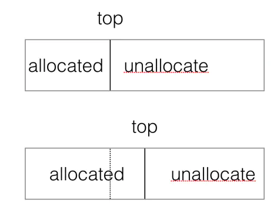
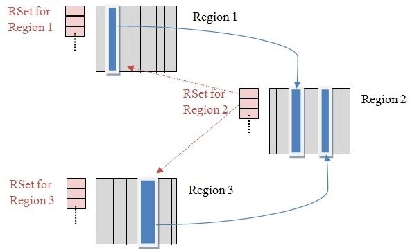
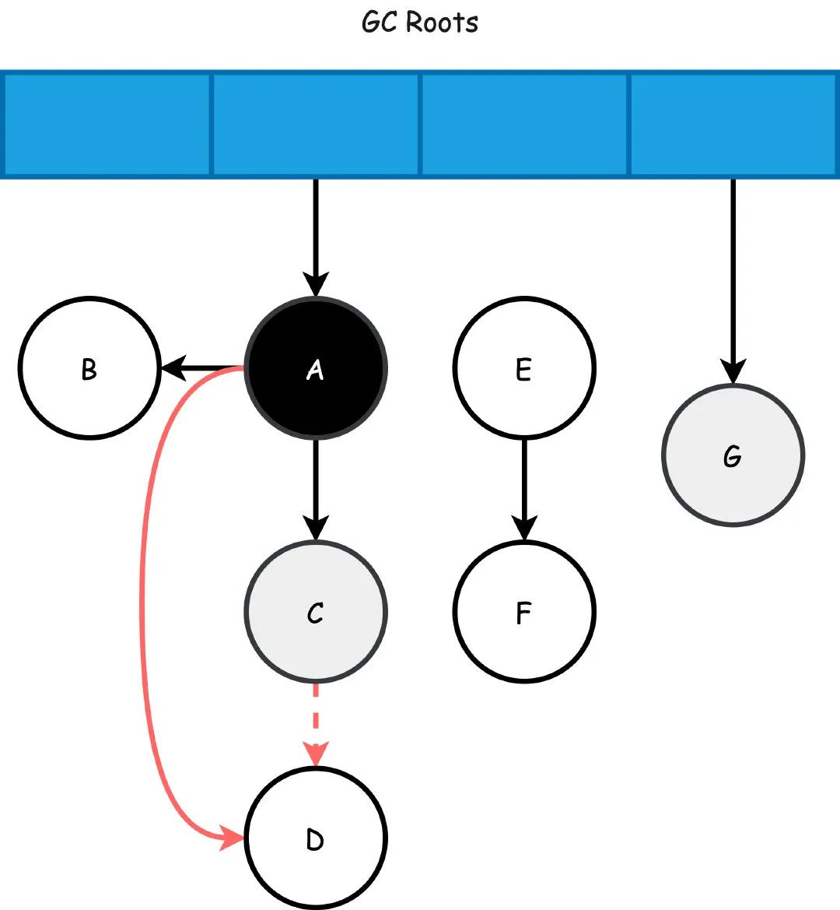
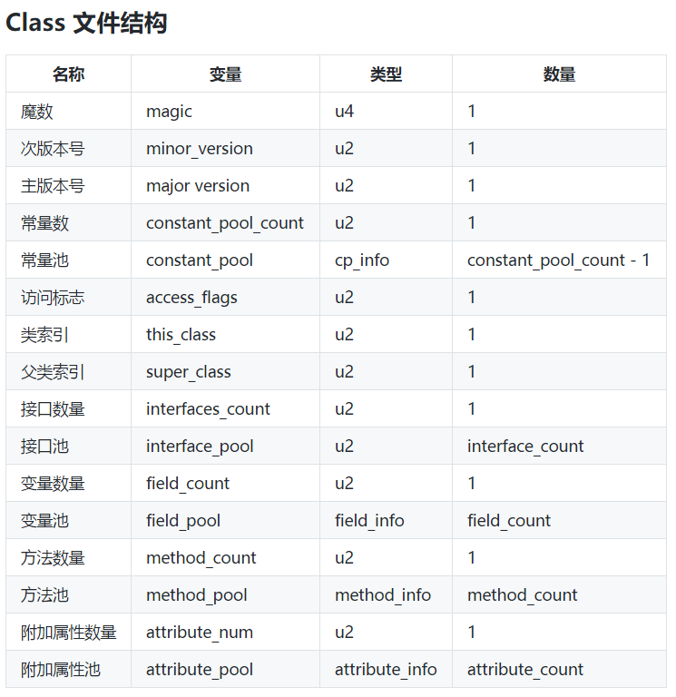

# JVM

### 对象的访问定位

访问对象的方式有通过句柄访问和直接指针访问两种

* 通过句柄访问

  Java堆中有一块内存作为句柄池，每个句柄包含了对象的实例数据地址和类数据地址，对象的引用保存的是句柄地址，通过句柄再去访问对象。这种方式的好处是在垃圾回收时，移动对象时，对象的引用保存的地址不用变化，只需要改变句柄中保存的实例数据地址。

* 直接指针访问(HotSpot虚拟机的主要使用方式)

  这种方式，对象引用保存的地址是对象的地址，根据对象引用可以直接访问对象，节省了一次指针定位的时间开销，速度更快。

### 分代理论

绝大部分对象都是朝生夕灭，熬过越多次垃圾收集的对象就越难以消忙。

1) 对象优先在Eden分配

当Eden区没有足够空间进行分配时，虚拟机将发起一次MinorGC。现在的商业虚拟机一般都采用复制算法来回收新生代，将内存分为一块较大的Eden空间和两块较小的Survivor空间，每次使用Eden和其中一块Survivor。 当进行垃圾回收时，将Eden和Survivor中还存活的对象一次性地复制到另外一块空闲的Survivor空间上，最后处理掉Eden和刚才的Survivor空间。（HotSpot虚拟机默认Eden和Survivor的大小比例是8:1）当Survivor空间不够用时，需要依赖老年代进行分配担保。

2) 大对象直接进入老年代

所谓的大对象是指，需要大量连续内存空间的Java对象，最典型的大对象就是那种很长的字符串以及数组，为了避免大对象在Eden和两个Survivor区之间进行来回复制，所以当对象超过-XX:+PrintTenuringDistribution参数设置的大小时，直接从老年代分配

3) 长期存活的对象将进入老年代

当对象在新生代中经历过一定次数（XX:MaxTenuringThreshold参数设置的次数，默认为15）的Minor GC后，就会被晋升到老年代中。

4) 动态对象年龄判定

为了更好地适应不同程序的内存状况，虚拟机并不是永远地要求对象年龄必须达到了MaxTenuringThreshold才能晋升老年代，如果在Survivor空间中某个年龄所有对象大小的总和>Survivor空间的50%，年龄大于或等于该年龄的对象就可以直接进入老年代，无须等到MaxTenuringThreshold中要求的年龄。

### MinorGC和FullGC

Minor GC：对新生代进行回收，不会影响到年老代。因为新生代的 Java 对象大多死亡频繁，所以 Minor GC 非常频繁，一般在这里使用速度快、效率高的算法，使垃圾回收能尽快完成。

Full GC：也叫 Major GC，对整个堆进行回收，包括新生代和老年代。由于Full GC需要对整个堆进行回收，所以比Minor GC要慢，因此应该尽可能减少Full GC的次数，导致Full GC的原因包括：老年代被写满和System.gc()被显式调用等。

### 新生代收集器

##### Serial收集器

单线程收集器，使用“标记-复制”算法，简单而高效

##### ParNew收集器

Serial的多线程版本

##### Parallel Scavenge收集器

关注点是达到一个可控制的吞吐量，无法与CMS收集器配合使用

### 老年代收集器

##### Serial Old收集器

Serial收集器的老年代版本，使用“标记-整理”算法

##### Parallel Old收集器

Parallel Scavenge收集器的老年代版本

##### CMS收集器

以获取最短回收停顿时间为目标的收集器，非常符合服务端上的Java应用，使用“标记-清除”算法。

* 初始标记：仅仅只是标记一下GC Roots能直接关联到的对象，速度很快，需要“Stop The World”
* 并发标记：进行GC Roots Tracing的过程，在整个过程中耗时最长，使用**增量更新**算法
* 重新标记：为了修正标记期间因用户程序继续运作而导致标记产生变动的那一部分对象的标记记录，这个阶段的停顿时间一般会比初始标记阶段稍长一些，但远比并发标记的时间短。此阶段也需要“Stop The World”
* 并发清除

缺点：对CPU资源非常敏感，无法处理浮动垃圾，“标记-清除”算法导致空间碎片

浮动垃圾：并发标记阶段产生的垃圾，但是却已经被标记了，所以这个垃圾无法清除（重新标记是之前未标记的重新检查是否需要标记，不会检查已标记的是否失效）

### G1收集器

G1收集器采用标记-整理算法，局部采用复制算法

##### 横跨整个堆内存

将Java堆划分为多个大小相等的独立区域，虽然还保留新生代和老年代的概念，但新生代和老年代不再是物理隔离的了，而都是一部分Region（不需要连续）的集合。每一次都只有一个Region处于被分配的状态中，称为current region。G1收集器采用和CMS一样的TLABs的手段。即为每一个线程分配一个Buffer，县城分配内存就在这个Buffer内分配。但是当线程耗尽了自己的Buffer之后，需要申请新的Buffer。这个时候会带来并发的问题，G1收集器通过CAS操作来更新Top值

##### 建立可预测的时间模型

G1收集器有计划地避免在整个Java堆中进行全区域的垃圾收集。G1跟踪各个Region里面的垃圾堆积的价值大小 ，在后台维护一个Collection Set优先列表，每次根据允许的收集时间，优先回收价值最大的Region。保证了G1收集器在有限的时间内可以获取尽可能多的收集效率

##### 避免全堆扫描--Remembered Set

一个对象分配在某个Region中，可以与整个Java堆任意的对象发生引用关系。在做可达性分析确定对象是否存活的时候，需要扫描整个Java堆才能保证准确性，显然是对GC效率的极大伤害。

为了避免全堆扫描的发生，虚拟机为G1中每个Region维护了一个与之对应的Remembered Set。RS记录了其他Region对象引用本Region中对象的关系，属于points-into结构（谁引用了我的对象）。每个Region被分成了固定大小的若干Card，每个Card都用一个Byte来记录是否修改过，所以Card Table是一种point-out结构（我引用了谁的对象）。G1的RS是在Card Table的基础上实现的，其实是一个Hash Table，Key是别的Region的起始地址，Value是一个集合，里面的元素是Card Table的Index。

##### Remembered Set的写屏障

在收集器只回收堆中部分区域的时候，任何来自该区域外的指针都需要被写屏障捕获，这些指针将会在垃圾回收的时候作为GC Roots。Java使用的其余的分代的收集器都使用了写屏障。举例来说，每一次将一个老年代对象的引用修改为指向年轻代对象，都会被写屏障捕获，并且记录下来。因此在年轻代回收的时候，就可以避免扫描整个老年代来查找根。

##### 原始快照SATB

SATB保证了在并发标记过程中新分配对象不会漏标。在初始标记的时候生成一个快照图，标记存活对象，在并发标记的时候出现了引用修改会把这些引用的原始值捕获下来，记录在log buffer中，然后在重新标记阶段扫描，修正SATB的误差。这也会产生浮动垃圾。

##### G1的两种GC模式

G1提供了两种GC模式，Young GC和Mixed GC，两种都是完全Stop The World的。Young GC：选定所有年轻代里的Region。通过控制年轻代的region个数，即年轻代内存大小，来控制young GC的时间开销。Mixed GC：选定所有年轻代里的Region，外加根据global concurrent marking统计得出收集收益高的若干老年代Region。在用户指定的开销目标范围内尽可能选择收益高的老年代Region。

由上面的描述可知，Mixed GC不是full GC，它只能回收部分老年代的Region，如果mixed GC实在无法跟上程序分配内存的速度，导致老年代填满无法继续进行Mixed GC，就会使用serial old GC（full GC）来收集整个GC heap。所以我们可以知道，G1是不提供full GC的。

### 判断对象存活

1. 引用计数：简单高效，但无法解决循环引用问题

2. 可达性分析

   1）将一系列的GC Roots对象作为起点，从这些起点开始向下搜索。当一个对象到GC Roots没有任何引用链相连时，则判断该对象不可达。
   
   2）对象在可达性分析中被判断为不可达后，会被第一次标记。如果有必要执行finalize()方法，进入下一阶段；否则判断该对象死亡，等待回收
   
   3）有必要执行finalize()方法的的对象会被放到F-Queue队列中，并由虚拟机自动建立、优先级低的Finalizer线程去执行队列中对象的finalize()方法。finalize()方法只会被执行一次，且并不承诺等待方法运行结束
   
   4）若在执行finalize()方法的过程中，对象依然没与引用链上的GC Roots直接关联或间接关联，那么该对象被判断死亡，等待回收

### 可作为GC Roots的对象

1. Java虚拟机栈中引用的对象
2. 本地方法栈中JNI引用的对象
3. 方法区中常量、类静态属性引用的对象

### 三色标记法

在三色标记法中，把从GC Roots开始遍历的对象标记为以下三种颜色：

1. 白色，在刚开始遍历的时候，所有的对象都是白色的
2. 灰色，被垃圾回收器扫描过，但是至少还有一个引用没有被扫描
3. 黑色，被垃圾回收器扫描过，并且这个对象的引用也全部都被扫描过，是安全存活的对象

但是如果同时满足以下两个条件会发生对象消失的问题：

1. 插入了一条或者多条黑色到白色对象的引用
2. 删除了全部从灰色到白色对象的引用

假设A扫描完，刚好C成为灰色，此时C->D的引用删除，同时A->D新增了引用（同时满足两个条件了吧），这样本来按照顺序接下来D应该会变成黑色(黑色对象不应该被清理)，但是由于C->D没有引用了，A已经成为了黑色对象，他不会再被重新扫描了，所以即便新增了A->D的引用，D也只能成为白色对象，最终被无情地清理：

解决这个问题的两种方案是**增量更新**和**原始快照**

##### 增量更新

CMS使用了增量更新。

破坏第一个条件，当黑色对象插入新的指向白色对象的引用关系时，就将这个新插入的引用记录下来，等并发扫描结束之后，再将这些记录过的引用关系中的黑色对象标记为根，重新扫描一次。

这可以简化理解为，黑色对象一旦新插入了指向白色对象的引用之后，它就变回灰色对象了。

##### 原始快照（STAB）

在开始标记的时候生成一个快照图，用于标记存活对象。在一个引用断开后，会把这个引用记录下来，保证白色对象还能被GC线程扫描到。配合RSet，扫描哪些Region引用到当前的白色对象，若没有引用到当前对象，则回收。

##### 原始快照效率高于增量更新的原因

因为原始快照在重新标记环节只需要去重新扫描那些被推到堆栈中的引用，并配合RSet来判断当前对象是否被引用来进行回收

并且在最后G1并不会选择回收所有垃圾对象，而是根据Region的垃圾多少来判断与预估回收价值，将一个或者多个Region放到CSet中，最后将这些Region中的存活对象压缩并复制到新的Region中，清空原来的Region。

### ZGC

ZGC是低延迟的，不分代的垃圾回收器，运行分为四个阶段：

* 并发标记：与G1一样，并发标记是遍历对象图做可达性分析的阶段，前后也要经过初始标记、最终标记的短暂停顿。与G1不同的是，ZGC的标记是在指针上而不是对象上进行的，标记阶段会更新**颜色指针**中的Marked 0、Marked 1标志位
* 并发预备重分配：ZGC会扫描所有的Region，组成**重分配集**（Relocation Set）。与G1的回收集（Collection Set）相比，ZGC用范围更大的扫描成本换取省去G1中记忆集的维护成本。所以说ZGC的回收行为是**针对全堆**的。
* 并发重分配：ZGC执行过程中的和新阶段，把重分配集中的存活对象复制到新的Region中，并为重分配集中的每个Region维护一个**转发表**，记录从旧对象到新对象的转向关系。得益于颜色指针的支持，ZGC收集器能仅从引用上就明确得知一个对象是否处于重分配集之中，如果用户线程此时并发访问了位于重分配集中的对象，这次访问会被预置的**内存屏障**所截获，然后立即根据Region上的转发表记录将访问转发到新复制的对象上，并同时修正更新该引用的值，使其直接指向新对象，这种行为称为指针的“自愈”（Self-Healing）能力。所以第一次访问旧对象会陷入转发，稍微慢一点。这里有一个好处是由于颜色指针的存在，一旦重分配集中某个Region的存活对象都复制完毕后，这个Region就可以立即释放用于新对象的分配（但是转发表还得留着），哪怕堆中还有很多指向这个对象的未更新指针也没有关系，这些旧指针一旦被使用，它们都是可以自愈的
* 并发重映射：修正堆中指向重分配集中旧对象的所有引用，但是这并不是一个必须要“迫切”去完成的任务，因为即使是旧指针，也是可以自愈的。一旦所有指针都被修正之后，原来的转发表就可以释放了

#### 颜色指针

1.为什么会有两个mark标记？

颜色指针中有一位Marked1标志和一位Marked0标志，每一个GC周期开始时，会交换使用的标记位，使上次GC周期中修正的已标记状态失效，所有引用都变成未标记。 GC周期1：使用mark0, 则周期结束所有引用mark标记都会成为01。 GC周期2：使用mark1, 与周期1相同，所有的mark标记都会成为10。

2.为什么ZGC不能做指针压缩？

指针压缩指的是压缩为32位，寻址位数不能超过35，这里的寻址位数已经达到了42位，支持4T内存

3.染色指针的三大优势

  1）在一个Region中的所有存活对象都被移走后，这个Region就可以立即被释放掉，因为还有转发表记录原始地址和新地址，这样的话，理论上只要还有一个Region对象空闲，ZGC就能完成垃圾收集

  2）颜色指针具有“自愈”能力，避免了写屏障，只需要一个读屏障就可以解决问题

  3）颜色指针还有18位未使用，具有极大的扩展性

### 双亲委派机制

类加载器分为三种：

**启动类加载器**：主要是在加载JAVA_HOME/lib目录下的特定名称jar包，例如rt.jar包，像java.lang就在这个jar包中

**扩展类加载器**：主要是加载JAVA_HOME/lib/ext目录下的具备通用性的类库

**应用程序类加载器**：加载用户类路径下所有的类库，也就是程序中默认的类加载器

除启动类加载器以外，所有类加载器都有自己的父类加载器，类加载器收到一个类加载请求时，首先会判断类是否已经加载过了，没有的话会调用父类加载器的的loadClass方法，将请求委派为父加载器，当父类加载器无法完成类加载请求时，子加载器才尝试去加载这个类。
目的是为了保证每个类只加载一次，并且是由特定的类加载器进行加载（都是首先让启动类来进行加载）

### class文件结构

