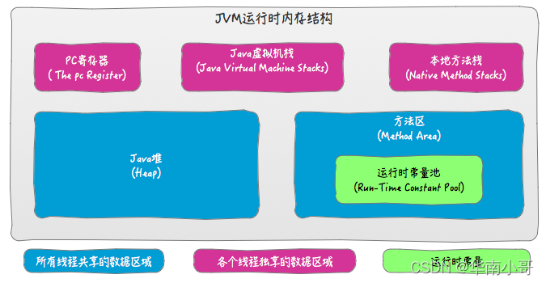

## Java内存模型

JDK 8 版本 本地方法区被Metaspace(元空间)取代

JDK 1.8 的时候，方法区（HotSpot 的永久代）被彻底移除了（JDK1.7 就已经开始了），取而代之是**元空间，元空间使用的是直接内存。**

运行时常量池还在方法区, 只不过方法区的实现从永久代变成了元空间(Metaspace)。

方法区会存储已被虚拟机加载的 **类信息、字段信息、方法信息、常量、静态变量、即时编译器编译后的代码缓存等数据**。

JDK 1.7 为什么要将字符串常量池移动到堆中？

主要是因为永久代（方法区实现）的 GC 回收效率太低，只有在整堆收集 (Full GC)的时候才会被执行 GC。Java 程序中通常会有大量的被创建的字符串等待回收，将字符串常量池放到堆中，能够更高效及时地回收字符串内存。

**线程私有的：**

- 程序计数器
- 虚拟机栈
- 本地方法栈（native方法）

**线程共享的：**

- 堆
- 方法区
- 直接内存 (非运行时数据区的一部分)

Java 虚拟机栈是由一个个栈帧组成，而每个栈帧中都拥有：局部变量表（基本数据类型 、引用）、操作数栈、动态链接、方法出口信息。

本地方法栈则为虚拟机使用到的 Native 方法服务

Java 堆是所有线程共享的一块内存区域，在虚拟机启动时创建。此内存区域的唯一目的就是存放对象实例，几乎所有的对象实例以及数组都在这里分配内存。

方法区与 Java 堆一样，是各个线程共享的内存区域，它用于存储已被虚拟机加载的类信息、常量、静态变量、即时编译器编译后的代码等数据。

## Java中创建对象都做了什么事情

Person p = new Person("zhangsan",20);

该句话都做了什么事情？

1，因为new用到了Person.class.所以会先找到Person.class文件并加载到内存中。

2，执行该类中的static代码块，如果有的话，给Person.class类进行初始化。

3，在堆内存中开辟空间，分配内存地址。

4，在堆内存中建立对象的特有属性。并进行默认初始化。

5，对属性进行显示初始化。

6，对对象进行构造代码块初始化。

7，对对象进行对应的构造函数初始化。

8，将内存地址付给栈内存中的p变量

Java中创建对象的内存图

## Java对象创建过程 五步

**1 类加载检查**

检查这个符号引用代表的类是否已被加载过、解析和初始化过。

**2 分配内存**

分配方式有 “指针碰撞” 和 “空闲列表” 两种，选择哪种分配方式由 Java 堆是否规整决定，而 Java 堆是否规整又由所采用的垃圾收集器是否带有压缩整理功能决定。

而 Java 堆内存是否规整，取决于 GC 收集器的算法是"标记-清除"，还是"标记-整理"（也称作"标记-压缩"）

**3 初始化零值**

**4 设置对象头**

初始化零值完成之后，**虚拟机要对对象进行必要的设置**，例如这个对象是哪个类的实例、如何才能找到类的元数据信息、对象的哈希码、对象的 GC 分代年龄等信息。 **这些信息存放在对象头中。**

**5 执行 init 方法**

执行 new 指令之后会接着执行 `<init>` 方法，把对象按照程序员的意愿进行初始化，这样一个真正可用的对象才算完全产生出来。

### 对象的访问定位

建立对象就是为了使用对象，我们的 Java 程序通过栈上的 reference 数据来操作堆上的具体对象。对象的访问方式由虚拟机实现而定，

目前主流的访问方式有

**① 使用句柄**

 Java 堆中将会划分出一块内存来作为句柄池，reference 中存储的就是对象的句柄地址，而句柄中包含了对象实例数据与类型数据各自的具体地址信息

**② 直接指针**

如果使用直接指针访问，那么 Java 堆对象的布局中就必须考虑如何放置访问类型数据的相关信息，而 reference 中存储的直接就是对象的地址。

**这两种对象访问方式各有优势。使用句柄来访问的最大好处是 reference 中存储的是稳定的句柄地址，在对象被移动时只会改变句柄中的实例数据指针，而 reference 本身不需要修改。使用直接指针访问方式最大的好处就是速度快，它节省了一次指针定位的时间开销。**

## 类的生命周期

一个类的完整生命周期如下：

## 类加载过程

系统加载 Class 类型的文件主要三步：**加载->连接->初始化**。连接过程又可分为三步：**验证->准备->解析**。

 Java 的类加载过程分为三个主要步骤：加载，连接，初始化，具体行为在 Java 虚拟机规范里有非常详细的定义。

​    首先是加载过程（Loading），它是 Java 将字节码数据从不同的数据源读取到 JVM 中，并映射为 JVM 认可的数据结构（Class 对象），这里的数据源可能是各种各样的形态，比如 jar 文件，class 文件，甚至是网络数据源等；如果输入数据不是 ClassFile 的结构，则会抛出 ClassFormatError。加载阶段是用户参与的阶段，我们可以自定义类加载器，去实现自己的类加载过程。

​    第二阶段是连接（Linking），这是核心的步骤，简单说是把原始的类定义信息平滑地转入 JVM 运行的过程中。这里可进一步细分成三个步骤：

1，验证（Verification），这是虚拟机安全的重要保障，JVM 需要核验字节信息是符合 Java 虚拟机规范的，否则就被认为是 VerifyError，这样就防止了恶意信息或者不合规信息危害 JVM 的运行，验证阶段有可能触发更多 class 的加载。**文件格式的验证** **元数据的验证**  **字节码的验证** **符号引用的验证**

2，准备（Pereparation），主要是为类变量（注意，不是实例变量）分配内存，并且赋予**初值**。。但这里的“初始化”和下面的显示初始化阶段是有区别的，侧重点在于分配所需要的内存空间，不会去执行更进一步的 JVM 指令。

3，解析（Resolution），在这一步会将常量池中的符号引用（symbolic reference）替换为直接引用。在 Java 虚拟机规范中，详细介绍了类，接口，方法和字段等各方面的解析。

​    最后是初始化阶段（initialization），这一步真正去执行类初始化的代码逻辑，包括静态字段赋值的动作，以及执行类定义中的静态初始化块内的逻辑，编译器在编译阶段就会把这部分逻辑整理好，父类型的初始化逻辑优先于当前类型的逻辑。

**双亲委派模型**

简单说就是当加载器（Class-Loader）试图加载某个类型的时候，除非父类加载器找不到相应类型，否则尽量将这个任务代理给当前加载器的父加载器去做。使用委派模型的目的是避免重复加载 Java 类型。

还可以参考

https://zhuanlan.zhihu.com/p/33509426

## 垃圾回收（重点）

针对 HotSpot VM 的实现，它里面的 GC 其实准确分类只有两大种：

部分收集 (Partial GC)：

- 新生代收集（Minor GC / Young GC）：只对新生代进行垃圾收集；
- 老年代收集（Major GC / Old GC）：只对老年代进行垃圾收集。需要注意的是 Major GC 在有的语境中也用于指代整堆收集；
- 混合收集（Mixed GC）：对整个新生代和部分老年代进行垃圾收集。

整堆收集 (Full GC)：收集整个 Java 堆和方法区。

## 如何对象已经死亡

- 引用计数法

给对象中添加一个引用计数器，每当有一个地方引用它，计数器就加 1；当引用失效，计数器就减 1；任何时候计数器为 0 的对象就是不可能再被使用的。

- 可达性分析算法 引用链

通过一系列的称为 **“GC Roots”** 的对象作为起点，从这些节点开始向下搜索，节点所走过的路径称为引用链，当一个对象到 GC Roots 没有任何引用链相连的话，则证明此对象是不可用的，需要被回收。

## 垃圾回收算法

**1 标记-清除算法**

标记出所有不需要回收的对象，在标记完成后统一回收掉所有没有被标记的对象

**2 标记-复制算法**

将内存分为大小相同的两块, 当这一块的内存使用完后，就将还存活的对象复制到另一块去，然后再把使用的空间一次清理掉

**3 标记-整理算法**

根据老年代的特点提出的一种标记算法, 让所有存活的对象向一端移动，然后直接清理掉端边界以外的内存。

**4 分代收集算法**

当前虚拟机的垃圾收集都采用分代收集算法,  一般将 java 堆分为新生代和老年代,  在新生代中，每次收集都会有大量对象死去，所以可以选择”标记-复制“算法, 

老年代的对象存活几率是比较高的，没有额外的空间对它进行分配担保，所以我们必须选择“标记-清除”或“标记-整理”算法进行垃圾收集。

## 垃圾收集器

1. **Serial 收集器**

单线程收集器,新生代采用标记-复制法，老年代采用标记-整理法。

2. **ParNew 收集器**

Serial 收集器的多线程版本, 新生代采用标记-复制法，老年代采用标记-整理法。

3. **Parallel Scavenge 收集器**

Parallel Scavenge 收集器也是使用标记-复制算法的多线程收集器, **这是 JDK1.8 默认收集器**

4. **Serial Old 收集器**

5. **Parallel Old 收集器**

**Parallel Scavenge 收集器的老年代版本**。使用多线程和“标记-整理”算法。在注重吞吐量以及 CPU 资源的场合，都可以优先考虑 Parallel Scavenge 收集器和 Parallel Old 收集器。

6. **CMS 收集器 ** 记住这个

CMS 收集器是一种 **“标记-清除”算法**实现的

7. **G1 收集器**  记住这个
8. **ZGC 收集器**

