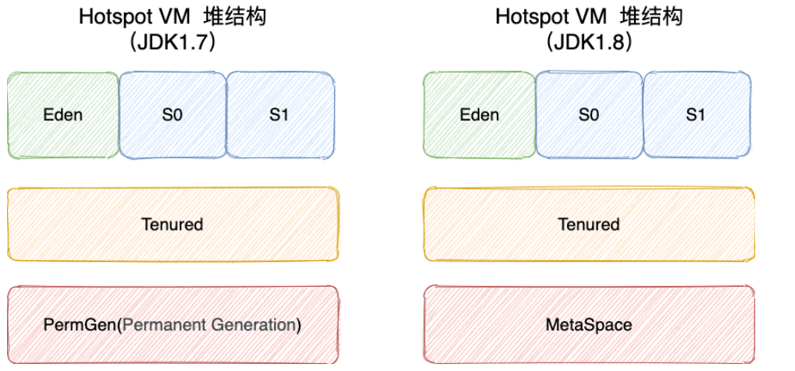
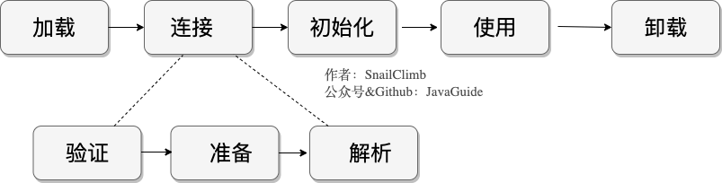

## Java内存模型

**JDK 1.8之前**

**JDK 1.8**

**线程私有的：**

- 程序计数器
- 虚拟机栈
- 本地方法栈（native方法）

**线程共享的：**

- 堆
- 方法区
- 直接内存 (非运行时数据区的一部分)

**程序计数器：**

程序计数器是一块较小的内存空间，可以看作是当前线程所执行的字节码的行号指示器。字节码解释器工作时通过改变这个计数器的值来选取下一条需要执行的字节码指令，分支、循环、跳转、异常处理、线程恢复等功能都需要依赖这个计数器来完成。

- 字节码解释器通过改变程序计数器来依次读取指令，从而实现代码的流程控制，如：顺序执行、选择、循环、异常处理。
- 在多线程的情况下，程序计数器用于记录当前线程执行的位置，从而当线程被切换回来的时候能够知道该线程上次运行到哪儿了。

**虚拟机栈：**

方法调用的数据需要通过栈进行传递，每一次方法调用都会有一个对应的栈帧被压入栈中，每一个方法调用结束后，都会有一个栈帧被弹出。

栈由一个个栈帧组成，而每个栈帧中都拥有：局部变量表、操作数栈、动态链接、方法返回地址。和数据结构上的栈类似，两者都是先进后出的数据结构，只支持出栈和入栈两种操作。

局部变量表 主要存放了编译期可知的各种数据类型（boolean、byte、char、short、int、float、long、double）、对象引用（reference 类型，它不同于对象本身，可能是一个指向对象起始地址的引用指针，也可能是指向一个代表对象的句柄或其他与此对象相关的位置）。

操作数栈 主要作为方法调用的中转站使用，用于存放方法执行过程中产生的中间计算结果。另外，计算过程中产生的临时变量也会放在操作数栈中。

动态链接 主要服务一个方法需要调用其他方法的场景。在 Java 源文件被编译成字节码文件时，所有的变量和方法引用都作为符号引用（Symbilic Reference）保存在 Class 文件的常量池里。当一个方法要调用其他方法，需要将常量池中指向方法的符号引用转化为其在内存地址中的直接引用。动态链接的作用就是为了将符号引用转换为调用方法的直接引用。

**本地方法栈：**

和虚拟机栈所发挥的作用非常相似，区别是： **虚拟机栈为虚拟机执行 Java 方法 （也就是字节码）服务，而本地方法栈则为虚拟机使用到的 Native 方法服务。** 在 HotSpot 虚拟机中和 Java 虚拟机栈合二为一。

**堆：**

Java 堆是所有线程共享的一块内存区域，在虚拟机启动时创建。此内存区域的唯一目的就是**存放对象实例**，几乎所有的对象实例以及数组都在这里分配内存。

Java 堆是垃圾收集器管理的主要区域，因此也被称作 **GC 堆（Garbage Collected Heap）**。从垃圾回收的角度，由于现在收集器基本都采用分代垃圾收集算法，所以 Java 堆还可以细分为：新生代和老年代；再细致一点有：Eden、Survivor、Old 等空间。进一步划分的目的是更好地回收内存，或者更快地分配内存。

在 JDK 7 版本及 JDK 7 版本之前，堆内存被通常分为下面三部分：

1. 新生代内存(Young Generation)
2. 老生代(Old Generation)
3. 永久代(Permanent Generation)

下图所示的 Eden 区、两个 Survivor 区 S0 和 S1 都属于新生代，中间一层属于老年代，最下面一层属于永久代。

**JDK 8 版本之后 PermGen(永久) 已被 Metaspace(元空间) 取代，元空间使用的是直接内存**

大部分情况，对象都会首先在 Eden 区域分配，在一次新生代垃圾回收后，如果对象还存活，则会进入 S0 或者 S1，并且对象的年龄还会加 1(Eden 区->Survivor 区后对象的初始年龄变为 1)，当它的年龄增加到一定程度（默认为 15 岁），就会被晋升到老年代中。对象晋升到老年代的年龄阈值，可以通过参数 `-XX:MaxTenuringThreshold` 来设置。

**为什么要将永久代 (PermGen) 替换为元空间 (MetaSpace) 呢 **

1、整个永久代有一个 JVM 本身设置的固定大小上限，无法进行调整，而元空间使用的是直接内存，受本机可用内存的限制，虽然元空间仍旧可能溢出，但是比原来出现的几率会更小。

> 当元空间溢出时会得到如下错误： `java.lang.OutOfMemoryError: MetaSpace`

你可以使用 `-XX：MaxMetaspaceSize` 标志设置最大元空间大小，默认值为 unlimited，这意味着它只受系统内存的限制。`-XX：MetaspaceSize` 调整标志定义元空间的初始大小如果未指定此标志，则 Metaspace 将根据运行时的应用程序需求动态地重新调整大小。

2、元空间里面存放的是类的元数据，这样加载多少类的元数据就不由 `MaxPermSize` 控制了, 而由系统的实际可用空间来控制，这样能加载的类就更多了。

3、在 JDK8，合并 HotSpot 和 JRockit 的代码时, JRockit 从来没有一个叫永久代的东西, 合并之后就没有必要额外的设置这么一个永久代的地方了。

**方法区：**

方法区与 Java 堆一样，是各个线程共享的内存区域，它用于存储已被虚拟机加载的类信息、常量、静态变量、即时编译器编译后的代码等数据。

当虚拟机要使用一个类时，它需要读取并解析 Class 文件获取相关信息，再将信息存入到方法区。方法区会存储已被虚拟机加载的 **类信息、字段信息、方法信息、常量、静态变量、即时编译器编译后的代码缓存等数据**。

**方法区和永久代以及元空间是什么关系呢？** 

方法区和永久代以及元空间的关系很像 Java 中接口和类的关系，类实现了接口，这里的类就可以看作是永久代和元空间，接口可以看作是方法区，也就是说永久代以及元空间是 HotSpot 虚拟机对虚拟机规范中方法区的两种实现方式。并且，永久代是 JDK 1.8 之前的方法区实现，JDK 1.8 及以后方法区的实现变成了元空间。

JDK 8 版本 本地方法区被Metaspace(元空间)取代

JDK 1.8 的时候，方法区（HotSpot 的永久代）被彻底移除了（JDK1.7 就已经开始了），取而代之是**元空间，元空间使用的是直接内存。**

运行时常量池还在方法区, 只不过方法区的实现从永久代变成了元空间(Metaspace)。

方法区会存储已被虚拟机加载的 **类信息、字段信息、方法信息、常量、静态变量、即时编译器编译后的代码缓存等数据**。

**运行时常量：**

Class 文件中除了有类的版本、字段、方法、接口等描述信息外，还有用于存放编译期生成的各种字面量（Literal）和符号引用（Symbolic Reference）的 **常量池表(Constant Pool Table)** 。

字面量包括整数、浮点数和字符串字面量，符号引用包括类符号引用、字段符号引用、方法符号引用和接口方法符号引用。

常量池表会在类加载后存放到方法区的运行时常量池中。

**字符串常量池：**

字符串常量池 是 JVM 为了提升性能和减少内存消耗针对字符串（String 类）专门开辟的一块区域，主要目的是为了避免字符串的重复创建。

JDK1.7 之前，字符串常量池存放在永久代。JDK1.7 字符串常量池和静态变量从永久代移动了 Java 堆中。

JDK 1.7 为什么要将字符串常量池移动到堆中？

主要是因为永久代（方法区实现）的 GC 回收效率太低，只有在整堆收集 (Full GC)的时候才会被执行 GC。Java 程序中通常会有大量的被创建的字符串等待回收，将字符串常量池放到堆中，能够更高效及时地回收字符串内存。

**直接内存：**

JDK1.4 中新加入的 NIO(New Input/Output) 类，引入了一种基于通道（Channel）与 缓存区（Buffer）的 I/O 方式，它可以直接使用 **Native 函数库**直接分配堆外内存，然后通过一个存储在 Java 堆中的 **DirectByteBuffer 对象**作为这块内存的引用进行操作。这样就能在一些场景中显著提高性能，因为避免了在 Java 堆和 Native 堆之间来回复制数据。

本机直接内存的分配不会受到 Java 堆的限制

## Java中创建对象都做了什么事情

Person p = new Person("zhangsan",20);

该句话都做了什么事情？

1，因为new用到了Person.class.所以会先找到Person.class文件并加载到内存中。

2，执行该类中的static代码块，如果有的话，给Person.class类进行初始化。

3，在堆内存中开辟空间，分配内存地址。

4，在堆内存中建立对象的特有属性。并进行默认初始化。

5，对属性进行显示初始化。

6，对对象进行构造代码块初始化。

7，对对象进行对应的构造函数初始化。

8，将内存地址付给栈内存中的p变量

Java中创建对象的内存图

## Java对象创建过程 五步

**1 类加载检查**

虚拟机遇到一条 new 指令时，首先将去检查这个指令的参数是否能在常量池中定位到这个类的符号引用，并且检查这个符号引用代表的类是否已被加载过、解析和初始化过。如果没有，那必须先执行相应的类加载过程。

**2 分配内存**

在**类加载检查**通过后，接下来虚拟机将为新生对象**分配内存**。对象所需的内存大小在类加载完成后便可确定，为对象分配空间的任务等同于把一块确定大小的内存从 Java 堆中划分出来。**分配方式**有 **“指针碰撞”** 和 **“空闲列表”** 两种，**选择哪种分配方式由 Java 堆是否规整决定，而 Java 堆是否规整又由所采用的垃圾收集器是否带有压缩整理功能决定**。

分配方式有 “指针碰撞” 和 “空闲列表” 两种，选择哪种分配方式由 Java 堆是否规整决定，而 Java 堆是否规整又由所采用的垃圾收集器是否带有压缩整理功能决定。

而 Java 堆内存是否规整，取决于 GC 收集器的算法是"标记-清除"，还是"标记-整理"（也称作"标记-压缩"）

**内存分配的两种方式** （补充内容，需要掌握）：

- 指针碰撞 ：
  - 适用场合 ：堆内存规整（即没有内存碎片）的情况下。
  - 原理 ：用过的内存全部整合到一边，没有用过的内存放在另一边，中间有一个分界指针，只需要向着没用过的内存方向将该指针移动对象内存大小位置即可。
  - 使用该分配方式的 GC 收集器：Serial, ParNew
- 空闲列表 ：
  - 适用场合 ： 堆内存不规整的情况下。
  - 原理 ：虚拟机会维护一个列表，该列表中会记录哪些内存块是可用的，在分配的时候，找一块儿足够大的内存块儿来划分给对象实例，最后更新列表记录。
  - 使用该分配方式的 GC 收集器：CMS

选择以上两种方式中的哪一种，取决于 Java 堆内存是否规整。而 Java 堆内存是否规整，取决于 GC 收集器的算法是"标记-清除"，还是"标记-整理"（也称作"标记-压缩"），值得注意的是，复制算法内存也是规整的。

**内存分配并发问题（补充内容，需要掌握）**

在创建对象的时候有一个很重要的问题，就是线程安全，因为在实际开发过程中，创建对象是很频繁的事情，作为虚拟机来说，必须要保证线程是安全的，通常来讲，虚拟机采用两种方式来保证线程安全：

- **CAS+失败重试：** CAS 是乐观锁的一种实现方式。所谓乐观锁就是，每次不加锁而是假设没有冲突而去完成某项操作，如果因为冲突失败就重试，直到成功为止。**虚拟机采用 CAS 配上失败重试的方式保证更新操作的原子性。**
- **TLAB：** 为每一个线程预先在 Eden 区分配一块儿内存，JVM 在给线程中的对象分配内存时，首先在 TLAB 分配，当对象大于 TLAB 中的剩余内存或 TLAB 的内存已用尽时，再采用上述的 CAS 进行内存分配

**3 初始化零值**

内存分配完成后，虚拟机需要将分配到的内存空间都初始化为零值（不包括对象头），这一步操作保证了对象的实例字段在 Java 代码中可以不赋初始值就直接使用，程序能访问到这些字段的数据类型所对应的零值。

**4 设置对象头**

初始化零值完成之后，**虚拟机要对对象进行必要的设置**，例如这个对象是哪个类的实例、如何才能找到类的元数据信息、对象的哈希码、对象的 GC 分代年龄等信息。 **这些信息存放在对象头中。** 另外，根据虚拟机当前运行状态的不同，如是否启用偏向锁等，对象头会有不同的设置方式。

**5 执行 init 方法**

在上面工作都完成之后，从虚拟机的视角来看，一个新的对象已经产生了，但从 Java 程序的视角来看，对象创建才刚开始，`<init>` 方法还没有执行，所有的字段都还为零。所以一般来说，执行 new 指令之后会接着执行 `<init>` 方法，把对象按照程序员的意愿进行初始化，这样一个真正可用的对象才算完全产生出来。

### 对象的访问定位

建立对象就是为了使用对象，我们的 Java 程序通过栈上的 reference 数据来操作堆上的具体对象。对象的访问方式由虚拟机实现而定，

目前主流的访问方式有

**① 使用句柄**

如果使用句柄的话，那么 Java 堆中将会划分出一块内存来作为句柄池，reference 中存储的就是对象的句柄地址，而句柄中包含了对象实例数据与类型数据各自的具体地址信息。

**② 直接指针**

如果使用直接指针访问，那么 Java 堆对象的布局中就必须考虑如何放置访问类型数据的相关信息，而 reference 中存储的直接就是对象的地址。

**这两种对象访问方式各有优势。使用句柄来访问的最大好处是 reference 中存储的是稳定的句柄地址，在对象被移动时只会改变句柄中的实例数据指针，而 reference 本身不需要修改。使用直接指针访问方式最大的好处就是速度快，它节省了一次指针定位的时间开销。**

## 类的生命周期

一个类的完整生命周期如下：

## 类加载过程

系统加载 Class 类型的文件主要三步：**加载->连接->初始化**。连接过程又可分为三步：**验证->准备->解析**。

 Java 的类加载过程分为三个主要步骤：加载，连接，初始化，具体行为在 Java 虚拟机规范里有非常详细的定义。

​    首先是加载过程（Loading），它是 Java 将字节码数据从不同的数据源读取到 JVM 中，并映射为 JVM 认可的数据结构（Class 对象），这里的数据源可能是各种各样的形态，比如 jar 文件，class 文件，甚至是网络数据源等；如果输入数据不是 ClassFile 的结构，则会抛出 ClassFormatError。加载阶段是用户参与的阶段，我们可以自定义类加载器，去实现自己的类加载过程。

​    第二阶段是连接（Linking），这是核心的步骤，简单说是把原始的类定义信息平滑地转入 JVM 运行的过程中。这里可进一步细分成三个步骤：

1，验证（Verification），这是虚拟机安全的重要保障，JVM 需要核验字节信息是符合 Java 虚拟机规范的，否则就被认为是 VerifyError，这样就防止了恶意信息或者不合规信息危害 JVM 的运行，验证阶段有可能触发更多 class 的加载。**文件格式的验证** **元数据的验证**  **字节码的验证** **符号引用的验证**

2，准备（Pereparation），主要是为类变量（注意，不是实例变量）分配内存，并且赋予**初值**。。但这里的“初始化”和下面的显示初始化阶段是有区别的，侧重点在于分配所需要的内存空间，不会去执行更进一步的 JVM 指令。

3，解析（Resolution），在这一步会将常量池中的符号引用（symbolic reference）替换为直接引用。在 Java 虚拟机规范中，详细介绍了类，接口，方法和字段等各方面的解析。

​    最后是初始化阶段（initialization），这一步真正去执行类初始化的代码逻辑，包括静态字段赋值的动作，以及执行类定义中的静态初始化块内的逻辑，编译器在编译阶段就会把这部分逻辑整理好，父类型的初始化逻辑优先于当前类型的逻辑。

**双亲委派模型**

简单说就是当加载器（Class-Loader）试图加载某个类型的时候，除非父类加载器找不到相应类型，否则尽量将这个任务代理给当前加载器的父加载器去做。使用委派模型的目的是避免重复加载 Java 类型。

类加载还可以参考

https://zhuanlan.zhihu.com/p/33509426

## 垃圾回收（重点）

针对 HotSpot VM 的实现，它里面的 GC 其实准确分类只有两大种：

部分收集 (Partial GC)：

- 新生代收集（Minor GC / Young GC）：只对新生代进行垃圾收集；
- 老年代收集（Major GC / Old GC）：只对老年代进行垃圾收集。需要注意的是 Major GC 在有的语境中也用于指代整堆收集；
- 混合收集（Mixed GC）：对整个新生代和部分老年代进行垃圾收集。

整堆收集 (Full GC)：收集整个 Java 堆和方法区。

## 如何对象已经死亡

- 引用计数法

给对象中添加一个引用计数器，每当有一个地方引用它，计数器就加 1；当引用失效，计数器就减 1；任何时候计数器为 0 的对象就是不可能再被使用的。

- 可达性分析算法 引用链

通过一系列的称为 **“GC Roots”** 的对象作为起点，从这些节点开始向下搜索，节点所走过的路径称为引用链，当一个对象到 GC Roots 没有任何引用链相连的话，则证明此对象是不可用的，需要被回收。

## 垃圾回收算法

**1 标记-清除算法**

标记出所有不需要回收的对象，在标记完成后统一回收掉所有没有被标记的对象

**2 标记-复制算法**

将内存分为大小相同的两块, 当这一块的内存使用完后，就将还存活的对象复制到另一块去，然后再把使用的空间一次清理掉

**3 标记-整理算法**

根据老年代的特点提出的一种标记算法, 让所有存活的对象向一端移动，然后直接清理掉端边界以外的内存。

**4 分代收集算法**

当前虚拟机的垃圾收集都采用分代收集算法,  一般将 java 堆分为新生代和老年代,  在新生代中，每次收集都会有大量对象死去，所以可以选择”标记-复制“算法, 

老年代的对象存活几率是比较高的，没有额外的空间对它进行分配担保，所以我们必须选择“标记-清除”或“标记-整理”算法进行垃圾收集。

## 垃圾收集器

1. **Serial 收集器**

单线程收集器,新生代采用标记-复制法，老年代采用标记-整理法。

2. **ParNew 收集器**

Serial 收集器的多线程版本, 新生代采用标记-复制法，老年代采用标记-整理法。

3. **Parallel Scavenge 收集器**

Parallel Scavenge 收集器也是使用标记-复制算法的多线程收集器, **这是 JDK1.8 默认收集器**

4. **Serial Old 收集器**

5. **Parallel Old 收集器**

**Parallel Scavenge 收集器的老年代版本**。使用多线程和“标记-整理”算法。在注重吞吐量以及 CPU 资源的场合，都可以优先考虑 Parallel Scavenge 收集器和 Parallel Old 收集器。

6. **CMS 收集器 ** 记住这个

CMS 收集器是一种 **“标记-清除”算法**实现的

7. **G1 收集器**  记住这个
8. **ZGC 收集器**

