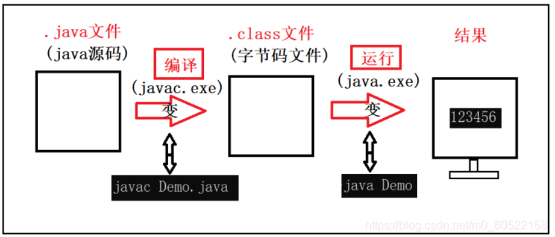
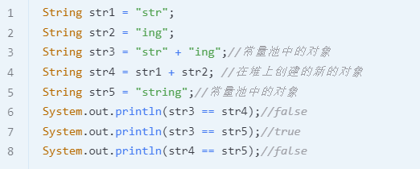
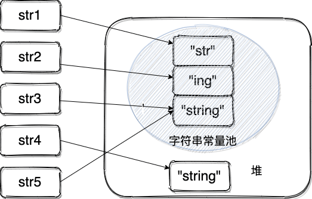
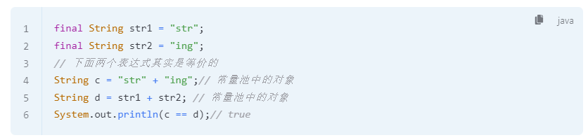
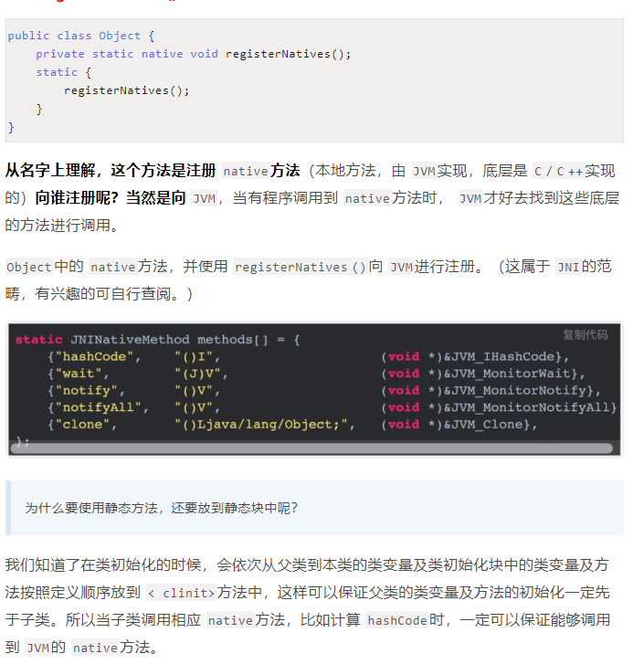
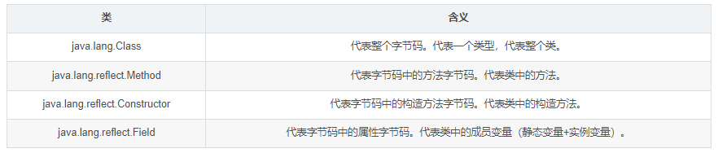
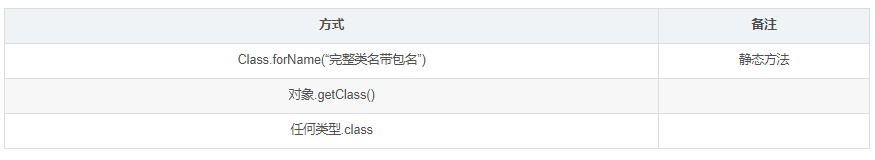
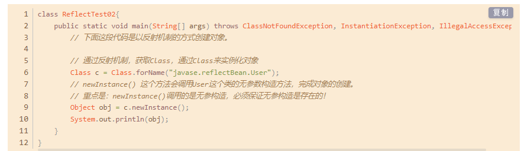

## Java特点

- 面向对象（封装 继承 多态）
- 跨平台（一次编写 随处运行)
- 支持多线程（C++ 多线程要调用操作系统的多线程功能实现）
- 安全 可靠 
- 编译和解释并存( JIT )


## JVM JDK JRE

- JVM（Java虚拟机）是运行 Java 字节码的虚拟机。不同系统有不同实现的JVM，都是使用字节码的，JVM和字节码是 Java 跨平台的原因

- JDK (Java Development Kit)  是功能齐全的 Java SDK。它拥有 JRE 所拥有的一切，还有编译器（javac）和工具（如 javadoc 和 jdb）。它能够创建和编译程序。
- JRE 是 Java 运行时环境（所以JRE没有编译器）。它是运行已编译 Java 程序所需的所有内容的集合，包括 Java 虚拟机（JVM），Java 类库，java 命令和其他的一些基础构件。但是，它不能用于创建新程序。

jdk包含jre  jre有jvm


jdk8

1、Lambda表达式

2、函数式编程

3、接口可以添加默认方法和静态方法，也就是定义不需要实现类实现的方法

4、方法引用

5、重复注解，同一个注解可以使用多次

6、引入Optional来避免空指针

7、引入Streams相关的API

8、引入新的Date/Time相关的API

9、新增jdeps命令行，来分析类、目录、jar包的类依赖层级关系

10、JVM使用MetaSpace代替了永久代（PermGen Space）


**Java 程序从源代码到运行的过程如下图所示：**



- **.class->机器码** 过程

JIT（just-in-time compilation）属于运行时编译器 编译过程中把字节码对应的机器码保存

当 JIT 编译器完成第一次编译后，其会将字节码对应的机器码保存下来，下次可以直接使用。

这也就是为什么说**Java 是编译与解释共存的语言**


## 面向对象 封装 继承 多态

**封装**
一个对象他所封装的是自己的属性和方法，所以它是不需要依赖其他对象就可以完成自己的操作
封装就是把一个对象的属性私有化，同时提供一些可以被外界访问属性的方法

**继承**

所谓继承是指可以让某个类型的对象获得另一个类型的对象的属性的方法。它支持按级分类的概念。继承是指这样一种能力：它可以使用现有类的所有功能，并在无需重新编写原来的类的情况下对这些功能进行扩展。 通过继承创建的新类称为“子类”或“派生类”，被继承的类称为“基类”、“父类”或“超类”。

继承概念的实现方式有二类：实现继承与接口继承。实现继承是指直接使用基类的属性和方法而无需额外编码的能力；接口继承是指仅使用属性和方法的名称、但是子类必须提供实现的能力

**多态**

所谓多态就是指一个类实例的相同方法在不同情形有不同表现形式。多态机制使具有不同内部结构的对象可以共享相同的外部接口。这意味着，虽然针对不同对象的具体操作不同，但通过一个公共的类，它们（那些操作）可以通过相同的方式予以调用

多态的分类：
**编译时多态，方法的重载
运行时多态，方法的重写**


简单版：

#### 封装

封装是指把一个对象的状态信息（也就是属性）隐藏在对象内部，不允许外部对象直接访问对象的内部信息。但是可以提供一些可以被外界访问的方法来操作属性。

#### 继承

子类继承父类的属性和方法。

#### 多态

多态，顾名思义，表示一个对象具有多种的状态，具体表现为父类的引用指向子类的实例。


## 重载和重写的区别

**重载**

发生在同一个类中（或者父类和子类之间），方法名必须相同，参数类型不同、个数不同、顺序不同，方法返回值和访问修饰符可以不同。

重载就是同一个类中多个同名方法根据不同的传参来执行不同的逻辑处理。


**重写**

重写发生在运行期，是子类对父类的允许访问的方法的实现过程进行重新编写。

1. 方法名、参数列表必须相同，**子类方法返回值类型应比父类方法返回值类型更小或相等**，抛出的异常范围小于等于父类，访问修饰符范围大于等于父类。

2. 如果父类方法访问修饰符为 `private/final/static` 则子类就不能重写该方法，但是被 `static` 修饰的方法能够被再次声明。

3. 构造方法无法被重写

**重写的返回类型**如果方法的返回类型是 void 和基本数据类型，则返回值重写时不可修改。但是如果方法的返回值是引用类型，重写时是可以返回该引用类型的子类的。


## hashCode()与 equals() 的相关规定：

`hashCode()`定义在 JDK 的 `Object` 类中，这就意味着 Java 中的任何类都包含有 `hashCode()` 函数。


- 如果两个对象相等，则 hashcode 一定也是相同的
- 两个对象相等,对两个 equals() 方法返回 true
- 两个对象有相同的 hashcode 值，它们也不一定是相等的，hashcode 值不相同一定不相等
- 综上，equals() 方法被覆盖过，则 hashCode() 方法也必须被覆盖
  hashCode()的默认行为是对堆上的对象产生独特值。如果没有重写 hashCode()，则该 class 的两个对象无论如何都不会相等（即使这两个对象指向相同的数据）。

## 为什么重写equal要重写hashCode呢

因为两个相等的对象的 `hashCode` 值必须是相等。也就是说如果 `equals` 方法判断两个对象是相等的，那这两个对象的 `hashCode` 值也要相等。

如果重写 `equals()` 时没有重写 `hashCode()` 方法的话就可能会导致 `equals` 方法判断是相等的两个对象，`hashCode` 值却不相等。

**举例子** HashMap中判断值是否相等 先判断hashCode是否相等 假如没有重写HashCode 可能导致HashCode不相等 值相等的情况


## ==与 equals 的区别

- 对于基本类型来说，== 比较的是值是否相等；
- 对于引用类型来说，== 比较的是两个引用是否指向同一个对象地址（两者在内存中存放的地址（堆内存地址）是否指向同一个地方）；
- 对于引用类型（包括包装类型）来说，equals 如果没有被重写，对比它们的地址是否相等；如果 equals()方法被重写（例如 String），则比较的是地址里的内容。


## String、StringBuffer、StringBuilder 的区别？String 为什么是不可变的?

**String**

```java
public final class String implements java.io.Serializable, Comparable<String>, CharSequence {
    // final 修饰 不能继承 引用不能指向其他对象
    private final char value[];
	//...
}
```

`String` 类中使用 `final` 关键字修饰字符数组来保存字符串，且保存字符串的数组是私有的，所以`String` 对象是不可变的

- 保存字符串的数组被 `final` 修饰且为私有的，并且`String` 类没有提供/暴露修改这个字符串的方法。

- `String` 类被 `final` 修饰导致其不能被继承，进而避免了子类破坏 `String` 不可变。

在 Java 9 之后，`String` 、`StringBuilder` 与 `StringBuffer` 的实现改用 byte 数组存储字符串。


**StringBuffer、StringBuilder**

`StringBuilder` 与 `StringBuffer` 都继承自 `AbstractStringBuilder` 类，在 `AbstractStringBuilder` 中也是使用**字符数组**保存字符串，不过**没有使用 `final` 和 `private` 关键字修饰**。


`String` 中的对象是不可变的，也就可以理解为常量，线程安全。`AbstractStringBuilder` 是 `StringBuilder` 与 `StringBuffer` 的公共父类，定义了一些字符串的基本操作，如 `expandCapacity`、`append`、`insert`、`indexOf` 等公共方法。`StringBuffer` 对方法加了同步锁或者对调用的方法加了同步锁，所以是线程安全的。`StringBuilder` 并没有对方法进行加同步锁，所以是非线程安全的。因此相同情况下StringBuilder的效率会比StringBuffer高，没有加同步锁。


**使用情况：**

1. 操作少量的数据: 适用 `String`
2. 单线程操作字符串缓冲区下操作大量数据: 适用 `StringBuilder`
3. 多线程操作字符串缓冲区下操作大量数据: 适用 `StringBuffer`


**String相加的情况:**

String a = "123" + “456”

实际上是通过 `StringBuilder` 调用 `append()` 方法实现的，拼接完成之后调用 `toString()` 得到一个 `String` 对象 。


**字符串常量池**

JVM 为了提升性能和减少内存消耗针对字符串（String 类）专门开辟的一块区域, 为了避免字符串的重复创建,

,,,

String a = new String("ab"); // a 为一个引用
String b = new String("ab"); // b为另一个引用,对象的内容一样
String aa = "ab"; // 放在常量池中
String bb = "ab"; // 从常量池中查找
System.out.println(aa == bb);// true
System.out.println(a == b);// false
System.out.println(a.equals(b));// true
System.out.println(42 == 42.0);// true

,,,

**只要使用 new 的方式创建对象，便需要创建新的对象** 。

使用 new 的方式创建对象的方式如下，可以简单概括为 3 步：

1. 在堆中创建一个字符串对象
2. 检查字符串常量池中是否有和 new 的字符串值相等的字符串常量
3. 如果没有的话需要在字符串常量池中也创建一个值相等的字符串常量，如果有的话，就直接返回堆中的字符串实例对象地址。

因此，`a` 和 `b` 都是在堆中新创建的对象。


因此

**String s1 = new String("abc");这句话创建了几个字符串对象？**

会创建 1 或 2 个字符串：

- 如果字符串常量池中已存在字符串常量“abc”，则只会在堆空间创建一个字符串常量“abc”。
- 如果字符串常量池中没有字符串常量“abc”，那么它将首先在字符串常量池中创建，然后在堆空间中创建，因此将创建总共 2 个字符串对象。


JDK1.7 之前运行时常量池逻辑包含字符串常量池存放在方法区。 JDK1.7 的时候，字符串常量池被从方法区拿到了堆中。





字符串使用 `final` 关键字声明之后，可以让编译器当做常量来处理。



被 `final` 关键字修改之后的 `String` 会被编译器当做常量来处理，编译器在程序编译期就可以确定它的值，其效果就想到于访问常量。


## Java 8 种基本数据类型

**四种整数类型**

byte 1个字节

short 2个字节

int 4个字节

long 8个字节


**两种浮点类型**

double 8个字节

float 4个字节


**一种字符类型 一种布尔型**

char 2个字节

boolean 1个字节


### 包装类型的常量池技术

- `Byte`,`Short`,`Integer`,`Long` 这 4 种包装类默认创建了数值 **[-128，127]** 的相应类型的缓存数据，`Character` 创建了数值在 **[0,127]** 范围的缓存数据，`Boolean` 直接返回 `True` or `False`。

- 两种浮点数类型的包装类 `Float`,`Double` 并没有实现常量池技术。


## **自动拆装箱**

- **装箱**：将基本类型用它们对应的引用类型包装起来；
- **拆箱**：将包装类型转换为基本数据类型；

装箱其实就是调用了 包装类的`valueOf()`方法，拆箱其实就是调用了 `xxxValue()`方法


### 面向对象和面向过程的区别

两者的主要区别在于解决问题的方式不同：

- 面向过程把解决问题的过程拆成一个个方法，通过一个个方法的执行解决问题。
- 面向对象会先抽象出对象，然后用对象执行方法的方式解决问题。


## 成员变量和局部变量

**语法形式** ：从语法形式上看，成员变量是属于类的，而局部变量是在代码块或方法中定义的变量或是方法的参数；成员变量可以被 `public`,`private`,`static` 等修饰符所修饰，而局部变量不能被访问控制修饰符及 `static` 所修饰；但是，成员变量和局部变量都能被 `final` 所修饰。

**存储方式** ：从变量在内存中的存储方式来看,如果成员变量是使用 `static` 修饰的，那么这个成员变量是属于类的，如果没有使用 `static` 修饰，这个成员变量是属于实例的。而对象存在于堆内存，局部变量则存在于栈内存。

**生存时间** ：从变量在内存中的生存时间上看，成员变量是对象的一部分，它随着对象的创建而存在，而局部变量随着方法的调用而自动消失。

**默认值** ：从变量是否有默认值来看，成员变量如果没有被赋初始值，则会自动以类型的默认值而赋值（一种情况例外:被 `final` 修饰的成员变量也必须显式地赋值），而局部变量则不会自动赋值。


### 深拷贝和浅拷贝区别

**浅拷贝**：浅拷贝会在堆上创建一个新的对象（区别于引用拷贝的一点），不过，如果原对象内部的属性是引用类型的话，浅拷贝会直接复制内部对象的引用地址，也就是说拷贝对象和原对象共用同一个内部对象。

**深拷贝** ：深拷贝会完全复制整个对象，包括这个对象所包含的内部对象。

**引用拷贝**就是两个不同的引用指向同一个对象。


## Java关键字

## Native关键字

Java平台有个用户和本地C代码进行互操作的API，称为Java Native Interface (Java本地接口)。允许Java代码和其他语言写的代码进行交互

**native 关键字告诉 JVM 调用的是该方法在外部定义**

当java中的方法用native来修饰的时候，就表示这个方法是一个本地方法。这个本地方法是C C++实现的，通过System.loadLibrary（）去加载这个方法库就行。


## final关键字

- 被 `final` 关键字修饰的类不能被继承

- 修饰的方法不能被重写

- 修饰的变量是基本数据类型则值不能改变

- 修饰的变量是引用类型则不能再指向其他对象

  

## transient 关键字

阻止**实例中那些用此关键字修饰的的变量**序列化；当对象被反序列化时，被 `transient` 修饰的变量值不会被持久化和恢复。

- `transient` **只能修饰变量**，不能修饰类和方法。
- `transient` 修饰的变量，在反序列化后变量值将会被置成类型的默认值。例如，如果是修饰 `int` 类型，那么反序列后结果就是 `0`。
- `static` 变量因为不属于任何对象(Object)，所以无论有没有 `transient` 关键字修饰，均不会被序列化。


## Object类的方法和作用

**`Object`中含有： 共十二个方法**

**`registerNatives()、`**



**`getClass()、**

public final native Class getClass();


这是一个 `public`的方法，我们可以直接通过对象调用。

类加载的第一阶段类的加载就是将 `.class`文件加载到内存，并生成一个 `java.lang.Class`对象的过程。 `getClass()`方法就是获取这个对象，这是当前类的对象在运行时类的所有信息的集合。这个方法是反射三种方式之一。


**`hashCode()、`**

**`equals()、`**

> 为什么需要重写 `equals`方法？

**因为如果不重写equals方法，当将自定义对象放到 `map`或者 `set`中时**；如果这时两个对象的 `hashCode`相同，就会调用 `equals`方法进行比较，这个时候会调用 `Object`中默认的 `equals`方法，而默认的 `equals`方法只是比较了两个对象的引用是否指向了同一个对象，显然大多数时候都不会指向，这样就会将重复对象存入 `map`或者 `set`中。这就**破坏了 `map`与 `set`不能存储重复对象的特性，会造成内存溢出**。


**`clone()、`**

此方法返回当前对象的一个副本。

这是一个 `protected`方法，提供给子类重写。但需要实现 `Cloneable`接口，这是一个标记接口，如果没有实现，当调用 `object.clone()`方法，会抛出 `CloneNotSupportedException`。

`clone`的对象是一个新的对象；但原对象与 `clone`对象的 `String`类型的 `name`却是同一个引用，这表明， `super.clone`方法对成员变量如果是引用类型，进行是浅拷贝。

> 那如果我们要进行深拷贝怎么办呢？ 
>
> **答案是**：如果成员变量是引用类型，想实现深拷贝，则成员变量也要实现 `Cloneable`接口，重写 `clone`方法。


**`toString()、`**

**`notify()、`**

**`notifyAll()、`**

**`wait(long)、`**

**`wait(long,int)、`**

**`wait()、`**

这三个方法是用来线程间通信用的，作用是阻塞当前线程，等待其他线程调用 `notify()/notifyAll()`方法将其唤醒。这些方法都是 `publicfinal`的，不可被重写。


**`finalize()` **。

此方法是在垃圾回收之前，JVM会调用此方法来清理资源。此方法可能会将对象重新置为可达状态，导致JVM无法进行垃圾回收。

**`finalize()`方法具有如下4个特点：**

1. 永远不要主动调用某个对象的 `finalize()`方法，该方法由垃圾回收机制自己调用；
2. `finalize()`何时被调用，是否被调用具有不确定性；
3. 当 `JVM`执行可恢复对象的 `finalize()`可能会将此对象重新变为可达状态；
4. 当 `JVM`执行 `finalize()`方法时出现异常，垃圾回收机制不会报告异常，程序继续执行。


## Java五种创建对象

- new对象

使用 new 关键字调用对象的构造器；

- 使用 Java 反射的 newInstance() 方法

利用反射的机制，可以使用 Class 类的 newInstance 方法创建对象。这个 newInstance 方法调用无参的构造函数创建对象；

- 使用 Constructor 类的 newInstance 方法

利用反射的机制，和 Class 类的 newInstance 方法很像， java.lang.reflect.Constructor 类里也有一个 newInstance 方法可以创建对象。我们可以通过这个 newInstance 方法调用有参数的和私有的构造函数；

- 使用 clone 方法

使用 Object 类的 clone() 方法；

- 使用反序列化

使用对象流 ObjectInputStream 的 readObject() 方法读取序列化对象；


## 泛型 

把类型明确的工作推迟到创建对象或调用方法的时候才去明确的特殊的类型

- Java 泛型（Generics）是 JDK 5 中引入的一个新特性。
  使用泛型参数，可以增强代码的可读性以及稳定性。编译器可以对泛型参数进行检测，并且通过泛型参数可以指定传入的对象类型。

- 比如 ArrayList<Persion> persons = new ArrayList<String>() 这行代码就指明了该ArrayList 对象只能传入 Persion 对象，如果传入其他类型的对象就会报错。
- 可以用于构建泛型集合。原生 List 返回类型是 Object ，需要手动转换类型才能使用，使用泛型后编译器自动转换。


**泛型提供了编译时类型安全检测机制**，该机制允许程序员在编译时检测到非法的类型。泛型的本质是参数化类型，也就是说所操作的数据类型被指定为一个参数。
引入泛型的原因：**可以增强代码的复用性**，当然这种限定死类型的方式也会使得代码的安全性和可读性更高。

**三种使用方式**

泛型类

泛型接口

泛型方法


## Java反射机制

​	java反射机制是在运行状态中，对于任意一个类，都能够知道这个类的所有属性和方法；对于任意一个对象，都能够调用它的任意一个方法和属性；这种动态获取的信息以及动态调用对象的方法的功能称为java语言的反射机制。


## 反射机制有什么用

 通过java语言中的反射机制可以操作字节码文件（可以读和修改字节码文件。）

 通过反射机制可以操作代码片段。（class 文件）


## 反射机制相关的重要的类有哪些




## 获取Class类对象的三种实例化模式

要操作一个类的字节码，需要首先获取到这个类的字节码，怎么获取java.lang.Class实例？




## 通过反射实例化对象

以上事例中可以看出除了getClass（）方法会实例化对象之外，其他的俩种不会产生实例化对象，所以取得Class类对象的一个最直接的好处就是通过**反射实例化对象**该方法为：**对象.newInstance()**

```java
对象.newInstance()
```

**注**：newInstance()方法内部实际上调用了**无参数构造方法**，必须保证无参构造存在才可以。
否则会抛出`java.lang.InstantiationException`异常。




## Java异常

[链接](https://blog.csdn.net/ThinkWon/article/details/101681073)

- Trowable

  - Error 错误 不可以处理

    通常有 Virtual MachineError（虚拟机运行错误）、NoClassDefFoundError（类定义错误）等。比如 OutOfMemoryError：内存不足错误；StackOverflowError：栈溢出错误。此类错误发生时，JVM 将终止线程。

  - Exception 异常 可以处理

    1. IOExceptioin 

       比如 ClassNotFoundException（没有找到指定的类异常），IOException（IO流异常）FileNotFoundException (没有找到文件异常)

    2. RuntimeException

       比如NullPointerException空指针异常、ArrayIndexOutBoundException数组下标越界异常、ClassCastException类型转换异常、ArithmeticExecption算术异常。

       - 空指针异常
       - 数组下标越界异常
       - 类型转换异常
       - 算数异常


异常可以通过 `catch` 来进行捕获  受检异常

**异常还可以这样划分**

- 受检异常 必须处理

**除 RuntimeException 及其子类外，其他的 Exception 异常都属于受检异常**。编译器会检查此类异常，也就是说当编译器检查到应用中的某处可能会此类异常时，将会提示你处理本异常——要么使用try-catch捕获，要么使用方法签名中用 throws 关键字抛出，否则编译不通过。

比如 ClassNotFoundException（没有找到指定的类异常），IOException（IO流异常）FileNotFoundException没有找到文件异常

- 非受检异常 可以不处理

**该类异常包括运行时异常（RuntimeException极其子类)**


## try-catch-finally

- 当在 `try` 块或 `catch` 块中遇到 `return` 语句时，`finally` 语句块将在方法返回之前被执行。

- **不要在 finally 语句块中使用 return!** 当 try 语句和 finally 语句中都有 return 语句时，try 语句块中的 return 语句不会被执行。


## 键盘输入

```java
Scanner input = new Scanner(System.in);
String s  = input.nextLine();
input.close();
```


## Java IO流

- InputStream/Reader: 所有的输入流的基类，前者是字节输入流，后者是字符输入流。
- OutputStream/Writer: 所有输出流的基类，前者是字节输出流，后者是字符输出流。


