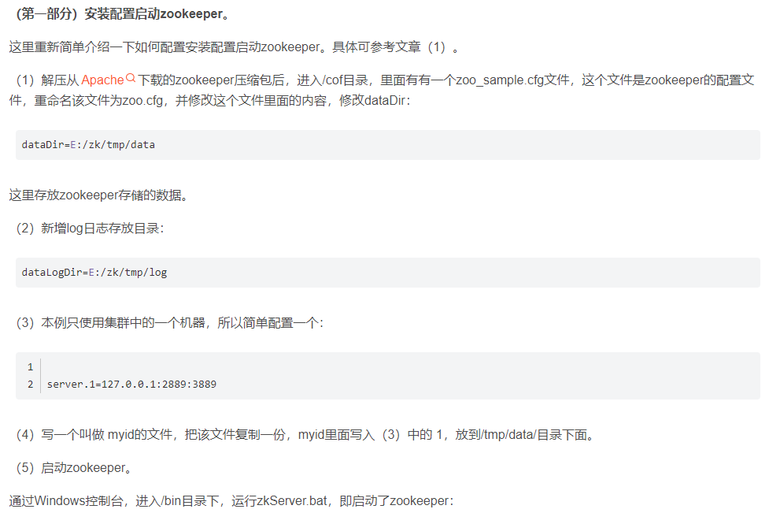
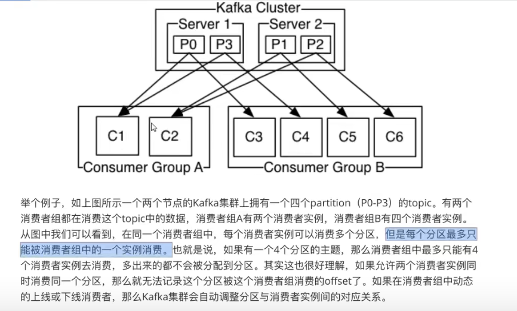
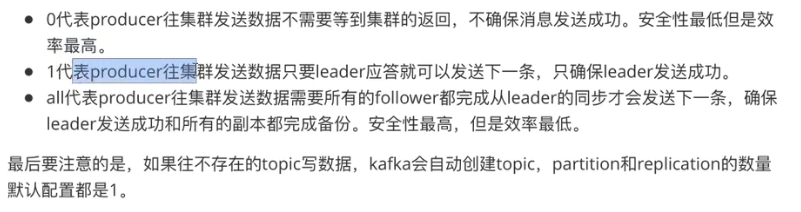
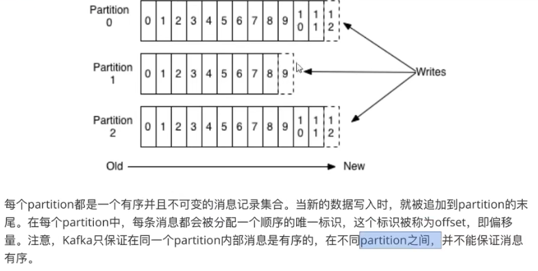
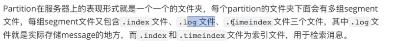
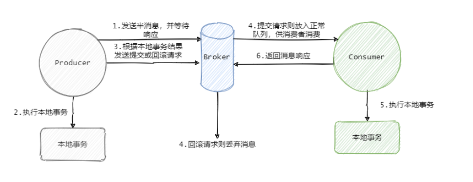

Kafka集群 + Zookeeper集群 +ES 日志收集系统

ELK方案存在的问题

1、运维成本高，每增加一个日志收集项，都需要手动修改配置

2、监控缺失，无法准确获取logstash状态

3、无法做到定制化开发与维护

 

kafka 2.13

zookeeper 3.5.9

## Zookeeper作用

服务注册发现的 做分布式应用的时候 

- 管理集群配置、选举 Leader 以及在 consumer group 发生变化时进行 **Rebalance**（即消费者负载均衡）。
- Producer使用push模式将消息发布到broker，Consumer使用pull模式从broker订阅并消费消息.

 使用ZooKeeper管理Kafka的集群，ZooKeeper 的作用有：broker 注册、topic 注册、producer 和 consumer 负载均衡、维护 partition 与 consumer 的关系、记录消息消费的进度以及 consumer 注册等。

考虑到zk本身的一些因素以及整个架构较大概率存在单点问题，新版本中逐渐弱化了zookeeper的作用。新的consumer使用了kafka内部的group coordination协议，也减少了对zookeeper的依赖

**Broker注册**

Broker是分布式部署并且相互之间相互独立，但是需要有一个注册中心对整个集群的Broker进行管理，此时就使用了Zookeeper。在Zookeeper上会有一个专门用来记录Broker服务器列表的节点：/brokers/ids

每个Broker在启动时，都会在Zookeeper上进行注册，即到/brokers/ids下创建属于自己的节点，如/brokers/ids/[0…N]。

Kafka使用了全局唯一的数字来指代每个Broker服务器，不同的Broker必须使用不同的Broker ID进行注册，创建完节点后，每个Broker就会将自己的IP地址和端口信息记录到该节点中去。其中，Broker创建的节点类型是临时节点，一旦Broker宕机，则对应的临时节点也会被自动删除。这样，我们就可以很方便的监控到Broker节点的变化，及时调整负载均衡等。

**Topic注册**

在kafka中，用户可以自定义多个topic，每个topic又被划分为多个分区，每个分区存储在一个独立的broker上。这些分区信息及与Broker的对应关系都是由Zookeeper进行维护。

在zookeeper中，建立专门的节点来记录这些信息，其节点路径为/brokers/topics/{topic_name}。并且topic创建的节点类型也是临时节点

**生产者负载均衡**

同一个Topic消息会被分区并将其分布在多个Broker上。由于每个Broker启动时，都会在Zookeeper上进行注册，生产者会通过该节点的变化来动态地感知到Broker服务器列表的变更，这样就可以实现动态的负载均衡。

**消费者负载均衡**

与生产者类似，Kafka中的消费者同样需要进行负载均衡来实现多个消费者合理地从对应的Broker服务器上接收消息，每个消费者分组包含若干消费者，**每条消息都只会发送给分组中的一个消费者**，不同的消费者分组消费自己特定的Topic下面的消息，互不干扰。

每个消费者都需要关注所属消费者分组中其他消费者服务器的变化情况，即对/consumers/[group_id]/ids节点注册子节点变化的Watcher监听，一旦发现消费者新增或减少，就触发消费者的负载均衡。

还对Broker服务器变化注册监听。消费者需要对/broker/ids/[0-N]中的节点进行监听，如果发现Broker服务器列表发生变化，那么就根据具体情况来决定是否需要进行消费者负载均衡。

**分区与消费者的关系**
消费者组 Consumer group 下有多个 Consumer（消费者）。

对于每个消费者组 (Consumer Group)，Kafka都会为其分配一个全局唯一的Group ID，Group 内部的所有消费者共享该 ID。订阅的topic下的每个分区只能分配给某个 group 下的一个consumer(当然该分区还可以被分配给其他group)。同时，Kafka为每个消费者分配一个Consumer ID。

在Kafka中，规定了每个消息分区 只能被同组的一个消费者进行消费，因此，**需要在 Zookeeper 上记录 消息分区 与 Consumer 之间的关系**，每个消费者一旦确定了对一个消息分区的消费权力，需要将其Consumer ID 写入到 Zookeeper 对应消息分区的临时节点上，例如：
/consumers/[group_id]/owners/[topic]/[broker_id-partition_id]
其中，[broker_id-partition_id]就是一个 消息分区 的标识，节点内容就是该消息分区上消费者的Consumer ID。

**记录消息消费的进度Offset**
在消费者对指定消息分区进行消息消费的过程中，需要定时地将分区消息的消费进度Offset记录到Zookeeper上，以便在该消费者进行重启或者其他消费者重新接管该消息分区的消息消费后，能够从之前的进度开始继续进行消息消费。

Offset在Zookeeper中由一个专门节点进行记录，其节点路径为:

/consumers/[group_id]/offsets/[topic]/[broker_id-partition_id]

节点内容就是Offset的值。

**消费者注册**
		注册新的消费者分组
当新的消费者组注册到zookeeper中时，zookeeper会创建专用的节点来保存相关信息，其节点路径为 /consumers/{group_id}，其节点下有三个子节点，分别为[ids, owners, offsets]。

ids节点：记录该消费组中当前正在消费的消费者；

owners节点：记录该消费组消费的topic信息；

offsets节点：记录每个topic的每个分区的offset；

​		注册新的消费者
当新的消费者注册到zookeeper中时，会在/consumers/{group_id}/ids节点下创建临时子节点，并记录相关信息

## Rebalance机制

在Kafka中，当有新消费者加入或者订阅的Topic数发生变化时，会触发Rebalance(再均衡：在同一个消费者组当中，分区的所有权从一个消费者转移到另外一个消费者)机制，Rebalance顾名思义就是重新均衡消费者消费。

Rebalance的过程如下：

第一步：所有消费成员都向Coordinator发送请求，请求入Consumer Group。一旦所有成员都发送了请求，Coordinator会从中选择一个Consumer担任Leader的角色，并把组成员信息以及订阅信息发给Leader。
第二步：Leader开始分配消费方案，指明具体哪个Consumer负责消费哪些Topic的哪些Partition。一旦完成分配，leader会将这个方案发给Coordinator。Coordinator接收到分配方案之后会把方案发给各个Consumer，这样组内的所有成员就都知道自己应该消费哪些分区了。
所以对于Rebalance来说，Coordinator起着至关重要的作用

**触发条件：**

触发条件，我们可以发现根本原因还是因为topic 中partition或者consumer实例发生了变更。

- consumer group成员发生变更

- consumer group订阅的topic数发生变更

- consumer group 订阅的topic分区数发生变更。

**rebalance的影响：**

1、可能重复消费: Consumer被踢出消费组，可能还没有提交offset，Rebalance时会Partition重新分配其它Consumer,会造成重复消费，虽有幂等操作但耗费消费资源，亦增加集群压力

2、集群不稳定：Rebalance扩散到整个ConsumerGroup的所有消费者，因为一个消费者的退出，导致整个Group进行了Rebalance，并在一个比较慢的时间内达到稳定状态，影响面较大

3、影响消费速度：频繁的Rebalance反而降低了消息的消费速度，大部分时间都在重复消费和Rebalance

kafka新版本提供了三种rebalance分区分配策略：

- **RangeAssignor 范围分配**  分区尽可能平均的分配给所有的消费者。
- **RoundRobinAssignor(轮询分配)** 将消费者组内所有主题的分区按照字典序排序，然后通过轮询的方式逐个将分区一次分配给每个消费者。
- **Stricky(粘性分配)**

**sticky**分配策略是从0.11.x版本开始引入的分配策略，它主要有两个目的：

（1）分区的分配要尽可能均匀。

（2）分区的分配尽可能与上次分配的保持相同。

当两者发生冲突时，第一个目标优于第二个目标。sticky具体实现要比上面两种要复杂的多。

## 集群部署和测试：

Kafka使用ZooKeeper管理集群，ZooKeeper用于协调服务器或集群拓扑，ZooKeeper是配置信息的一致性文件系统。

 

选择Kafka自带的Zookeeper，也可以选择单独部署，一台主机开放三个端口即可构建一个简单的伪ZooKeeper集群。

如本系统使用Kafka自带的Zookeeper部署伪ZooKeeper集群，开放三个端口：

server.1=localhost:2887:3887

server.2=localhost:2888:3888

server.3=localhost:2889:3889

server.A=B:C:D;其中 A 是一个数字，表示这个是第几号服务器；B 是这个服务器的 ip 地址；

C 表示的是这个服务器与集群中的 Leader 服务器交换信息的端口；D 表示的是万一集群中的 Leader 服务器挂了，

需要一个端口来重新进行选举，选出一个新的 Leader，而这个端口就是用来执行选举时服务器相互通信的端口。

 

新版本Kafka内置了zookeeper

Kafka集群，在本机上开放三个端口搭建Kafka集群

9097 9098 9099三个端口

在Kafka配置文件里，设置zookeeper的连接

**zookeeper.connect**=localhost:2181,localhost:2182,localhost:2183

这三个端口是zookeeper客户端连接的端口号

若是自己单独配置zookeeper,

 

kafka学习

https://gitbook.cn/books/5ae1e77197c22f130e67ec4e/index.html

## Kafka介绍

http://blog.itpub.net/31077337/viewspace-2185691/

Kafka是一种高吞吐量的 发布订阅消息系统，它可以处理消费者规模的网站中所有动作流数据。

Kafka的目的是通过 并行加载机制统一线上和离线消息处理，并通过 提供实时消息。

2、Topic——每条发布到Kafka集群的消息都有一个类别，这个类别被称为Topic。

（物理上不同Topic的消息分开存储，逻辑上一个Topic的消息虽然保存于一个或多个broker上但用户只需指定消息的Topic即可生产或消费数据而不必关心数据存于何处）

4、Producer——负责发布消息到Kafka broker

5、Consumer——消息消费者，向Kafka broker读取消息的客户端。

ZooKeeper可以将拓扑更改发送到Kafka，如果集群中的某台服务器宕机或者某个topic被添加、删除，集群中的每个节点都可以知道新服务器何时加入，

ZooKeeper提供Kafka Cluster配置的同步视图。

Kafka服务器

Kafka集群由多个Kafka Brokers组成。每个Kafka Broker都有一个唯一的ID（编号）。

Kafka Brokers包含主题日志分区，如果希望获得故障处理能力，需要保证至少有三到五个服务器，

Kafka集群最大可同时存在10,100或1,000个服务器。Kafka将每个partition数据复制到多个server上,

任何一个partition有一个leader和多个follower(可以没有);备份的个数可以通过broker配置文件来设定.

当leader失效时,需在followers中选取出新的leader,可能此时follower落后于leader,因此需要选择一个"up-to-date"的follower。

 

https://www.cnblogs.com/06080410z/p/15349784.html 讲得挺细的

## Kafka特点

**高吞吐量、低延迟 高容错率 高可用** 

Kafka 每秒可以处理几十万条消息，它的延迟最低只有几毫秒。每个 topic 可以分多个 Partition，Consumer Group 对 Partition 进行消费操作，提高负载均衡能力和消费能力。

高吞吐量 可以做集群 存储分片  topic 分区做负载，提高Kafka的吞吐量

低延迟 取数据快 不是随机 读取 顺序读取的 零拷贝 网络io

高容错率 配合zookeeper  可以做集群 某个节点挂了 可以选举 leader follower

## 为什么需要消息队列 （MQ）

主要原因是由于在高并发环境下，同步请求来不及处理，请求往往会发生阻塞。比如大量的请求并发访问数据库，导致行锁表锁，最后请求线程会堆积过多， 从而触发 too many connection 错误， 引发雪崩效应。

我们使用消息队列，通过异步处理请求，从而缓解系统的压力。消息队列常应用于**异步处理，流量削峰，应用解耦，消息通讯**等场景当前比较常见的 MQ 中间件有 ActiveMQ、RabbitMQ、RocketMQ、Kafka 等。

## 使用消息队列的好处

（1）解耦

允许你独立的扩展或修改两边的处理过程， 只要确保它们遵守同样的接口约束。

（2）可恢复性

系统的一部分组件失效时，不会影响到整个系统。消息队列降低了进程间的耦合度，所以即使一个处理消息的进程挂掉，加入队列中的消息仍然可 以在系统恢复后被处理。

（3）缓冲

有助于控制和优化数据流经过系统的速度，解决生产消息和消费消息的处理速度不一致的情况。

（4）灵活性 & 峰值处理能力

在访问量剧增的情况下， 应用仍然需要继续发挥作用，但是这样的突发流量并不常见。 如果为以能处理这类峰值访问为标准来投入资源随时待命无疑是巨大的浪费。 使用消息队列能够使关键组件顶住突发的访问压力， 而不会因为突发的超负荷的请求而完全崩溃。

（5）异步通信很多时候，用户不想也不需要立即处理消息。消息队列提供了异步处理机制， 允许用户把一个消息放入队列， 但并不立即处理它。 想向队列中放入多少消息就放多少，然后在需要的时候再去处理它们。

消息队列的两种模式

（1）点对点模式（一对一，消费者主动拉取数据，消息收到后消息清除）

（2）发布/订阅模式（一对多， 又叫观察者模式，消费者消费数据之后不会清除消息）

消息生产者 （发布）将消息发布到 topic 中，同时有多个消息消费者 （订阅）消费该消息。和点对点方式不同，发布到 topic 的消息会被所有订阅者消费。

发布/订阅模式是定 义对象间一种—对多的依赖关系，使得每当一个对象 （ 目标对象）的状态发生改变， 则所有依赖干它的对象 （观察者对象）都会得到通知并自动更新。

 

Kafka 是一个分布式的基于发布/订阅模式的消息队列（MQ，Message Queue），主要应用于大数据实时处理领域。

Kafka 是最初由 Linkedin 公司开发，是一个分布式、支持分区的（partition）、多副本的（replica），基于 Zookeeper协调的分布式消息中间件系统，

它的最大的特性就是可以实时的处理大量数据以满足各种需求场景，比如基于 hadoop的批处理系统、低延迟的实时系统、Spark/Flink 流式处理引擎，nginx 访问日志，消息服务等等，用 scala 语言编写， Linkedin 于 2010 年贡献给了 Apache 基金会并成为顶级开源项目。

 

## Kafka的推拉模式

一般而言我们在谈论**推拉模式的时候指的是 Comsumer 和 Broker 之间的交互**。

默认的认为 Producer 与 Broker 之间就是推的方式，即 Producer 将消息推送给 Broker，而不是 Broker 主动去拉取消息。

如果需要 Broker 去拉取消息，那么 Producer 就必须在本地通过日志的形式保存消息来等待 Broker 的拉取，如果有很多生产者的话，那么消息的可靠性不仅仅靠 Broker 自身，还需要靠成百上千的 Producer。

## 推模式：

推模式指的是消息从 Broker 推向 Consumer，即 Consumer 被动的接收消息，由 Broker 来主导消息的发送

好处：

**消息实时性高**， Broker 接受完消息之后可以立马推送给 Consumer。

**对于消费者使用来说更简单**，简单啊就等着，反正有消息来了就会推过来。

坏处：

**推送速率难以适应消费速率**，推模式的目标就是以最快的速度推送消息，当生产者往 Broker 发送消息的速率大于消费者消费消息的速率时，随着时间的增长消费者那边可能就“爆仓”了，因为根本消费不过来啊

推模式难以根据消费者的状态控制推送速率，**适用于消息量不大、消费能力强要求实时性高的情况下**

## 拉模式：

拉模式指的是 Consumer 主动向 Broker 请求拉取消息，即 Broker 被动的发送消息给 Consumer。

好处：

拉模式主动权就在消费者身上了，**消费者可以根据自身的情况来发起拉取消息的请求**。假设当前消费者觉得自己消费不过来了，它可以根据一定的策略停止拉取，或者间隔拉取都行。

**拉模式下 Broker 就相对轻松了**，它只管存生产者发来的消息，至于消费的时候自然由消费者主动发起

**拉模式可以更合适的进行消息的批量发送**，基于推模式可以来一个消息就推送，也可以缓存一些消息之后再推送，但是推送的时候其实不知道消费者到底能不能一次性处理这么多消息。而拉模式就更加合理，它可以参考消费者请求的信息来决定缓存多少消息之后批量发送。

缺点：

**消息延迟**，毕竟是消费者去拉取消息，但是消费者怎么知道消息到了呢？所以它只能不断地拉取，但是又不能很频繁地请求，太频繁了就变成消费者在攻击 Broker 了。因此需要降低请求的频率，比如隔个 2 秒请求一次，你看着消息就很有可能延迟 2 秒了。

**消息忙请求**，忙请求就是比如消息隔了几个小时才有，那么在几个小时之内消费者的请求都是无效的，在做无用功。

**Kafka 选择了拉模式**

拉模式更加的合适，因为现在的消息队列都有持久化消息的需求，也就是说本身它就有个存储功能，它的使命就是接受消息，保存好消息使得消费者可以消费消息即可。

而消费者各种各样，身为 Broker 不应该有依赖于消费者的倾向，我已经为你保存好消息了，你要就来拿好了。

虽说一般而言 Broker 不会成为瓶颈，因为消费端有业务消耗比较慢，但是 Broker 毕竟是一个中心点，能轻量就尽量轻量。

**Kafka中的长轮询**

 Kafka 在拉请求中有参数，可以使得消费者请求在 “长轮询” 中阻塞等待

消费者去 Broker 拉消息，定义了一个超时时间，也就是说消费者去请求消息，如果有的话马上返回消息，如果没有的话消费者等着直到超时，然后再次发起拉消息请求。并且 Broker 也得配合，如果消费者请求过来，有消息肯定马上返回，没有消息那就建立一个延迟操作，等条件满足了再返回。

总结：

 Kafka 都是采用“长轮询”的机制，具体的做法都是通过消费者等待消息，当有消息的时候 Broker 会直接返回消息，如果没有消息都会采取延迟处理的策略，并且为了保证消息的及时性，在对应队列或者分区有新消息到来的时候都会提醒消息来了，及时返回消息。
一句话说就是消费者和 Broker 相互配合，拉取消息请求不满足条件的时候 hold 住，避免了多次频繁的拉取动作，当消息一到就提醒返回。

## Kafka的基础知识

Broker  每一个kafka实例节点服务器

Topic 消息的主题 每个broker可以有多个Topic

Partition Topic的分区 同一个topic的不同分区数据是不重复的

Replication 默认十个副本 不能超过Broker的数量

在不同的Broker上面 即每一个分区有多个副本 主分区（Leader故障的时候）会选取一个Follower作为Leader (ISR表)

一台机器不可能有同一个分区的leader 和 follower的

消费

在同一个消费者中，每个消费者实例可以消费多个分区，但每个分区最多只能被消费者组中的一个实例消费。

## ACK应答机制

producer在向Kafka写入消息的时候，可以设置参数来确定是否确认Kafka接受到数据，这个参数可设置的值为0，1，all。

 

## Kafka分区内消息的有序性

## 分区数据

.index文件 .log文件  .timeindex文件

## 为什么要用Kafka   技术选型

## 不同消息队列的对比

https://zhuanlan.zhihu.com/p/60288391

https://blog.csdn.net/yunfeng482/article/details/72856762

1. 全量的消息队列究竟有哪些？
2. Kafka、RocketMQ、RabbitMQ的优劣势比较；
3. 以及消息队列的选型； 

- Kafka

scala语言 高吞吐量 单机10万级并发 写入性能高 毫秒级别

高并发代价可能出现消息的丢失 所以用于大数据的日志收集比较常见

支持消息查询

- RabbitMQ

erlang语言 单机万级吞吐量  RabbitMQ确实吞吐量会低一些

学习和维护成本较高 社区活跃度高

- RocketMQ

RocketMQ整合了Kafka和RabbitMQ的优点，例如较高的吞吐量和通过参数配置能够做到消息绝对不丢失。

java语言 单机吞吐量十万级 

消息可靠性：经过参数优化配置，消息可以做到0丢失

不同于Kafka的单一日志收集功能，RocketMQ被广泛运用于订单、交易、计算、消息推送、binlog分发等场景。

RocketMQ提供的丰富的功能。例如延迟消息、事务消息、消息回溯、死信队列、消费重试等等

延迟消息:

延迟消息是指生产者发送消息发送消息后，不能立刻被消费者消费，需要等待指定的时间后才可以被消费。

延迟队列：

当你在网上购物的时候是否会遇到这样的提示：“三十分钟之内未付款，订单自动取消”?这个是延迟队列的一种典型应用场景。延迟队列存储的是对应的延迟消息，所谓“延迟消息”是指当消息被发送以后，并不想让消费者立刻拿到消息，而是等待特定时间后，消费者才能拿到这个消息进行消费。

事务消息:

消息回溯:

一般消息在消费完成之后就被处理了，之后再也不能消费到该条消息。消息回溯正好相反，是指消息在消费完成之后，还能消费到之前被消费掉的消息。

死信队列:

死信队列用于处理无法被正常消费的消息。当一条消息初次消费失败，消息队列会自动进行消息重试；达到最大重试次数后，若消费依然失败，则表明消费者在正常情况下无法正确地消费该消息，此时，消息队列 不会立刻将消息丢弃，而是将其发送到该消费者对应的特殊队列中。

### 如何保证消息顺序性

https://www.jianshu.com/p/ab0275888abf

Kafka可以保证消息在一个Partition分区内的顺序性。如果生产者按照顺序发送消息，Kafka将按照这个顺序将消息写入分区，消费者也会按照同样的顺序来读取消息（通过自增偏移量）。

- `retries`: 消息投递失败重试次数
- `max.in.flight.requests.per.connection`: 生产者在收到kafka响应之前可以投递多少个消息

1. 可以把`retries`设置为0 ，不重试，那么消息肯定是有序的，只不过存在消息投递失败丢失的情况。
2. 将`max.in.flight.requests.per.connection`设置为1，在接收到Kafka响应之前，只允许一个批次的消息处于投递中的状态，这当然会严重影响Kafka的吞吐量。

## 如果你要设计一个消息队列 怎么设计

通信 

可靠性

## 消息队列设计的难点在于

高吞吐量 低延迟 高容错率 高可用

1. 可扩展性

kafka 集群支持热扩展

2. 持久性、可靠性

消息被持久化到本地磁盘，并且支持数据备份防止数据丢失

3. 容错性

允许集群中节点失败（多副本情况下，若副本数量为 n，则允许 n-1 个节点失败）

4. 高并发

支持数干个客户端同时读写

 

3.3 Partition

为了实现扩展性，一个非常大的 topic 可以分布到多个 broker （即服务器）上，一个 topic 可以分割为一个或多个 partition，每个 partition 是一个有序的队列。Kafka 只保证 partition 内的记录是有序的，而不保证 topic 中不同 partition 的顺序。

分区的原因 :

方便在集群中扩展，每个Partition可以通过调整以适应它所在的机器，而一个topic又可以有多个Partition组成，因此整群就可以适应任意大小的数据了;

可以提高并发，因为可 以以Partition为单位读写了。

3.6 Replica

副本，为保证集群中的某个节点发生故障时，该节点上的 partition 数据不丢失，且 kafka 仍然能够继续工作，kafka提供了副本机制，一个 topic 的每个分区都有若干个副本，一个 leader 和若干个 follower

 

Kafka面试题：

https://www.nowcoder.com/discuss/809261?type=all&order=recall&pos=&page=0&ncTraceId=&channel=-1&source_id=search_all_nctrack&gio_id=0B4AEC2B6C443237D83E9B6E4B928204-1640744414161

 

## kafka的应用场景和优势（入场券）

解耦，高吞吐（以及如何保证高吞吐）

## kafka如何做到发送端和接收端的顺序一致性？

发送端只保证了partition级别的顺序一致性，不保证topic级别的顺序。可以指定key值让相同key的数据到同一个partition保证顺序一致性。

消费端使用offset保证读入数据的一致性。

 

 

零拷贝的实现原理，省略了哪一次上下文切换？（这个也是netty经常会问到的问题）

如果频繁的从磁盘读数据然后发给消费者，会增加两次没必要的拷贝，如下图：

 

一次是从操作系统的 cache 里拷贝到应用进程的缓存里，接着又从应用程序缓存里拷贝回操作系统的 Socket 缓存里。 

而且为了进行这两次拷贝，中间还发生了好几次上下文切换，一会儿是应用程序在执行，一会儿上下文切换到操作系统来执行。所以这种方式来读取数据是比较消耗性能的。

**Kafka 为了解决这个问题，在读数据的时候是引入零拷贝技术。**

也就是说，直接让操作系统的 cache 中的数据发送到**网卡**后传输给下游的消费者，**中间跳过了两次拷贝数据的步骤**，Socket 缓存中仅仅会拷贝一个描述符过去，不会拷贝数据到 Socket 缓存，如下图所示：

 

通过**零拷贝技术**，就不需要把 os cache 里的数据拷贝到应用缓存，再从应用缓存拷贝到 Socket 缓存了，两次拷贝都省略了，所以叫做零拷贝。

对 Socket 缓存仅仅就是拷贝数据的描述符过去，然后数据就直接从 os cache 中发送到网卡上去了，**这个过程大大的提升了数据消费时读取文件数据的性能**。 

Kafka 从磁盘读数据的时候，会先看看 os cache 内存中是否有，如果有的话，其实读数据都是直接读内存的。 

kafka 集群经过良好的调优，数据直接写入 os cache 中，然后读数据的时候也是从 os cache 中读。相当于 Kafka 完全基于内存提供数据的写和读了，所以这个整体性能会极其的高。

 

## kafka 消费支持几种消费模式?

 最多/最少/恰好消费一次

at most once 模式 最多一次。保证每一条消息 commit 成功之后，再进行消费处理。消息可能会丢失，但不会重复。 

at least once 模式 至少一次。保证每一条消息处理成功之后，再进行commit。消息不会丢失，但可能会重复。 

exactly once 模式 精确传递一次。将 offset 作为唯一 id 与消息同时处理，并且保证处理的原子性。消息只会处理一次，不丢失也不会重复。但这种方式很难做到。 

kafka 默认的模式是 at least once ，但这种模式可能会产生重复消费的问题，所以在业务逻辑必须做幂等设计。 

在业务场景保存数据时使用了 INSERT INTO ...ON DUPLICATE KEY UPDATE语法，不存在时插入，存在时更新，是天然支持幂等性的。

## kafka 如何保证数据的不重复和不丢失？

exactly once 模式 精确传递一次。将 offset 作为唯一 id 与消息同时处理，并且保证处理的原子性。消息只会处理一次，不丢失也不会重复。但这种方式很难做到。 

kafka 默认的模式是 at least once ，但这种模式可能会产生重复消费的问题，所以在业务逻辑必须做幂等设计。 

使用 exactly Once + 幂等操作，可以保证数据不重复，不丢失。

## kafka 是如何清理过期数据的？

kafka 将数据持久化到了硬盘上，允许你配置一定的策略对数据清理，清理的策略有两个，删除和压缩。

1、删除

log.cleanup.policy=delete启用删除策略

直接删除，删除后的消息不可恢复。

2、压缩 

将数据压缩，只保留每个 key 最后一个版本的数据。 

首先在 broker 的配置中设置log.cleaner.enable=true启用 cleaner，这个默认是关闭的。 

在 topic 的配置中设置log.cleanup.policy=compact启用压缩策略。

 

## Kafka怎么保证数据的一致性和可靠性

[link](https://blog.csdn.net/weixin_38246518/article/details/108123878?spm=1001.2101.3001.6650.12&utm_medium=distribute.pc_relevant.none-task-blog-2%7Edefault%7EBlogCommendFromBaidu%7ERate-12.pc_relevant_paycolumn_v3&depth_1-utm_source=distribute.pc_relevant.none-task-blog-2%7Edefault%7EBlogCommendFromBaidu%7ERate-12.pc_relevant_paycolumn_v3&utm_relevant_index=18)

**可靠性的保证**
下面通过从**topic的分区副本、producer发送到broker、leader选举**三个方面来阐述kafka的可靠性。

- **topic的分区副本**

在众多的分区副本里面有一个副本是 Leader，其余的副本是 follower，所有的读写操作都是经过 Leader 进行的，同时 follower 会定期地去 leader 上的复制数据。

Kafka的分区多副本是Kafka可靠性的核心保证，把消息写入到多个副本可以使Kafka在崩溃时保证消息的持久性及可靠性。

- **producer发送到broker**

**producer发送消息到broker时通过acks参数来确认消息是否发送成功,request.required.acks参数有三个值来代表不同的含义;

同时为了确保消息的可靠性，Producer 发送消息选择同步的方法（默认）**

kafka为用户设置了三种可靠性级别，通过acks参数设定：

0： producer不等broker的ack, 提供了最低的延迟， broker一接收到还没有写入磁盘就返回， broker故障时会丢失数据

1：producer等待broker的ack，partition的leader落盘成功后返回ack， 如果在follower同步成功之前leader故障，会丢失数据

-1（all）:producer等待broker的ack、partition的leader和follower全部落盘成功过后才返回ack，但是如果在follower同步完成后， broker发送ack之前，leader发生故障，那么会造成数据重复；

- **leader选举**

在每个分区的leader都会维护一个ISR（in-sync replicas 已同步的副本）列表，ISR里面就是follower在broker的编号，只有跟得上leader的follower副本才能加入到ISR列表，只有这个列表里面的follower才能被选举为leader，所以在leader挂了的时候，并且unclean.leader.election.enable=false(关闭不完全的leader选举)的情况下，会从ISR列表中选取第一个follower作为新的leader，来保证消息的高可靠性。

 综上所述，为了保证数据的可靠性，我们最少需要**配置一下几个参数**：
topic 级别：设置 replication.factor>=3，并且 min.insync.replicas>=2；

producer 级别：acks=all（或者 request.required.acks=-1），同时发生模式为同步 producer.type=sync

broker 级别：关闭不完全的 Leader 选举，即 unclean.leader.election.enable=false；

[参考](https://cloud.tencent.com/developer/article/1790732)

由于Kafka集群依赖zookeeper集群，所以最简单最直观的方案是，所有Follower 

都在ZooKeeper上设置一个Watch，一旦Leader宕机，其对应的ephemeral znode

会自动删除，此时所有Follower都尝试创建该节点，而创建成功者 

(ZooKeeper保证只有一个能创建成功)即是新的Leader，其它Replica即为 Follower。

## 选举算法

Zab(zookeeper使用)

Raft 

启动时在集群中指定一些机器为Candidate，然后Candidate开始向其他机器(尤其是Follower)拉票，当某个Candidate的票数超过半数，它就成为leader。

## Kafka Leader选举

所谓控制器就是一个Broker，在一个kafka集群中，有多个broker节点，但是它们之间需要选举出一个leader，其他的broker充当follower角色。集群中第一个启动的broker会通过在zookeeper中创建**临时节点/controller**来让自己成为控制器，其他broker启动时也会在zookeeper中创建临时节点，但是发现节点已经存在，所以它们会收到一个异常，意识到控制器已经存在，那么就会在zookeeper中**创建watch对象，便于它们收到控制器变更的通知**。

那么如果控制器由于网络原因与zookeeper断开连接或者异常退出，那么**其他broker通过watch收到控制器变更的通知，就会去尝试创建临时节点/controller**，如果有一个broker创建成功，那么其他broker就会收到创建异常通知，也就意味着集群中已经有了控制器，其他broker只需创建watch对象即可。

如果集群中有一个broker发生异常退出了，那么控制器就会检查这个broker是否有分区的副本leader，如果有那么这个分区就需要一个新的leader，此时控制器就会去遍历其他副本，决定哪一个成为新的leader，同时更新分区的ISR集合。

如果有一个broker加入集群中，那么控制器就会通过Broker ID去判断新加入的broker中是否含有现有分区的副本，如果有，就会从分区副本中去同步数据。

## Kafka Partition选主机制

**3.1 优势**

Kafka的Leader Election方案解决了上述问题，它在所有broker中选出一个controller，所有Partition的Leader选举都由controller决定。 controller会将Leader的改变直接通过RPC的方式(比ZooKeeper Queue的方式更高效)通知需为此作为响应的Broker。

没有使用 zk，所以无 2.3 问题；也没有注册 watch无 2.2 问题 leader 失败了，就通过 controller 继续重新选举即可，所以克服所有问题。

**3.2 Kafka集群controller的选举**

每个Broker都会在Controller Path (/controller)上注册一个Watch。 当前 Controller失败时，对应的Controller Path会自动消失(因为它是ephemeral Node)，此时该Watch被fire，所有“活” 着的Broker都会去竞选成为新的 Controller (创建新的Controller Path)，但是只会有一个竞选成功(这点由 Zookeeper保证)。竞选成功者即为新的Leader，竞选失败者则重新在新的 Controller Path上注册Watch。因为Zookeeper的Watch是一次性的， 被fire一次 之后即失效，所以需要重新注册。

**3.3 Kafka partition leader的选举**

由controller执行: 

- 从Zookeeper中读取当前分区的所有ISR(in-sync replicas)集合
- 调用配置的分区选择算法选择分区的leader

## 数据一致性的保证

一些概念

木桶原理 选择最小的LEO

LEO（Log End Offset） 每个副本的最后一个offset

HW 所有副本中的最小LEO

**kafka是通过HW（High Water Mark） 机制来保证数据的一致性。**

##### 1. leader故障

从ISR中选出一个新的leader，为了保证多个副本的数据一致性，其余的follower会先将各自的log文件高于HW的部分截掉，然后从新的leader同步数据。

**2.follower故障**

follower发生故障后会被临时踢出ISR，恢复后会把自己log文件高于HW的部分截取掉，然后向leader进行同步，同步完加入到ISR

## kafka的日志存储机制（/index下的文件结构），如何使用时间戳索引日志

/index文件中会生成三份文件XX.log,XX.index,XX.timeindex，日志是分块存储的，时间戳索引从XX.timeindex中找到对应的offset，再从XX.index中索引XX.log。（学到了）

 

Etcd模块:

Etcd 是由 Go 编写的。它是一个强一致性的分布式键值存储，提供一种可靠的方式来存储需要由分布式系统或者机器集群访问的数据。 同时 Etcd 各节点中的通信是通过 Raft 一致性算法来处理的。

Etcd 的场景

服务发现。(可以把服务存储到某个 prefix 开头的 key中，然后消费端或者服务信息以调用， 同时消费者也可以通过 watch 获得 key 的变化)

消息分布和订阅

分布式锁

Leader 选举

分布式队列

负载均衡

 

**项目基本思路**

将日志收集文件路径  写在etcd 里面

通过etcd watch监控键值的变化 去实现动态服务发现

和 redis 的区别

### 面试的时候可能有面试官喜欢问，

redis 数据类型更丰富(string, hash, set ,zset, list)，etcd 仅仅就是 key-val。

etcd 的底层是 Raft 算法，可以保证数据的强一致性。而 redis 数据复制上是主备异步复制，只能最终一致性。

读写性能上，因为 etcd 保证强一致性，所以会比 redis 差。

存储方面，etcd 使用的是持久化存储boltdb，而 redis 的方案是可持久化的 aof/rdb

## ETCD优势 VS Zookeeper

etcd可实现的功能，Zookeeper都能实现，那么为什么要用etcd而非直接使用Zookeeper呢？相较之下，Zookeeper有如下缺点：

1.复杂。Zookeeper的部署维护复杂，管理员需要掌握一系列的知识和技能；而Paxos强一致性算法也是素来以复杂难懂而闻名于世；另外，Zookeeper的使用也比较复杂，需要安装客户端，官方只提供了java和C两种语言的接口。

2.Java编写。这里不是对Java有偏见，而是Java本身就偏向于重型应用，它会引入大量的依赖。而运维人员则普遍希望机器集群尽可能简单，维护起来也不易出错。

3.发展缓慢。Apache基金会项目特有的[“Apache Way”](https://link.jianshu.com?t=http://www.infoworld.com/article/2612082/open-source-software/has-apache-lost-its-way-.html)在开源界饱受争议，其中一大原因就是由于基金会庞大的结构以及松散的管理导致项目发展缓慢。

而etcd作为一个后起之秀，其优点也很明显。

1.简单。使用Go语言编写部署简单；使用HTTP作为接口使用简单；使用Raft算法保证强一致性让用户易于理解。

2.数据持久化。etcd默认数据一更新就进行持久化。

3.安全。etcd支持SSL客户端安全认证。

最后，etcd作为一个年轻的项目，正在高速迭代和开发中，这既是一个优点，也是一个缺点。优点在于它的未来具有无限的可能性，缺点是版本的迭代导致其使用的可靠性无法保证，无法得到大项目长时间使用的检验。然而，目前CoreOS、Kubernetes和Cloudfoundry等知名项目均在生产环境中使用了etcd，所以总的来说，etcd值得你去尝试。

## ETCD实现强一致性

**线性一致性写：**

所有的写操作，都要经过leader节点，一旦leader被选举成功，就可以对客户端提供服务了。客户端提交每一条命令都会按顺序记录到leader地日志中，然后向其他节点并行发送复制命令，大多数节点复制成功后，leader就会执行命令并且将执行结果返回客户端。raft保证已经提交地命令最终也会被其他节点成功执行（状态机）。因为日志是顺序记录的，并且有严格的确认机制，所以可以认为写是满足线性一致性的。

由于在Raft算法中，写操作成功仅仅意味着日志达成了一致（已经落盘），而不能确保当前状态机已经apply了日志。状态机apply日志的行为在大多数Raft算法的实现中都是异步的，所以此时读取状态机并不能准确反应数据的状态，很可能会读到过期数据。

**线性一致读：**

ReadIndex算法：

每次读操作的时候记录此时集群的committed index，当状态机的apply index大于等于committed index时才读取数据并返回。由于此时状态机已经把读请求发起时的已提交日志进行了apply日志，所以此时状态机的状态就可以反应读请求发起时的状态，符合线性一致性读的要求。

大致的流程如下：

1. 如果follower收到读请求，先从Leader获取集群最新的committed index
2. Leader收到ReadIndex请求，会向Follower节点发送心跳确认，一半以上节点确认Leader身份后，才能将committed index返回给请求节点
3. follower节点会等待直到apply index >= committed index时，处理读请求

## etcd通过Raft算法实现强一致性

[link](https://zhuanlan.zhihu.com/p/32052223)

还可以参考下面的

http://dockone.io/article/2434665

raft工作原理:

​	Raft开始时在集群中选举出Leader负责日志复制的管理，Leader接受来自客户端的事务请求（日志），并将它们复制给集群的其他节点，然后负责通知集群中其他节点提交日志，Leader负责保证其他节点与他的日志同步，当Leader宕掉后集群其他节点会发起选举选出新的Leader；

**Raft将系统中的角色分为领导者（Leader）、跟从者（Follower）和候选者**（Candidate）。

- **Leader**：接受客户端请求，并向Follower同步请求日志，当日志同步到大多数节点上后告诉Follower提交日志。有且仅有一个leader节点，如果leader宕机，通过选举机制选出新的leader；
- **Follower**：接受并持久化Leader同步的日志，在Leader告之日志可以提交之后，提交日志，通过安全性的准则来保证保证整个日志复制的强一致性。
- **Candidate**：Leader选举过程中的临时角色。

Raft将一致性拆分为几个关键元素：

- **Leader选举**

​	Raft 使用心跳（heartbeat）触发Leader选举。当服务器启动时，初始化为Follower。Leader向所有Followers周期性发送heartbeat。如果Follower在选举超时时间内没有收到Leader的heartbeat，就会等待一段随机的时间后发起一次Leader选举。Follower将其当前term加一然后转换为Candidate。它首先给自己投票并且给集群中的其他服务器发送 RequestVote RPC。

​	选举出Leader后，Leader通过定期向所有Followers发送心跳信息维持其统治。若Follower一段时间未收到Leader的心跳则认为Leader可能已经挂了，再次发起Leader选举过程。Raft保证选举出的Leader上一定具有最新的已提交的日志

- 日志复制

​	1. Leader选出后，就开始接收客户端的请求。Leader把请求作为日志条目（Log entries）加入到它的日志中，然后并行的**向其他服务器**发起 AppendEntries RPC复制日志条目。当这条日志被复制到**大多数**服务器上，Leader将这条日志应用到它的状态机并向客户端返回执行结果。

​	2. 某些Followers可能没有成功的复制日志，Leader会无限的重试 AppendEntries RPC直到所有的Followers最终存储了所有的日志条目。

​	3. Leader通过强制Followers复制它的日志来处理日志的不一致，Followers上的不一致的日志会被Leader的日志覆盖。

​	4. Leader为了使Followers的日志同自己的一致，Leader需要找到**Followers同它的日志一致**的地方，然后**覆盖Followers在该位置之后的条目**。

- 安全性

Raft增加了如下两条限制以保证安全性：

- 拥有最新的已提交的log entry的Follower才有资格成为Leader。

这个保证是在RequestVote RPC中做的，Candidate在发送RequestVote RPC时，要带上自己的最后一条日志的term和log index，其他节点收到消息时，如果发现自己的日志比请求中携带的更新，则拒绝投票。日志比较的原则是，如果本地的最后一条log entry的term更大，则term大的更新，如果term一样大，则log index更大的更新。

- Leader只能推进commit index来提交当前term的已经复制到大多数服务器上的日志，旧term日志的提交要等到提交当前term的日志来间接提交。
