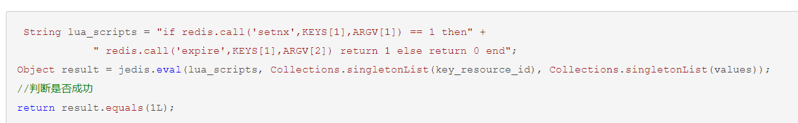

参考
[link](https://javaguide.cn/database/redis/redis-questions-01/)

**Redis 6.2.6 is the latest stable version**

6379

Redis分布式缓存 集群的主从复制 实现读写分离 六个节点的应用实例

关于社交网络分析系统的Redis 集群介绍

社交网络系统使用5.2的版本

Redis集群 6个节点的 三主三从 复制Redis文件 配置端口不一样就行

在项目的redis.properties文件中新增集群机器的配置，将6个节点依次加入配置

在ssm+maven项目中集成redis很简单，只需要引入redis客户端（redis.clients redis连接工具）和spring对redis的支持的jar包（spring-data-redis），引入redis的相关配置就可以了

直接注入jedisCluster获取一个集群对象

**jedisCluster.set(key,value)**

**jedisCluster.get(key)**

## Redis是什么
简单来说 Redis 就是一个使用 C 语言开发的，开源的高性能key-value非关系缓存数据库，不过与传统数据库不同的是 Redis 的数据是存在内存中的 ，也就是它是内存数据库，所以读写速度非常快，每秒可以处理超过 10万次读写操作，因此 Redis 被广泛应用于缓存方向。

另外，Redis 除了做分布式缓存之外，也经常用来做分布式锁，甚至是消息队列。

Redis 提供了多种数据类型（字符串、列表、散列表、集合、有序集合 zset）来支持不同的业务场景。Redis 还支持事务 、持久化、Lua 脚本、多种集群方案。

## Redis用途 应用场景
- 分布式缓存：性能key-value非关系**缓存数据库** 支持集群模式 集群的主从复制模型
- 分布式锁 ： 通过 Redis 来做分布式锁是一种比较常见的方式。通常情况下，我们都是基于 Redisson 来实现分布式锁。
-  限流 ：一般是通过 Redis + Lua 脚本的方式来实现限流。
- 消息队列 ：Redis 自带的 list 数据结构可以作为一个简单的队列使用。Redis5.0 中增加的 Stream 类型的数据结构更加适合用来做消息队列。它比较类似于 Kafka，有主题和消费组的概念，支持消息持久化以及 ACK 机制。 
- 复杂业务场景 ：通过 Redis 以及 Redis 扩展（比如 Redisson）提供的数据结构，我们可以很方便地完成很多复杂的业务场景比如通过 bitmap 统计活跃用户、通过 sorted set 维护排行榜。 如排行榜 计算器应用

## Redis并发场景数据同步问题

- 可以使用 Lua 脚本实现原子性操作，避免不同客户端访问 Redis 服务器造成的数据冲突。
- 在前后多次请求的结果有依赖时，可以使用 Lua 脚本把多个请求整合为一个请求。
- 一次发出多个 Redis 请求，但请求前后无依赖时，使用 `pipeline`，比 Lua 脚本方便

通过watch（监控）+mutil（事务）实现应用于在[分布式](https://so.csdn.net/so/search?q=分布式&spm=1001.2101.3001.7020)高并发处理等相关场景。

Redis 并发set线程安全问题。

redis的每个操作是[原子操作](https://so.csdn.net/so/search?q=原子操作&spm=1001.2101.3001.7020)，但是在java代码中组合起来的redis操作不是原子操作，因此需要借用redis来实现分布式锁，解决并发问题。

##  方法：

Redis并发场景 需要我们自己对多个客户端  做数据同步的保证

1. 加锁synchronized

单实例线程安全没有问题，多实例还是数据不一致。

2. 加分布式锁

多实例集群模式 加分布式锁

基于redis的setnx命令实现分布式锁

就是在Redis 设置一个分布式锁 值的标识  每次获取分布式锁 就是setnx("lock",1)   释放就删除就行

3. lua脚本，所有的命令为原子性

## Redis 常见数据类型以及使用场景分析

5种 String List Hash Set Sorted set

- string
Redis自己构建了一种 简单动态字符串（simple dynamic string，SDS）
相比于 C 的原生字符串，Redis 的 SDS 不光可以保存文本数据还可以保存二进制数据，并且获取字符串长度复杂度为 O(1)（C 字符串为 O(N)）
应用场景： 一般常用在需要计数的场景，比如**用户的访问次数、热点文章的点赞转发数量**等等。string自增自减实现计数器

- list
  Redis 的 list 的实现为一个 双向链表，即可以支持反向查找和遍历，更方便操作，不过带来了部分额外的内存开销。
  应用场景: 发布与订阅或者说消息队列、慢查询。

- hash

  hash 类似于 JDK1.8 前的 HashMap，内部实现也差不多(数组 + 链表)。

  hash 是一个 string 类型的 field 和 value 的映射表，特别适合用于存储对象，内部实现类似于数组+链表，后续操作的时候，你可以直接仅仅修改这个对象中的某个字段的值。 比如我们可以 hash 数据结构来存储用户信息，商品信息等等。
  应用场景: 系统中对象数据的存储。

- set
set 类似于 Java 中的 HashSet 
应用场景: 需要存放的数据不能重复以及需要获取多个数据源交集和并集等场景，
比如：你可以将一个用户**所有的关注人存在一个集合**中，将其**所有粉丝存在一个集合**。Redis 可以非常方便的实现如共同关注、共同粉丝、共同喜好等功能。这个过程也就是求交集的过程。 哈希表实现的

- sorted set
  和 set 相比，sorted set 增加了一个权重参数 score，使得集合中的元素能够按 score 进行有序排列，还可以通过 score 的范围来获取元素的列表。
  应用场景： 需要对数据根据某个权重进行排序的场景。比如在直播系统中，实时排行信息包含直播间在线用户列表，各种礼物排行榜，弹幕消息（可以理解为按消息维度的**消息排行榜**）等信息。使用跳跃表实现sorted set.

实现原理：

- bitmap 位图
  bitmap 存储的是连续的二进制数字（0 和 1）通过 bitmap,  只需要一个 bit 位来表示某个元素对应的值或者状态，key 就是对应元素本身 。我们知道 8 个 bit 可以组成一个 byte，所以 bitmap 本身会极大的节省储存空间。
  应用场景： 适合需要保存状态信息（比如是否签到、是否登录...）并需要进一步对这些信息进行分析的场景。比如用户签到情况、活跃用户情况、用户行为统计（比如是否点赞过某个视频）。

## Redis 数据结构

**字典**  就是哈希表数组

[link](https://www.jianshu.com/p/bfecf4ccf28b)

1. 在Redis中，Redis数据库就是使用字典来作为底层实现的，Redis的字典使用**哈希表数组**作为底层实现。

2. 以**链地址法**的方式解决键冲突问题，多个哈希值相同的键值对连接在一起**，**程序总是将新节点添加到链表的表头位置（这样添加节点的时间复杂度为O(1)）**。

3. Redis 的字典 dict 中包含两个哈希表 dictht，这是为了方便进行 rehash 操作。在扩容时，将其中一个 dictht 上的键值对 rehash 到另一个 dictht 上面，完成之后释放空间并交换两个 dictht 的角色。

**Redis扩容** **渐进性扩容**

rehash 操作不是一次性完成，而是采用**渐进方式**，这是为了避免一次性执行过多的 rehash 操作给服务器带来过大的负担。

这样做的目的是，如果服务器中包含很多键值对，要一次性的将这些键值对全部rehash到ht[1]的话，庞大的计算量可能导致服务器在一段时间内停止服务于。

渐进式 rehash 通过记录 dict 的 **rehashidx** 完成，它从 0 开始，然后每执行一次 rehash 都会递增。例如在一次 rehash 中，要把 dict[0] rehash 到 dict[1]，这一次会把 dict[0] 上 table[rehashidx] 的键值对 rehash 到 dict[1] 上，dict[0] 的 table[rehashidx] 指向 null，并令 rehashidx++。

在 rehash 期间，每次对字典执行添加、删除、查找或者更新操作时，都会执行一次渐进式 rehash。

字典的删除、查找、更新等操作都是在两个表上进行的。

例如，**查找**操作会先在ht[0]上进行，如果没找到再在ht[1]上进行。

**添加**操作的键值对会一律保存到ht[1]中，这一措施保证ht[0]包含的键值对只会减少不会增加。

采用渐进式 rehash 会导致字典中的数据分散在两个 dictht 上，因此对字典的查找操作也需要到对应的 dictht 去执行。

哈希表结构

table属性是一个**数组**，数组中的每个元素都指向一个dictEntry结构的指针，每个dictEntry结构保存着一个键值对。

**以拉链法的方式解决冲突问题，多个哈希值相同的键值对连接在一起**

**跳跃表**

是有序集合的底层实现之一。

跳跃表是基于**多指针有序链表**实现的，可以看成多个有序链表。

可以实现二分查找的有序链表 可以实现插入 删除 查找 特别重要 区间查询（红黑树不可以）

在查找时，从上层指针开始查找，找到对应的区间之后再到下一层去查找。

**与红黑树等平衡树相比，跳跃表具有以下优点：**

- 插入速度非常快速，因为不需要进行旋转等操作来维护平衡性；
- 更容易实现；
- 按照区间来查找数据这个操作，红黑树的效率没有跳表高。按照区间查找数据时，跳表可以做到 O(logn) 的时间复杂度定位区间的起点，然后在原始链表中顺序往后遍历就可以了，非常高效。

**为什么Redis选择使用跳表而不是红黑树来实现有序集合？**

首先，我们来分析下Redis的有序集合支持的操作：

1）插入元素

2）删除元素

3）查找元素

4）有序输出所有元素

5）查找区间内所有元素

其中，前4项红黑树都可以完成，且时间复杂度与跳表一致。

但是，最后一项，红黑树的效率就没有跳表高了。

在跳表中，要查找区间的元素，我们只要定位到两个区间端点在最低层级的位置，然后按顺序遍历元素就可以了，非常高效。

而红黑树只能定位到端点后，再从首位置开始每次都要查找后继节点，相对来说是比较耗时的。

此外，跳表实现起来很容易且易读，红黑树实现起来相对困难，所以Redis选择使用跳表来实现有序集合。

## Redis 单线程模型

先讲这个：

Redis 基于 Reactor 模式开发了自己的网络事件模型，使用 I/O 多路复用程序来同时监听多个套接字，并将到达的事件传送给文件事件分派器，分派器会根据套接字产生的事件类型调用相应的事件处理器。

由于**文件事件处理器**（file event handler）是单线程方式运行的，所以我们一般都说 Redis 是单线程模型。

文件事件处理器（file event handler）主要是包含 4 个部分： 

- 多个 socket（客户端连接）
- IO 多路复用程序（支持多个客户端连接的关键）
- 文件事件分派器（将 socket 关联到相应的事件处理器）
- 事件处理器（连接应答处理器、命令请求处理器、命令回复处理器）

**Redis 通过IO 多路复用程序 来监听来自客户端的大量连接（或者说是监听多个 socket），它会将感兴趣的事件及类型（读、写）注册到内核中并监听每个事件是否发生。**

 **I/O 多路复用技术的使用让 Redis 不需要额外创建多余的线程来监听客户端的大量连接，降低了资源的消耗。**

**后来Redis6.0后引入多线程是为了提高网络 IO 读写性能**。

 Redis 服务器是一个事件驱动程序，服务器需要处理两类事件：1. 文件事件; 2. 时间事件。

文件事件就是上面说的文件事件处理器

## Redis单线程为什么还能这么快？

- Redis是基于内存的，内存的读写速度非常快；
- Redis是单线程的，避免了不必要的上下文切换和竞争条件；
- Redis使用多路复用技术，可以处理并发的连接。非阻塞I/O内部实现采用epoll，采用了epoll+自己实现的简单的事件框架。epoll中的读、写、关闭、连接都转化成了事件，然后利用epoll的多路复用特性，绝不在io上浪费一点时间。

## Redis多线程知识
- Redis 4.0加入了对多线程的支持，增加的多线程主要是针对一些大键值对的删除操作的命令，使用这些命令就会使用主处理之外的其他线程来“异步处理”。
- Redis 6.0 之前主要还是单线程处理

-  **Redis6.0 引入多线程主要是为了提高网络 IO 读写性能，但是Redis 的瓶颈主要受限于内存和网络。**
- Redis6.0 引入了多线程，但是 Redis 的多线程只是在网络数据的读写这类耗时操作上使用了，**执行命令仍然是单线程顺序执行**。因此，你也不需要担心线程安全问题。
- Redis6.0 的多线程默认是禁用的，只使用主线程。如需开启需要修改 redis 配置文件 redis.conf，且还需要设置线程数，否则是不生效的。

redis.conf配置文件
>io-threads-do-reads yes
>io-threads 4 #官网建议4核的机器建议设置为2或3个线程，8核的建议设置为6个线程

## Redis6.0 之前 为什么不使用多线程
1. 单线程编程容易并且更容易维护；
2. Redis 的性能瓶颈不在 CPU ，主要在内存和网络；
3. 多线程就会存在死锁、线程上下文切换等问题，甚至会影响性能。

**但后来Redis6.0后引入多线程是为了提高网络 IO 读写性能**。

## Redis线程安全问题

我们正常理解的线程安全问题是指`单进程多线程`模型内部多个线程`操作进程内共享内存`导致的数据资源充突。而 Redis 的线程安全问题的产生，并不是来自于 Redis 服务器内部。

Redis 作为数据服务器，就相当于多个客户端的共享内存，多个客户端就相当于同一进程下的多个线程，如果多个客户端之间没有良好的数据同步策略，就会产生类似线程安全的问题。

## Redis 给缓存数据设置过期时间的作用
- 因为内存是有限的，如果缓存中的所有数据都是一直保存的话，分分钟直接 Out of memory
- 很多时候，我们的业务场景就是需要某个数据只在某一时间段内存在, 短信验证码可能只在 1 分钟内有效，用户登录的 token 可能只在 1 天内有效。

## Redis 是如何判断数据是否过期的
Redis 通过一个叫做**过期字典（可以看作是 hash 表）**来保存数据过期的时间。过期字典的键指向 Redis 数据库中的某个 key(键)，过期字典的值是一个 long long 类型的整数，这个整数保存了 key 所指向的数据库键的过期时间（毫秒精度的 UNIX 时间戳）。

过期字典是存储在 redisDb 这个结构里的

## 过期的数据的删除策略

- **惰性删除** ：只会在取出 key 的时候才对数据进行过期检查。这样对 CPU 最友好，但是可能会造成太多过期 key 没有被删除。 
- **定期删除** ： 每隔一段时间抽取一批 key 执行删除过期 key 操作。并且，Redis 底层会通过限制删除操作执行的时长和频率来减少删除操作对 CPU 时间的影响。 定期删除对内存更加友好，惰性删除对 CPU 更加友好。

两者各有千秋，所以 Redis 采用的是 定期删除+惰性删除 。

但是，仅仅通过给 key 设置过期时间还是有问题的。因为还是可能存在定期删除和惰性删除漏掉了很多过期 key 的情况。这样就导致大量过期 key 堆积在内存里，然后就 Out of memory 了。

怎么解决这个问题呢？答案就是：**Redis 内存淘汰机制**。

## Redis 内存淘汰机制
allkey LRU LFU Random
volatile LRU LFU Random
再加两个
noeviction 写入报错
volatile ttl 有更早过期时间的key优先移除

Redis的内存淘汰策略是指在Redis的用于缓存的内存不足时，怎么处理需要新写入且需要申请额外空间的数据。

**全局的key选择性移除**
- noeviction：当内存不足以容纳新写入数据时，新写入操作会报错。
- allkeys-lru：当内存不足以容纳新写入数据时，在键空间中，移除最近最少使用的key。（*LRU 是最常用的**）
- allkeys-random：当内存不足以容纳新写入数据时，在键空间中，随机移除某个key。

**设置过期时间的key选择性移除**

- volatile-lru：当内存不足以容纳新写入数据时，在设置了过期时间的键空间中，移除最近最少使用的key。
- volatile-random：当内存不足以容纳新写入数据时，在设置了过期时间的键空间中，随机移除某个key。
- volatile-ttl：当内存不足以容纳新写入数据时，在设置了过期时间的键空间中，有更早过期时间的key优先移除。

4.0 版本后增加以下两种： 

- volatile-lfu（least frequently used）：从已设置过期时间的数据集（server.db[i].expires）中挑选最不经常使用的数据淘汰 
- 
- allkeys-lfu（least frequently used）：当内存不足以容纳新写入数据时，在键空间中，移除最不经常使用的 key

这里Redis的内存淘汰策略的选取并不会影响过期的key的处理。内存淘汰策略是用于处理内存不足时的需要申请额外空间的数据；而过期策略用于处理过期的缓存数据。

## Redis 持久化机制(怎么保证 Redis 挂掉之后再重启数据可以进行恢复)

save 60 10000 // 如果60秒内有10000次写入,则产生快照

- Redis 默认的一种持久化方式叫**快照**（snapshotting，RDB）
Redis 可以通过创建快照来获得存储在内存里面的数据在某个时间点上的副本，产生的数据文件为dump.rdb。

- 另一种方式是**只追加文件**（append-only file, AOF）
则是将Redis执行的每次写命令记录到单独的日志文件中，当重启Redis会重新将持久化的日志中文件恢复数据。当两种方式同时开启时，数据恢复Redis会优先选择AOF恢复。

开启 AOF 持久化后每执行一条会更改 Redis 中的数据的命令，Redis 就会将该命令写入到内存缓存 server.aof_buf 中，然后再根据 appendfsync 配置来决定何时将其同步到硬盘中的 AOF 文件。

在 Redis 的配置文件中存在三种不同的 AOF 持久化方式，它们分别是：
>appendfsync always    #每次有数据修改发生时都会写入AOF文件,这样会严重降低Redis的速度
appendfsync everysec  #每秒钟同步一次，显示地将多个写命令同步到硬盘
appendfsync no        #让操作系统决定何时进行同步

**Redis 4.0 开始支持 RDB 和 AOF 的混合持久化, AOF 重写的时候就直接把 RDB 的内容写到 AOF 文件开头。结合 RDB 和 AOF 的优点, 快速加载同时避免丢失过多的数据。**

##  save bgsave命令 手动触发机制 RDB

Redis 处理命令的方式是以单线程形式来进行的，客户端的请求都会放入一个队列里。当执行 save 命令时，如果执行时间很长的话，后面的请求就会被阻塞，客户端发送的所有命令都会被拒绝。

与 save 不同的是，执行过程中它并不会阻塞客户端的请求。而是将持久化工作交给子进程来执行，主进程仍负责客户端请求的处理工作。

save是同步的会阻塞客户端命令，bgsave的时候是可以修改的。

### RDB与AOF的选择

- 对数据非常敏感，建议使用默认的AOF持久化方案
  - AOF持久化策略使用everysecond，每秒钟fsync一次。该策略redis仍可以保持很好的处理性能，当出 现问题时，最多丢失0-1秒内的数据。
  - 注意：由于AOF文件存储体积较大，且恢复速度较慢
- 数据呈现阶段有效性，建议使用RDB持久化方案
- 数据可以良好的做到阶段内无丢失（该阶段是开发者或运维人员手工维护的），且恢复速度较快，阶段点数据恢复通常采用RDB方案
- 注意：利用RDB实现紧凑的数据持久化会使Redis降的很低
- 综合对比
  - RDB与AOF的选择实际上是在做一种权衡，每种都有利有弊
  - 如不能承受数分钟以内的数据丢失，对业务数据非常敏感，选用AOF
  - 如能承受数分钟以内的数据丢失，且追求大数据集的恢复速度，选用RDB
  - 灾难恢复选用RDB
  - 双保险策略，同时开启 RDB 和 AOF，重启后，Redis优先使用 AOF 来恢复数据，降低丢失数据的量

## 两种持久化的优/缺点

**3.1、RDB 优点与缺点**

**（1）优点**

- 文件体积小：RDB 的文件内容是二进制格式，因此体积比实例内存小。
- 恢复速度快

**（2）缺点**

- 数据缺失：RDB 保存的是某一时刻的数据，当 Redis 实例某一时刻异常时，会导致数据丢失。
- 消耗资源：RDB 文件的生成会消耗大量的 CPU 和内存资源，有一定代价。

**3.2、AOF 优点与缺点**

**（1）优点**

- 数据更完整：AOF 中是及时写入的方式，数据保存更完整。恢复时降低数据的损失。
- 易读性强：AOF 中保存的数据格式是客户端的写入命令，可读性性强。

**（2）缺点**

- 文件体积大：AOF 中存储客户端所有的写命令，未经压缩，随着命令的写入，文件会越来越大。
- 增加磁盘IO：AOF 文件刷盘如果采用每秒刷一次的方式会导致磁盘IO升高，影响性能。

## 混合持久化

**混合持久化**其实就是 RDB 与 AOF 的混合模式，这是 Redis4.0 之后新增的。

**4.1、持久化方式**

混合持久化是通过 aof-use-rdb-preamble 参数来开启的。它的操作方式是这样的，在写入的时候先把数据以 RDB 的形式写入文件的开头，再将后续的写命令以 AOF 的格式追加到文件中。这样既能保证数据恢复时的速度，同时又能减少数据丢失的风险。

**4.2、文件恢复**

在 Redis 重启时，先加载 RDB 的内容，然后再重放增量 AOF 格式命令。这样就避免了 AOF 持久化时的全量加载，从而使加载速率得到大幅提升。

## Redis 事务
- Redis 事务提供了一种将多个命令（MULTI，EXEC，DISCARD 和 WATCH）请求打包的功能。然后，再按顺序执行打包的所有命令，并且不会被中途打断。
- Redis的事务和数据库的ACID事务不一样
**Redis 是不支持 roll back 的，因而不满足原子性的（而且不满足持久性）。**

redis中也是有事务的，不过这个事务没有mysql中的完善，只保证了一致性和隔离性，不满足原子性和持久性。
redis事务使用multi、exec命令

## Redis原子操作

redis自己提供了安全的原子操作方式

EX seconds ： 将键的过期时间设置为 seconds 秒。 执行 SET key value EX seconds 的效果等同于执行 SETEX key seconds value 。
PX milliseconds ： 将键的过期时间设置为 milliseconds 毫秒。 执行 SET key value PX milliseconds 的效果等同于执行 PSETEX key milliseconds value 。
NX ： 只在键不存在时， 才对键进行设置操作。 执行 SET key value NX 的效果等同于执行 SETNX key value 。
XX ： 只在键已经存在时， 才对键进行设置操作

## Redis 除了做分布式缓存，还能做什么
- **分布式锁** ： 通过 Redis 来做分布式锁是一种比较常见的方式。通常情况下，我们都是基于 Redisson 来实现分布式锁。
- **限流** ：一般是通过 Redis + Lua 脚本的方式来实现限流。 
- **消息队列** ：Redis 自带的 list 数据结构可以作为一个简单的队列使用。Redis5.0 中增加的 Stream 类型的数据结构更加适合用来做消息队列。它比较类似于 Kafka，有主题和消费组的概念，支持消息持久化以及 ACK 机制。 
- **复杂业务场景** ：通过 Redis 以及 Redis 扩展（比如 Redisson）提供的数据结构，我们可以很方便地完成很多复杂的业务场景比如通过 bitmap 统计活跃用户、通过 sorted set 维护排行榜。

## Redis分布式锁

https://www.cnblogs.com/wangyingshuo/p/14510524.html

https://juejin.cn/post/6936956908007850014

控制分布式系统不同进程共同访问共享资源的一种锁的实现

分布式锁的特征:

- **「互斥性」**: 任意时刻，只有一个客户端能持有锁。
- **「锁超时释放」**：持有锁超时，可以释放，防止不必要的资源浪费，也可以防止死锁。
- **「可重入性」**:一个线程如果获取了锁之后,可以再次对其请求加锁。
- **「高性能和高可用」**：加锁和解锁需要开销尽可能低，同时也要保证高可用，避免分布式锁失效。
- **「安全性」**：锁只能被持有的客户端删除，不能被其他客户端删除

记住这个

方案一：SETNX + EXPIRE

方案二：SETNX + value值是（系统时间+过期时间）

方案三：使用Lua脚本(包含SETNX + EXPIRE两条指令)

方案四：SET的扩展命令（SET EX PX NX）

方案五：SET EX PX NX  + 校验唯一随机值,再释放锁

方案六: 开源框架:Redisson

方案七：多机实现的分布式锁Redlock

**方案一：SETNX + EXPIRE**

提到Redis的分布式锁，很多小伙伴马上就会想到`setnx`+ `expire`命令。即先用`setnx`来抢锁，如果抢到之后，再用`expire`给锁设置一个过期时间，防止锁忘记了释放。

> SETNX 是SET IF NOT EXISTS的简写.日常命令格式是SETNX key value，如果 key不存在，则SETNX成功返回1，如果这个key已经存在了，则返回0。

缺点:`setnx`和`expire`两个命令分开了，**「不是原子操作」**

**方案二：SETNX + value值是(系统时间+过期时间)**

巧妙移除`expire`单独设置过期时间的操作，把**「过期时间放到setnx的value值」**里面来。解决了方案一发生异常，锁得不到释放的问题。

**方案三：使用Lua脚本(包含SETNX + EXPIRE两条指令)**

**方案四：SET的扩展命令（SET EX PX NX）**

**SET key value [EX seconds] [PX milliseconds] [NX|XX]**

- NX :表示key不存在的时候，才能set成功，也即保证只有第一个客户端请求才能获得锁，而其他客户端请求只能等其释放锁，才能获取。
- EX seconds :设定key的过期时间，时间单位是秒。
- PX milliseconds: 设定key的过期时间，单位为毫秒
- XX: 仅当key存在时设置值

方案四可能存在两个问题：

- 问题一：**「锁过期释放了，业务还没执行完」**。假设线程a获取锁成功，一直在执行临界区的代码。但是100s过去后，它还没执行完。但是，这时候锁已经过期了，此时线程b又请求过来。显然线程b就可以获得锁成功，也开始执行临界区的代码。那么问题就来了，临界区的业务代码都不是严格串行执行的啦。
- 问题二：**「锁被别的线程误删」**。假设线程a执行完后，去释放锁。但是它不知道当前的锁可能是线程b持有的（线程a去释放锁时，有可能过期时间已经到了，此时线程b进来占有了锁）。那线程a就把线程b的锁释放掉了，但是线程b临界区业务代码可能都还没执行完呢。

**方案五：SET EX PX NX  + 校验唯一随机值,再删除**

既然锁可能被别的线程误删，那我们给value值设置一个标记当前线程唯一的随机数，在删除的时候，校验一下，不就OK了嘛。

在这里，**「判断是不是当前线程加的锁」**和**「释放锁」**不是一个原子操作。如果调用jedis.del()释放锁的时候，可能这把锁已经不属于当前客户端，会解除他人加的锁。方案五还是可能存在**「锁过期释放，业务没执行完」**

**方案六：Redisson框架**

只要线程一加锁成功，就会启动一个`watch dog`看门狗，它是一个后台线程，会每隔10秒检查一下，如果线程1还持有锁，那么就会不断的延长锁key的生存时间。因此，Redisson就是使用Redisson解决了**「锁过期释放，业务没执行完」**问题。

**方案七：多机实现的分布式锁Redlock+Redisson**

Redisson实现了redLock版本的锁

## 分布式缓存常见的技术选型方案有哪些？
分布式缓存的话，使用的比较多的主要是 Memcached 和 Redis。

## Redis 和 Memcached 的区别和共同点
- 共同点 ： 
	1. 都是基于内存的数据库，一般都用来当做缓存使用。 
	2.  都有过期策略。 
	3.  两者的性能都非常高。 
- 区别 ： 
1. **Redis 支持更丰富的数据类型（支持更复杂的应用场景）**。Redis 不仅仅支持简单的 k/v 类型的数据，同时还提供 list，set，zset，hash 等数据结构的存储。Memcached 只支持最简单的 k/v 数据类型。 
2. **Redis 支持数据的持久化，可以将内存中的数据保持在磁盘中，重启的时候可以再次加载进行使用,而 Memcached 把数据全部存在内存之中**。 
3. **Redis 有灾难恢复机制**。 因为可以把缓存中的数据持久化到磁盘上。 
4. Redis 在服务器内存使用完之后，可以将不用的数据放到磁盘上。但是，Memcached 在服务器内存使用完之后，就会直接报异常。 
5. **Memcached 没有原生的集群模式，需要依靠客户端来实现往集群中分片写入数据；但是 Redis 目前是原生支持 cluster 模式的**。 
6. **Memcached 是多线程，非阻塞 IO 复用的网络模型；Redis 使用单线程的多路 IO 复用模型**。 （Redis 6.0 引入了多线程 IO ） 
7. **Redis 支持发布订阅模型、Lua 脚本、事务等功能，而 Memcached 不支持。并且，Redis 支持更多的编程语言**。 
8. **Memcached 过期数据的删除策略只用了惰性删除，而 Redis 同时使用了惰性删除与定期删除。**

记住这个：

Redis支持五种数据类型，Memcached只支持string。

Redis支持RDB AOF持久化  Memcached不支持持久化，把数据保存在内存中

所以Redis 有灾难恢复机制，Memcached没有。

Redis支持分布式集群，Memcached依靠客户端来实现往集群中分片写入数据

Memcached 是多线程，非阻塞 IO 复用的网络模型；Redis 使用单线程的多路 IO 复用模型

Memcached 过期数据的删除策略只用了惰性删除，而 Redis 同时使用了惰性删除与定期删除，可以为每个键设置过期时间。

## 为什么要用 Redis/为什么要用缓存？
主要从“高性能”和“高并发”这两点来看待这个问题。
- 高性能
假如用户第一次访问数据库中的某些数据。这个过程会比较慢，因为是从硬盘上读取的。将该用户访问的数据存在数缓存中，这样下一次再访问这些数据的时候就可以直接从缓存中获取了。操作缓存就是直接操作内存，所以速度相当快。如果数据库中的对应数据改变的之后，同步改变缓存中相应的数据即可！
- 高并发
直接操作缓存能够承受的请求是远远大于直接访问数据库的，所以我们可以考虑把数据库中的部分数据转移到缓存中去，这样用户的一部分请求会直接到缓存这里而不用经过数据库。

## 保证 Redis 缓存与数据库双写一致性？ 缓存一致性

[link](https://mp.weixin.qq.com/s?__biz=MzIyOTYxNDI5OA==&mid=2247487312&idx=1&sn=fa19566f5729d6598155b5c676eee62d&chksm=e8beb8e5dfc931f3e35655da9da0b61c79f2843101c130cf38996446975014f958a6481aacf1&scene=178&cur_album_id=1699766580538032128#rd)

数据一致性问题

- 写请求依旧只写数据库
- 读请求先读缓存，如果缓存不存在，则从数据库读取，并重建缓存
- 同时，写入缓存中的数据，都设置失效时间

所以，当数据发生更新时，我们不仅要操作数据库，还要一并操作缓存。具体操作就是，修改一条数据时，不仅要更新数据库，也要连带缓存一起更新。

但数据库和缓存都更新，又存在先后问题，那对应的方案就有 2 个：

1. 先更新缓存，后更新数据库
2. 先更新数据库，后更新缓存

  **1) 先更新缓存，后更新数据库**

如果缓存更新成功了，但数据库更新失败，那么此时缓存中是最新值，但数据库中是「旧值」。

虽然此时读请求可以命中缓存，拿到正确的值，但是，一旦缓存「失效」，就会从数据库中读取到「旧值」，重建缓存也是这个旧值。

**2) 先更新数据库，后更新缓存**

如果数据库更新成功了，但缓存更新失败，那么此时数据库中是最新值，缓存中是「旧值」。

之后的读请求读到的都是旧数据，只有当缓存「失效」后，才能从数据库中得到正确的值。

「更新数据库 + 更新缓存」的方法在多线程并发上会出现不一致 错误的问题

**所以要采用删除缓存的策略**

[链接](https://segmentfault.com/a/1190000039078249)

​	**3）先删除缓存，后更新数据库**

就会产生数据库和 Redis 数据不一致
解决办法 **延时双删的策略**

但是上述的保证事务提交完以后再进行删除缓存还有一个问题，就是如果你使用的是 Mysql 的读写分离的架构的话，那么其实主从同步之间也会有时间差。

此时的解决办法就是如果是对 Redis 进行填充数据的查询数据库操作，那么就强制将其指向主库进行查询。

**4）先更新数据库，后删除缓存**
这一种情况也会出现问题，比如更新数据库成功了，但是在删除缓存的阶段出错了没有删除成功，那么此时再读取缓存的时候每次都是错误的数据了。

解决方案就是利用消息队列进行删除的补偿

这个方案会有一个缺点就是会对**业务代码**造成大量的侵入，深深的耦合在一起，所以这时会有一个优化的方案，我们知道对 Mysql 数据库更新操作后再 binlog 日志中我们都能够找到相应的操作，那么我们可以**订阅 Mysql 数据库的 binlog 日志**对缓存进行操作。

拿 MySQL 举例，当一条数据发生修改时，MySQL 就会产生一条变更日志（Binlog），我们可以订阅这个日志，拿到具体操作的数据，然后再根据这条数据，去删除对应的缓存。

记住这个：

1. **先更新数据库，后删除缓存，一定程度上可以保证数据一致性。**

2. **删除缓存可能失败，利用消息队列进行删除的补偿。**
3. **消息队列 业务代码耦合，近年来流行的方案，订阅数据库变更日志Binlog，再操作缓存**

不能保证缓存和数据库「强一致」，做到强一致，最常见的方案是 2PC、3PC、Paxos、Raft 这类一致性协议，但它们的性能往往比较差，而且这些方案也比较复杂，还要考虑各种容错问题。

引入缓存是为了提高性能，要在性能和一致性做权衡。

当然我们可以通过加「分布锁」的方式来实现，但我们要付出的代价，很可能会超过引入缓存带来的性能提升。

## Redis集群模式

**Redis 支持三种集群方案**

- 主从复制模式
- Sentinel（哨兵）模式
- Cluster 模式

**主从复制模式**

主数据库可以进行读写操作，当写操作导致数据变化时会自动将数据同步给从数据库。而从数据库一般是只读的，并接受主数据库同步过来的数据。一个主数据库可以拥有多个从数据库，而一个从数据库只能拥有一个主数据库。

**总结：引入主从复制机制的目的有两个**

- 一个是读写分离，分担 "master" 的读写压力
- 一个是方便做容灾恢复

**哨兵模式**

哨兵模式是一种特殊的模式，首先 Redis 提供了哨兵的命令，**哨兵是一个独立的进程，作为进程，它会独立运行。其原理是哨兵通过发送命令，等待Redis服务器响应，从而监控运行的多个 Redis 实例**。

**哨兵模式的作用**

- 通过发送命令，让 Redis 服务器返回监控其运行状态，包括主服务器和从服务器；
- 当哨兵监测到 master 宕机，会自动将 slave 切换成 master ，然后通过**发布订阅模式**通知其他的从服务器，修改配置文件，让它们切换主机；

**Cluster 集群模式**

Redis 的哨兵模式基本已经可以实现高可用，读写分离 ，但是在这种模式下每台 Redis 服务器都存储相同的数据，很浪费内存，所以在 redis3.0上加入了 Cluster 集群模式，实现了 Redis 的分布式存储，**也就是说每台 Redis 节点上存储不同的内容**。

Redis 集群的主从复制模型

为了保证高可用，redis-cluster集群引入了主从复制模型，一个主节点对应一个或者多个从节点，当主节点宕机的时候，就会启用从节点。

redis-cluster**投票容错机制**：Redis 之间通过互相的 ping-pong 判断是否节点可以连接上。如果有一半以上的节点去ping 一个节点的时候没有回应，集群就认为这个节点宕机了，然后去连接它的从节点(必须主备模式)。

分布式缓存应该指的就是Redis 集群的主从复制模型 ？

## 什么是缓存穿透、缓存击穿、缓存雪崩

### 缓存穿透
大量请求的 key 根本不存在于缓存中，导致请求直接到了数据库上，根本没有经过缓存这一层。举个例子：某个黑客故意制造我们缓存中不存在的 key 发起大量请求，导致大量请求落到数据库。
这个请求的数据可能也不在数据库中 

### 如何避免缓存穿透
- 1.如果是非法请求，我们在API入口，对参数进行校验，过滤非法值。
- 2.如果查询数据库为空，我们可以给缓存设置个空值，或者默认值。但是如有有写请求进来的话，需要更新缓存哈，以保证缓存一致性，同时，最后给缓存设置适当的过期时间。（业务上比较常用，简单有效）
- 3.使用布隆过滤器快速判断数据是否存在。即一个查询请求过来时，先通过布隆过滤器判断值是否存在，存在才继续往下查。

布隆过滤器原理：它由初始值为0的位图数组和N个哈希函数组成。一个对一个key进行N个hash算法获取N个值，在比特数组中将这N个值散列后设定为1，然后查的时候如果特定的这几个位置都为1，那么布隆过滤器判断该key存在。

## 缓存雪奔
指缓存中数据大批量到过期时间，而查询数据量巨大，请求都直接访问数据库，引起数据库压力过大甚至down机。

出现场景：
举个例子：系统的缓存模块出了问题比如宕机导致不可用。造成系统的所有访问，都要走数据库。 
还有一种缓存雪崩的场景是：有一些被大量访问数据（热点缓存）在某一时刻大面积失效，导致对应的请求直接落到了数据库上。

### 解决办法
**针对 Redis 服务不可用的情况： **

- 采用 Redis 集群，避免单机出现问题整个缓存服务都没办法使用。
- 限流，避免同时处理大量的请求。 

**针对热点缓存失效的情况：**
- 设置不同的失效时间比如随机设置缓存的失效时间。 
- 缓存永不失效。

也可以加分布式锁

### 缓存击穿
指热点key在某个时间点过期的时候，而恰好在这个时间点对这个Key有大量的并发请求过来，从而大量的请求打到db。

缓存击穿看着有点像，其实它两区别是，缓存雪奔是指数据库压力过大甚至down机，缓存击穿只是大量并发请求到了DB数据库层面。

### 解决办法
1. **使用分布式锁**。缓存失效时，不是立即去加载db数据，而是先使用某些带成功返回的原子操作命令，如(Redis的setnx）去操作，成功的时候，再去加载db数据库数据和设置缓存。否则就去重试获取缓存。
2. **“永不过期”**，是指没有设置过期时间，但是热点数据快要过期时，异步线程去更新和设置过期时间。

## 什么是热Key问题，如何解决热key问题
什么是热Key问题？

在Redis中，我们把访问频率高的key，称为热点key
如果某一热点key的请求到服务器主机时，由于请求量特别大，可能会导致主机资源不足，甚至宕机，从而影响正常的服务。

如何解决热key问题？
- Redis集群扩容：增加分片副本，均衡读流量；
- 将热key分散到不同的服务器中；
- 使用二级缓存，即JVM本地缓存,减少Redis的读请求。

## Redis 实现高可用 解决单点问题有两种方式

（1）Redis集群

好处：主节点崩了，从节点替换。读写分离。

1.  **主备方式**
   **一台主机、一台或多台备机，在正常情况下主机对外提供服务，并把数据同步到备机，当主机宕机后，备机立刻开始服务。**
   Redis HA中使用比较多的是keepalived，它使主机备机对外提供同一个虚拟IP，客户端通过虚拟IP进行数据操作，正常期间主机一直对外提供服务，宕机后VIP自动漂移到备机上。

优点是对客户端毫无影响，仍然通过VIP操作。
缺点也很明显，在绝大多数时间内备机是一直没使用，被浪费着的。

2. **主从方式**
   这种采取一主多从的办法，**主从之间进行数据同步**。 当Master宕机后，通过选举算法(Paxos、Raft)从slave中选举出新Master继续对外提供服务，主机恢复后以slave的身份重新加入。
   主从另一个目的是进行读写分离，这是当单机读写压力过高的一种通用型解决方案。 其主机的角色只提供写操作或少量的读，把多余读请求通过**负载均衡**算法分流到单个或多个slave服务器上。

缺点是主机宕机后，Slave虽然被选举成新Master了，但对外提供的IP服务地址却发生变化了，意味着会影响到客户端。 解决这种情况需要一些额外的工作，在当主机地址发生变化后及时通知到客户端，客户端收到新地址后，使用新地址继续发送新请求。

（2）数据同步
无论是主备还是主从都牵扯到数据同步的问题，这也分2种情况：

同步方式：当主机收到客户端写操作后，以同步方式把数据同步到从机上，当从机也成功写入后，主机才返回给客户端成功，也称数据强一致性。 很显然这种方式性能会降低不少，当从机很多时，可以不用每台都同步，主机同步某一台从机后，从机再把数据分发同步到其他从机上，这样提高主机性能分担同步压力。 在redis中是支持这杨配置的，一台master，一台slave，同时这台salve又作为其他slave的master。

异步方式：主机接收到写操作后，直接返回成功，然后在后台用异步方式把数据同步到从机上。 这种同步性能比较好，但无法保证数据的完整性，比如在异步同步过程中主机突然宕机了，也称这种方式为数据弱一致性。

**Redis主从同步采用的是异步方式，因此会有少量丢数据的危险。还有种弱一致性的特例叫最终一致性**，这块详细内容可参见CAP原理及一致性模型。

## Redis的三种模式
## 一、cluster的架构变化

1、单机redis：redis单机模式，保证了数据的一致性而牺牲了可用性，即不能够实现高可用，只是保证了用户可以看到相同的数据和当网络通信出问题是能够保证隔离的子系统能够继续运行，因为在单机模式中master与slave之间不存在通信问题 所以当master节点挂掉以后子节点不能保证能够正常的提供服务

2、哨兵redis：哨兵在单机redis上做了些许改动增加一个sentinel也就是哨兵来实现redis的可用性，让单机的redis的master和slave之间存在通信，实现了故障转移从而实现了高可用性，不过哨兵的缺点也显而易见，那么redis作为一个内存服务器每个节点的数据都是全量复制，哨兵的存储受限于内存最小的节点，并且在故障转移的过程中存在一瞬间的访问瞬断情况，只有一个数据节点对外服务无法应对高并发的访问，而且单个节点内存也不宜设置得过大，否则会导致持久化文件过大，影响数据恢复或主从同步的效率。

3、集群模式：集群模式才采用数据分片的方式存储，即采用虚拟槽分区所有的键值根据哈希算法映射到数据槽内，每个节点负责维护一部分的槽及槽锁映射的键值数据，这使得redis由一个单纯的nosql内存数据库变为一个分布式的nosql数据库使redis具有了分区容忍性，并且实现了负载均衡，当某个节点挂了以后数据在其他节点上具有备份并且这个节点马上就可以投入使用，实现了高可用性也正是因为这一点redis失去了数据的强一致性

4、CAP理论：
Redis单机模式：实 现了数据的一致性Consistency(一致性)

redis哨兵模式：实现了数据的一致性和高可用性 Consistency(一致性)、Availability(可用性)

redis 集群模式：实现了分区容忍性和高可用性 Availability(可用性)、Partition Tolerance(分区容错性)

分区容忍性：指分布式系统中的节点被划分为多个区域，每个区域内部可以通信，但是区域之间无法通信，在分布式系统中，分区容忍性必不可少，因为需要总是假设网络是不可靠的。因此，CAP 理论实际上是要在可用性和一致性之间做权衡。

## 二、集群模式的原理

1、基本通信原理：gossip协议Goosip协议维护集群数据更新
Goosip协议也可以叫流言协议Gossip 过程是由种子节点发起，当一个种子节点有状态需要更新到网络中的其他节点时，它会随机的选择周围几个节点散播消息，收到消息的节点也会重复该过程，直至最终网络中所有的节点都收到了消息。这个过程可能需要一定的时间，由于不能保证某个时刻所有节点都收到消息，但是理论上最终所有节点都会收到消息，因此它是一个最终一致性协议。
2、 存储原理：Redis Cluster 采用虚拟哈希槽分区，所有的键根据哈希函数映射到 0 ~ 16383 整数槽内，计算公式：slot = CRC16(key) & 16383。每一个节点负责维护一部分槽以及槽所映射的键值数据。

## CAP原理

Consistency 强一致性

Availability 可用性

Partition tolerance 分区容错性

Redis单机模式：实现了数据的一致性Consistency(一致性)
redis哨兵模式：实现了数据的一致性和高可用性 Consistency(一致性)、Availability(可用性)
redis 集群模式：实现了分区容忍性和高可用性 Availability(可用性)、Partition Tolerance(分区容错性)
分区容忍性：指分布式系统中的节点被划分为多个区域，每个区域内部可以通信，但是区域之间无法通信，在分布式系统中，分区容忍性必不可少，因为需要总是假设网络是不可靠的。因此，CAP 理论实际上是要在可用性和一致性之间做权衡。

## Redis分布式缓存 

就是分布式集群的意思 根据不同的业务部署多个集群 通过代理访问真实的Redis服务器进行读写。
