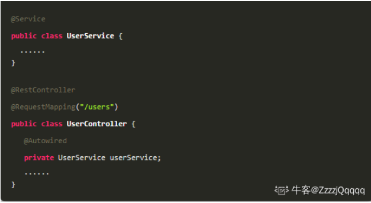

## 什么是SprintBoot 微服务架构

随着动态语言的流行,Java的开发显得格外的笨重:繁多的配置,低下的开发效率,复杂的部署流程以及第三方技术集成难度大.

SpringBoot应运而生.

它使用"习惯优于配置"(项目中存在大量的配置,此外还内置一个习惯性配置,让你无需手动进行配置)的理念让你的项目快速运行起来.使用SpringBoot很容易创建一个独立运行(运行Jar内嵌Servlet容器)准生产级别的基于Spring框架的项目,使用SpringBoot你可以不用或者只需要很少的Spring配置。


从本质上来说，Spring Boot就是Spring,它做了那些没有它你也会去做的Spring Bean配置。它使用“习惯优于配置”（项目中存在大量的配置，此外还内置了一个习惯性的配置，让你无需手动进行配置）的理念让你的项目快速运行起来。使用Spring Boot很容易创建一个独立运行（运行jar,内嵌Servlet容器）、准生产级别的基于Spring框架的项目，使用Spring Boot你可以不用或者只需要很少的Spring配置。


## SpringBoot特性

能够快速创建基于spring的程序
能够直接使用Java main方法启动内嵌的Tomcat服务器运行springboot程序，不需要部署war包
提供约定的starter POM来简化Maven配置，让Maven的配置变得简单
自动化配置，根据项目的Maven依赖配置，springboot自动配置spring、springmvc等
提供了程序的健康检查功能
基本可以完全不使用xml配合文件，采用注解配置


## SpringBoot 四大核心

Spring将很多魔法带入了Spring应用程序的开发之中，其中最重要的是以下四个核心。

- 自动配置：针对很多Spring应用程序常见的应用功能，Spring Boot能自动提供相关配置
- 起步依赖：告诉Spring Boot需要什么功能，它就能引入需要的库。
- 命令行界面：这是Spring Boot的可选特性，借此你只需写代码就能完成完整的应用程序，无需传统项目构建。
- Actuator：让你能够深入运行中的Spring Boot应用程序，一探究竟。


##  sprintboot的优点

\- 减少开发，测试时间和努力。

\- 使用 JavaConfig 有助于避免使用 XML。

\- 避免大量的 Maven 导入和各种版本冲突。

\- 提供意见发展方法。

\- 通过提供默认值快速开始开发。

\- 没有单独的 Web 服务器需要。这意味着你不再需要启动 Tomcat，Glassfish 或其他任何东西。

\- 需要更少的配置 因为没有 web.xml 文件。只需添加用@ Configuration 注释的类，然后添加用@Bean 注释的方法，Spring 将自动加载对象并像以前一样对其进行管理。您甚至可以将@Autowired 添加到 bean 方法中，以使 Spring 自动装入需要的依赖关系中。

\- 基于环境的配置 使用这些属性，您可以将您正在使用的环境传递到应用程序：-

Dspring.profiles.active = {enviornment}。在加载主应用程序属性文件后，Spring 将在（application{environment} .properties）中加载后续的应用程序属性文件。


优点：

- 快速构建项目 
- 对主流开发框架的无配置集成 
- 项目可独立运行,无需外部依赖Servlet容器 
- 提供运行时的应用监控 
- 极大地提高了开发,部署效率 
- 与云计算的天然集成 

缺点：

- 书籍文档较少,且不够深入 
- 版本迭代速度很快，一些模块改动很大。 
- 由于不用自己做配置，报错时很难定位。 
- 网上现成的解决方案比较少


## 什么是 JavaConfig

\- Spring JavaConfig 是 Spring 社区的产品，它提供了配置 Spring IoC 容器的纯 Java 方法。因此它有助于避免使用 XML 配置。使用 JavaConfig 的优点在于：


\- 面向对象的配置。由于配置被定义为 JavaConfig 中的类，因此用户可以充分利用 Java 中的面向对象功能。一个配置类可以继承另一个，重写它的@Bean 方法等。


\- 减少或消除 XML 配置。基于依赖注入原则的外化配置的好处已被证明。但是，许多开发人员不希望在 XML 和 Java 之间来回切换。JavaConfig 为开发人员提供了一种纯 Java 方法来配置与 XML 配置概念相似的 Spring 容器。从技术角度来讲，只使用 JavaConfig 配置类来配置容器是可行的，但实际上很多人认为将 JavaConfig 与 XML 混合匹配是理想的。类型安全和重构友好。JavaConfig 提供了一种类型安全的方法来配置 Spring 容器。由于Java 5.0 对泛型的支持，现在可以按类型而不是按名称检索 bean，不需要任何强制转换或基于字符串的查找。


### 什么是SpringBoot Starters

和自动配置一样，Spring Boot Starter的目的也是简化配置，而Spring Boot Starter解决的是依赖管理配置复杂的问题，有了它，当我需要构建一个Web应用程序时，不必再遍历所有的依赖包，一个一个地添加到项目的依赖管理中，而是只需要一个配置`spring-boot-starter-web`, 同理，如果想引入持久化功能，可以配置`spring-boot-starter-data-jpa`


### Spirng Boot 常用的两种配置文件

一个是properties,另一个是yaml。

**追问：什么是 YAML？YAML 配置的优势在哪里 ?**

YAML现在可以算是非常流行的一种配置文件格式，无论是前端还是后端，都可以见到YAML配置。那么YAML配置和传统的properties配置相比到底有哪些优势呢？

配置有序。在一些特殊场景下，配置有序很关键。
支持数组，数组中的元素可以是基本数据类型也可以是对象。
简洁，相比properties配置文件，YAML还有一个缺点，就是不支持@PropertySource注解导入自定义的YAML配置。


https://www.nowcoder.com/discuss/958159?type=post&order=recall&pos=&page=0&ncTraceId=&channel=-1&source_id=search_post_nctrack&gio_id=24707745B8FD5FC8BE40E47E92BC0B4A-1656990134113


## sprintboot注解

**@SpringBootApplication**

这个注解是 Spring Boot 项目的基石，创建 SpringBoot 项目之后会默认在主类加上。

可以把 @SpringBootApplication看作是 @SpringBootConfiguration、@EnableAutoConfiguration、@ComponentScan 注解的集合。


根据 SpringBoot 官网，这三个注解的作用分别是： 

- @SpringBootConfiguration：将当前类标注为配置类，并将当前类里以 @Bean 注解标记的方法的实例注入到spring容器中

-  @EnableAutoConfiguration：启用 SpringBoot 的自动配置机制 
- @ComponentScan： 扫描被@Component (@Service,@Controller)注解的 bean，注解默认会扫描该类所在的包下所有的类。 


**1、@SpringBootConfiguration**

 @SpringBootConfiguration 也是来源于 @Configuration，二者功能都是将当前类标注为配置类，并将当前类里以 @Bean 注解标记的方法的实例注入到spring容器中，实例名即为方法名。

至于@Configuration，我想在非SpringBoot时代大家应该不陌生吧，作用是配置Spring容器，也即 JavaConfig 形式的 Spring IoC 容器的配置类所使用。


**2、@EnableAutoConfiguration**

@EnableAutoConfiguration 注解启用自动配置，其可以帮助 SpringBoot 应用将所有符合条件的 @Configuration 配置都加载到当前 IoC 容器之中


从ClassPath下扫描所有的META-INF/spring.factories配置文件，并将spring.factories文件中的EnableAutoConfiguration对应的配置项通过反射机制实例化为对应标注了@Configuration的形式的IoC容器配置类，然后注入IoC容器。


**3、@ComponentScan**

@ComponentScan 对应于XML配置形式中的 ，用于将一些标注了特定注解的bean定义批量采集注册到Spring的IoC容器之中，这些特定的注解大致包括：

- **@Controller**
- **@Entity**
- **@Component**
- **@Service**
- **@Repository**

对于该注解，还可以通过 basePackages 属性来更细粒度的控制该注解的自动扫描范围，比如：

```
@ComponentScan(basePackages = {"cn.codesheep.controller","cn.codesheep.entity"})
```


## Spring Bean 相关的注解

**2.1. @Autowired**

自动导入对象到类中，被注入进的类同样要被 Spring 容器管理比如：Service 类注入到 Controller 类中。
@Bean是将没有的注入到spring容器中 @Autowired是将spring容器中已有的自动装配（组合）到另一个类中



**@Bean**

- 作用： 用于将对象存入spring的ioc容器中，同@controller、@Service、@Component、@Configuration、@Repository等几个注解是一样的，都是负责将对象存入容器当中。只不过方式不同，他们是用在类上面的，然后将当前类通过无参构造函数创建对象然后放入容器，而@Bean是用在方法上，将当前方法的返回值对象放到容器当中！可以理解为前者是由spring自动创建对象，而@Bean创建对象是交给我们自己来控制。
- 使用位置: @Bean一般出现在方法上面，也可用于自定义注解上。
- 修饰的方法的位置： 使用@Bean修饰的方法，可以放在@controller、@Service、@Component、@Configuration、@Repository修饰的类当中，这样项目在启动的时候，@Bean方法返回的对象也会立马存入容器当中！放在启动类也是可以的哦！光通过@Bean是无法将对象放入容器当中的！
对象名： 默认注入到容器当中的对象id（有的也叫做名称）是方法名，但是如果需要显式命名，则可以在注解上使用 name 属性（或其别名{value}）。比如：@Bean(name = "名称")或者@Bean("名称")，当然也可以有多个名称@Bean(name = { "dataSource1", "dataSource2", "dataSource3" })
所属： @Bean属于spring当中的注解，在spring-context包下，而并非springboot！
- 对方法的要求： 可以使用static final修饰、但是有个前提方法一定要有返回值，否则启动报错！
@controller、@Service、@Configuration、@Repository这四个注解其实都是@Component派生注解，点开源码就会发现，全是使用的@Component注解自定义的。其实spring整这几个注解就是为了方便我们分层，controller层用@controller，service用@Service，仅此而已！

**2.2. Component,@Repository,@Service, @Controller** 

 我们一般使用 @Autowired 注解让 Spring 容器帮我们自动装配 bean。要想把类标识成可用于 @Autowired 注解自动装配的 bean 的类,可以采用以下注解实现： 

-  @Component ：通用的注解，可标注任意类为 Spring 组件。如果一个 Bean 不知道属于哪个层，可以使用@Component 注解标注。 
-  @Repository : 对应持久层即 Dao 层，主要用于数据库相关操作。 
-  @Service : 对应服务层，主要涉及一些复杂的逻辑，需要用到 Dao 层。 
-  @Controller : 对应 Spring MVC 控制层，主要用户接受用户请求并调用 Service 层返回数据给前端页面。


**2.3. @RestController** 

 @RestController注解是@Controller和@ResponseBody的合集,表示这是个控制器 bean,并且是将函数的返回值直接填入 HTTP 响应体中,是 REST 风格的控制器。


单独使用 @Controller 不加 @ResponseBody的话一般使用在要返回一个视图的情况，这种情况属于比较传统的 Spring MVC 的应用，对应于前后端不分离的情况。@Controller +@ResponseBody 返回 JSON 或 XML 形式数据


**2.4. @Scope**

声明 Spring Bean 的作用域，使用方法：


**四种常见的 Spring Bean 的作用域：** 

-  singleton : 唯一 bean 实例，Spring 中的 bean 默认都是单例的。 
-  prototype : 每次请求都会创建一个新的 bean 实例。 
-  request : 每一次 HTTP 请求都会产生一个新的 bean，该 bean 仅在当前 HTTP request 内有效。 
-  session : 每一次 HTTP 请求都会产生一个新的 bean，该 bean 仅在当前 HTTP session 内有效。


**2.5. Configuration**

一般用来声明配置类，可以使用 @Component注解替代，不过使用Configuration注解声明配置类更加语义化。


## 处理常见的 HTTP 请求类型 

 **5 种常见的请求类型:** 

-  **GET** ：请求从服务器获取特定资源。举个例子：GET /users（获取所有学生） 
-  **POST** ：在服务器上创建一个新的资源。举个例子：POST /users（创建学生） 
-  **PUT** ：更新服务器上的资源（客户端提供更新后的整个资源）。举个例子：PUT /users/12（更新编号为 12 的学生） 
-  **DELETE** ：从服务器删除特定的资源。举个例子：DELETE /users/12（删除编号为 12 的学生） 
-  **PATCH** ：更新服务器上的资源（客户端提供更改的属性，可以看做作是部分更新），使用的比较少，这里就不举例子了。 

 **3.1. GET 请求** 

 @GetMapping("users") 等价于@RequestMapping(value="/users",method=RequestMethod.GET) 


 **3.2. POST 请求** 

 @PostMapping("users") 等价于@RequestMapping(value="/users",method=RequestMethod.POST) 

 关于@RequestBody注解的使用，在下面的“前后端传值”这块会讲到。 

```
@PostMapping("/users")
public ResponseEntity<User> createUser(@Valid @RequestBody UserCreateRequest userCreateRequest) {
 return userRespository.save(user);
}
```

 **3.3. PUT 请求** 

   @PutMapping("/users/{userId}") 等价于  

   @RequestMapping(value="/users/{userId}",method=RequestMethod.PUT)  

   


  


 3.5. **PATCH 请求** 

 一般实际项目中，我们都是 PUT 不够用了之后才用 PATCH 请求去更新数据。 

```
 @PatchMapping("/profile")
  public ResponseEntity updateStudent(@RequestBody StudentUpdateRequest studentUpdateRequest) {
        studentRepository.updateDetail(studentUpdateRequest);
        return ResponseEntity.ok().build();
    }
```


## 前后端传值 

 **掌握前后端传值的正确姿势，是你开始 CRUD 的第一步！** 

 **4.1. @PathVariable 和 @RequestParam** 

 @PathVariable用于获取路径参数，@RequestParam用于获取查询参数。 

 举个简单的例子： 


 如果我们请求的 url 是：/klasses/{123456}/teachers?type=web 

 那么我们服务获取到的数据就是：klassId=123456,type=web。 

 **4.2. @RequestBody** 

 用于读取 Request 请求（可能是 POST,PUT,DELETE,GET 请求）的 body 部分并且**Content-Type 为 application/json** 格式的数据，接收到数据之后会自动将数据绑定到 Java 对象上去。系统会使用HttpMessageConverter或者自定义的HttpMessageConverter将请求的 body 中的 json 字符串转换为 java 对象。 

 我用一个简单的例子来给演示一下基本使用！ 

 我们有一个注册的接口： 

```
@PostMapping("/sign-up")
public ResponseEntity signUp(@RequestBody @Valid UserRegisterRequest userRegisterRequest) {
  userService.save(userRegisterRequest);
  return ResponseEntity.ok().build();
}
```

 UserRegisterRequest对象： 


  


 我们发送 post 请求到这个接口，并且 body 携带 JSON 数据： 

```
{"userName":"coder","fullName":"shuangkou","password":"123456"}
```

 这样我们的后端就可以直接把 json 格式的数据映射到我们的UserRegisterRequest 类上。 


 需要注意的是：**一个请求方法只可以有一个@RequestBody，但是可以有多个@RequestParam和@PathVariable**。 如果你的方法必须要用两个@RequestBody来接受数据的话，大概率是你的数据库设计或者系统设计出问题了！
