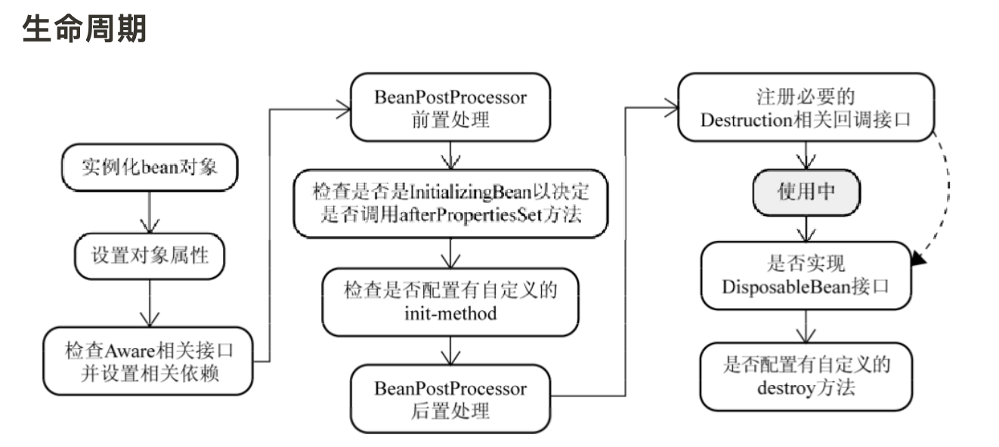
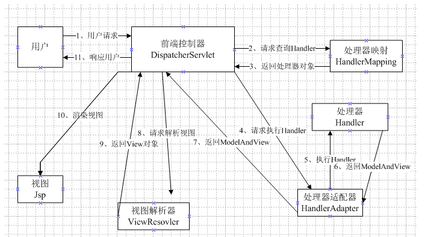
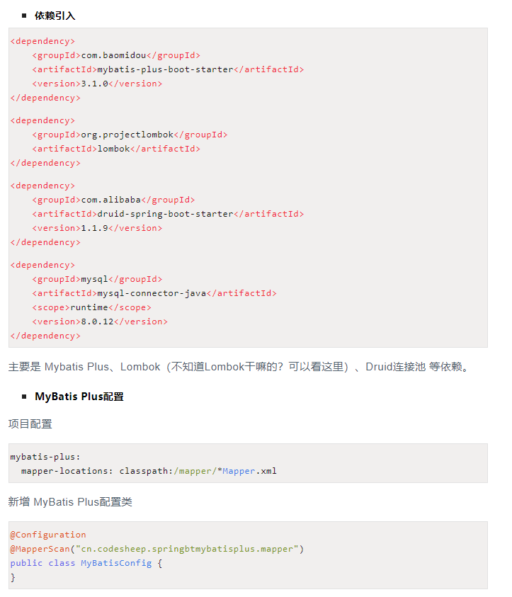
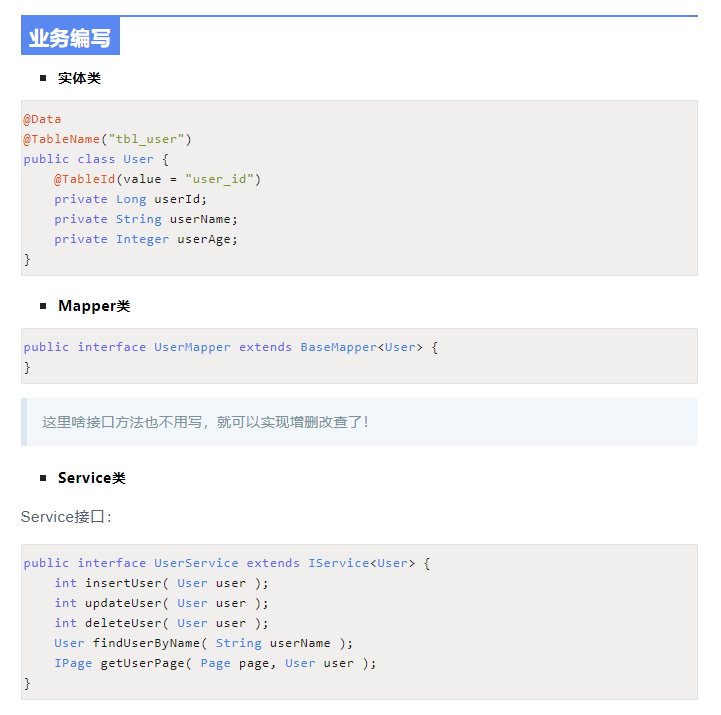
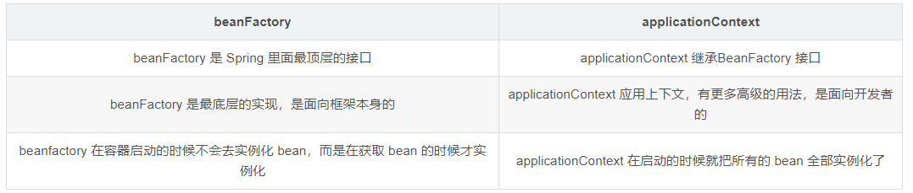

## SSM框架

SSM框架

缓存层 Redis

实体层 entity

控制层 control

业务层 service

数据访问层 dao


## Spring：

Spring 是一种轻量级开发框架，它是很多模块的集合，这些模块是：核心容器、数据访问/集成,、Web、AOP（面向切面编程）、工具、消息和测试模块。

Spring框架提供面向切面编程，可以很方便地对程序进行拦截，监控地声明式事务，比如日记管理，事务管理。而且只需要通过配置就可以完成对事务地管理，无需对手编程，还支持其他框架，另外一点就是IOC,将对象地创建权交给Spring容器进行管理，不需要自己去new一个对象出来。


- **ioc 控制反转**

将原本在程序中手动创建对象的控制权，交由Spring框架来管理。将对象之间的相互依赖关系交给 IoC 容器来管理，并由 IoC 容器完成对象的注入。这样可以很大程度上简化应用的开发，把应用从复杂的依赖关系中解放出来。

IoC 容器是 Spring 用来实现 IoC 的载体， IoC 容器实际上就是个Map（key，value）,Map 中存放的是各种对象。

通过配置xml文件或配置注解配置**Bean**


- **aop 面向切面编程**

AOP(Aspect-Oriented Programming:面向切面编程)能够将那些与业务无关，**却为业务模块所共同调用的逻辑或责任（例如事务处理、日志管理、权限控制等）封装起来**，便于**减少系统的重复代码**，**降低模块间的耦合度**，并**有利于未来的可拓展性和可维护性**。

使用 AOP 之后我们可以把一些通用功能抽象出来，在需要用到的地方直接使用即可，这样大大简化了代码量。我们需要增加新功能时也方便，这样也提高了系统扩展性。日志功能、事务管理等等场景都用到了 AOP 。

Spring AOP就是基于动态代理的,比如Cglib，AspectJ。AspectJ 应该算的上是 Java 生态系统中最完整的 AOP 框架了。


## 介绍一下Spring的事物管理

事务就是对一系列的数据库操作（比如插入多条数据）进行统一的提交或回滚操作，如果插入成功，那么一起成功，如果中间有一条出现异常，那么回滚之前的所有操作。这样可以防止出现脏数据，防止数据库数据出现问题。

开发中为了避免这种情况一般都会进行事务管理。Spring中也有自己的事务管理机制，一般是使用TransactionMananger进行管 理，可以通过Spring的注入来完成此功能。

Spring支持如下两种方式的事务管理：

编程式事务管理：这意味着你可以通过编程的方式管理事务，这种方式带来了很大的灵活性，但很难维护。

声明式事务管理：这种方式意味着你可以将事务管理和业务代码分离。你只需要通过注解或者XML配置管理事务。

一般选择声明式事务管理，因为这种方式和应用程序的关联较少。 


## Spring 中的 bean 的作用域有哪些?

- singleton : 唯一 bean 实例，Spring 中的 bean 默认都是单例的。
- prototype : 每次请求都会创建一个新的 bean 实例。
- request : 每一次HTTP请求都会产生一个新的bean，该bean仅在当前HTTP request内有效。
- session : 每一次HTTP请求都会产生一个新的 bean，该bean仅在当前 HTTP session 内有效。
- global-session： 全局session作用域，仅仅在基于portlet的web应用中才有意义，Spring5已经没有了。Portlet是能够生成语义代码(例如：HTML)片段的小型Java Web插件。它们基于portlet容器，可以像servlet一样处理HTTP请求。但是，与 servlet 不同，每个 portlet 都有不同的会话


## Spring 中的单例 bean 的线程安全问题

单例 bean 存在线程问题，主要是因为当多个线程操作同一个对象的时候，对这个对象的非静态成员变量的写操作会存在线程安全问题。

常见的有两种解决办法：

1. 在Bean对象中尽量避免定义可变的成员变量（不太现实）。
2. 在类中定义一个ThreadLocal成员变量，将需要的可变成员变量保存在 ThreadLocal 中（推荐的一种方式）。


## Spring 中的 bean 生命周期

1. 调用构造器或者工厂模式创建 Bean 对象
2. 给 Bean 对象的属性注入值(依赖注入)
3. 调用初始方法，进行初始化
4. 使用 Bean 对象
5. IOC 容器关闭时，销毁 Bean 对象




## Spring MVC

MVC 是一种设计模式,Spring MVC 是一款很优秀的 MVC 框架。Spring MVC 可以帮助我们进行更简洁的Web层的开发，并且它天生与 Spring 框架集成。

Spring MVC 下我们一般把后端项目分为 Service层（处理业务）、Dao层（数据库操作）、Entity层（实体类）、Controller层(控制层，返回数据给前台页面)。


Spring MVC 是一个基于 Java 的实现了 MVC设计思想的轻量级 Web 框架，MVC 的设计思想，就是复杂的 web 应用分成 Model，View，Controller 三层，有利于前后端分离、简化开发、方便开发人员之间的配合


**Spring MVC的优点**

- 与Spring框架无缝集成，如AOP、IOC容器等
- 清晰的角色分配：前端控制器(dispatcherServlet) , 请求到处理器映射（handlerMapping), 处理器适配器（HandlerAdapter), 视图解析器（ViewResolver）。
- 支持各种请求资源的映射策略
- 支持各种视图技术，比如Thymeleaf，而不仅仅局限于JSP
- 代码清新简洁，性能卓著，大幅度提升开发效率


## SpringMVC 工作原理



**流程说明（重要）：**

1、  用户发送请求至前端控制器DispatcherServlet。

2、  DispatcherServlet收到请求调用HandlerMapping处理器映射器。

3、  处理器映射器找到具体的处理器(可以根据xml配置、注解进行查找)，生成处理器对象及处理器拦截器(如果有则生成)一并返回给DispatcherServlet。

4、  DispatcherServlet调用HandlerAdapter处理器适配器。

5、  HandlerAdapter经过适配调用具体的处理器(Controller，也叫后端控制器)。

6、  Controller执行完成返回ModelAndView。

7、  HandlerAdapter将controller执行结果ModelAndView返回给DispatcherServlet。

8、  DispatcherServlet将ModelAndView传给ViewReslover视图解析器。

9、  ViewReslover解析后返回具体View。

10、DispatcherServlet根据View进行渲染视图（即将模型数据填充至视图中）。

11、 DispatcherServlet响应用户。


### Mybatis介绍

- Mybatis 是一个可以自定义 SQL 、存储过程和高级映射的持久层框架。
- 内部封装了 JDBC，开发的时候只需要关注 SQL 语句本身，性能高、效率高、灵活性高


### Mapper 接口工作原理

Mapper接口的工作原理是**JDK的动态代理**，Mybatis 运行时会使用 JDK动态代理为 Mapper 接口生成代理对象 proxy，代理对象会拦截接口方法，从而执行所代表的sql，然后将sql的执行结果返回


## MyBatis 执行 SQL 的工作原理，都有哪些映射形式
使用 resultMap 标签，定义数据库列名和对象属性之间的映射关系
使用 sql 列的别名功能，将列的别名书写为对象属性名
有了列名与属性名的映射关系后，MyBatis 通过反射创建对象，同时使用反射给对象的属性逐一赋值并返回


## 讲一下 MyBatis 的缓存
MyBatis 的缓存分为一级缓存、二级缓存，一级缓存存放在 session 中，默认就有
二级缓存存放在命名空间中，默认是不打开的，使用二级缓存属性类需要实现 serializable 接口，可以在映射文件中配置 cache 标签开启


## MybatisPlus






通过以上几个简单的步骤，我们就实现了 `tbl_user`表的增删改查，传统 MyBatis的 XML文件一个都不需要写！


## Spring 框架中用到了哪些设计模式？

关于下面一些设计模式的详细介绍，可以看笔主前段时间的原创文章[《面试官:“谈谈Spring中都用到了那些设计模式?”。》](https://mp.weixin.qq.com/s?__biz=Mzg2OTA0Njk0OA==&mid=2247485303&idx=1&sn=9e4626a1e3f001f9b0d84a6fa0cff04a&chksm=cea248bcf9d5c1aaf48b67cc52bac74eb29d6037848d6cf213b0e5466f2d1fda970db700ba41&token=255050878&lang=zh_CN#rd)。

- **工厂设计模式**: Spring使用工厂模式通过`BeanFactory`、`ApplicationContext`创建 bean 对象。
- **代理设计模式**: Spring AOP 基于动态代理，如果要代理的对象实现了某个接口，SpringAOP 会使用 JDK 的动态代理创建代理对象；如果对象没有实现接口，Spring AOP会使用 CGLib 生成一个被代理对象的子类作为代理对象。
- **单例设计模式**: Spring 中的 Bean 默认都是单例的。
- **模板方法模式**: Spring 中`jdbcTemplate`、`hibernateTemplate`等以 Template 结尾的对数据库操作的类，它们就使用到了模板模式。
- **包装器设计模式**: 我们的项目需要连接多个数据库，而且不同的客户在每次访问中根据需要会去访问不同的数据库。这种模式让我们可以根据客户的需求能够动态切换不同的数据源。
- **观察者模式**: 定义的对象有一对多的依赖关系，当一个对象的状态发生改变时，所有依赖于它的对象都会得到通知被自动更新，Spring 事件驱动模型就是观察者模式很经典的一个应用。
- **适配器模式**:Spring AOP 的增强或通知(Advice)使用到了适配器模式、spring MVC 中也是用到了适配器模式适配`Controller`。


## Spring 生成 Bean 的三种方式

- 默认**无参的构造方法**
- **静态工厂** 提供一个工厂类 定义返回bean的静态函数 在xml文件配置
- **实例工厂** 提供一个工厂类 定义返回bean的非静态函数 在xml文件配置


## Spring DI 的三种方式

构造器注入：通过构造方法初始化

```javascript
<constructor-arg index="0" type="java.lang.String" value="宝马"></constructor-arg>
```

setter方法注入：通过setter方法初始化

```javascript
<property name="id" value="1111"></property>
```

接口注入


## Spring四种依赖注入方式

https://baijiahao.baidu.com/s?id=1612405553596190826&wfr=spider&for=pc

**依赖注入：**

​		依赖注入是Spring协调不同Bean实例之间的合作而提供的一种工作机制，在确保Bean实例之间合作的同时，并能保持每个Bean的相对独立性。

​		在Spring框架下，当Bean实例 A运行过程中需要引用另外一个Bean实例B时，Spring框架会创建Bean的实例B，并将实例B通过实例A的构造函数、set方法、自动装配和注解方式注入到实例A，这种注入实例Bean到另外一个实例Bean的过程称为**依赖注入**。

​		依赖注入的好处就是尽可能隔离Bean之间的代码耦合，提高Bean重用的可能性，并尽量降低程序代码的维护难度。Spring框架通过依赖注入技术将不同的Bean融合起来，完成复杂业务操作，但又确保了每个Bean相对的独立性。


- 基于构造函数的依赖注入

Bean类依赖外部类时，可以在Bean类内部声明该依赖类，并在提供的构造函数参数中声明该类。Spring创建Bean实例时，Spring容器会根据Bean中指定的构造函数参数注入外部类。


- 基于设置函数的依赖注入

Bean类依赖外部类时，可以在Bean类内部声明该依赖类，并提供该设置该依赖类的set方法。Spring容器会根据Bean类提供的set方法，将外部依赖类注入到Bean中。


- 基于自动装配的依赖注入

该模式自动装配相互协作的 bean 之间的关系，Spring的自动装配有三种模式：byType(类型模式)，byName(名称模式)、constructor(构造函数模式)。Spring的自动装配有助于减少在Spring配置文件中编写大量的注入语句。


在byType模式中，Spring IOC容器会基于反射查看Bean定义的类。当Spring 容器发现Bean被设置为自动装配的byType模式后，它会根据参数类型在Spring容器中查找与参数类型相同的被依赖Bean对象,如果已经创建,则会把被依赖的对象自动注入到Bean中,如果没有创建,则不会注入。注入过程需要借助Bean提供的设置方法来完成，否则注入失败。

在byName模式中，Spring IOC容器会根据定义Bean类的属性名称，在Spring容器中查找与Bean类属性名称相同的其它Bean名称进行匹配，如果找到则注入依赖bean。

类似于byName和byType模式，constructor(构造函数模式)适用于构造函数参数类型，Spring IOC容器会根据定义Bean类的构造函数给出的参数类型，在Spring容器中查找与其类型相匹配的其它Bean类，如果找到则注入依赖Bean。

自动装配最大的问题在于匹配失败后，Spring容器将不会向Bean注入任何依赖对象，就会导致Bean获取不到所依赖的对象，当Bean使用该依赖对象时，就会发生错误。因此，在可能的情况下尽可能使用手动装配。


- 基于注解的依赖注入

前面依赖注入都需要在配置文件中手动配置，当需要配置较多Bean类时，需要做大量的手动部署工作，这显然不妥。在Spring2.5之后，Spring增加了注解注入。当Bean类依赖外部类时，只要对Bean类所依赖的类成员变量、方法及构造函数进行标注，Spring即可完成依赖注入的自动装配工作。

​	@Autowired 注解，可以对Bean类成员变量、方法及构造函数进行标注，完成依赖注入的自动装配工作。使用@Autowired可以省略Bean类的待依赖注入对象的set方法，@Autowired默认情况下按照依赖注入对象的类型自动进行匹配。加入@Autowired注解的方式是在Bean类依赖注入对象的前面加上@Autowired语句。

@Resource注解的功能和@Autowired注解功能相近，@Resource有name和type两个主要的属性。Spring容器对于@Resource注解的name属性解析为bean的名字，type属性则解析为bean的类型。因此使用name属性，则按byName模式的自动注入策略，如果使用type属性则按 byType模式自动注入策略。如果两个属性都未指定，Spring容器将通过反射技术默认按byName模式注入。


## BeanFactory 和FactoryBean的区别：

区别：BeanFactory是个Factory，也就是IOC容器或对象工厂，FactoryBean是个Bean。

在Spring中，所有的Bean都是由BeanFactory(也就是IOC容器)来进行管理的。但对FactoryBean而言，这个Bean不是简单的Bean，而是一个能生产或者修饰对象生成的工厂Bean,它的实现与设计模式中的工厂模式和修饰器模式类似


