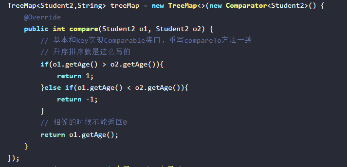
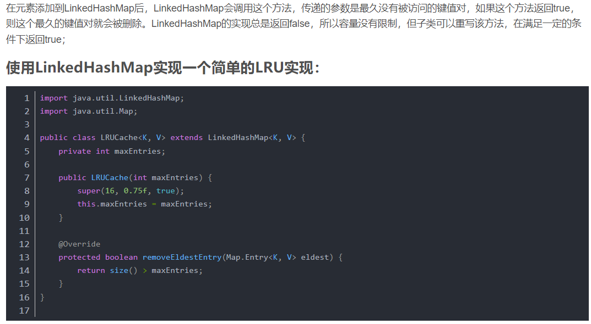
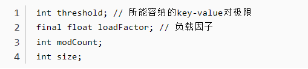
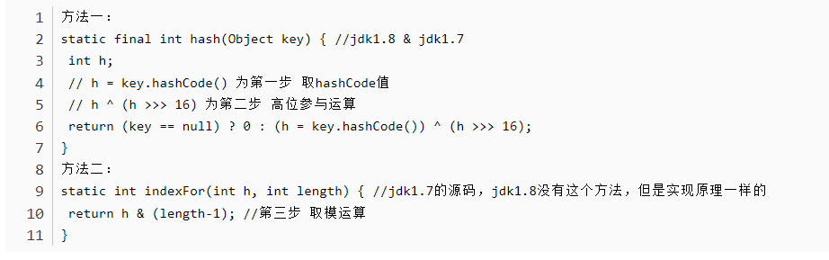
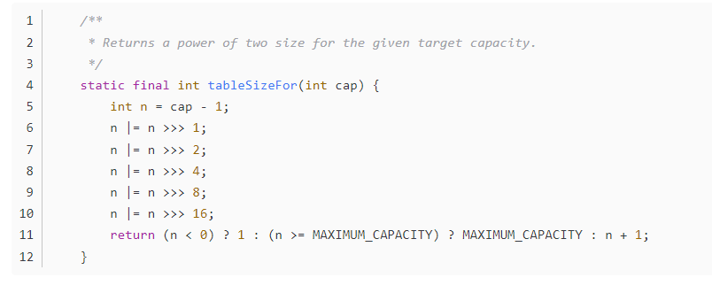
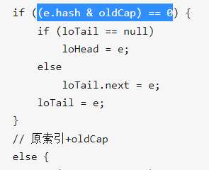
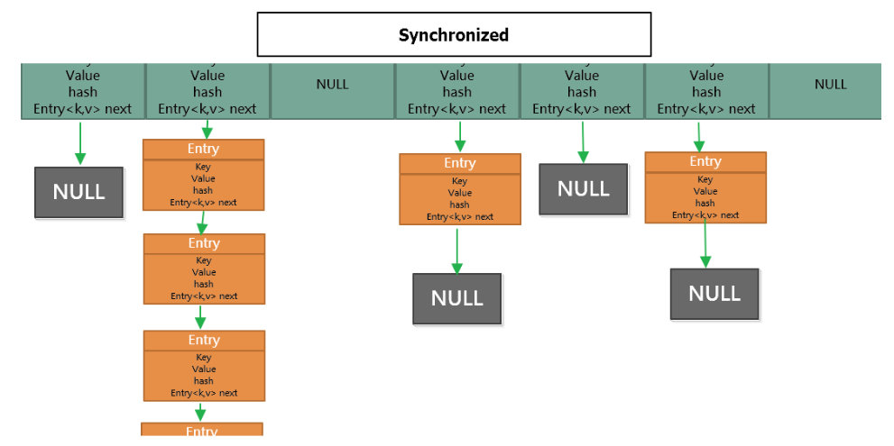

## 集合大体框架图

## 集合的数据结构底层实现


#### List

- `Arraylist`： `Object[]` 数组
- `Vector`：`Object[]` 数组
- `LinkedList`： 双向链表(JDK1.6 之前为循环链表，JDK1.7 取消了循环)

#### Set

- `HashSet`(无序，唯一): 基于 `HashMap` 实现的，底层采用 `HashMap` 来保存元素
- `LinkedHashSet`: `LinkedHashSet` 是 `HashSet` 的子类，并且其内部是通过 `LinkedHashMap` 来实现的。有点类似于我们之前说的 `LinkedHashMap` 其内部是基于 `HashMap` 实现一样，不过还是有一点点区别的
- `TreeSet`(有序，唯一): 红黑树(自平衡的排序二叉树)

#### Queue

- `PriorityQueue`: `Object[]` 数组来实现二叉堆
- `ArrayQueue`: `Object[]` 数组 + 双指针

再来看看 `Map` 接口下面的集合。

#### Map
一般就是数组+链表  HashMap的话链表长度大于8  就会转化为红黑树
有Tree的比如TreeMap就是红黑树

- `HashMap`： **JDK1.8 之前 `HashMap` 由数组+链表组成的，数组是 `HashMap` 的主体，链表则是主要为了解决哈希冲突而存在的（“拉链法”解决冲突）。JDK1.8 以后在解决哈希冲突时有了较大的变化，当链表长度大于阈值（默认为 8）（将链表转换成红黑树前会判断，如果当前数组的长度小于 64，那么会选择先进行数组扩容，而不是转换为红黑树）时，将链表转化为红黑树，以减少搜索时间**

- `LinkedHashMap`： `LinkedHashMap` 继承自 `HashMap`，所以它的底层仍然是基于拉链式散列结构即由数组和链表或红黑树组成。另外，`LinkedHashMap` 在上面结构的基础上，增加了一条双向链表，使得上面的结构可以保持键值对的插入顺序。同时通过对链表进行相应的操作，实现了访问顺序相关逻辑。

默认情况是按照插入顺序的,有个构造函数是指定按访问顺序的 LinkedHashMap(int initialCapacity, float loadFactor, boolean accessOrder) 

- 
LinkHashMap如何实现有序的：
在HashMap的基础上增加了一个双向链表，LinkedHashMap对Entry进行了扩展，增加了指针before和after。


- `Hashtable`： 数组+链表组成的，数组是 `Hashtable` 的主体，链表则是主要为了解决哈希冲突而存在的

- `TreeMap`： 红黑树（自平衡的排序二叉树）


**TreeMap 如何重写排序呢**

一个是key实现Comparable接口，重写compareTo()方法，另一个是在TreeMap的构造函数中创建new Comparator<key>() 匿名内部类，重写compare 方法(下图)；




**LinkedHashMap实现一个简单的LRU**




## Arraylist 与 LinkedList 区别
- **1. 是否保证线程安全：**`ArrayList`和`LinkedList`都是不同步的，也就是不保证线程安全；

- **2. 底层数据结构：**`Arraylist`底层使用的是**`Object`数组**；`LinkedList`底层使用的是**双向链表**数据结构（JDK1.6之前为循环链表，JDK1.7取消了循环。）

- **3.插入和删除是否受元素位置的影响**：`LinkedList`采用链表存储，插入，删除元素时间复杂度不受元素位置的影响，都是近似 O（1）

  数组指定位置的插入`add(int index, E element)` 删除近似 O（n） `add(E element)` 复杂度为O(1)

  ①`ArrayList`采用数组存储，所以插入和删除元素的时间复杂度受元素位置的影响。比如：执行`add(E e)`方法的时候，`ArrayList`会默认在将指定的元素追加到此列表的末尾，这种情况时间复杂度就是O(1)。但是如果要在指定位置 i 插入和删除元素的话（`add(int index, E element)`）时间复杂度就为 O(n-i)。因为在进行上述操作的时候集合中第 i 和第 i 个元素之后的(n-i)个元素都要执行向后位/向前移一位的操作。 ②`LinkedList`采用链表存储，所以插入，删除元素时间复杂度不受元素位置的影响，都是近似 O（1）而数组指定位置的插入删除近似 O（n）

- **4. 是否支持快速随机访问：**`LinkedList`不支持高效的随机元素访问，而`ArrayList`支持。快速随机访问就是通过元素的序号快速获取元素对象(对应于`get(int index)`方法)。
- **5. 内存空间占用**:ArrayList的空间浪费主要体现在在list列表的结尾会预留一定的容量空间，而LinkedList的空间花费则体现在它的每一个元素都需要消耗比ArrayList更多的空间（因为要存放直接后继和直接前驱以及数据）。


记住这个

底层数据结构，指定位置的插入删除，随机访问，空间内存占用


## ArrayList的扩容机制
ArrayList默认数组容量为10
ArrayList new初建数组时 不带参数的时候是空数组 带参数就是创建参数长度的数组

- 当第一次add元素时，如果是空数组的时候，数组的扩容容量设置为默认数组长度
- 之后再add元素时，计算数组的实际需要的最小容量（数组的实际长度+1）
	- 判断数组需要实际的最小容量和数组的容量（数组的长度）
	- 若数组实际需要的最小容量比数组的容量大 
	- 调用grow(int mincapacity) 进行扩容
- **扩容**
	- 将数组的容量 * 1.5（长度右移一位 + 长度） 和实际需要的最小容量比较（mincapacity） 取最大值**作为扩容的容量** newCapacity
	- 若扩容的容量 和 数组默认的数组最大长度（Integer.MAX_VALUE - 8）相比 扩容容量大 调用函数hugeCapacity(minCapacity)求出 **最后真正扩容的容量**
		- 如果实际需要的最小容量 比  Integer.MAX_VALUE还要大 扩容的容量设为Integer.MAX_VALUE
		- 如果实际需要的最小容量 比  Integer.MAX_VALUE还要小 扩容的容量设为实际需要的最小容量


## HashMap的扩容

- capacity 即容量，默认16。
- loadFactor 加载因子，默认是0.75
- threshold 阈值。阈值=容量*加载因子。默认12。当元素数量超过阈值时便会触发扩容。

一般情况下，**当元素数量超过阈值时**便会触发扩容。每次扩容的容量都是之前容量的2倍。

HashMap的容量是有上限的，必须小于**1<<30**，即1073741824。如果容量超出了这个数，则不再增长，且阈值会被设置为**Integer.MAX_VALUE**


[link](https://blog.csdn.net/lkforce/article/details/89521318)

HashMap构造函数的一些参数：



1. Node[] table的**初始化长度length(默认值是16)**，**Load factor为负载因子(默认值是0.75)**
2. threshold是HashMap所能容纳的最大数据量的Node(键值对)个数。**threshold = length * Load factor**
3. 在数组定义好长度之后，负载因子越大，所能容纳的键值对个数越多。
4. 在JDK1.8版本， 当**链表长度太长（默认超过8）时，链表就转换为红黑树**，利用红黑树快速增删改查的特点提高HashMap的性能。
5. 链表长度太长（默认超过8）时,此时容量小于64的时候，链表没有转化为红黑树，而是进行扩容的，调用resize()函数。


记住这个

**Hash算法**：

- **取key的hashCode值**

- **高16位异或运算**

- **取模运算 h&(length - 1) **



知识：

通过hashCode()的**高16位异或**低16位实现的：(h = k.hashCode()) ^ (h >>> 16)，主要是从速度、功效、质量来考虑的，这么做可以在数组table的length比较小的时候，也能保证考虑到高低Bit都参与到Hash的计算中，同时不会有太大的开销。

通过h & (table.length -1)来得到该对象的保存位，而HashMap底层数组的长度总是2的n次方，这是HashMap在速度上的优化。当length总是2的n次方时，h& (length-1)运算等价于对length取模，也就是h%length，但是&比%具有更高的效率。


记住这个

**扩容：**

扩容 当put(key,value)时，刚开始table为空或长度为0 或者 ++size 大于threshold时，需要扩容

table在第一次往HashMap中put元素的时候初始化。

如果HashMap初始化的时候没有指定容量，那么初始化table的时候会使用默认的**DEFAULT_INITIAL_CAPACITY**参数，也就是16，作为table初始化时的长度。

如果HashMap初始化的时候指定了容量，HashMap会把这个容量修改为2的倍数，然后创建对应长度的table。

指定容量时，修改容量方法的函数：可以将容量修改为2的倍数



**JDK1.7下的扩容机制**

如果原有table长度已经达到了上限，就不再扩容了。

如果还未达到上限，则创建一个新的table，并调用transfer方法：

transfer方法的作用是把原table的Node放到新的table中，使用的是**头插法**，也就是说，

新table中链表的顺序和旧列表中是相反的，在HashMap线程不安全的情况下，这种头插法可能会导致**环状节点**。


就是按照链表的顺序一个个计算新数组的index 复制过去 采用头插法

**JDK1.8下的扩容机制**

正常情况下，计算节点在table中的下标的方法是：hash&(oldTable.length-1)，扩容之后，table长度翻倍，计算table下标的方法是hash&(newTable.length-1)，也就是hash&(oldTable.length*2-1)，于是我们有了这样的结论：这新旧两次计算下标的结果，要不然就相同，要不然就是新下标等于旧下标加上旧数组的长度。


计算新数组下标，在扩充HashMap的时候，**不需要像JDK1.7的实现那样重新计算hash**，只需要看看原来的hash值新增（"高位"）的那个bit是1还是0就好了，是0的话索引没变，是1的话索引变成“原索引+oldCap”。




**省去了重新计算hash值的时间**，看hash&oldCap == 0？


## HashTable和HashMap区别

- **1.继承的父类不同**

Hashtable继承自Dictionary类，而HashMap继承自AbstractMap类。但二者都实现了Map接口。

- **2.线程安全性不同**

HashMap 是非线程安全的，HashTable 是线程安全的。HashTable 内部的方法基本都经过`synchronized`修饰。（如果你要保证线程安全的话就使用 ConcurrentHashMap ）。

Hashtable不建议在新代码中使用，不需要线程安全的场合可以用HashMap替换，需要线程安全的场合可以用ConcurrentHashMap替换。

**ConcurrentHashMap取消了Segment分段锁，采用CAS和synchronized来保证并发安全。**

- **3.对Null key 和Null value的支持不同**

HashMap 中，null 可以作为键，这样的键只有一个，可以有一个或多个键所对应的值为 null。但是在 HashTable 中 put 进的键值只要有一个 null，直接抛出 NullPointerException。

- **4.初始容量大小和每次扩充容量大小的不同**

①创建时如果不指定容量初始值，Hashtable 默认的初始大小为11，之后每次扩充，容量变为原来的2n+1。HashMap 默认的初始化大小为16。之后每次扩充，容量变为原来的2倍。②创建时如果给定了容量初始值，那么 Hashtable 会直接使用你给定的大小，而 HashMap 会将其扩充为2的幂次方大小。

- **5.底层数据结构**

都是基于哈希表实现的，就是数组+链表。哈希表，也称为哈希数组，数组的每个元素都是一个单链表的头节点，链表是用来解决冲突的，如果不同的key映射到了数组的同一位置处，就将其放入单链表中。

JDK1.8 以后的 HashMap 在解决哈希冲突时有了较大的变化，当链表长度大于阈值（默认为8）时，将链表转化为红黑树，以减少搜索时间。Hashtable 没有这样的机制。


## HashMap 多线程操作导致死循环问题
多线程下，进行 put 操作会导致 HashMap 死循环，原因在于 HashMap 的扩容 resize()方法。由于扩容是新建一个数组，复制原数据到数组。由于数组下标挂有链表，所以需要复制链表，但是多线程操作有可能导致环形链表，主要原因在于并发下的 Rehash 会造成元素之间会形成一个循环链表。不过，jdk 1.8 后解决了这个问题，但是还是不建议在多线程下使用 HashMap,因为多线程下使用 HashMap 还是会存在其他问题比如数据丢失。并发环境下推荐使用 ConcurrentHashMap 。

https://www.sohu.com/a/519628232_121124376


**死循环**

- 举个例子 比如 A ->B->null 的链表  扩容时由于需要重新Rehash 
- 线程1 在扩容时 取出B采用头插法 B->A->null

- 线程2也在扩容 阻塞时 指针T指向A  T.next = B 由于线程1已经让B->next = A   所以就会产生循环链表 A->B->A


1.7链表元素采用的是头插法，会出现死循环，数据丢失，1.8改成尾插法, 尾插法解决了死循环的问题 但是多线程下还存在数据覆盖的问题 所以HashMap是线程不安全的，需要使用ConcurrentHashMap

**数据覆盖**

- 线程1添加一个key-value 比如C 就会有A->C-> ...'
- 这个时候线程2 也在添加一个key-value  比如 B 定位到原来的链表结尾同时是A  A->B 
- 就会覆盖掉线程1的 C 值


## HashMap的线程不安全主要体现在下面两个方面：
- 在JDK1.7中，当并发执行扩容操作时会造成环形链和数据丢失的情况。
- 在JDK1.8中，在并发执行put操作时会发生数据覆盖的情况。
- [具体看](https://blog.csdn.net/swpu_ocean/article/details/88917958?spm=1001.2101.3001.6650.1&utm_medium=distribute.pc_relevant.none-task-blog-2%7Edefault%7ECTRLIST%7ERate-1.pc_relevant_aa&depth_1-utm_source=distribute.pc_relevant.none-task-blog-2%7Edefault%7ECTRLIST%7ERate-1.pc_relevant_aa&utm_relevant_index=2)

## HashMap 的长度为什么是 2 的幂次方
hash函数根据key得到哈希值 hash 映射函数如何设计呢 第一个想到是取模%操作
取余(%)操作中如果除数是 2 的幂次则等价于与其除数减一的与(&)操作（也就是说 hash%length==hash&(length-1)的前提是 length 是 2 的 n 次方；）。” 并且 采用二进制位操作 &，相对于%能够提高运算效率，这就解释了 HashMap 的长度为什么是 2 的幂次方


## 红黑树

- 1）  红黑树节点要么是红节点、要么是黑节点；

- 2）  根节点为黑节点；

- 3）  叶节点（空节点）为黑节点；

- 4）  每个红节点的两个子节点是黑节点；

- 5）  对于每个节点，从该节点到其叶子点的所有路径上包含相同数目的黑节点。

最长路径不超过最短路径的两倍

左旋：根节点变为左节点 右节点变为根节点


具有二叉查找树的特点。

不过，与平衡树不同的是，红黑树在插入、删除等操作，**不会像平衡树那样，频繁着破坏红黑树的规则，所以不需要频繁着调整**，

平衡树是为了解决二叉查找树退化为链表的情况，而红黑树是为了解决平衡树在插入、删除等操作需要频繁调整的情况。


## 平衡二叉树

平衡二叉树就是为了解决二叉查找树退化成一颗链表而诞生了，平衡树具有如下特点

1、具有二叉查找树的全部特性。

2、每个节点的左子树和右子树的高度差至多等于1。


## HashMap 和 HashSet区别
**往set 和map两种数据结构去比较**

如果你看过`HashSet`源码的话就应该知道：HashSet 底层就是基于 HashMap 实现的。

| HashMap                   | HashSet                                                                |
|:-------------------------:|:----------------------------------------------------------------------:|
| 实现了Map接口                  | 实现Set接口                                                                |
| 存储键值对                     | 仅存储对象                                                                  |
| 调用`put（）`向map中添加元素        | 调用`add（）`方法向Set中添加元素                                                   |
| HashMap使用键（Key）计算Hashcode | HashSet使用成员对象来计算hashcode值，对于两个对象来说hashcode可能相同，所以equals()方法用来判断对象的相等性， |

**TreeMap、TreeSet以及JDK1.8之后的HashMap底层都用到了红黑树。红黑树就是为了解决二叉查找树的缺陷，因为二叉查找树在某些情况下会退化成一个线性结构。**


## Map的一些介绍

Java为数据结构中的映射定义了一个接口java.util.Map，此接口主要有四个常用的实现类，分别是HashMap、Hashtable、LinkedHashMap和TreeMap，类继承关系如下图所示：

下面针对各个实现类的特点做一些说明：

- **(1) HashMap**：它根据键的hashCode值存储数据，大多数情况下可以直接定位到它的值，因而具有很快的访问速度，但遍历顺序却是不确定的。 HashMap继承 AbstractMap ，最多只允许一条记录的键为null，允许多条记录的值为null。HashMap非线程安全，即任一时刻可以有多个线程同时写HashMap，可能会导致数据的不一致。如果需要满足线程安全，可以用 Collections的synchronized Map方法使HashMap具有线程安全的能力，或者使用ConcurrentHashMap。
- **(2) Hashtable**：Hashtable是遗留类，很多映射的常用功能与HashMap类似，不同的是它承自Dictionary类，不允许键值中一个为null，并且是线程安全的，任一时间只有一个线程能写Hashtable，并发性不如ConcurrentHashMap，因为ConcurrentHashMap引入了分段锁。Hashtable不建议在新代码中使用，不需要线程安全的场合可以用HashMap替换，需要线程安全的场合可以用ConcurrentHashMap替换。
- **(3) LinkedHashMap**：LinkedHashMap是HashMap的一个子类，保存了记录的插入顺序，在用Iterator遍历LinkedHashMap时，先得到的记录肯定是先插入的，也可以在构造时带参数，按照访问次序排序。
- **(4) TreeMap**：TreeMap实现SortedMap接口，能够把它保存的记录根据键排序，默认是按键值的升序排序，也可以指定排序的比较器，当用Iterator遍历TreeMap时，得到的记录是排过序的。如果使用排序的映射，建议使用TreeMap。在使用TreeMap时，key必须实现Comparable接口或者在构造TreeMap传入自定义的Comparator，否则会在运行时抛出java.lang.ClassCastException类型的异常。


## ArrayDeque 与 LinkedList 的区别

ArrayDeque 和 LinkedList 都实现了 Deque 接口，两者都具有队列的功能，但两者有什么区别呢？

- ArrayDeque 是基于可变长的数组和双指针来实现，而 LinkedList 则通过链表来实现。

- ArrayDeque 不支持存储 NULL 数据，但 LinkedList 支持。

- ArrayDeque 是在 JDK1.6 才被引入的，而LinkedList 早在 JDK1.2 时就已经存在。

- ArrayDeque 插入时可能存在扩容过程, 不过均摊后的插入操作依然为 O(1)。虽然 LinkedList 不需要扩容，但是每次插入数据时均需要申请新的堆空间，均摊性能相比更慢。

从性能的角度上，选用 ArrayDeque 来实现队列要比 LinkedList 更好。此外，ArrayDeque 也可以用于实现栈。


## 讲讲PriorityQueue

与 `Queue` 的区别在于元素出队顺序是与优先级相关的 总是优先级最高的元素先出队。

- PriorityQueue 利用了二叉堆的数据结构来实现的，底层使用可变长的数组来存储数据
- PriorityQueue 通过堆元素的上浮和下沉，实现了在 O(logn) 的时间复杂度内插入元素和删除堆顶元素。
- PriorityQueue 是非线程安全的，且不支持存储 NULL 和 non-comparable 的对象。
- PriorityQueue 默认是小顶堆，但可以接收一个 Comparator 作为构造参数，从而来自定义元素优先级的先后。

```java
// 传入比较构造器 排序对象 最大堆 最小堆
PriorityQueue<Person> p = new PriorityQueue<Person>(new Comparator<Person>(
	@OVerride
	public int compare(Person o1, Person o2){
		return 1;
	}
));
```


###  ConcurrentHashMap 和 Hashtable 的区别

主要体现在**实现线程安全的方式**上不同

- 数据结构

JDK1.7的 ConcurrentHashMap采用分段的数组(**`Segment` 数组和 `HashEntry` 数组**)+链表实现，JDK1.8和HashMap一样也是数组(Node数组)+链表 扩容时转化为红黑树

HashTable采用的是数组+链表

- 实现线程的安全方式

jdk1.7中是采用Segment + HashEntry + ReentrantLock的方式进行实现的

JDK1.7的 ConcurrentHashMap采用分段锁，每把锁锁定容器里的一部分数据，多线程访问不同数据段的数据

每个数组(Segment)都会对应一把不同的锁；只有当多个线程操作同一个小数组时，才会发生线程串行的情形。

JDK1.8的ConcurrentHashMap并发控制使用 `synchronized` 和 CAS 来操作，`synchronized` 只锁定当前链表或红黑二叉树的首节点，这样只要 hash 不冲突，就不会产生并发。


1. 采用Node + CAS + Synchronized来保证并发安全进行实现。

2. 假设两个线程同时对数组的第一个位置进行put操作，则会采取CAS策略，保证线程并发的安全性，同一时间只有一个线程成功执行CAS操作；
   在插入元素的过程中，会给插入的数组元素加上synchronized锁，


3. 在1.8中ConcurrentHashMap的get操作全程不需要加锁，这也是它比其他并发集合比如hashtable、用Collections.synchronizedMap()包装的hashmap;安全效率高的原因之一。

4. get操作全程不需要加锁是因为Node的成员val是用volatile修饰的和数组用volatile修饰没有关系。

5. 数组用volatile修饰主要是保证在数组扩容的时候保证可见性。


Hashtable使用 `synchronized` 来保证线程安全 ，用`synchronized` 同步get、put方法，全表锁锁住整个Hashtable，效率非常低下



## ConcurrentHashMap 和 HashMap 的区别

1：HashMap允许null值null键，而ConcurrentHashMap则不允许null值null键
2：HashMap是非线程安全的，而ConcurrentHashMap是线程安全的
3：HashMap和ConcurrentHashMap的底层都是数组+链表+红黑树

ConcurrentHashMap JDK 1.7 使用的是Segment数组 + 链表的结构


