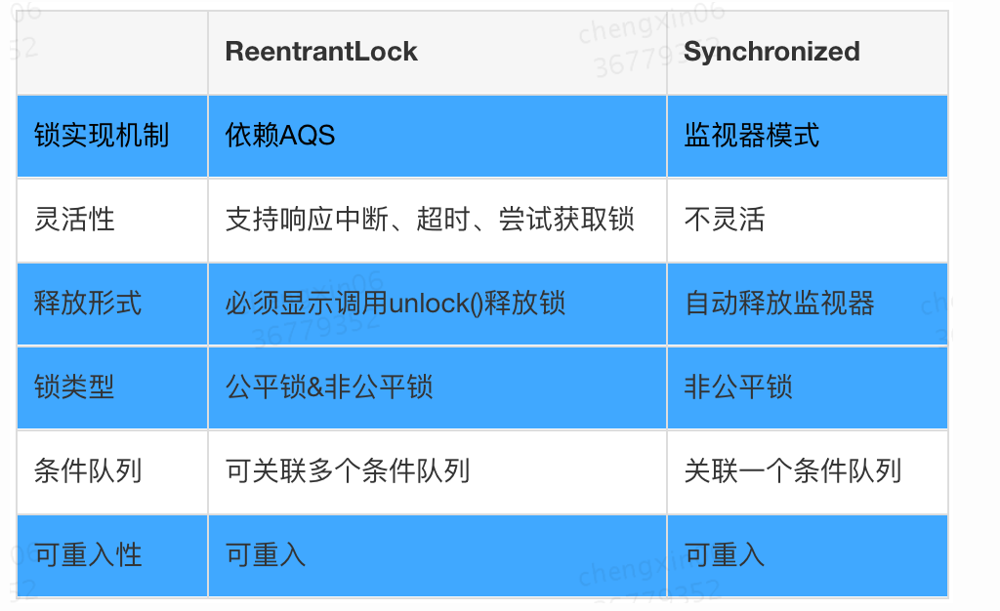
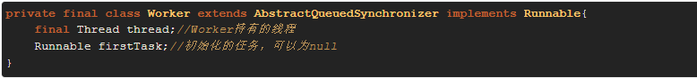
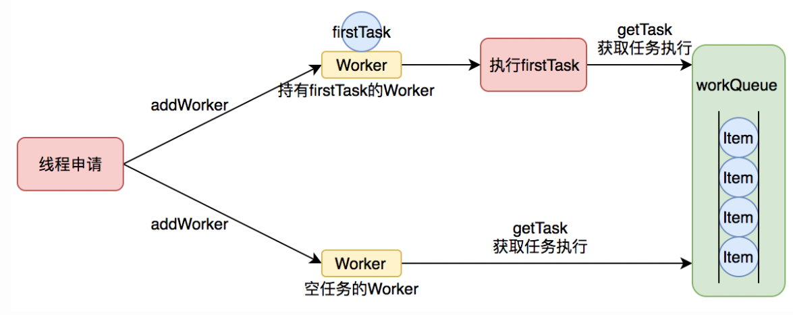
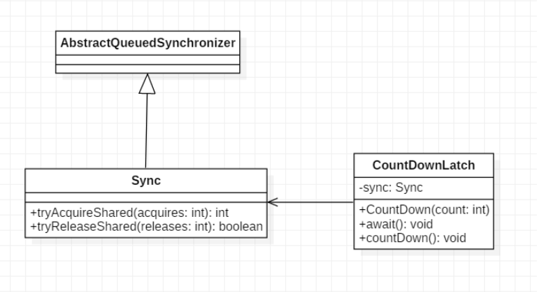
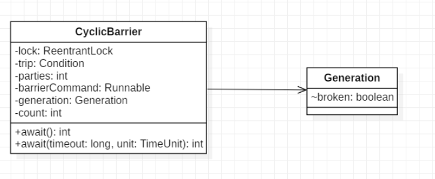
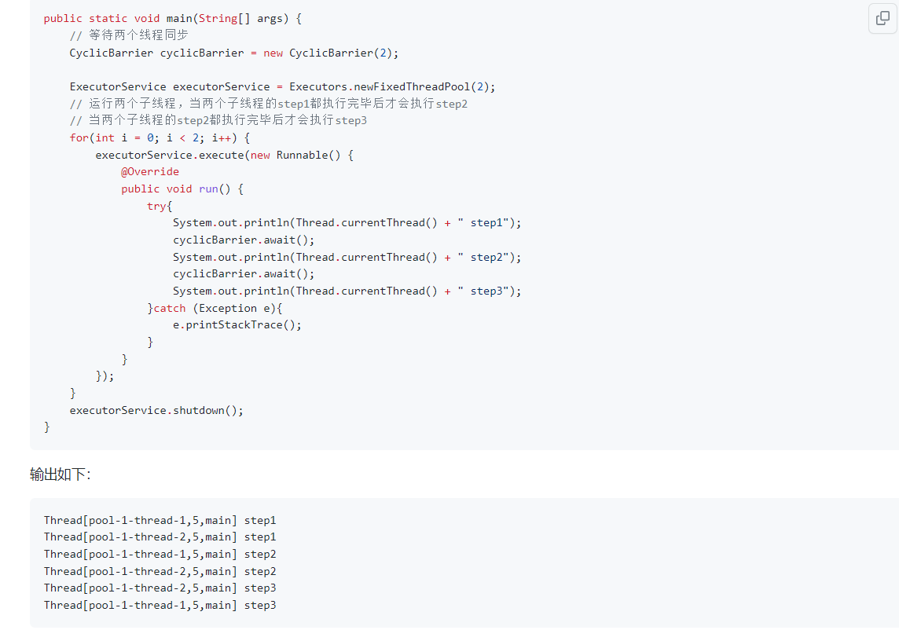
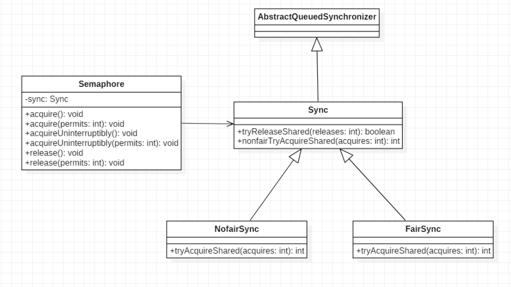

## 什么是线程和进程
1. 进程是系统进行资源分配和调度的基本单位，而线程是CPU资源分配的最小单位。
因为cpu资源比较特殊，它是分配到线程的，占用cpu运行的是线程。
2. 一个进程中有多个线程，多个线程共享进程中的堆和方法区资源，每个线程有自己的**程序计数器、虚拟机栈和本地方法栈**。
3. 在 Java 中，当我们启动 main 函数时其实就是启动了一个 JVM 的进程，而 main 函数所在的线程就是这个进程中的一个线程，也称主线程。一个 Java 程序的运行是 main 线程和多个其他线程同时运行。

## Java中创建线程的四种方法

[link](https://www.cnblogs.com/zhou-test/p/9811771.html)

https://cloud.tencent.com/developer/article/1038547

 在JDK1.5之前，创建线程就只有两种方式，即继承java.lang.Thread类和实现java.lang.Runnable接口；而在JDK1.5以后，增加了两个创建线程的方式，即实现java.util.concurrent.Callable接口和线程池

1. 定义一个类继承Thread类并重写run方法（Java不支持多继承）

2.定义一个类实现Runnable接口，并重写run方法

3.实现Callable接口，并重写call方法

3.使用线程池去创建


## Runnable接口和Callable接口的区别：
Runnable自 Java 1.0 以来一直存在，但Callable仅在 Java 1.5 中引入,目的就是为了来处理Runnable不支持的用例。Runnable 接口 不会返回结果或抛出检查异常，但是 Callable 接口 可以。所以，如果任务不需要返回结果或抛出异常推荐使用 Runnable 接口 ，这样代码看起来会更加简洁。
Runnable.java
```java
@FunctionalInterface
public interface Runnable {
   /**
    * 被线程执行，没有返回值也无法抛出异常
    */
    public abstract void run();
}
```
Callable
```java
@FunctionalInterface
public interface Callable<V> {
    /**
     * 计算结果，或在无法这样做时抛出异常。
     * @return 计算得出的结果
     * @throws 如果无法计算结果，则抛出异常
     */
    V call() throws Exception;
}
```


## 并发与并行的区别
并发： 同一时间段，多个任务都在执行 (单位时间内不一定同时执行)；
并行： 单位时间内，多个任务同时执行。

## 线程的生命周期和状态


由上图可以看出：线程创建之后它将处于 NEW（新建） 状态，调用 start() 方法后开始运行，线程这时候处于 READY（可运行） 状态。可运行状态的线程获得了 CPU 时间片（timeslice）后就处于 RUNNING（运行） 状态。
在操作系统中层面线程有 READY 和 RUNNING 状态，而在 JVM 层面只能看到 RUNNABLE 状态，所以 Java 系统一般将这两个状态统称为 **RUNNABLE**（运行中） 状态 。

当线程执行 wait()方法之后，线程进入 **WAITING**（等待） 状态。进入等待状态的线程需要依靠其他线程的通知才能够返回到运行状态，而 **TIMED_WAITING**(超时等待) 状态相当于在等待状态的基础上增加了超时限制，比如通过 sleep（long millis）方法或 wait（long millis）方法可以将 Java 线程置于 **TIMED_WAITING** 状态。当超时时间到达后 Java 线程将会返回到 **RUNNABLE** 状态。当线程调用同步方法时，在没有获取到锁的情况下，线程将会进入到 **BLOCKED**（阻塞） 状态。线程在执行 Runnable 的run()方法之后将会进入到 **TERMINATED**（终止） 状态。

## 线程上下文切换
线程在执行过程中会有自己的运行条件和状态（也称上下文），比如上文所说到过的程序计数器，栈信息等。当出现如下情况的时候，线程会从占用 CPU 状态中退出。

1. 主动让出 CPU，比如调用了 sleep(), wait() 等。
2. 时间片用完，因为操作系统要防止一个线程或者进程长时间占用CPU导致其他线程或者进程饿死。
3. 调用了阻塞类型的系统中断，比如请求 IO，线程被阻塞。
4. 被终止或结束运行
这其中前三种都会发生线程切换，线程切换意味着需要保存当前线程的上下文，留待线程下次占用 CPU 的时候恢复现场。并加载下一个将要占用 CPU 的线程上下文。这就是所谓的 上下文切换。

上下文切换是现代操作系统的基本功能，因其每次需要保存信息恢复信息，这将会占用 CPU，内存等系统资源进行处理，也就意味着效率会有一定损耗，如果频繁切换就会造成整体效率低下。

## 什么是线程死锁
死锁是指两个或两个以上的线程在执行过程中，因争夺资源而造成的相互等待的现象，多个线程同时被阻塞。
如线程 A 持有资源 2，线程 B 持有资源 1，他们同时都想申请对方的资源，所以这两个线程就会互相等待而进入死锁状态。

操作系统产生死锁必须具备以下四个条件：

- 互斥条件：该资源任意一个时刻只由一个线程占用。
- 请求与保持条件：一个进程因请求资源而阻塞时，对已获得的资源保持不放。
- 不剥夺条件:线程已获得的资源在未使用完之前不能被其他线程强行剥夺，只有自己使用完毕后才释放资源。
- 循环等待条件:若干进程之间形成一种头尾相接的循环等待资源关系。
## 如何预防和避免线程死锁?
破坏死锁的产生的必要条件即可：

-  破坏请求与保持条件 ：一次性申请所有的资源。
- 破坏不剥夺条件 ：占用部分资源的线程进一步申请其他资源时，如果申请不到，可以主动释放它占有的资源。
- 破坏循环等待条件 ：靠按序申请资源来预防。按某一顺序申请资源，释放资源则反序释放。破坏循环等待条件。

## 如何避免死锁？

避免死锁就是在资源分配时，借助于算法（比如银行家算法）对资源分配进行计算评估，使其进入安全状态。
安全状态 指的是系统能够按照某种进程推进顺序（P1、P2、P3.....Pn）来为每个进程分配所需资源，直到满足每个进程对资源的最大需求，使每个进程都可顺利完成。称<P1、P2、P3.....Pn>序列为安全序列。

## sleep() 方法和 wait() 方法区别和共同点
- 两者最主要的区别在于：sleep()方法没有释放锁，而 wait() 方法释放了锁 。
- 两者都可以暂停线程的执行。
- wait() 通常被用于线程间交互/通信，sleep() 通常被用于暂停执行。
- wait() 方法被调用后，线程不会自动苏醒，需要别的线程调用同一个对象上的 notify() 或者 notifyAll() 方法。sleep() 方法执行完成后，线程会自动苏醒。或者可以使用 wait(long timeout) 超时后线程会自动苏醒。

## 为什么我们调用 start() 方法时会执行 run() 方法，为什么我们不能直接调用 run() 方法？
这是另一个非常经典的 Java 多线程面试问题，而且在面试中会经常被问到。很简单，但是很多人都会答不上来！

new 一个 Thread，线程进入了新建状态。调用 start()方法，会启动一个线程并使线程进入了就绪状态，当分配到时间片后就可以开始运行了。 start() 会执行线程的相应准备工作，然后自动执行 run() 方法的内容，这是真正的多线程工作。 但是，直接执行 run() 方法，会把 run() 方法当成一个 main 线程下的普通方法去执行，并不会在某个线程中执行它，所以这并不是多线程工作。

**总结： 调用 start() 方法方可启动线程并使线程进入就绪状态，直接执行 run() 方法的话不会以多线程的方式执行。**


## 并发编程的三个重要特性

1. **原子性** : 一个的操作或者多次操作，要么所有的操作全部都得到执行并且不会受到任何因素的干扰而中断，要么所有的操作都执行，要么都不执行。`synchronized` 可以保证代码片段的原子性。
2. **可见性** ：当一个线程对共享变量进行了修改，那么另外的线程都是立即可以看到修改后的最新值。`volatile` 关键字可以保证共享变量的可见性。
3. **有序性** ：代码在执行的过程中的先后顺序，Java 在编译器以及运行期间的优化，代码的执行顺序未必就是编写代码时候的顺序。`volatile` 关键字可以禁止指令进行重排序优化。


## 1. 说说synchronized 关键字
synchronized是java提供的一个原子性内置锁，线程的执行代码在进入synchronized代码块时会自动获取到内部锁（java内置的使用者看不到的锁），也叫监视器锁，其他线程访问该同步代码块时会被阻塞挂起。synchronized关键字可以保证被它修饰的方法或者代码块在任意时刻只能有一个线程执行。
## synchronized 关键字主要的三种使用方式
**1.修饰实例方法:** 作用于当前对象实例加锁，进入同步代码前要获得 **当前对象实例的锁**

```java
synchronized void method() {
    //业务代码
}
```

**2.修饰静态方法:** 也就是给当前类加锁，会作用于类的所有对象实例 ，进入同步代码前要获得 **当前 class 的锁**。因为静态成员不属于任何一个实例对象，是类成员（ _static 表明这是该类的一个静态资源，不管 new 了多少个对象，只有一份_）。所以，如果一个线程 A 调用一个实例对象的非静态 `synchronized` 方法，而线程 B 需要调用这个实例对象所属类的静态 `synchronized` 方法，是允许的，不会发生互斥现象，**因为访问静态 `synchronized` 方法占用的锁是当前类的锁，而访问非静态 `synchronized` 方法占用的锁是当前实例对象锁**。

```java
synchronized static void method() {
    //业务代码
}
```

**3.修饰代码块** ：指定加锁对象，对给定对象/类加锁。`synchronized(this|object)` 表示进入同步代码库前要获得**给定对象的锁**。`synchronized(类.class)` 表示进入同步代码前要获得 **当前 class 的锁**

```java
synchronized(this) {
    //业务代码
}
```

**总结：**

- `synchronized` 关键字加到 `static` 静态方法和 `synchronized(class)` 代码块上都是给 Class 类上锁。
- `synchronized` 关键字加到实例方法上是给对象实例上锁。
- 尽量不要使用 `synchronized(String a)` 因为 JVM 中，字符串常量池具有缓存功能！

synchronized除了可以解决共享变量的内存可见性问题外，还可以用来实现原子性操作，synchronized关键字会引起线程上下文切换并带来线程调度开销。

## 面试题
面试中面试官经常会说：“单例模式了解吗？来给我手写一下！给我解释一下双重检验锁方式实现单例模式的原理呗！”

**双重校验锁实现对象单例（线程安全）**

```java
public class Singleton {

    private volatile static Singleton uniqueInstance;

    private Singleton() {
    }

    public  static Singleton getUniqueInstance() {
       //先判断对象是否已经实例过，没有实例化过才进入加锁代码
        if (uniqueInstance == null) {
            //类对象加锁
            synchronized (Singleton.class) {
                if (uniqueInstance == null) {
                    uniqueInstance = new Singleton();
                }
            }
        }
        return uniqueInstance;
    }
}
```

1. 由于**构造函数私有**，我们获取Singleton类的实例化对象只能通过Singleton.getUniqueInstance()的方式，而无法在外界通过new或者其他方法创建此类的实例，并且由于此成员变量被static修饰，使得实例对象属于类本身且只有唯一一个。
2. volatile关键字可以防止jvm指令重排
> 因为 uniqueInstance = new Singleton() 这句话可以分为三步：
1.为 singleton 分配内存空间；
2.初始化 singleton；
3.将 singleton 指向分配的内存空间。
但是由于JVM具有指令重排的特性，执行顺序有可能变成 1-3-2。 指令重排在单线程下不会出现问题，但是在多线程下会导致一个线程获得一个未初始化的实例。例如：线程T1执行了1和3，此时T2调用 getInstance() 后发现 singleton 不为空，因此返回 singleton， 但是此时的 singleton 还没有被初始化。
使用 volatile 会禁止JVM指令重排，从而保证在多线程下也能正常执行。

3. synchronized加在getUniqueInstance方法上这样虽然能保证只有一个线程执行getUniqueInstance()方法，但是缺点在于锁的粒度太大了，多个线程同时调用getUniqueInstance()时，其他线程都会被阻塞，毕竟大多数情况下对象已经存在。
4. 第二次判断是为了防止多个线程同时完成第一次判断为null，A线程获得锁后new一个对象释放锁，此时B线程也获得锁如果没有第二次判断B线程也会new一个对象。

## 2. 讲一下 synchronized 关键字的底层原理
synchronized 关键字底层原理属于 JVM 层面。
- synchronized 同步语句块的实现使用的是 monitorenter 和 monitorexit 指令，其中 monitorenter 指令指向同步代码块的开始位置，monitorexit 指令则指明同步代码块的结束位置。
>1. 在执行monitorenter时，会尝试获取对象的锁，如果锁的计数器为 0 则表示锁可以被获取，获取后将锁计数器设为 1 也就是加 1。
>2. 在执行 monitorexit 指令后，将锁计数器设为 0，表明锁被释放。如果获取对象锁失败，那当前线程就要阻塞等待，直到锁被另外一个线程释放为止。
- synchronized 修饰的方法并没有 monitorenter 指令和 monitorexit 指令，取得代之的确实是 ACC_SYNCHRONIZED 标识，该标识指明了该方法是一个同步方法。JVM 通过该 ACC_SYNCHRONIZED 访问标志来辨别一个方法是否声明为同步方法，从而执行相应的同步调用。

不过两者的本质都是对对象监视器 monitor 的获取。


总结：

同步代码块

- **通过`monitorenter`与`monitorexit`指令获取和释放对象的监控器锁( monitor )**

同步方法

- **当线程执行到方法后会检查是否有ACC_SYNCHRONIZED这个标志，有的话隐式去调用`monitorenter`与`monitorexit`指令，也是对监控器锁的获取和释放**


## JDK1.6后 synchronized 增加了锁的升级

 

synchronized为重量级锁, 线程的阻塞和唤醒需要操作系统用户态和内核态的切换，耗费时间，所以锁的升级是为了尽量避免这种时间消耗。

不得已才使用重量级锁，也就是最终

**Synchronized锁升级的过程。 主要步骤是：**

- 先是通过偏向锁来获取锁，解决了虽然有同步但无竞争的场景下锁的消耗。
- 再是通过对象头的Mark Word来实现的轻量级锁，通过轻量级锁如果还有竞争，那么继续升级。
- 升级为自旋锁，如果达到最大自旋次数了，那么就直接升级为重量级锁，所有未获取锁的线程都阻塞等待。


## 说说 JDK1.6 之后的 synchronized 关键字底层做了哪些优化，可以详细介绍一下这些优化吗

[link](https://www.nowcoder.com/discuss/839862?type=all&order=recall&pos=&page=1&ncTraceId=&channel=-1&source_id=search_all_nctrack&gio_id=0B4AEC2B6C443237D83E9B6E4B928204-1645864140400)

JDK1.6 对锁的实现引入了大量的优化，锁粗化、锁消除、锁升级如偏向锁、轻量级锁、自旋锁、适应性自旋锁等技术来减少锁操作的开销。

锁主要存在四种状态，依次是：无锁状态、偏向锁状态、轻量级锁状态、重量级锁状态，他们会随着竞争的激烈而逐渐升级。注意锁可以升级不可降级，这种策略是为了提高获得锁和释放锁的效率。

**锁粗化**就是将「**多个连续的加锁、解锁操作连接在一起**」，扩展成一个范围更大的锁，避免频繁的加锁解锁操作。

**锁消除**是指去除不可能存在共享资源竞争的锁，通过这种方式消除没有必要的锁，可以节省毫无意义的时间消耗。


### 锁升级

`Synchronized` 锁的升级顺序是 「**无锁-->偏向锁-->轻量级锁-->自旋锁-->重量级锁，只会升级不会降级**」

`Java`中每个对象都拥有对象头，对象头由`Mark World` 、指向类的指针、以及数组长度三部分组成，本文，我们只需要关心`Mark World` 即可，`Mark World` 记录了对象的`HashCode`、分代年龄和**锁标志位信息**。

锁的升级变化，体现在锁对象的对象头`Mark World`部分，也就是说`Mark World`的内容会随着锁升级而改变。


1. **偏向锁**

在大多数情况下，锁总是由同一线程多次获得，不存在多线程竞争，所以出现了偏向锁，其目标就是在只有一个线程执行同步代码块时，降低获取锁带来的消耗，提高性能


2. **轻量级锁**

轻量级锁考虑的是竞争锁对象的线程不多，持有锁时间也不长的场景。

当前线程持有的锁是偏向锁的时候，被另外的线程所访问，偏向锁就会升级为轻量级锁，其他线程会通过自旋的形式尝试获取锁，不会阻塞，从而提高性能。


3. **自旋锁**

未获取锁的线程“稍等一会”，但不放弃处理器执行时间，只需要让线程执行一个忙循环（自旋），这就是所谓的自旋锁。


4. **重量级锁**

轻量级锁膨胀之后，就升级为重量级锁，重量级锁是依赖操作系统的`MutexLock`（**互斥锁**）来实现的，需要从用户态转到内核态。


## 谈谈 synchronized 和 ReentrantLock 的区别
两者都是可重入锁
synchronized 依赖于 JVM 而 ReentrantLock 依赖于 API
ReentrantLock 比 synchronized 增加了一些高级功能

- 等待可中断 : ReentrantLock提供了一种能够中断等待锁的线程的机制，通过 lock.lockInterruptibly() 来实现这个机制。也就是说正在等待的线程可以选择放弃等待，改为处理其他事情。
- 可实现公平锁 : ReentrantLock可以指定是公平锁还是非公平锁。而synchronized只能是非公平锁。所谓的公平锁就是先等待的线程先获得锁。ReentrantLock默认情况是非公平的，可以通过 ReentrantLock类的ReentrantLock(boolean fair)构造方法来制定是否是公平的。
- 可实现选择性通知（锁可以绑定多个条件）: synchronized关键字与wait()和notify()/notifyAll()方法相结合可以实现等待/通知机制。ReentrantLock类当然也可以实现，但是需要借助于Condition接口与newCondition()方法。



记住这个：

ReentrantLock是依赖AQS的，提供等待可中断，实现公平锁和非公平锁（默认），可选择性通知。


ReentrantLock加锁解锁时API层核心方法的映射关系


## 并发编程之AQS

https://www.cnblogs.com/waterystone/p/4920797.html

https://tech.meituan.com/2019/12/05/aqs-theory-and-apply.html


某个线程获取锁失败的后续流程是什么呢？

A：存在某种排队等候机制,通过addWaiter添加到等待队列中，线程继续等待，仍然保留获取锁的可能，获取锁流程仍在继续。

Q：既然说到了排队等候机制，那么就一定会有某种队列形成，这样的队列是什么数据结构呢？

A：是CLH变体的FIFO双端队列。Craig、Landin and Hagersten队列

Q：处于排队等候机制中的线程，什么时候可以有机会获取锁呢？

A：可以详细看下2.3.1.3小节。

Q：如果处于排队等候机制中的线程一直无法获取锁，需要一直等待么？还是有别的策略来解决这一问题？

A：**线程所在节点的状态会变成取消状态**，取消状态的节点会从队列中释放，具体可见2.3.2小节。

Q：Lock函数通过Acquire方法进行加锁，但是具体是如何加锁的呢？

A：AQS的Acquire会调用tryAcquire方法，tryAcquire由各个自定义同步器实现，通过tryAcquire完成加锁过程。


## 有哪几种方式实现线程安全
volatile

互斥 同步
synchronized
ReetrantLock 

无同步
ThreadLocal 本地副本


# 说说volatile关键字

用以声明变量的值可能随时会别的线程修改，使用volatile修饰的变量会强制将修改的值立即写入主存，主存中值的更新会使缓存中的值失效(非volatile变量不具备这样的特性，非volatile变量的值会被缓存，线程A更新了这个值，线程B读取这个变量的值时可能读到的并不是是线程A更新后的值)。
volatile具有**内存可见性、有序性，不具备原子性**。

可见性：当多个线程访问同一个变量x时，线程1修改了变量x的值，线程1、线程2...线程n能够立即读取到线程1修改后的值。

即程序执行时按照代码书写的先后顺序执行。

有序性：即程序执行时按照代码书写的先后顺序执行。

**所以volatile 关键字 除了防止 JVM 的指令重排 ，还有一个重要的作用就是保证变量的可见性。**

**volatile适用场景**

适用于**读多写少**的场景。

JDK中volatie应用：JDK中**ConcurrentHashMap**的Entry的value和next被声明为volatile，**AtomicLong**中的value被声明为volatile。AtomicLong通过CAS原理(也可以理解为乐观锁)保证了原子性。
volatile的一个重要作用就是和CAS结合，保证了原子性，详细的可以参见java.util.concurrent.atomic包下的类，比如AtomicInteger。


## 说说 synchronized 关键字和 volatile 关键字的区别
`synchronized` 关键字和 `volatile` 关键字是两个互补的存在，而不是对立的存在！

- **`volatile` 关键字**是线程同步的**轻量级实现**，所以 **`volatile `性能肯定比` synchronized `关键字要好** 。volatile不会让线程阻塞，响应速度比synchronized高，但是 `volatile` 关键字只能用于变量而 `synchronized` 关键字可以修饰方法以及代码块** 。
- **`volatile` 关键字能保证数据的可见性，但不能保证数据的原子性。`synchronized` 关键字两者都能保证。**
- **`volatile`关键字主要用于解决变量在多个线程之间的可见性，而 `synchronized` 关键字解决的是多个线程之间访问资源的同步性。**


## Java中的CAS操作

CAS即Compare And Swap，JDK中Unsafe类提供了一系列的compareAndSwap*方法。

即**compare and swap（比较与交换）**，是一种有名的**无锁算法**。无锁编程，即不使用锁的情况下实现多线程之间的变量同步，也就是在没有线程被阻塞的情况下实现变量的同步，所以也叫非阻塞同步（Non-blocking Synchronization）。**CAS算法**涉及到三个操作数

- 需要读写的内存值 V
- 进行比较的值 A
- 拟写入的新值 B

当且仅当 V 的值等于 A时，CAS通过原子方式用新值B来更新V的值，否则不会执行任何操作（比较和替换是一个原子操作）。一般情况下是一个**自旋操作**，即**不断的重试**。

### 示例
下面以compareAndSwapLong(Object obj, long valueOffset, long expect, long update)方法为例进行介绍

boolean compareAndSwapLong(Object obj, long valueOffset, long expect, long update)方法：如果obj对象中内存偏移值为valueOffset的变量值为expect，则使用新的值update替换之。这是处理器提供的一个原子性指令。

### ABA问题

#### 问题描述

假如线程A要去通过CAS修改变量X，要先判断X当前值是否改变过，如果“未改变”，则更新之。但这并不能保证X没有被改变过：假如A修改X前，线程B修改了X的值，然后又修改回来，A的CAS操作仍能成功，但X实际上发生过改变。

#### 解决方案

JDK中的AtomicStampedReference类给每个变量都配备了一个时间戳，从而避免了ABA问题的产生。


## 讲一下ThreadLocal

ThreadLocal是JDK包提供的，实现每一个线程都有自己的专属本地变量。
如果你创建了一个ThreadLocal变量，那么访问这个变量的每个线程都会有这个变量的一个本地副本，当多个线程操作这个变量时，实际操作的是自己本地内存里面的变量，从而避免了线程安全的问题。

## ThreadLocal原理
从 Thread类源代码入手。

```java
public class Thread implements Runnable {
    //......
    //与此线程有关的ThreadLocal值。由ThreadLocal类维护
    ThreadLocal.ThreadLocalMap threadLocals = null;

    //与此线程有关的InheritableThreadLocal值。由InheritableThreadLocal类维护
    ThreadLocal.ThreadLocalMap inheritableThreadLocals = null;
    //......
}
```
**Thread 类中有一个 threadLocals 和 一个 inheritableThreadLocals 变量，它们都是 ThreadLocalMap 类型的变量**。默认情况下这两个变量都是 null，只有当前线程调用 ThreadLocal 类的 set或get方法时才创建它们，实际上调用这两个方法的时候，我们调用的是ThreadLocalMap类对应的 get()、set()方法。

其实每个线程的本地变量不是存放在ThreadLoal实例里面的，而是存放在**调用线程的threadLocals变量里面的**。ThreadLocals类型的本地变量是放到具体的线程内存空间的。ThreadLocals就是一个工具壳，它通过 set把value值放到当前线程的threadLocal变量存放，或get方从当前线程的threadLocals变量拿出来使用。（来自书本）


## 为什么要用线程池

1. 在执行大量异步任务时，线程池能够提供较好的性能。

   不使用线程池的话，每次执行异步任务都需要创建线程，而线程的创建和销毁是需要开销的，线程池的线程是可以复用的

2. 线程池提供了一种限制和管理资源的手段，比如限制线程的个数，动态新增线程。

3. 线程池也提供了许多可调的参数和可扩展的接口。例如好几种创建线程池的方法。


## 线程池生命周期：

`ctl`这个AtomicInteger类型，是对线程池的运行状态(五种线程状态)和线程池中有效线程的数量进行控制的一个字段， 它同时包含两部分的信息：线程池的运行状态 (runState) 和线程池内有效线程的数量 (workerCount)，高3位保存runState，低29位保存workerCount，两个变量之间互不干扰。


## 线程池的五个状态如下：

- RUNNING：接受新任务并处理阻塞队列里的任务。
- SHUTDOWN：拒绝新任务但是处理阻塞队列里面的任务。
- STOP：拒绝新任务并且抛弃阻塞队列里的任务，同时会中断正在处理的任务。
- TIDYING：所有任务都执行完后当前线程池活动线程数为0，将要调用terminated方法（相当于一个过渡状态）。
- TERMINATED： 终止状态，terminated方法调用完成后的状态。

生命周期转换流程

****


参考博客

https://tech.meituan.com/2020/04/02/java-pooling-pratice-in-meituan.html

## 任务调度

​		所有任务的调度都是由execute方法完成的，这部分完成的工作是：检查现在线程池的运行状态、运行线程数、运行策略，决定接下来执行的流程，是直接申请线程执行，或是缓冲到队列中执行，亦或是直接拒绝该任务。其执行过程如下：

1. 首先检测线程池运行状态，如果不是RUNNING，则直接拒绝，线程池要保证在RUNNING的状态下执行任务。
2. 如果workerCount < corePoolSize，则创建并启动一个线程来执行新提交的任务。
3. 如果workerCount >= corePoolSize，且线程池内的阻塞队列未满，则将任务添加到该阻塞队列中。
4. 如果workerCount >= corePoolSize && workerCount < maximumPoolSize，且线程池内的阻塞队列已满，则创建并启动一个线程来执行新提交的任务。
5. 如果workerCount >= maximumPoolSize，并且线程池内的阻塞队列已满, 则根据拒绝策略来处理该任务, 默认的处理方式是拒绝并抛出异常（四种拒绝）


## 线程池的类型如下

常见线程池 **四种**

①newSingleThreadExecutor

创建一个核心线程个数和最大线程个数都为1的线程池，阻塞队列长度为Integer.max_value, keepAliveTime = 0,表示线程个数比核心线程个数多并且当前空闲则回收, 阻塞队列为LinkedBlockingQueue。

②newFixedThreadExecutor(n)

固定大小的线程池

创建一个核心线程个数和最大线程个数都为n的线程池，阻塞队列长度为Integer.max_value, keepAliveTime = 0,表示线程个数比核心线程个数多并且当前空闲则回收, 阻塞队列为LinkedBlockingQueue。

③newCacheThreadExecutor()

创建一个按需创建线程的线程池,初始线程个数为0,即核心线程数为0，最大线程数为Integer.max_value, keepAliveTime = 60s,表示只有当前线程在60s内空闲则回收，阻塞队列为同步队列, 同步队列里面最多只有一个任务，加入同步队列的任务会被马上执行。

④newScheduleThreadExecutor（n）

延时任务执行的线程池

创建一个核心线程个数为n, 最大线程数为Integer.max_value, keepAliveTime = 0,  阻塞队列为DelayQueue


**newScheduleThreadExecutor主要方法介绍：**

https://www.cnblogs.com/jinggod/p/8490223.html

- 零延时的 execute()、submit() 方法

本质上调用的还是 schedule() 方法；从下面的源码可以看出，这两个方法提交的任务都是延时为0的 “实时任务”；

- 提交一个延时任务的 schedule() 方法

**`<V> ScheduledFuture<V> schedule(Callable<V> callable, long delay, TimeUnit unit)：`**
创建并执行在给定延迟后启用的 ScheduledFuture。
**`ScheduledFuture<?> schedule(Runnable command, long delay,imeUnit unit)：`**
创建并执行在给定延迟后启用的一次性操作。

- 提交周期性的任务 

`scheduleAtFixedRate()`（固定的周期时间）

 `scheduleWithFixedDelay()`(固定的间隔时间)


通过上面的几个线程池的底层实现，我们可以发现底层都是通过 `ThreadPoolExecutor` 类来实现的，只是参数不一样

可以自己直接调用ThreadPoolExecutor的构造函数来自己创建线程池。阿里java编程建议这样创建线程池。  


## ThreadPoolExecutor 线程池的参数和含义

[使用 ThreadPoolExecutor 创建线程池时所设置的 7 个参数](https://mdnice.com/writing/3c078a2e14bc4412afdd126ed61abc86)

**这 7 个参数分别是：**

1. corePoolSize：核心线程数

   通常情况下最多添加corePoolSize个Worker，当任务过多时添加到阻塞队列里，阻塞队列满的时候，会继续创建Worker直到Worker数达到maximumPoolSize，超过maximumPoolSize实施拒绝策略，有四种拒绝策略。

2. maximumPoolSize：线程池的最大线程数。-

3. keepAliveTime：空闲线程存活时间

   如果当前线程池的线程数量比核心线程数多，且是闲置状态，则这些闲置的线程能存活的最大时间。

4. TimeUnit：存活时间的时间单位。

5. workQueue：用于保存等待执行的任务的阻塞队列、任务队列。**七种**

   如基于数组的有界队列ArrayBlockingQueue

   基于链表的有界队列LinkedBlockingQueue

   基于链表的无界队列LinkedTransferQueue

   基于链表的双向阻塞队列LinkedBlockingQueue
   
   
   
   不存储元素的同步队列SynchronousQueue
   
   支持优先级排序的无界阻塞队列 PriorityBlockingQueue
   
   优先级队列实现，实现延迟获取的延迟无界阻塞队列DelayQueue


6. ThreadFactory：创建线程的工厂

7. RejectedExecutionHandler：拒绝策略

- AbortPolicy：丢弃任务并抛出异常。
- DiscardPolicy：忽略并抛弃任务。
- DiscardOldestPolicy：抛弃队列最前面的任务，然后重新提交被拒绝的任务。
- CallerRunsPolicy：由调用线程（提交任务的线程）处理该任务


### workQueue 线程池 阻塞队列

**阻塞队列：线程池存放任务的队列，用来存储线程池的所有待执行任务。** 它可以设置以下几个值：

1. ArrayBlockingQueue：基于数组实现的有界阻塞队列。
2. LinkedBlockingQueue：基于链表实现的有界阻塞队列，队列默认长度为Integer.max_value

LinkedTransferQueue：一个由链表结构组成的无界阻塞队列。

LinkedBlockingDeque：一个由链表结构组成的双向阻塞队列。


SynchronousQueue：一个不存储元素的阻塞队列（同步队列），即直接提交给线程不保持它们，使用场景newCachedThreadPool()就使用了不储存元素的阻塞队列。

PriorityBlockingQueue：一个支持优先级排序的无界阻塞队列。

DelayQueue：一个使用优先级队列实现，实现延迟获取的无界阻塞队列，只有在延迟期满时才能从中提取元素。


比较常用的是 LinkedBlockingQueue，线程池的排队策略和 BlockingQueue 息息相关。


###  RejectedExecutionHandler：拒绝策略

**拒绝策略：当线程池的任务超出线程池队列可以存储的最大值之后，执行的策略。** 默认的拒绝策略有以下 4 种：

- AbortPolicy：丢弃任务并抛出异常。
- DiscardPolicy：忽略并抛弃任务。
- DiscardOldestPolicy：抛弃队列最前面的任务，然后重新提交被拒绝的任务。
- CallerRunsPolicy：由调用线程（提交任务的线程）处理该任务

线程池的默认策略是 AbortPolicy 丢弃并抛出异常。


## Worker线程管理

线程池内的工作线程Worker

Worker这个工作线程，实现了Runnable接口，并持有一个线程thread，一个初始化的任务firstTask。






**Worker线程增加**

Worker是通过继承AQS，使用AQS来实现独占锁这个功能。

增加线程是通过线程池中的addWorker方法，该方法的功能就是增加一个线程，addWorker方法有两个参数：firstTask、core。firstTask参数用于指定新增的线程执行的第一个任务，该参数可以为空；core参数为true表示在新增线程时会判断当前活动线程数是否少于corePoolSize，false表示新增线程前需要判断当前活动线程数是否少于maximumPoolSize.


**Worker线程回收**

线程池使用一张Hash表去持有线程的引用，这样可以通过添加引用、移除引用这样的操作来控制线程的生命周期。

线程池中线程的销毁依赖JVM自动的回收，线程池做的工作是根据当前线程池的状态维护一定数量的线程引用，防止这部分线程被JVM回收，当线程池决定哪些线程需要回收时，只需要将其引用消除即可。


**Worker线程执行任务**

在Worker类中的run方法调用了runWorker方法来执行任务。


## 并发编程的线程同步器

### CountDownLatch



日常开发中经常遇到一个线程需要等待一些线程都结束后才能继续向下运行的场景，在CountDownLatch出现之前通常使用join方法来实现。

CountDownLatch用法：

```
CountDownLatch countDownLatch = new CountDownLatch(2);
// 阻塞直到被interrupt或计数器递减至0
countDownLatch.await();
```

CountDownLatch相对于join方法的优点大致有两点：

- 调用一个子线程的join方法后，该线程会一直阻塞直到子线程运行完毕，而CountDownLatch允许子线程运行完毕或在运行过程中递减计数器，也就是说await方法不一定要等到子线程运行结束才返回。
- 使用线程池来管理线程一般都是直接添加Runnable到线程池，这时就没有办法再调用线程的join方法了，而仍可在子线程中递减计数器，也就是说CountDownLatch相比join方法可以更灵活地控制线程的同步。

**CountDownLatch是基于AQS实现的**，把计数器的值赋给了AQS的状态变量state


主要用法：

#### void await()

当线程调用CountDownLatch的await方法后，当前线程会被阻塞，直到CountDownLatch的计数器值递减至0或者其他线程调用了当前线程的interrupt方法。

#### void countDown()

递减计数器，当计数器的值为0（即state=0）时会唤醒所有因调用await方法而被阻塞的线程。


## CyclicBarrier 回环屏障




CyclicBarrier是回环屏障的意思，它可以使一组线程全部达到一个状态后再全部同时执行，然后重置自身状态又可用于下一次的状态同步。

线程调用await方法后就会被阻塞，这个阻塞点叫屏障点，等所有的线程都调用了await方法，线程们就会冲破屏障，继续向下运行。

只能保证线程都执行完一个状态，不能保证这期间线程的顺序问题。




## Semaphore

Semaphore信号量也是一个同步器，与CountDownLatch和CyclicBarrier不同的是，**它内部的计数器是递增的**，并且在初始化时可以指定计数器的初始值（通常为0），但不必知道需要同步的线程个数，而是在**需要同步的地方调用acquire方法时指定需要同步的线程个数**。

Semaphore还是使用AQS实现的，并且可以选取公平性策略（默认为非公平性的）。



用法：

#### void acquire()

表示当前线程希望获取一个信号量资源，如果当前信号量大于0，则当前信号量的计数减1，然后该方法直接返回。否则如果当前信号量等于0，则被阻塞。

#### void acquire(int permits)

可获取多个信号量。

#### void release()

使信号量加1，如果当前有线程因为调用acquire方法被阻塞而被放入AQS中的话，会根据公平性策略选择一个信号量个数能被满足的线程进行激活。

#### void release(int permits)

可增加多个信号量。


## 并发编程之AQS 抽象队列同步器

https://www.cnblogs.com/waterystone/p/4920797.html

https://tech.meituan.com/2019/12/05/aqs-theory-and-apply.html

还需要总结


# 乐观锁和悲观锁

**悲观锁**

总是假设最坏的情况，每次去拿数据的时候都认为别人会修改，所以每次在拿数据的时候都会上锁，这样别人想拿这个数据就会阻塞直到它拿到锁（**共享资源每次只给一个线程使用，其它线程阻塞，用完后再把资源转让给其它线程**）。传统的关系型数据库里边就用到了很多这种锁机制，比如行锁，表锁等，读锁，写锁等，都是在做操作之前先上锁。Java中`synchronized`和`ReentrantLock`等独占锁就是悲观锁思想的实现。

**乐观锁**

总是假设最好的情况，每次去拿数据的时候都认为别人不会修改，所以不会上锁，但是在更新的时候会判断一下在此期间别人有没有去更新这个数据，可以**使用版本号机制和CAS算法**实现。**乐观锁适用于多读的应用类型，这样可以提高吞吐量**，像数据库提供的类似于**write_condition机制**，其实都是提供的乐观锁。在Java中`java.util.concurrent.atomic`包下面的原子变量类就是使用了乐观锁的一种实现方式**CAS**实现的。

**乐观锁适用于多读少写**

### CAS与synchronized的使用情景

> 简单的来说CAS适用**多读场景**，冲突一般较少
>
> synchronized适用**多写场景**，冲突一般较多。
>
> 

# ConCurrentHashMap线程安全

**摒弃了Segment的概念，并发控制使用 synchronized 和 CAS 来操作。**

Hashtable 本身比较低效，因为它的实现基本就是将 put、get、size 等各种方法加上“synchronized”。简单来说，这就导致了所有并发操作都要竞争同一把锁，一个线程在进行同步操作时，其他线程只能等待，大大降低了并发操作的效率，比如线程使用了put操作，其他线程不能使用get操作。

- 数据Entry存储key value利用 volatile 来保证可见性。
- 使用 CAS 等操作，在特定场景进行无锁并发操作。
- 使用 Unsafe、LongAdder 之类底层手段，进行极端情况的优化。


## JVM内存结构 VS Java内存模型 VS Java对象模型]
http://www.hollischuang.com/archives/2509

## 讲一下JVM内存结构
我们都知道，Java代码是要运行在虚拟机上的，而虚拟机在执行Java程序的过程中会把所管理的内存划分为若干个不同的数据区域，这些区域都有各自的用途。其中有些区域随着虚拟机进程的启动而存在，而有些区域则依赖用户线程的启动和结束而建立和销毁。在《Java虚拟机规范（Java SE 8）》中描述了JVM运行时内存区域结构如下：
**总结，JVM内存结构，由Java虚拟机规范定义。描述的是Java程序执行过程中，由JVM管理的不同数据区域。各个区域有其特定的功能。**


## 讲一下 JMM(Java 内存模型 定义多线程 共享内存通信的模型)
Java的多线程之间是通过共享内存进行通信的，而由于采用共享内存进行通信，在通信过程中会存在一系列如可见性、原子性、顺序性等问题，而JMM就是围绕着多线程通信以及与其相关的一系列特性而建立的模型。JMM定义了一些语法集，这些语法集映射到Java语言中就是volatile、synchronized等关键字。


在 JDK1.2 之前，Java 的内存模型实现总是从主存（即共享内存）读取变量，是不需要进行特别的注意的。而在**当前的 Java 内存模型下**，线程可以把变量保存本地内存（比如机器的寄存器）中，而不是直接在主存中进行读写。这就可能造成一个线程在主存中修改了一个变量的值，而另外一个线程还继续使用它在寄存器中的变量值的拷贝，造成数据的不一致。
**如果要解决这个问题，就需要把变量声明为 volatile**

## Java对象模型
Java是一种面向对象的语言，而Java对象在JVM中的存储也是有一定的结构的。而这个关于Java对象自身的存储模型称之为Java对象模型。


## 泛型

**泛型的本质是为了参数化类型（在不创建新的类型的情况下，通过泛型指定的不同类型来控制形参具体限制的类型）**。也就是说在泛型使用过程中，操作的数据类型被指定为一个参数，这种参数类型可以用在类、接口和方法中，分别被称为泛型类、泛型接口、泛型方法。

## 类加载

一个Java文件从编码完成到最终执行，一般主要包括两个过程

- 编译

- 运行

编译，即把我们写好的java文件，通过javac命令编译成字节码，也就是我们常说的.class文件。

运行，则是把编译声称的.class文件交给Java虚拟机(JVM)执行。

而我们所说的类加载过程即是指JVM虚拟机把.class文件中类信息加载进内存，并进行解析生成对应的class对象的过程。

举个通俗点的例子来说，JVM在执行某段代码时，遇到了class A， 然而此时内存中并没有class A的相关信息，于是JVM就会到相应的class文件中去寻找class A的类信息，并加载进内存中，这就是我们所说的类加载过程。

由此可见，JVM不是一开始就把所有的类都加载进内存中，而是只有第一次遇到某个需要运行的类时才会加载，且只加载一次。

## JIT 即时编译


工作原理 
当JIT编译启用时（默认是启用的），JVM读入.class文件解释后，将其发给JIT编译器。JIT编译器将字节码编译成本机机器代码。 

通常javac将程序源码编译，转换成java字节码，JVM通过解释字节码将其翻译成相应的机器指令，逐条读入，逐条解释翻译。非常显然，经过解释运行，其运行速度必定会比可运行的二进制字节码程序慢。为了提高运行速度，引入了JIT技术。 

在执行时JIT会把翻译过的机器码保存起来，已备下次使用，因此从理论上来说，採用该JIT技术能够，能够接近曾经纯编译技术。 

使用该技术，可以加速java程序的运行速度。 


