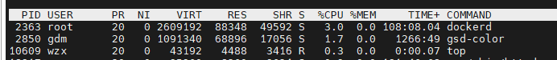
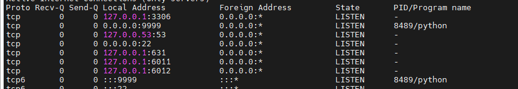
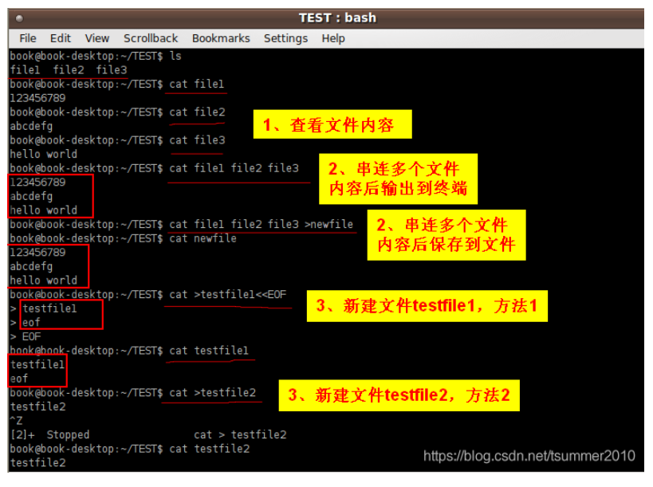

## 面试官在问用到什么linux命令的时候

## ps命令

ps -ef

5）ps e  列出程序时，显示每个程序所使用的环境变量。
6）ps f  用ASCII字符显示树状结构，表达程序间的相互关系。

ps -aux

1）ps a 显示现行终端机下的所有程序，包括其他用户的程序。

12）ps u 　 以用户为主的格式来显示程序状况。
13）ps x 　 显示所有程序，不以终端机来区分。

top

netstat -nltp

-n或–numeric  直接使用IP地址，而不通过域名服务器。

-l或–listening  显示监控中的服务器的Socket。

 -t或–tcp  显示TCP传输协议的连线状况。

 -p或–programs  显示正在使用Socket的程序识别码和程序名称。

grep

ps -ef|grep

ps -aux|grep

netstat -nltp|grep

查看指定进程的线程

ps -L 1213

cat -n test.log |grep "debug" 得到关键日志的行号

## cat命令

1. 查看一个文本文件的内容

cat 文件名

2. 将几个文本文件的内容串接在一起输出到某文件或者显示到终端

显示到终端：cat 文件1 文件2
输出到文件：cat 文件1 文件2  > 文件名

3、新建一个文件

以EOF为结束标志   ：cat > 文件名 <<EOF
以eof为结束标志   ：cat > 文件名 <<eof
以ctrl+z为结束标志：cat > 文件名

## more命令

1. 查看文件

more /var/log/dmesg

**空格键**：查看下一屏；

**回车键**：往下滚动一行；

**b 键**：往前查看一屏；

**q 键**：退出。

2. 从指定行开始显示

more +100 /var/log/dmesg

3. 一次只想查看 10 行

more -10 /var/log/dmesg

## 其他查看日志命令

head -n 10 test.log  查询日志文件中的头10行日志;

head -n -10 test.log  查询日志文件除了最后10行的其他所有日志

tail -n 10 test.log  查询日志尾部最后10行的日志;

tail -n +10 test.log  查询10行之后的所有日志

nohup  command &

**在linux操作时，经常要查看运行的项目的进程和端口号，在这里总结了以下常用到的相关命令**

查看系统运行的java项目，并查看进程号

- ps -ef|grep java
- ps -ef

- ps -aux

kill -9 

kill

## 查看端口命令

**lsof命令**

根据进程pid查看端口号

- lsof -i | grep pid

根据用户查看进程和端口号

- lsof -i | grep user

根据端口号查看进程

- lsof -i:port

**netstat命令**

根据进程查看端口号

- netstat -nap | grep pid

根据端口号查看进程

- netstat -nap | grep port
- netstat -nltp

top                动态显示当前耗费资源最多进程信息
ps                  显示瞬间进程状态 ps -aux

grep             在文本文件中查找某个字符串

