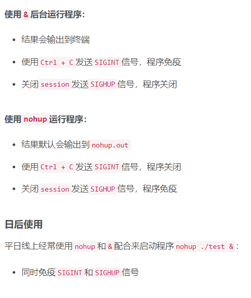
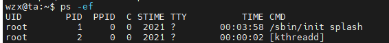
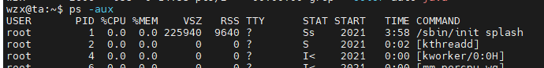

## 面试官在问用到什么linux命令的时候

用过 

ps -ef

ps -aux

netstat -nltp

grep

ps -ef|grep

ps -aux|grep

netstat -nltp|grep

cat -n test.log |grep "debug" 得到关键日志的行号

nohup  command &

**在linux操作时，经常要查看运行的项目的进程和端口号，在这里总结了以下常用到的相关命令**

查看系统运行的java项目，并查看进程号

- ps -ef|grep java
- ps -ef

- ps -aux

kill -9 

kill

**lsof命令**

根据进程pid查看端口号

- lsof -i | grep pid

根据用户查看进程和端口号

- lsof -i | grep user

根据端口号查看进程

- lsof -i:port

**netstat命令**

根据进程查看端口号

- netstat -nap | grep pid

根据端口号查看进程

- netstat -nap | grep port
- netstat -nltp

**cat 查找日志**

cat -n test.log |grep "debug" 得到关键日志的行号

head -n 10 test.log  查询日志文件中的头10行日志;

head -n -10 test.log  查询日志文件除了最后10行的其他所有日志

tail -n 10 test.log  查询日志尾部最后10行的日志;

tail -n +10 test.log  查询10行之后的所有日志

top                动态显示当前耗费资源最多进程信息
ps                  显示瞬间进程状态 ps -aux

grep             在文本文件中查找某个字符串

