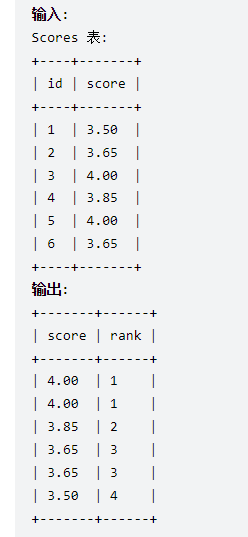

数据库表语句

## 更改字段长度
ALTER TABLE 表名 MODIFY COLUMN 字段名  数据类型(修改后的长度)
ALTER TABLE attence MODIFY COLUMN id INT(20)

## 修改字段的名称
alter table <表名> change <字段名> <字段新名称> <字段的类型>。
ALTER TABLE attence CHANGE attence_name NAME  VARCHAR(20)

## 新增默认为空的字段
ALTER TABLE 表名 ADD COLUMN 字段名 字段类型 DEFAULT NULL;

## 新增不为空的字段
ALTER TABLE 表名 ADD COLUMN 字段名 字段类型  NOT NULL;

## 添加行 删除行
ALTER TABLE mytable ADD col CHAR(20); 
ALTER TABLE mytable DROP COLUMN col;


## 添加索引

https://blog.csdn.net/weixin_41811352/article/details/115463508

https://www.cnblogs.com/bruce1992/p/13958166.html


**建表的时候添加索引**

```
CREATE TABLE mytable(
       ID INT NOT NULL primary key, 
       username VARCHAR(16) NOT NULL, 
       INDEX indexName(username)
 );
```


**普通索引**

Alter table tablename add index indexname(colunm)

ALTER TABLE `table_name` ADD INDEX index_name ( `column` )

**主键索引**

ALTER TABLE `table_name` ADD PRIMARY KEY ( `column` )

要先删除主键索引

ALTER TABLE `table_name` DROP PRIMARY KEY;


**唯一索引**

AlTER TABLE `table_name` ADD UNIQUE  index_name ( `column` )


**全文索引**

ALTER TABLE `table_name` ADD FULLTEXT index_name ( `column`)


**多列索引**

ALTER TABLE `table_name` ADD INDEX index_name ( `column1`, `column2`, `column3` )


上面的index_name 也可以不要

unique index = unique

fulltext index = fulltext

后面的index可以不用


比如

AlTER TABLE `table_name` ADD UNIQUE index  index_name ( `column` )

等于 

AlTER TABLE `table_name` ADD UNIQUE ( `column` )


**删除索引**

ALTER TABLE `table_name` DROP INDEX name;

DROP INDEX [indexName] ON mytable;


**创建外键**

https://blog.csdn.net/weixin_46649583/article/details/109236860

创建方式一：创建表时加入外键

FOREIGN KEY (`gradeid`) REFERENCES grade (`gradeid`)

创建方式二：创建表后，再添加外键约束

建立外键:ALTER TABLE 从表 ADD CONSTRAINT 约束名 FOREIGN KEY(外键的列名) REFERENCES 主表 (哪个字段);
ALTER TABLE student ADD CONSTRAINT `FK_gradeid` FOREIGN KEY(`gradeid`) REFERENCES grade (`gradeid`);


升序
SELECT *
FROM mytable
ORDER BY col1 DESC, col2 ASC;

分组 WHERE 过滤行，HAVING 过滤分组，行过滤应当先于分组过滤。
SELECT col, COUNT(*) AS num
FROM mytable
WHERE col > 2
GROUP BY col
HAVING num >= 2;


## 连接

**内连接、 也叫等值连接  两张表拼接在一起**

**可以不用显示inner join**

SELECT A.value, B.value
FROM tablea AS A INNER JOIN tableb AS B
ON A.key = B.key;

可以不显示
SELECT A.value, B.value
FROM tablea AS A, tableb AS B
WHERE A.key = B.key;


**自连接、内连接的一种 连接的表是自身**

自然连接的是同名属性列的连接，而内连接则不要求两属性列同名，可以用**using或on**来指定某两列字段相同的连接条件。

一张员工表，包含员工姓名和员工所属部门，要找出与 Jim 处在同一部门的所有员工姓名。
子查询:
SELECT name
FROM employee
WHERE department = (
      SELECT department
      FROM employee
      WHERE name = "Jim");


**自连接版本：**
SELECT e1.name
FROM employee AS e1 INNER JOIN employee AS e2
ON e1.department = e2.department
      AND e2.name = "Jim";


select E1.name AS Employee 

from

Employee E1 inner join Employee E2

on E1.managerId = E2.id and E1.salary > E2.salary;


**自然连接**

**自然连接是一种特殊的等值连接**，他要求两个关系表中进行连接的必须是相同的属性列（名字相同），无须添加连接条件，**并且在结果中消除重复的属性列。**

 Select * from table1 natural join table2


**外连接 **

**外连接保留了没有关联的那些行。分为左外连接，右外连接以及全外连接，左外连接就是保留左表没有关联的行。**

LEFT OUTER JOIN

right outer join

full outer join


左外外连接
SELECT Customers.cust_id, Customer.cust_name, Orders.order_id
FROM Customers LEFT OUTER JOIN Orders
ON Customers.cust_id = Orders.cust_id;


**排名函数**

1.rank() over：排名相同的两名是并列，但是占两个名次，1 1 3 4 4 6这种

2.dense_rank() over：排名相同的两名是并列，共占一个名词，1 1 2 3 3 4这种

3.row_number() over这个函数不需要考虑是否并列，哪怕根据条件查询出来的数值相同也会进行连续排名 1 2 3 4 5


例子：

返回分数排名

select

 score,

 (dense_rank() over (order by Score desc)) AS "rank" 

from Scores;



