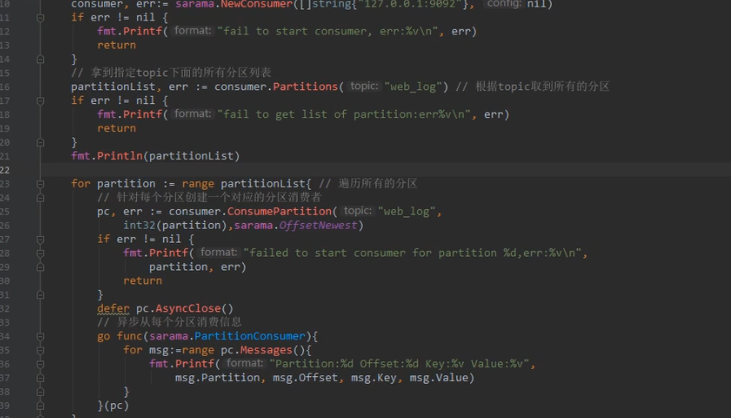

## 基于Kaffa的日志流收集项目

技术选型：参考ELK模型  es Logstash Kabana

Kafka 高吞吐量  目的就是用于日志收集和传输

RocketMQ  可靠性要求很高的场景，尤其是电商里面的订单扣款  并发场景

RabbitMQ 数据量没有那么大，小公司优先选择功能比较完备的RabbitMQ RabbitMQ的社区十分活跃


why what how理论

why 背景

实验室有很多项目 图书搜索 音乐搜索

需要收集项目的访问日志 检查项目系统访问情况


项目背景 b站

每个业务系统都有日志，当系统出现问题时，需要通过日志信息定位和解决问题。

分布式的系统，一个系统部署在十几台机器上，登录到机器上查看几乎不现实。


what 是什么

日志收集项目包括两个模块，agent模块、transfer模块


how 怎么做的

用Kafka消息队列暂存消息日志，建立好不同的日志topic类型，系统访问成功200，失败404.

agent从etcd中获取要收集的日志路径，每一个日志路径分配一个任务到线程池中，通过线程池分配一个线程读取日志文件。

线程读取日志的情况，日志文件新增一行日志，通过循环判断日志大小，读取新增的日志行同步直接发到Kafka对应的主题里面或者（发到通道里面，通道就是阻塞队列，另外真正的后台生产者通过从通道里面的取消息 实时发到kafka里面 这样做的原因是Kakfa的单机吞吐量是十万级的  而文件io读写是非常慢的 ）。

 

- **agent模块**：

agent从etcd中获取要收集的日志路径，每一个日志路径分配一个任务到线程池中，通过线程池分配一个线程读取日志文件。

使用的线程池是固定大小（100) 的线程池

newFixedThreadExecutor(100)

创建一个核心线程个数和最大线程个数都为100的线程池，阻塞队列长度为Integer.max_value, keepAliveTime = 0,表示线程个数比核心线程个数多并且当前空闲则回收, 阻塞队列为LinkedBlockingQueue。


线程池new 开一个线程去生产消息 线程需要判断这个文件有没有存在 没有的话分配错误  读取日志里面的变化日志 这个是通过什么去检测变化的 

加入读取日志的线程崩了 通过心跳检测重新分配线程 从上一次的offset去读

线程每次在读日志文件的时候定期保持日志文件的offset（这里有个问题 假如读取日志的时候没到时间记录offset  这个时候线程崩了 下一次线程启动的时候读取的时候从上一次offset读取 这样会有重复 这种不可避免 性能权衡的问题）


Java中 RandomAccessFile类 实时读取日志文件 对应于go的tail包

RandomAccess[File类](https://so.csdn.net/so/search?q=File类&spm=1001.2101.3001.7020)中seek方法可以从指定位置读取文件，可以用来实现文件实时读取。

怎么保证这个实时性呢 每隔两秒读取 用到file类 维护一个上次读文件的大小 如果当前文件大小比上次读文件的大小大 则从上次读文件大小开始读


##  项目亮点1

**项目亮点 采用内存映射文件的方法，将整个日志文件映射到虚拟内存，快速读取日志文件 **

`BufferedReader`方式的优势是：读取日志消耗的内存和CPU比较小，吞吐量高。缓存

- 因为使用缓存，相比逐个字节地从文件读取内容，以块方式读取文件内容，能大大提升日志读取的吞吐量。

`BufferedReader`方式的缺点是：不支持随机读取，在一些场景下耗时比较高。


`RandomAccessFile` 方式的优势是：支持随机读取，读取日志消耗内存少。dom

- 这种方式可以快速定位到文件的读取位置，定位到文件读取位置的时间复杂度为 `O(1)` 。
- 该方式读取本地文件，会逐个字节读取文件中内容，且不使用缓存，内存占用极低。

`RandomAccessFile` 方式的缺点是：CPU占用高、吞吐量低。


`RandomAccessFile` 随机读取方式须要按字节读取文件，这样读取文件的吞吐量会很低。而 `BufferedReader` 的数据块缓存机制能提升文件的读取吞吐量，所以考虑为 `RandomAccessFile` 添加缓存。调研发现 `MappedByteBuffer` 内存映射文件方式提供了缓存机制。

`MappedByteBuffer` 内存映射文件方式的优势：CPU消耗低、吞吐量高、支持随机读取。

- 这种方式在实现上使用了缓存，下降 IO 对 CPU 的中断次数，这样 CPU 消耗低，文件读取的吞吐量高。
- 而且底层使用了 `RandomAccessFile` ，支持文件内容的随机读取，查找文件读取位置的时间复杂度为 `O(1)`.


通过FileChannel.map方法，把整个文件映射到虚拟内存，并返回逻辑地址address


**一秒能读两万行日志**


## 项目亮点2

采用ETCD动态管理日志收集的配置 例如各种业务线日志收集 进行日志收集配置的服务发现，实现热部署


## 项目亮点3


发到kafka用到 apache基金会 的Kafka client 对应于go的sarama

结合这两个库，实现一边读取文件日志，一遍写入到kafka


```Java
import org.apache.kafka.clients.producer.KafkaProducer;
```


- **transfer模块 **

  通过线程池异步去消费消息
  
  获取topic分区数量 每一个分区创建一个消费者
  
  一直在读取

 


```Java
import org.apache.kafka.clients.consumer.KafkaConsumer;
```


- etcd

  

  

  通过etcd进行配置的增删改实现日志的收集。

 把要收集的日志文件的路径名更新到etcd里面 监控管理日志收集任务的配置信息


etcd日志路径只有一个key value 每个key相当于一个项目系统ip  value 是这个项目下的日志收集 假设为json格式 里面包含非常多的日志路径 和 收集日志模块主题


## 为什么用ETCD？

热加载的配置管理  

实现配置动态管理的功能

 用etcd管理agent配置项，不用配置文件，在etcd中动态地管理日志收集配置。

比如新开业务 日志收集线 在etcd用命令行 增加一个配置项 提交

agent就自动去识别etcd的最新的配置项 自动起一个收集日志收集的任务 收集新的日志收集项

就是说agent不需要 改配置文件 重启了 就是实现了一个热加载的功能 


etcd是一个高可用的分布式key-value储存系统，可以用于共享和服务的注册和发现


## 在Java实现：

全局的channel 用来暂存保存消息的 将数据放到通道中，从通道中获取信息

创建一个管理agent的管理类

根据etcd的配置型创建多个日志收集agent

循环每一个日志收集项 创建一个agent

把收集日志任务添加到管理类中的 线程池中

传递日志收集路径和主题参数（创建一个带参数实现runnable 的线程类）

线程池分配多个线程实时读取多个日志文件，每一个日志文件对应一个线程，读取日志文件发到channel中

另外创建一个生产者从channel中读取打包的日志消息（消息和主题） 通过创建一个kafaka实例，Kafka.producer


如何实现监视etcd配置项的变更

通过etcd的watch 用于监视etcd的key的变化，当有变化时通知管理agent的管理类（通过一个配置的通道）


管理类开启一个监控线程函数，不断监控是否有新的配置信息。

新配置来了之后应该管理一下我之前启动的那些tailTask日志收集任务


1. 原来已经存在的任务就不用动

2. 原来没有的我要新创建一个taiTask任务 扔到线程池 把创建的这个tailTask任务登记在册（在管理类中会有一个map key是日志收集路径 string value 是日志收集类实例 实现了收集任务的类）,方便后续管理

3. 原来有的现在没有的要tailTask停掉

找出tailTaskMap中存在,但是newConf不存在的那些tailTask,把它们都停掉，tailTask有个日志收集状态 停掉 或 继续运行收集

tailTask runnable 每次运行的时候都需要判断这个线程是否能举行运行 不能直接stop()

最后需要更新一下tailTaskMap


配置原来就有的 不需要操作

配置删除的 把对应的agent模块去掉

配置新增的 新开一个agent模块


## 实现模块：

**管理日志任务收集的管理类tailfile_mgr**

有管理所有tailTask任务的变量 map

新配置通道 list


对现有个配置开启日志收集

新配置来了之后应该管理一下我之前启动的那些tailTask

通过对比新的配置和原来所有TailTask任务的map 进行管理


**日志收集线程类 tailTask**


在Java上定义一个日志收集状态 停掉 或 继续运行收集 tailTask runnable 每次运行的时候都需要判断这个线程是否能举行运行 不能直接stop()


ssm框架中配置log4j环

https://www.cnblogs.com/fawaikuangtu123/articles/10360264.html

配置Nginx日志格式  一条日志的日志格式

```
log_format  access_log_json ``'{"host":"$http_x_real_ip","client_ip":"$remote_addr","log_time":"$time_iso8601","request":"$request","status":"$status","body_bytes_sent":"$body_bytes_sent","req_time":"$request_time","AgentVersion":"$http_user_agent"}'``;
```

状态码、客户端浏览器版本


https://blog.csdn.net/weixin_34281537/article/details/89869842

数据库的数据表

MariaDB [elk]> create table nginx_log(host varchar(128),client_ip varchar(128),status int(4),req_time float(8,3),AgentVersion varchar(512), time TIMESTAMP NOT NULL DEFAULT CURRENT_TIMESTAMP) ENGINE=InnoDB DEFAULT CHARSET=utf8 COLLATE=utf8_bin;

表结构


有一个主键id 递增的


项目的日志文件格式是否为json格式


数据库的日志格式

host    client_ip   status  req_time    AgentVersion    time

1. \-   192.168.20.191  304 0.023   Mozilla/5.0 (Windows NT 10.0; Win64; x64) AppleWebKit/537.36 (KHTML, like Gecko) Chrome/58.0.3029.110 Safari/537.36 2017-12-18 11:33:39
2. \-   192.168.20.191  200 0.042   Mozilla/5.0 (Windows NT 10.0; Win64; x64) AppleWebKit/537.36 (KHTML, like Gecko) Chrome/58.0.3029.110 Safari/537.36 2017-12-18 11:33:39
3. \-   192.168.20.191  200 0.030   Mozilla/5.0 (Windows NT 10.0; Win64; x64) AppleWebKit/537.36 (KHTML, like Gecko) Chrome/58.0.3029.110 Safari/537.36 2017-12-18 11:33:39

前面的主机host -


- 生产者和消费者的数量关系

kafka使用分区将topic的消息打散到多个分区分布保存在不同的broker上

Kafka的producer和consumer都可以多线程地并行操作，而每个线程处理的是一个分区的数据。

对于producer而言，它实际上是用多个线程并发地向不同分区所在的broker发起Socket连接同时给这些分区发送消息；而consumer，同一个消费组内的所有consumer线程都被指定topic的某一个分区进行消费。


- Consumer个数与分区数有什么关系？

topic下的一个分区只能被同一个consumer group下的一个consumer线程来消费，但反之并不成立，即一个consumer线程可以消费多个分区的数据，比如Kafka提供的ConsoleConsumer，默认就只是一个线程来消费所有分区的数据。即分区数决定了同组消费者个数的上限

[link](https://www.jianshu.com/p/dbbca800f607)


Etcd作为 KV 存储，会为每个 key 都保留历史版本，比如用于发布回滚、配置历史等。

观察 key的变化:

```nginx
etcdctl watch  foo --rev=0

```


## 你的项目是如何保证Redis的数据和Mysql数据一致性的问题的

1. 设置定期的过期时间

2. 手动删 delete key

3. mysql更新时把更新的部分写到redis里面


## 如何读取日志文件

1. 项目日志文件按照每日更新的变化 保存在每天的日志文件里
2. 通过开启线程不断读取每天的日志 不断循环从最后一次读的行read 当有新的日志行写入时 就会检测到变化
3. Kafka创建不断的日志消息主题 按照社交信息的类别 不断写入kafka 记录用户的系统行为 信息传播变化 后续用于日志的分析行为


## 高并发情况上如何解决

1. 部署多台服务器 集群管理 分流
2. 设置缓存 多级缓存
3. 用布隆过滤器查数据是否存在
4. 限制 访问权限 过滤掉一部分无效的访问
5. 设置分布式锁 


## ES检索为什么这么快

基于文档的搜索引擎

对数据进行分词后保存索引

建立分词字典 建立分词索引

根据分词索引找到分词在分词字典的位置

然后根据分词和文档的映射快速找到对应的文档


倒排索引


将一个文本拆分成一个一个独立Term 的过程其实就是我们常说的分词。

而将所有 Term 合并在一起就是一个 Term Dictionary

为Term Dictionary 创建索引放到内存中，

创建Term Index 字典数 

通过检索term index找到对应的 term 在 Term Dictionary字典文件哪个位置 可能是一个区间 通过二分很快就找到具体的位置了 也就是文档所在的位置 


