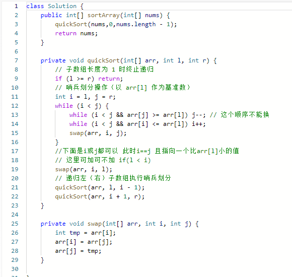

## 排序

https://www.cnblogs.com/zwtgyh/p/10631760.html

- 稳定排序

冒泡排序 插入排序 归并排序 基数排序

- 不稳定排序

快速排序 堆排序 希尔排序 选择排序

快速排序最坏的情况是n*n

堆排序 归并排序  最好最坏平均都是 nlogn

最优的条件下，所以[插入排序](https://so.csdn.net/so/search?q=插入排序&spm=1001.2101.3001.7020)和冒泡排序是最优的为o(n)的复杂度

选择排序的复杂度都为n*n

**插入排序**

思想：每步将一个待排序的记录，按其顺序码大小插入到前面已经排序的字序列的合适位置，直到全部插入排序完为止。

 

**二分插入排序**

思想：二分法插入排序的思想和直接插入一样，只是找合适的插入位置的方式不同，这里是按二分法找到合适的位置，可以减少比较的次数。

**选择排序**

思想：每趟从待排序的记录序列中选择关键字最小的记录放置到已排序表的最前位置，直到全部排完。 

**冒泡排序**

思想：在要排序的一组数中，对当前还未排好序的范围内的全部数，自上而下对相邻的两个数依次进行比较和调整，让较大的数往下沉，较小的往上冒。重复以上的步骤，直至全部排序完成。

**希尔排序**

思想：希尔排序又叫“缩小增量排序”，先取一个小于n的整数d1作为第一个增量，把文件的全部记录分成d1个组。所有距离为d1的倍数的记录放在同一个组中。先在各组内进行直接插入排序，然后取第二个增量d2。其是插入排序改良的算法，希尔排序步长从大到小调整，第一次循环后面元素逐个和前面元素按间隔步长进行比较并交换，直至步长为1，步长选择是关键。

##  快排序

## 堆排序

## 归并排序

