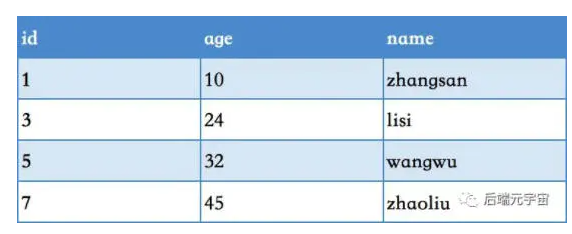

## Mysql 查询语句
链接: [link](http://www.cyc2018.xyz/%E6%95%B0%E6%8D%AE%E5%BA%93/SQL%20%E7%BB%83%E4%B9%A0.html#description-7).

## 什么是事务
事务是数据库区别于文件系统的重要特性之一，事务可以一条非常简单的SQL语句组成，也可以由一组复杂的SQL语句组成(一系列操作)，事务是访问并更新数据库中各种数据项的一个程序执行单元。在事务中的操作，要么都做修改，要么都不做，这就是事务的主要目的。

## 事务的特性有哪些？分别是怎么保证的？

**ACID 隔离的原子 一致的持久**

**隔离性**

隔离性指的是事物内部的操作与其他事务是隔离的，并发执行的事务之间不能互相干扰。

**原子性**

原子性就是说事务是一个不可分割的基本单位，其中的操作要么全部执行，要么都不执行，其实就是rollback的实现机制，**原子性实现的原理是通过undo log**。

**一致性** 

保持数据库的约束完整性

**持久性**

持久性是指事务一旦提交，它对数据库的改变就应该是永久性的。接下来的其他操作或故障不应该对其有任何影响。重点就是如何保证数据库宕机数据不受影响。**实现原理是通过redo log**

原子性 undo log

持久性 redo log

一致性 binlog

隔离性 MVCC

## 持久性是通过什么实现的

https://www.jb51.net/article/204972.htm

为了提高性能，和数据页类似，redo log 也包括两部分：一是内存中的日志缓冲(redo log buffer)，该部分日志是易失性的；二是磁盘上的重做日志文件(redo log file)，该部分日志是持久的。redo log是物理日志，记录的是数据库中物理页的情况 。

当数据发生修改时，InnoDB不仅会修改Buffer Pool中的数据，也会在redo log buffer记录这次操作；当事务提交时，会对**redo log buffer进行刷盘，记录到redo log file中**。如果MySQL宕机，重启时可以读取redo log file中的数据，对数据库进行恢复。这样就不需要每次提交事务都实时进行刷脏了。

## Mysql三大日志

二进制日志 binlog（归档日志）和事务日志 redo log（重做日志）和 undo log（回滚日志）

## 面试官可能会问三种日志的区别和作用

redo log：恢复提交事务修改的页操作；通常是物理日志，记录的是页的物理修改操作。保证持久性

undo log：回滚记录到某个特定版本；通常是逻辑日志，根据每行记录进行记录。 保证原子性

bin log：用来进行Point-In-Time(PIT)的恢复及主从复制环境的建立，记录mysql语句。保证一致性

## undo log 应用场景

undo_log是逻辑日志，用于记录数据更新之前的值。undo_log可以用于事务回滚，即事务的原子性和多版本并发控制（MVCC）。

## binlog和redolog的区别

redo log和事务的持久性相关的，是InnoDB引擎产生特有的, 记录的是对于每个页的修改, redo log在事务进行中不断的写入redo log buffer,事务提交时进行将buffer刷盘到redo file log中

binlog 是和事务的一致性相关的，是msyql server端的, 记录的是SQL语句，用于备份和恢复数据、主从复制，二进制日志只在事务提交完成后进行一次写入

回答：
（1）重做日志是在InnoDB存储引擎层产生的，而二进制日志是在MySQL数据库上层产生的，二进制日志不仅仅针对InnoDB存储引擎，任何存储引擎都会产生二进制日志。

（2）两种日志的记录内容形式不同。二进制日志是一种逻辑日志，记录的是SQL语句；而InnoDB存储引擎层面的重做日志是物理格式日志，记录的是对于每个页的修改。

（3）写入磁盘的时间不同，二进制日志只在事务提交完成后进行一次写入，而redo log在事务进行中不断的写入。

完全无关，两者的层次和维度都不相同。bin log是server端的，用于备份和恢复数据、主从复制等，而redo log是innodb特有的，用于保证异常情况下数据安全。当然redo log的二阶段提交也是必要的，用来保证redo log和bin log的一致性。

## 数据库中并发事务带来的问题

## 数据丢失（修改丢失）

指在一个事务读取一个数据时，另外一个事务也访问了该数据，那么在第一个事务中修改了这个数据后，第二个事务也修改了这个数据（或修改失败回滚）。这样第一个事务内的修改结果就被丢失，因此称为丢失修改。 例如：事务1读取某表中的数据A=20，事务2也读取A=20，事务1修改A=A-1，事务2也修改A=A-1，最终结果A=19，事务1的修改被丢失。

### 脏读（读取未提交数据）
A事务读取B事务尚未提交的数据，此时如果B事务发生错误并执行回滚操作，那么A事务读取到的数据就是脏数据。
### 不可重复读（前后多次读取，数据内容不一致）

事务A在执行读取操作，由整个事务A比较大，前后读取同一条数据需要经历很长的时间 。而在事务A第一次读取数据，比如此时读取了小明的年龄为20岁，事务B执行更改操作，将小明的年龄更改为30岁，此时事务A第二次读取到小明的年龄时，发现其年龄是30岁，和之前的数据不一样了，也就是数据不重复了，系统不可以读取到重复的数据，成为不可重复读。
### 幻读（前后多次读取，数据总量不一致）

事务A在执行读取操作，需要两次统计数据的总量，前一次查询数据总量后，此时事务B执行了新增数据的操作并提交后，这个时候事务A读取的数据总量和之前统计的不一样，就像产生了幻觉一样。

### 不可重复读和幻读到底有什么区别呢？

（1）不可重复读是读取了其他事务更改的数据，针对insert与update操作

解决：使用行级锁，锁定该行，事务A多次读取操作完成后才释放该锁，这个时候才允许其他事务更改刚才的数据。

（2）幻读是读取了其他事务新增的数据，针对insert与delete操作

解决：使用表级锁，锁定整张表，事务A多次读取数据总量之后才释放该锁，这个时候才允许其他事务新增数据。

## 数据库的锁

一、从锁范围分，可以把锁分为：全局锁、表级锁、行级锁，锁的精度逐渐增加，锁精度越高，需要同时锁住的数据越少，并发程度越高

二、从锁的作用分，可以把锁分为：共享锁（其他锁只能读不能写）、排他锁（其他锁不能读也不能写），很明显，共享锁的并发程度更高

(1)在读未提交(Read Uncommitted)，读提交(Read Committed, RC)，可重复读(Repeated Read, RR)这三种事务隔离级别下，普通select使用快照读(snpashot read)，不加锁，并发非常高；

(2)在串行化(Serializable)这种事务的隔离级别下，普通select会升级为select … in share mode;

加锁select主要是指：

select … for update

select … in share mode

innodb的三种行锁

https://www.cnblogs.com/zyh-s/p/13253670.html

https://www.jianshu.com/p/478bc84a7721

## 记录锁，间隙锁，临键锁 

**Record Lock：**记录锁，单个行记录上的锁。

**Gap Lock：**间隙锁，锁定一个范围，但不包括记录本身。
**Next-Key Lock：**临键锁，锁定一个范围，并且锁定记录本身。对于行的查询，都是采用该方法，可以解决幻读的问题。

间隙锁和临键锁只有在可重复读的情况下生效

**记录锁：**
记录锁就是为某行记录加锁，列必须为唯一索引列或主键列，否则加的锁就会变成临键锁，
查询语句必须为精准匹配 = ，不能为 >、<、like等，否则也会退化成临键锁。

**间隙锁：**
间隙锁基于非唯一索引，它锁定一段范围内的索引记录，但不包括记录本身。比如查询字段区间为1-5，即1-5内的记录行都会被锁住，2、3、4 的数据行的会被阻塞，但是 1 和 5 两条记录行并不会被锁住。

**临键锁：**

锁定一个范围，并且锁定记录本身。**对于行的查询，都是采用该方法，可以解决幻读的问题。**

临键锁可以理解为一种特殊的间隙锁，上面说过了通过临建锁可以解决幻读的问题。 每个数据行上的非唯一索引列上都会存在一把临键锁，当某个事务持有该数据行的临键锁时，会锁住一段左开右闭区间的数据。

**记录锁**存在于包括**主键索引**在内的**唯一索引**中，锁定单条索引记录。

**间隙锁**存在于**非唯一索引**中，锁定**开区间**范围内的一段间隔，它是基于**临键锁**实现的。

**临键锁**存在于**非唯一索引**中，该类型的每条记录的索引上都存在这种锁，它是一种特殊的**间隙锁**，锁定一段**左开右闭**的索引区间。

总结：

间隙锁 锁索引值两边 开区间 不包括索引本身

临键锁锁 一个左开右闭的数据，比如

比如在表中 age 列潜在的临键锁有：
(-∞, 10],
(10, 24],
(24, 32],
(32, 45],
(45, +∞],

执行这条记录 获取了 (24, 32] 这个区间内的临键锁。

SELECT * FROM table WHERE age = 24 FOR UPDATE; 

## 数据库事务隔离级别
数据库事务的隔离级别有4个，由低到高依次为Read uncommitted 、Read committed 、Repeatable read 、Serializable ，这四个级别可以逐个解决脏读 、不可重复读 、幻读 这几类问题。

- 读未提交（Read Uncommitted）：在事务 A 读取数据时，事务 B 读取和修改数据加了共享锁。这种隔离级别，会导致脏读、不可重复读以及幻读。
- 读提交（Read Committed）：在事务 A 读取数据时增加了共享锁，**一旦读取，立即释放锁**，事务 B 读取修改数据时增加了行级排他锁，直到事务结束才释放锁。也就是说，事务 A 在**读取数据时，事务 B 只能读取数据**，不能修改。当事务 A 读取到数据后，事务 B才能修改。这种隔离级别，可以避免脏读，但依然存在不可重复读以及幻读的问题。
- 可重复读（Repeatable Read）：在事务 A 读取数据时增加了共享锁，**事务结束，才释放锁**，事务 B 读取修改数据时增加了行级排他锁，直到事务结束才释放锁。也就是说，事务A 在**没有结束事务时，事务 B 只能读取数据**，不能修改。当事务 A 结束事务，事务 B 才能修改。这种隔离级别，可以避免脏读、不可重复读，但依然存在幻读的问题。
- 可序列化（Serializable）：在事务 A 读取数据时增加了表级共享锁，**事务结束，才释放锁，事务 B 读取修改数据时增加了表级排他锁**，直到事务结束才释放锁。可序列化解决了脏读、不可重复读、幻读等问题，但隔离级别越来越高的同时，并发性会越来越低。

​    最高隔离级别，不允许事务并发执行，而必须串行化执行，最安全，不可能出现更新、脏读、不可重复读、幻读，但是效率最低。

- 
- MySQL InnoDB 存储引擎的默认支持的隔离级别是 REPEATABLE-READ（可重读）

至于InnoDB为什么选用可重复读，我的个人理解是：在InnoDB存储引擎中，使用可重复读可以解决脏读、不可重复读，而幻读也有可能发生，但是是可以避免的，通过加**Next-Key Lock锁（左开右闭）可以解决幻读问题**。并且并非隔离级别越高越好，隔离级别越高的话，并发性能越低，所以在实际的开发中，需要根据业务场景进行选择事务的隔离级别。

不可重复读对应的是修改，即UPDATE操作。但是可能还会有幻读问题。

因为幻读问题对应的是插入INSERT操作，而不是UPDATE操作。

先对各个级别加锁情况做个介绍，让你有个基本概念：

1. 读未提交级别：不需要加任何锁，因此它的并发程度最高，但同时也会引发各种并发问题
2. 读已提交级别：读不需要加锁，但是写需要加排它锁 / MVCC
3. 可重复读级别：有两种不同的实现方式，一是悲观锁即读加共享锁，写加排它锁，这种方式并发程度低；二是乐观锁即MVCC，它的优势是不加锁，使用undo log和视图的概念实现，并发程度高
4. 串行化：读加共享锁，写加排他锁，读写互斥

数据库默认使用的是可重复读
是通过MVCC实现的

MVCC + 间隙锁可以解决幻读的情况

### MVCC

https://www.cnblogs.com/xuwc/p/13873611.html

**MVCC的目的就是多版本并发控制，mvcc 多版本控制用于实现事务的隔离级别，用于在不加锁的情况下解决数据库读写冲突问题**

是在undolog中实现的，通过undolog可以找回数据的历史版本。找回的数据历史版本可以提供给用户读(按照隔离级别的定义，有些读请求只能看到比较老的数据版本)，也可以在回滚的时候覆盖数据页上的数据。在InnoDB内部中，会记录一个全局的活跃读写事务数组，其主要用来判断事务的可见性。

MVCC模型在MySQL中的具体实现则是由 **3个隐式字段**，**undo日志** ，**Read View** 等去完成的

`undo log`会记录事务前老版本数据，然后行记录中回滚指针会指向老版本位置

`Read View` 就是事务进行`快照读`操作的时候生产的`读视图`(Read View)，在该事务执行的快照读的那一刻，会生成数据库系统当前的一个快照，记录并维护系统当前活跃事务的 ID

同时还可以解决脏读，幻读，不可重复读等事务隔离问题，但不能解决更新丢失问题

MVCC只在**读取已提交和可重复读**两种隔离级别下有作用

读已提交隔离级别下，会在每次快照读（查询）都生成一个`Read View`

可重复读只在事务开始时生成一个`Read View`，以后每次查询都用这个`Read View`，以此实现不同隔离级别。

#### 隐式字段

每行记录除了我们自定义的字段外，还有在数据库的每一行中，额外添加三个字段：`DB_TRX_ID`,`DB_ROLL_PTR`,`DB_ROW_ID`等字段

- `DB_TRX_ID`
  6byte，最近修改(`修改/插入`)事务ID：记录创建这条记录/最后一次修改该记录的事务ID
- `DB_ROLL_PTR`
  7byte，回滚指针，指向这条记录的上一个版本（存储于rollback segment里）
- `DB_ROW_ID`
  6byte，隐含的自增ID（隐藏主键），如果数据表没有主键，InnoDB会自动以`DB_ROW_ID`产生一个聚簇索引
- 实际还有一个删除flag隐藏字段, 既记录被更新或删除并不代表真的删除，而是删除flag变了

#### undo日志

undo log主要分为两种：

- insert undo log
  代表事务在`insert`新记录时产生的`undo log`, 只在事务回滚时需要，并且在事务提交后可以被立即丢弃
- update undo log
  事务在进行`update`或`delete`时产生的`undo log`; 不仅在事务回滚时需要，在快照读时也需要；所以不能随便删除，只有在快速读或事务回滚不涉及该日志时，对应的日志才会被`purge`线程统一清除

## Read View

Read View就是事务进行**快照读**操作的时候生产的`读视图`(Read View)，在该事务执行的快照读的那一刻，会生成数据库系统当前的一个**快照**，记录并维护系统当前活跃事务的ID

`Read View`遵循一个可见性算法，主要是将`要被修改的数据`的最新记录中的`DB_TRX_ID`（即当前事务ID）取出来，与系统当前其他活跃事务的ID去对比

## 能解决什么问题

数据库并发场景有三种，分别为：
读-读：不存在任何问题，也不需要并发控制
读-写：有线程安全问题，可能会造成事务隔离性问题，可能遇到脏读，幻读，不可重复读
写-写：有线程安全问题，可能会存在更新丢失问题，比如第一类更新丢失，第二类更新丢失

## MVCC带来的好处

MVCC可以为数据库解决以下问题

- 在并发读写数据库时，可以做到在读操作时不用阻塞写操作，写操作也不用阻塞读操作，提高了数据库并发读写的性能
- 同时还可以解决脏读，幻读，不可重复读等事务隔离问题，但不能解决更新丢失问题
- MVCC只在**读取已提交和可重复读**两种隔离级别下有作用

- MVCC常见的实现方式乐观锁和悲观锁

- MVCC是行级锁的变种，很多情况下避免了加锁操作。

- 应对高并发事务, MVCC比单纯的加锁更高效;

- InnoDB存储引擎在数据库每行数据的后面添加了三个字段, 不是两个!!

InnoDB存储引擎在数据库每行数据的后面添加了三个字段
分别是事务ID、回滚指针和
6字节的DB_ROW_ID字段: 包含一个随着新行插入而单调递增的行ID, 当由innodb自动产生聚集索引时，聚集索引会包括这个行ID的值，否则这个行ID不会出现在任何索引中。

## 数据库中的死锁概念
回答：死锁是指两个或两个以上的事务在执行过程中，因争夺资源而造成的一种互相等待的现象。

解决死锁的办法：
- 一种是超时回滚
- 一种是采用死锁检测机制（wait-for graph等待图）
如果面试官让你举例子，可以举例下面的例子：

在 MySQL 中，gap lock 默认是开启的，即innodb_locks_unsafe_for_binlog 参数值是disable 的，且 MySQL 中默认的是 RR 事务隔离级别。

当我们执行以下查询 SQL 时，由于 order_no 列为非唯一索引，此时又是 RR 事务隔离级别，所以 SELECT 的加锁类型为 gap lock，这里的 gap 范围是 (4,+∞）。

执行查询 SQL 语句获取的 gap lock 并不会导致阻塞，而当我们执行以下插入 SQL 时，会在插入间隙上再次获取插入意向锁。插入意向锁其实也是一种 gap 锁，它与 gap lock 是冲突的，所以当其它事务持有该间隙的 gap lock 时，需要等待其它事务释放 gap lock 之后，才能获取到插入意向锁。

以上事务 A 和事务 B 都持有间隙 (4,+∞）的 gap 锁，而接下来的插入操作为了获取到插入意向锁，都在等待对方事务的 gap 锁释放，于是就造成了循环等待，导致死锁。

## 数据库储存引擎

### InnoDB
是 MySQL 默认的事务型存储引擎，只有在需要它不支持的特性时，才考虑使用其它存储引擎。

实现了四个标准的隔离级别，默认级别是可重复读（REPEATABLE READ）。在可重复读隔离级别下，通过多版本并发控制（MVCC）+ Next-Key Locking 防止幻影读。

主索引是聚簇索引，在索引中保存了数据，从而避免直接读取磁盘，因此对查询性能有很大的提升。

内部做了很多优化，包括从磁盘读取数据时采用的可预测性读、能够加快读操作并且自动创建的自适应哈希索引、能够加速插入操作的插入缓冲区等。

支持真正的在线热备份。其它存储引擎不支持在线热备份，要获取一致性视图需要停止对所有表的写入，而在读写混合场景中，停止写入可能也意味着停止读取。

### MyISAM
设计简单，数据以紧密格式存储。对于只读数据，或者表比较小、可以容忍修复操作，则依然可以使用它。

提供了大量的特性，包括压缩表、空间数据索引等。

不支持事务。

不支持行级锁，只能对整张表加锁，读取时会对需要读到的所有表加共享锁，写入时则对表加排它锁。但在表有读取操作的同时，也可以往表中插入新的记录，这被称为并发插入（CONCURRENT INSERT）。

可以手工或者自动执行检查和修复操作，但是和事务恢复以及崩溃恢复不同，可能导致一些数据丢失，而且修复操作是非常慢的。

如果指定了 DELAY_KEY_WRITE 选项，在每次修改执行完成时，不会立即将修改的索引数据写入磁盘，而是会写到内存中的键缓冲区，只有在清理键缓冲区或者关闭表的时候才会将对应的索引块写入磁盘。这种方式可以极大的提升写入性能，但是在数据库或者主机崩溃时会造成索引损坏，需要执行修复操作。

### 比较
- 事务：InnoDB 是事务型的，可以使用 Commit 和 Rollback 语句。
- 并发：MyISAM 只支持表级锁，而 InnoDB 还支持行级锁。
- 外键：InnoDB 支持外键。
- 备份：InnoDB 支持在线热备份。
- 崩溃恢复：MyISAM 崩溃后发生损坏的概率比 InnoDB 高很多，而且恢复的速度也更慢。
- 其它特性：MyISAM 支持压缩表和空间数据索引。

记住这个

另一个版本
- InnoDB支持行锁 支持事务 支持外键 支持MVCC 支持崩溃后的安全恢复
- **InnoDB**支持行级锁和表级锁  但MyISAM只支持表级锁
- **MyISAM**强调的是性能，每次查询具有原子性,其执行速度比InnoDB类型更快

## 数据库的索引

索引是存储引擎用于提高数据库表的访问速度的一种**数据结构**。

## 索引的种类

**普通索引**: 即针对数据库表创建索引

**唯一索引**: 与普通索引类似，不同的就是：MySQL 数据库索引列的值必须唯一，**但允许有空值**

**主键索引**: 它是一种特殊的唯一索引，**不允许有空值**。一般是在建表的时候同时创建主键索引

**组合索引**(联合索引): 为了进一步榨取 MySQL 的效率，就要考虑建立组合索引。

即将数据库表中的多个字段联合起来作为一个组合索引。

**全文索引**：只有在`MyISAM`引擎上才能使用，只能在`CHAR`、`VARCHAR`和`TEXT`类型字段上使用全文索引。

## 索引的数据结构

索引的数据结构主要有**B 树， B+树和 哈希表**，对应也就有B+树索引 和 哈希索引

既然哈希表这么快，**为什么MySQL 没有使用其作为索引的数据结构呢**

- **1.Hash 冲突问题**
- **2.Hash 索引不支持顺序和范围查询(Hash 索引不支持顺序和范围查询是它最大的缺点：** 假如我们要对表中的数据进行排序或者进行范围查询，那 Hash 索引可就不行了。
- 哈希表是无序的，不支持顺序和范围查询。

## **B 树& B+树**

- B 树的所有节点既存放键(key) 也存放 数据(data)，而 B+树只有叶子节点存放 key 和 data，其他内节点只存放 key。
- B 树的叶子节点都是独立的;B+树的叶子节点有一条引用链指向与它相邻的叶子节点。
- B 树的检索的过程相当于对范围内的每个节点的关键字做二分查找 B+树的检索，都是从根节点到叶子节点的过程，叶子节点的顺序检索很明显

**B+树的结构图**

**在 MySQL 中，MyISAM 引擎和 InnoDB 引擎都是使用 B+Tree 作为索引结构**

### 为什么B+树比B树更适合实现数据库索引？

- 由于B+树的数据都存储在叶子结点中，叶子结点均为索引，方便扫库，只需要扫一遍叶子结点即可，但是B树因为其分支结点同样存储着数据，我们要找到具体的数据，需要进行一次中序遍历按序来扫，所以B+树更加适合在**范围区间查询**的情况，而在数据库中基于范围的查询是非常频繁的，所以通常B+树用于数据库索引。

- B+树的节点只存储索引key值，具体信息的地址存在于叶子节点的地址中。这就使以页为单位的索引中可以存放更多的节点。**减少更多的I/O支出**。

**解释**：B+树的内部结点并没有指向关键字具体信息的指针，其内部结点比B树小，盘块能容纳的结点中关键字数量更多，一次性读入内存中可以查找的关键字也就越多，相对的，IO读写次数也就降低了。

- B+树的**查询效率更加稳定**，任何关键字的查找必须走一条从根结点到叶子结点的路。所有**关键字查询的路径长度相同**，导致每一个数据的查询效率相当。

## **聚集索引和非聚集索引**

1. 聚集索引即索引结构和数据一起存放的索引。主键索引属于聚集索引。
2. 非聚集索引即索引结构和数据分开存放的索引。

InnoDB聚集索引的叶子节点存储行记录，因此， InnoDB必须要有，且只有一个聚集索引：

（1）如果表定义了主键，则PK就是聚集索引；
 （2）如果表没有定义主键，则第一个非空唯一索引（not NULL unique）列是聚集索引；
 （3）否则，InnoDB会创建一个隐藏的row-id作为聚集索引；

## 数据库的回表查询

select * from user where ID=1;

无需回表，根据主键的查询方式，搜索主键索引，就可以找到相应的记录了。

select * from user where name='ls';

需要回表，先根据普通索引树找到主键，然后根据主键去主键索引找到完整的记录，进行了两次索引查询。基于非主键索引的查询需要多扫描一棵索引树。

（1）先通过普通索引定位到主键值id=5；
（2）在通过聚集索引定位到行记录；
这就是所谓的回表查询，先定位主键值，再定位行记录，它的性能较扫一遍索引树更低。

## 覆盖索引

覆盖索引即需要查询的字段正好是索引的字段，那么直接根据该索引，就可以查到数据了， 而无需回表查询。

在一个索引树就可以找到所需要的列数据了。

使用方法，建立联合索引,将单列索引建立为联合索引

比如

select id,name from user where name='shenjian';

能够命中name索引，索引叶子节点存储了主键id，通过name的索引树即可获取id和name，无需回表，符合索引覆盖，效率较高。

## 数据库如何建立索引呢

具体查看sql.md文件

alter table name add /change/modify 

### 数据库的主从复制

主从复制是指数据可以从一个MySQL数据库服务器主节点复制到一个或多个从节点。

主要涉及三个线程：binlog 线程、I/O 线程和 SQL 线程。

- **binlog 线程** ：负责将主服务器上的数据更改写入二进制日志（Binary log）中。
- **I/O 线程** ：负责从主服务器上读取二进制日志，并写入从服务器的**中继日志**（Relay log）。
- **SQL 线程** ：负责读取中继日志，解析出主服务器已经执行的数据更改并在从服务器中重放（Replay）。

### 数据库的读写分离

- 主服务器处理写操作以及实时性要求比较高的读操作，而从服务器处理读操作。
- 读写分离常用代理方式来实现，代理服务器接收应用层传来的读写请求，然后决定转发到哪个服务器。

## 数据库范式
- 1NF(第一范式)
属性（对应于表中的字段）不能再被分割，也就是这个字段只能是一个值，不能再分为多个其他的字段了。1NF 是所有关系型数据库的最基本要求 ，也就是说关系型数据库中创建的表一定满足第一范式。

- 2NF(第二范式)
2NF 在 1NF 的基础之上，消除了非主属性对于码的部分函数依赖

- 3NF(第三范式)
3NF 在 2NF 的基础之上，消除了非主属性对于码的传递函数依赖 。

**总结**
1NF：属性不可再分。
2NF：1NF 的基础之上，消除了非主属性对于码的部分函数依赖。
3NF：3NF 在 2NF 的基础之上，消除了非主属性对于码的传递函数依赖