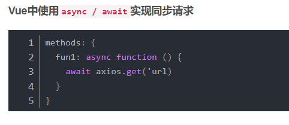
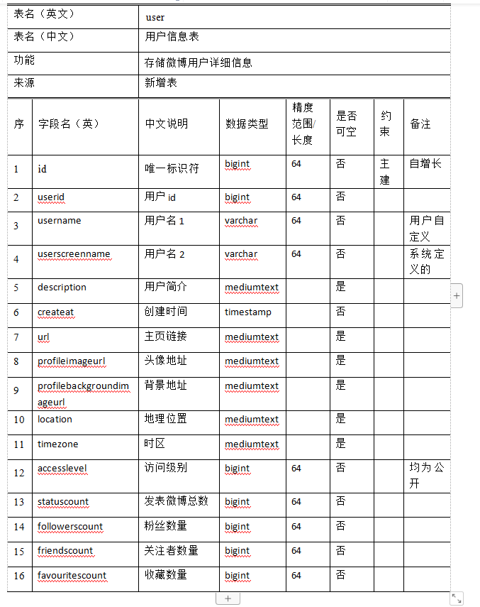
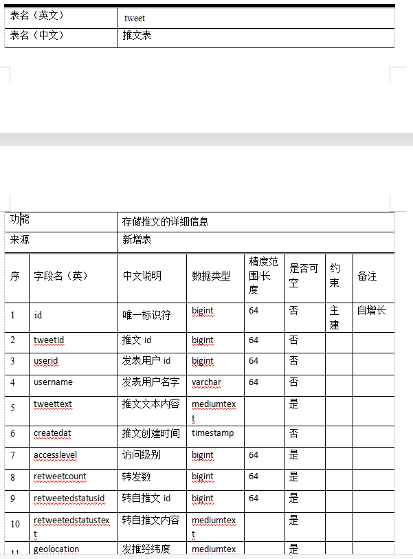
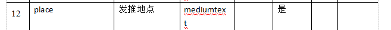
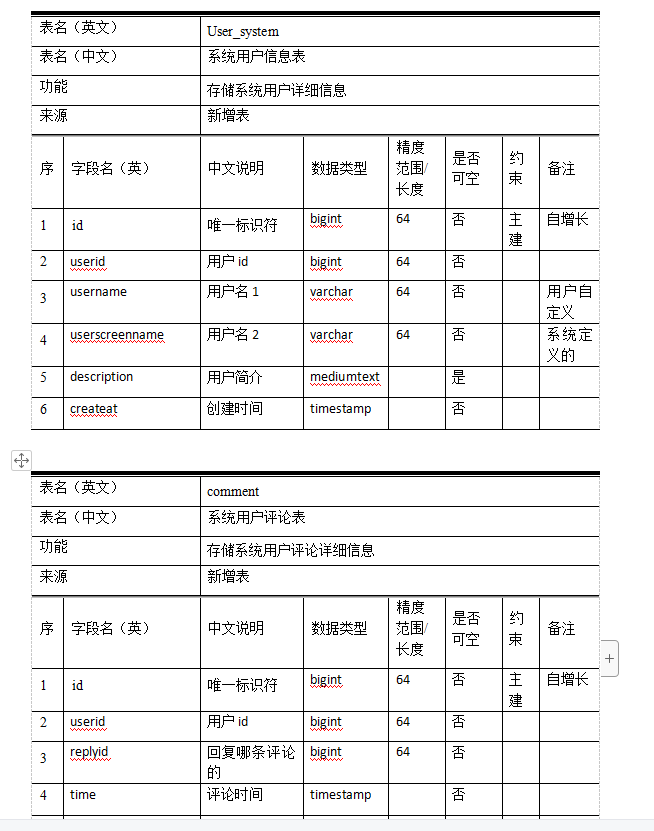
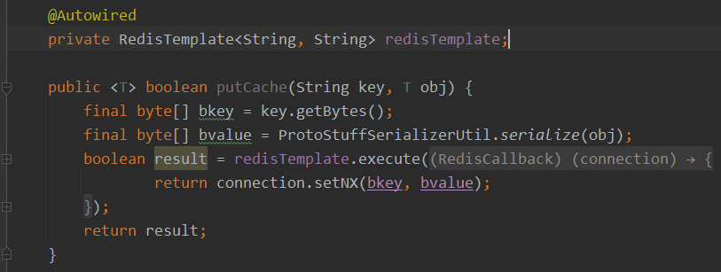
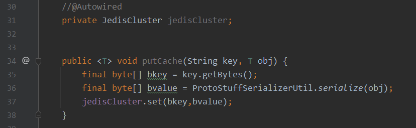
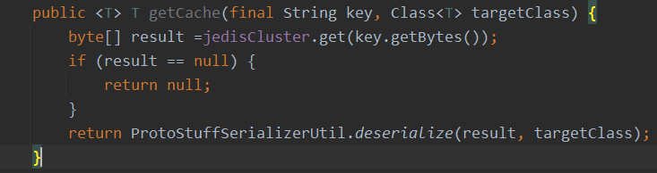

实验室项目，在线社交网络分析系统采用SSM框架进行实现 

从互联网收集社交网络数据，构建社交网络传播数据存入Mysql数据库中 

系统使用Redis进行数据缓存

前端用Vue  前后端分离

Vue.js 2.0 版本推荐使用 axios 来完成 ajax 请求

默认异步的 可以改成同步

SSM框架

缓存层 Redis

实体层 entity

控制层 control

业务层 service

数据访问层 dao

jdbc访问数据库 配置jdbc配置文件

访问数据库的一些列操作交给Mybatis 连接 查询 插入 更新

从互联网收集社交网络数据，构建社交网络传播数据存入Mysql数据库中 

用八爪鱼爬虫爬的  里面有爬取社交网络数据 输入微博的接口 解析出自己要爬取的字段

数据库表：

user twreet system_user comment

- Redis单节点

- Redis集群版本

关于社交网络分析系统的Redis 集群介绍

社交网络系统使用5.2的版本

Redis集群 6个节点的 三主三从 复制Redis文件 配置端口不一样就行

在项目的redis.properties文件中新增集群机器的配置，将6个节点依次加入配置

在ssm+maven项目中集成redis很简单，只需要引入redis客户端（redis.clients redis连接工具）和spring对redis的支持的jar包（spring-data-redis），引入redis的相关配置就可以了

直接注入jedisCluster获取一个集群对象

**jedisCluster.set(key,value)**

**jedisCluster.get(key)**

