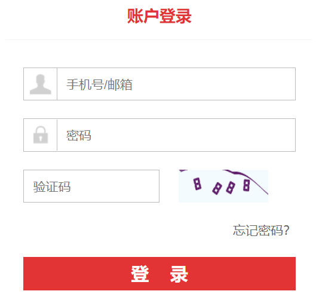
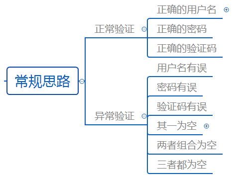
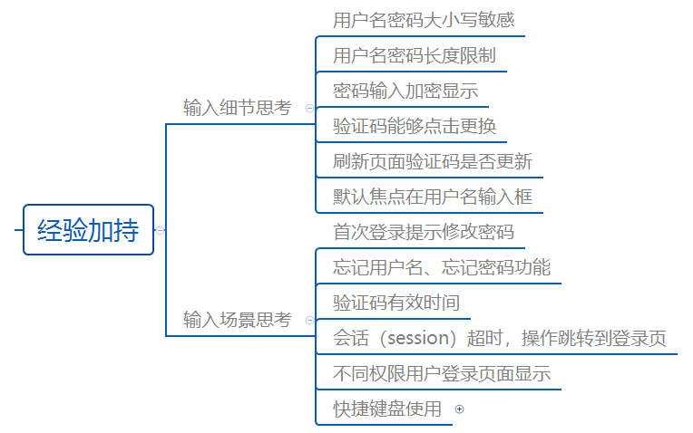
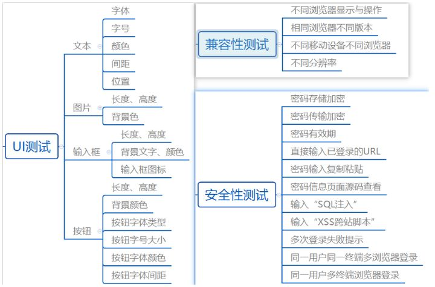

https://www.jianshu.com/p/51930cc5dcf9

软件测试

https://blog.csdn.net/m0_59868866/article/details/120833236

## 软件测试

软件测试过程五个步骤：1、需求分析：分析客户的需求可不可行。2、编写测试计划。3、编写测试用例：测试用例就是指导测试的文档。4、执行测试：提交bug，回归测试。5、编写测试总结报告。

There are five steps in the software testing process: 

1. Requirements analysis: analyze whether the customer's requirements are feasible. 
2. Write test plan.
3. Write test cases: test cases are documents that guide testing. 
4. Execute tests: submit bugs and regression tests. 
5. Prepare test summary report.

1、需求分析、需求评审。

需求分析和评审就是分析客户的需求可不可行，需要怎么进行测试。

1. Demand analysis and demand review.

Demand analysis and review is to analyze whether the customer's demand is feasible and how to test it.

2、编写测试计划。

编写测试计划通俗一点讲就是什么人在什么时间做什么事，最后产出什么东西。那也就是测试人员要测试哪些模块、在什么期限内,提交哪些文档。

2. Write test plan.

Writing a test plan, in a more common sense, is about who does what at what time and what will be produced in the end. That is, which modules should be tested by testers, within what time limit, and which documents should be submitted.

3、编写测试用例、用例评审。

测试用例就是指导测试的文档，比如我们要测试商城登录、买东西等功能，通过测试方法和策略设计测试

用例。

评审就是评价审查,不能想当然该怎么测。不能只是输入正确的用户名和密码，能登录进去就完事了。作

为软测工程师需要有破坏性，比如密码输错时怎么办，会不会有相应的报错等等。

3. Write test cases and use case review.

Test cases are the documents that guide the test. For example, we need to test the functions of mall login and shopping, and design tests through test methods and strategies

Use cases.

Review is evaluation review. You can't take it for granted. You can't just enter the correct user name and password. It's over if you can log in. do

For soft testing, engineers need to be destructive, such as what to do when the password is wrong, whether there will be corresponding error reporting, etc.

4、执行测试、bug. 回归测试。

Bug就是缺陷，发现bug之后,要提交给开发人员让他们去修改,然后进行回归测试，验证开发人员有没有改好。

4. Execute test and bug  Regression test.

A bug is a defect. Once a bug is found, it should be submitted to the developer for modification. Then, regression testing should be carried out to verify whether the developer has corrected it.

5、编写测试总结报告。

Bug都改好了之后，要编写测试总结报告，这款软件的质量如何。

5. Prepare test summary report.

After the bugs have been changed, a test summary report should be prepared. How about the quality of this software.

### 单元测试Mock

在单元测试中，我们往往想去独立地去测一个类中的某个方法，但是这个类可不是独立的，它会去调用一些其它类的方法和service(Database Hadoop dbfs Hive Hbase 其他service)，这也就导致了以下两个问题：外部服务可能无法在单元测试的环境中正常工作，因为它们可能需要访问数据库或者使用一些其它的外部系统。我们的测试关注点在于这个类的实现上，外部类的一些行为可能会影响到我们对本类的测试，那也就失去了我们进行单测的意义。

mock对象就是在调试期间用来作为真实对象的替代品
mock测试就是在测试过程中，对那些不容易构建的对象用一个虚拟对象来代替测试的方法就叫mock测试

**“mock框架”**（**Mockito 、jmock 、 powermock、EasyMock**），可以通过mock框架模拟一个对象的行为，从而隔离开我们不关心的其他对象，使得测试变得简单。（例如service调用dao，即service依赖dao，我们可以通过mock dao来模拟真实的dao调用，从而能达到测试service的目的。）

Unit test mock

In unit testing, we often want to test a method in a class independently, but this class is not independent. It will call some methods and services of other classes (database Hadoop dBfs hive HBase and other services), which leads to the following two problems: external services may not work normally in the environment of unit testing, Because they may need to access the database or use some other external system. Our test focuses on the implementation of this class. Some behaviors of external classes may affect our test of this class, which will lose the significance of our unit test.

Mock objects are used as substitutes for real objects during debugging

Mock test is to replace the test with a virtual object for those objects that are not easy to build, which is called mock test

**"Mock framework" ** (**mockito, jmock, powermock, easymock**) can simulate the behavior of an object through the mock framework, so as to isolate other objects we don't care about and make the test simple. (for example, a service invokes Dao, that is, a service depends on Dao. We can simulate a real Dao call through mock Dao, so as to achieve the purpose of testing a service.)

## Mockito和PowerMock

PowerMock是Java开发中的一种Mock框架，用于单元模块测试。当你想要测试一个service接口，但service需要经过防火墙访问，防火墙不能为你打开或者你需要认证才能访问。遇到这样情况时，你可以在你能访问的地方使用MockService替代，模拟实现获取数据。
PowerMock可以实现完成对private/static/final方法的Mock（模拟），而Mockito可以对普通的方法进行Mock，如：public等。

Mockito.when().thenReturn()

PowerMockito.when().thenReturn()

Powermock is a mock framework in java development, which is used for unit module testing. When you want to test a service interface, but the service needs to be accessed through a firewall. The firewall cannot be opened for you or you need authentication to access it. In this case, you can use mockservice instead where you can access to simulate the implementation to obtain data.

Powermock can mock private / static / final methods, while mockito can mock common methods, such as public.

## Junit单测

JUnit是单元测试框架，可以轻松的完成关联依赖关系少或者比较简单的类的单元测试，但是对于关联到其它比较复杂的类或对运行环境有要求的类的单元测试，模拟环境或者配置环境会非常耗时，实施单元测试比较困难。

在 JUnit 4 中，单元测试用例的执行顺序为：

## 测试用例

因此，在介绍如何编写测试用例之前，先看一个软件系统登录功能的测试（如下截图所示）：

**目录**

> 测试用例：为了特定的目的（证明软件存在某问题）而设计的一组由测试输入、执行条件、预期结果构成的文档

1、测试用例简单来说就是指导如何做测试的文档，该文档主要记录需要验证被测软件的是否满足需求

2、测试用例表现形式常见的有两种，可以以模板形式展示

​       1）一种是通过Excel直接编写

​           ——大多数项目中都需要按照这种方式设计编写

​       2）一种是通过xmind直接整理测试点

​            ——时间紧迫，项目没有强制要求时，可以设计测试点的形式编写
​            ——对于业务流程类的测试，也可以整理为测试点进行测试

3、设计及执行人员：测试工程师

4、用例的模板：描述编写用例核心内容，一般项目都有自己的设计用例的模板，常见测试用例模板可参照如下：

## **二.为什么要写测试用例**

为什么要写测试用例，实际中产品出现问题，第一责任人首先想到的是测试为啥没有测到？

当然，除了避免“甩锅和背锅”，其实写测试用例更重要的作用如下：

- 技术上将需求转化为具体可验证的指标
- 以文档的形式记录软件可能存在的问题
- 防止测试过程的活动出现遗漏，提高工作效率
- 测试工作量的展示

## **三.如何编写测试用例**

**1、常规思考**

回归到开篇的问题，对于一个基本的登录页面，按照常规思路能否会想到如下截图的测试点呢？实际，这些测试点都是源于从用户角度出发，结合需求进行细化设计的过程。实际测试中是不是只有这些测试点呢？

**2、学习积累**

相信大多数测试工程师都能够想到上述基本的测试点，然在实际工作中面对的项目不同，设计测试用例的颗粒度也有不同的要求，如果针对上述登录的模块，更深入一层考虑呢？此时需要对产品的熟悉程度及测试经验的加持，而且这些点的设计是不断学习、熟悉项目、测试积累中得到的。

**3、理论支撑**

有了常规的思考，有了经验的积累，还需要理论的支撑。测试用例毕竟是通过人去思考设计，这个过程不可避免有疏漏。如何规避？实际就需要测试理论的支撑，个人认为深入思考设计用例不外乎以下两方面：

​     **1）测试用例的设计方法**

> 测试理论中很关键一块就是将需求拆分为具体的测试点，然后根据用例设计方法进行具体的设计，其中拆分需求的关键是熟悉需求，将文档中已有的描述内容，按照用户使用场景、个人测试经验的积累（如果有的话）、把大段的内容拆分成能够直接用用例设计方法的测试点，这样就直接可以通过简明扼要的文字描述转化为Excel的测试用例，在这个过程通俗理解就是拆分细化的过程，直到可以直接写用例验证一个具体的功能点即可。

​    **其中熟知的设计用例方法有：**

​     \- 观察法

​    \- 等价类、边界值

​    \- 判定表、[因果图](https://www.zhihu.com/search?q=因果图&search_source=Entity&hybrid_search_source=Entity&hybrid_search_extra={"sourceType"%3A"answer"%2C"sourceId"%3A1494934653})

​    \- 流程图、场景法

​    \- 错误推测法等

​      **2）测试设计的思路开拓**

> 倘若按照需求将已有的描述信息都已经拆分完毕了，是不是就可以确保测试没有问题了呢？
> 其实不然，在上述基础上如果还需要再拓展全面测试，还需要借助于软件质量模型的特性，从这些特性出发，给予测试用例设计者更多的思考空间。这样的设计就更加的全面可靠。

​     **常见软件质量模型特性说明：**

​      \- 功能性：功能有没有，好不好用

​      \- 性能效率：对应系统的资源耗费程度及响应时间

​      \- 易用性：容易理解、学习、使用

​      \- 兼容性：能够兼容不同的软硬件平台

​      \- 可靠性：不易出问题，万一出问题容易恢复

​      \- 安全性：对于用户的安全保障（外在的人生安全、内在的信息安全等）

​      \- 可移植性：能否在不同环境条件下无故障运行

​      \- 可维护性：对于后期的修复维护是否方便快捷

**因此，对于上述登录功能，按照上述质量模型的思路指导，就得到如下的测试点：**

## 软件测试

和开发过程相对应，测试过程会依次经历单元测试（Unit Testing）、集成测试(Integrated Testing)、系统测试(System Testing)、验收测试四个主要阶段：

- 单元测试：单元测试是针对软件设计的最小单位––程序模块甚至代码段进行正确性检验的测试工作，通常由开发人员进行。

  Unit testing: unit testing is the testing work to verify the correctness of program modules and even code segments, which is the smallest unit of software design. It is usually carried out by developers.

- 集成测试：集成测试是将模块按照设计要求组装起来进行测试，主要目的是发现与接口有关的问题。由于在产品提交到测试部门前，产品开发小组都要进行联合调试，因此在大部分企业中集成测试是由开发人员来完成的。

  Integration test: integration test is to assemble the modules according to the design requirements for testing. The main purpose is to find the problems related to the interface. Since the product development team must conduct joint debugging before the product is submitted to the testing department, in most enterprises, integration testing is completed by developers.

- 系统测试：系统测试是在集成测试通过后进行的，目的是充分运行系统，验证各子系统是否都能正常工作并完成设计的要求。它主要由测试部门进行，是测试部门最大最重要的一个测试，对产品的质量有重大的影响。

  System test: the system test is carried out after the integration test is passed. The purpose is to fully run the system, verify whether all subsystems can work normally and complete the design requirements. It is mainly conducted by the testing department. It is the largest and most important test of the testing department and has a significant impact on the quality of products.

- 验收测试：验收测试以需求阶段的《需求规格说明书》为验收标准，测试时要求模拟实际用户的运行环境。对于实际项目可以和客户共同进行，对于产品来说就是最后一次的系统测试。测试内容为对功能模块的全面测试，尤其要进行文档测试。

  Acceptance test: the acceptance test takes 《the requirements specification》 in the requirements stage as the acceptance standard, and it is required to simulate the operating environment of the actual user during the test. For the actual project, it can be carried out together with the customer. For the product, it is the last system test. The test content is the comprehensive test of functional modules, especially the document test.

## 软件的基本测试方法

软件的基本测试方法主要有静态测试和动态测试、功能测试、性能测试、黑盒测试和白盒测试

- 静态测试是不运行程序本身而寻找程序代码中可能存在的错误或评估程序代码的过程。

- 动态测试是实际运行被测程序，输入相应的测试实例，检查运行结果与预期结果的差异，判定执行结果是否符合要求，从而检验程序的正确性、可靠性和有效性，并分析系统运行效率和健壮性等性能。

- 黑盒测试一般用来确认软件功能的正确性和可操作性,目的是检测软件的各个功能是否能得以实现,把被测试的程序当作一个黑盒,不考虑其内部结构,在知道该程序的输入和输出之间的关系或程序功能的情况下,依靠软件规格说明书来确定测试用例和推断测试结果的正确性。

- 白盒测试根据软件内部的逻辑结构分析来进行测试,是基于代码的测试，测试人员通过阅读程序代码或者通过使用开发工具中的单步调试来判断软件的质量，一般黑盒测试由项目经理在程序员开发中来实现。

- α测试是由一个用户在开发环境下进行的测试，也可以是公司内部的用户在模拟实际操作环境下进行的受控测试，Alpha测试不能由程序员或测试员完成。

- β测试是软件的多个用户在一个或多个用户的实际使用环境下进行的测试。开发者通常不在测试现场，Beta测试不能由程序员或测试员完成。

## 黑盒测试 白盒测试

白盒测试：逻辑覆盖（logic coverage）、循环覆盖（loop coverage）、基本路径覆盖（basic path coverage）

黑盒测试用例设计方法包括**等价类划分法（equivalence class division method）、边界值分析法（boundary value analysis method）、错误推测法（wrong guess method）**、因果图法（cause and effect diagram method）、判定表驱动法（decision table-driven method）、正交试验设计法、功能图法（function diagram method）、场景图法（scene diagram method）等。

- 等价类划分，就是将测试的范围划分成几个互不相交的子集，他们的并集是全集，从每个子集选出若干个**有代表性**的值作为测试用例。

-Equivalence class division is to divide the test scope into several disjoint subsets. Their union set is a complete set. Several * * representative * * values are selected from each subset as test cases.

- 边界值分析，大量的错误是发生在输入或输出范围的边界上，而不是发生在输入输出范围的内部。因此针对各种边界情况设计测试用例，可以查出更多的错误。选出的测试用例，应选取正好等于、刚刚大于、刚刚小于边界的值。

In boundary value analysis, a large number of errors occur on the boundary of the input or output range, not inside the input and output range. Therefore, designing test cases for various boundary conditions can find out more errors. For the selected test cases, the values that are exactly equal to, just greater than, and just less than the boundary should be selected.

- 错误推测，大量的错误是发生在输入或输出范围的边界上，而不是发生在输入输出范围的内部。因此针对各种边界情况设计测试用例，可以查出更多的错误。选出的测试用例，应选取正好等于、刚刚大于、刚刚小于边界的值

Error speculation, a large number of errors occur at the boundary of the input or output range, rather than within the input and output range. Therefore, designing test cases for various boundary conditions can find out more errors. For the selected test cases, the values that are exactly equal to, just greater than and just less than the boundary shall be selected

- 因果图方法：前面介绍的等价类划分方法和边界值分析方法,都是着重考虑输入条件,但未考虑输入条件之间的联系, 相互组合等. 考虑输入条件之间的相互组合,可能会产生一些新的情况. 但要检查输入条件的组合不是一件容易的事情, 即使把所有输入条件划分成等价类,他们之间的组合情况也相当多. 因此必须考虑采用一种适合于描述对于多种条件的组合,相应产生多个动作的形式来考虑设计测试用例. 这就需要利用因果图(逻辑模型). 因果图方法最终生成的就是判定表. 它适合于检查程序输入条件的各种组合情况.
- 正交表分析法：可能因为大量的参数的组合而引起测试用例数量上的激增，同时，这些测试用例并没有明显的优先级上的差距，而测试人员又无法完成这么多数量的测试，就可以通过正交表来进行缩减一些用例，从而达到尽量少的用例覆盖尽量大的范围的可能性。
- 场景分析方法：指根据用户场景来模拟用户的操作步骤，这个比较类似因果图，但是可能执行的深度和可行性更好。
- 状态图法：通过输入条件和系统需求说明得到被测系统的所有状态，通过输入条件和状态得出输出条件;通过输入条件、输出条件和状态得出被测系统的测试用例。
- 大纲法：大纲法是一种着眼于需求的方法，为了列出各种测试条件，就将需求转换为大纲的形式。大纲表示为树状结构，在根和每个叶子结点之间存在唯一的路径。大纲中的每条路径定义了一个特定的输入条件集合，用于定义测试用例。树中叶子的数目或大纲中的路径给出了测试所有功能所需测试用例的大致数量。

-Cause and effect diagram method: the equivalence class division method and boundary value analysis method introduced above focus on the input conditions, but do not consider the relationship and combination between the input conditions Considering the combination of input conditions, some new situations may arise However, it is not easy to check the combination of input conditions. Even if all input conditions are divided into equivalent classes, there are quite a lot of combinations between them Therefore, it is necessary to consider the design of test cases in a form suitable for describing the combination of multiple conditions and generating multiple actions accordingly This requires the use of cause and effect diagrams (logical models) The final result of causality diagram method is decision table It is suitable for checking various combinations of program input conditions

-Orthogonal table analysis method: the number of test cases may increase sharply due to the combination of a large number of parameters. At the same time, there is no obvious priority gap for these test cases, and testers cannot complete so many tests. Therefore, some use cases can be reduced through orthogonal table, so as to achieve the possibility that as few use cases as possible cover as large a range as possible.

-Scenario analysis method: it refers to simulating the user's operation steps according to the user scenario. This is similar to the cause and effect diagram, but the depth and feasibility of the possible implementation are better.

-State diagram method: all States of the tested system are obtained through the input conditions and system requirements, and the output conditions are obtained through the input conditions and states; The test cases of the tested system are obtained through input conditions, output conditions and states.

-Outline method: outline method is a method focusing on requirements. In order to list various test conditions, requirements are converted into outline form. The outline is represented as a tree structure, and there is a unique path between the root and each leaf node. Each path in the outline defines a specific set of input conditions for defining test cases. The number of leaves in the tree or the path in the Outline gives the approximate number of test cases required to test all functions.

**优缺点**

黑盒测试的优点有：比较简单，不需要了解程序内部的代码及实现;与软件的内部实现无关; 从用户角度出发，能很容易的知道用户会用到哪些功能，会遇到哪些问题;基于软件开发文档，所以也能知道软件实现了文档中的哪些功能;在做软件自动化测试时较为方便。

黑盒测试的缺点有：不可能覆盖所有的代码，覆盖率较低，大概只能达到总代码量的30%;自动化测试的复用性较低。

白盒测试的优点有：帮助软件测试人员增大代码的覆盖率，提高代码的质量，发现代码中隐 藏的问题。

白盒测试的缺点有：程序运行会有很多不同的路径，不可能测试所有的运行路径;测试基于代码，只能测试开发人员做的对不对，而不能知道设计的正确与否，可能会漏掉一些功能需求;系统庞大时，测试开销会非常大。

Black box testing has the following advantages: it is relatively simple and does not need to understand the internal code and implementation of the program; It has nothing to do with the internal implementation of the software; From the perspective of users, it is easy to know what functions users will use and what problems they will encounter; Based on software development documents, you can also know what functions the software has implemented in the documents; It is more convenient to do software automatic testing.

The disadvantages of black box testing are: it is impossible to cover all the codes, and the coverage rate is low, which can only reach 30% of the total code; The reusability of automated testing is low.

The advantages of white box testing are: helping software testers increase the coverage of code, improve the quality of code, and find hidden problems in code.

The disadvantages of white box testing are: there will be many different paths for program operation, and it is impossible to test all running paths; Testing is based on code, which can only test whether the developers do right or not, but can not know whether the design is correct or not, and some functional requirements may be missed; When the system is huge, the test overhead will be very large.

## 软件产品质量特性是什么?

功能性：适应性、准确性、互操作性、依从性、安全性。

Functionality: adaptability, accuracy, interoperability, compliance, security.

可靠性：成熟性、容错性、易恢复性。

Reliability: maturity, fault tolerance and recoverability.

可使用性：易理解性、易学习性、易操作性。

Usability: easy to understand, easy to learn and easy to operate.

效率：时间特性、资源特性。

Efficiency: time characteristic and resource characteristic.

可维护性：易分析性、易变更性、稳定性、易测试性。

Maintainability: analyzability, variability, stability and testability.

可移植性： 适应性、易安装性、遵循性、易替换性

Portability: adaptability, easy installation, compliance and easy replacement

## 如何测试一个纸杯?

### 面试官问:给你一个物件（花瓶、笔、桌子）你怎么测试？

(1)问题分析：
无论是哪个物件,都从以下几个维度出发设计:
    1、功能
    2、UI
    3、易用性
    4、性能
    5、安全
    6、接口
    7、兼容性
    8、可移植
    ....也可以适当缩减和增加
（2）参考回答:
 给你一个杯子你怎么测，至少写出20条测试用例
1.功能测试：
主要关注水杯基本功能
1.1 水杯是否可以正常装水
1.2 水杯是否可以正常喝水
1.3 水杯是否有盖子，盖子是否可以正常盖住
1.4 水杯是否有保温功能，保温功能是否正常保温
1.5 水杯是否会漏水，盖住盖子拧紧后是否会漏水
2.ui测试：
主要关注水杯外观、颜色、设计等方面
2.1 外观是否完整
2.2 外观是否舒适
2.3 颜色搭配及使用是否让人感到舒适
2.2 杯子外观大小是否适中
2.3 杯子是否有图案，图案是否易磨损
3.易用性测试：
主要关注水杯使用是否方便
3.1 水杯喝水时否方便
3.2 水杯拿起放下是否方便，这里会衍生到水杯形状的测试
3.3 水杯装水是否方便
3.4 水杯携带是否方方便
3.5 水杯是否有防滑功能
3.6 水杯装有低温或者高温水时，是否会让手感到不适
4.性能测试：
4.1 水杯装满水时，是否会漏出来
4.2 水杯最大使用次数
4.3 水杯的保温性是否达到要求
4.4 水杯的[耐寒性](https://www.zhihu.com/search?q=耐寒性&search_source=Entity&hybrid_search_source=Entity&hybrid_search_extra={"sourceType"%3A"answer"%2C"sourceId"%3A1494934653})是否达到要求
4.5 水杯的耐热性是否达到要求
4.6 水杯掉落时，是否可以正常使用
4.7 水杯长时间放置时，是否会发生泄露
5.安全性测试：
主要关注水杯外观和各种异常条件下是否释放有毒物质等
5.1 当水杯装满热水时，水杯是否会烫手
5.2 当水杯装上水后，是否会产生有毒物质
5.3 把水杯放在零下环境时，是否会产生有毒物质
5.4 把水杯放在高温环境时，是否会产生有毒物质
6.接口（杯子没有想到怎么和接口关联起来）
7.兼容性测试：
主要关注水杯是否可以装其他液体，如果汁、汽油、酒精等
8.可移植性测试：
主要关注水杯放置环境等
6.1 将水杯放在常温环境中，使用是否正常
6.2 将水杯放在零下的环境中，使用是否正常
6.3 将水杯放在高于正常温度的环境中，使用是否正常

## 测试开发工具

Postman是一款功能超级强大的用于发送 HTTP 请求的 Chrome插件 。做web页面开发和测试的人员应该是无人不晓无人不用！其主要特点特点：

创建 + 测试：创建和发送任何的HTTP请求，请求可以保存到历史中再次执行

Organize:使用Postman Collections为更有效的测试及集成工作流管理和组织APIs

document:依据你创建的Clollections自动生成API文档,并将其发布成规范的格式

collarorate:通过同步连接你的team和你的api，以及权限控制，API库

Postman is a super powerful chrome plug-in for sending HTTP requests. Do web page development and testing personnel should be everyone knows that no one does not! Its main features:

Create + test: create and send any HTTP request. The request can be saved in the history and executed again

Organize: use postman collections to manage and organize APIs for more effective testing and integration workflows

Document: automatically generate API documents based on the clollections you create and publish them in a standard format

Collalarate: synchronously connect your team and your API, as well as permission control and API library

