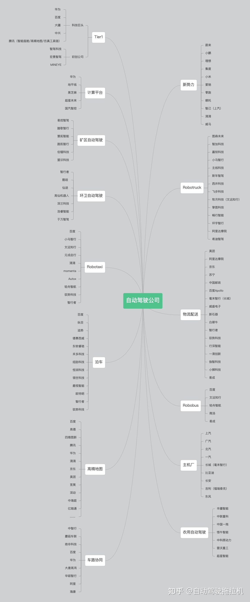
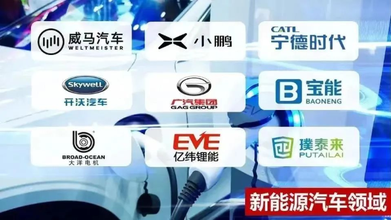

ET5对标小鹏P7

## SUV对比

6 月份发布的 ES7 对标小鹏的G9 理想的L9   蔚来ES7推出三款车型，售价46.80-54.80万元

6月15日晚，蔚来汽车推出了全新车型蔚来ES7。据了解，ES7是蔚来旗下首款中大型五座SUV。
蔚来ES7瞄向的竞争对手是宝马X5L，但两者分属不同的市场。ES7是纯电车，X5L是燃油车，两者所对应的市场和人群截然不同。其实，蔚来ES7真正的对手是即将上市的小鹏G9。

**蔚来**

[蔚来ES7](https://car.yiche.com/yulaies7/)搭载了[蔚来](https://car.yiche.com/weilaiqiche/)智能系统Banyan·榕树，以及[蔚来](https://car.yiche.com/weilaiqiche/)最新的NAD自动驾驶技术。该系统将逐步实现高速、城区、泊车、换电等场景，全程安全放松的点到点自动驾驶体验。

另外，蔚来ES7还搭载了全景数字座舱。车内配备的专属AR眼镜，可投射出视距6米，等效201英寸的超大屏幕。全景数字座舱在蔚来ES7这样一个专属空间内，将给用户带来独特的全感官沉浸体验。

**小鹏**

另一款车型小鹏G9则搭载了Xpilot 4.0辅助驾驶系统，以及全新一代X-EEA 3.0电子电气架构。

小鹏G9采用中央超算+区域控制的高融合硬件架构，可以搭载更高性能的芯片。这样的架构使得算力更加集中，以支持更高级的自动驾驶和更强大的智能座舱等智能功能。

 该车型配备两颗激光雷达，前双目800万像素摄像头和两颗290万像素侧面摄像头将会提供更广的视觉场景。再加上两颗来自于英伟达Orin-X的自动驾驶芯片，将会为用户提供更可靠的安全保障。

在续航补能方面，[蔚来ES7](https://car.yiche.com/yulaies7/)明显逊色于小鹏G9。

[蔚来ES7](https://car.yiche.com/yulaies7/)提供多个电池包，不同电池包会支持不同的续航里程。

该车型提供标准续航电池包、长续航电池包和超长续航电池包三种版本。续航里程分别为485公里、620公里和850公里。

在充电基础设施布局上，[蔚来](https://car.yiche.com/weilaiqiche/)汽车配合家充桩、超充桩及全国近千座[蔚来](https://car.yiche.com/weilaiqiche/)换电站。

从现有的消息来看，小鹏G9最长续航里程可达700km/h以上。

目前，[小鹏汽车](https://car.yiche.com/xpeng/)共有954座充电站。对于高效补能，小鹏给出了超长续航+超快补能的解决方案。**小鹏G9是国内首款基于800V高压SiC平台的量产车，超充能力达到充电5min，续航200+km。**

此外，今年第四季度，小鹏汽车将率先量产铺设480kW高压超充桩。

通过对比，我们可以[发现](https://car.yiche.com/diwudaifaxian/)小鹏G9在补能方面更有优势。

总的来说，在智能化和续航补能方面小鹏G9更有优势。

近年来，大湾区战略性新兴产业中更是到处闪耀着华工人的身影。以新能源汽车行业为例，**小鹏汽车**董事长何小鹏、**广汽集团**董事长曾庆洪、**威马汽车**董事长沈晖、开沃汽车与创维汽车董事长黄宏生、**宁德时代**董事长曾毓群、**亿纬锂能**董事长刘金成、璞泰来董事长梁丰、大洋电机董事长鲁楚平、华锋股份董事长谭帼英、广州巨湾技研董事长黄向东……

这个**“新能源汽车界的黄埔军校”**实力有多强？何小鹏曾经半开玩笑地说：“如果你是华南理工大学毕业的学生，你想要造车的话，只要你在校友群里面吱一声，学长们就已经帮你把供应链给搞定了。”

可以说，华南理工大学校友和“华工系”企业占领新能源汽车整车制造及多个关键环节的“半壁江山”，“新能源汽车界的黄埔军校”之名响彻全国、远扬海外。

介绍自己

HR晚上好，我叫吴志祥，是华南理工大学的研究生二年级的学生，专业是软件工程。

我的本科也是在华南理工大学读的，也是学的软件工程。本科毕业后成绩相对来说比较好，就报送华南理工大学的研究生。

在这里呢，我顺便提一下，华南理工大学就有着“新能源汽车界的黄埔军校”的称呼，那么我本人也是一个新能源汽车的爱好者。

然后我投的是蔚来自动驾驶的研发岗位，我对自动驾驶的前景还是抱有很大的希望的，同时也希望自己呢能够有机会进入新能源汽车行业发展了。以上就是我的一个简单的介绍了。

最大的优点

特别能吃苦 

技术上的苦 专研技术点的 某一个领域的知识

生活上的苦 特别能折腾 不断拓展自己的爱好兴趣 发现一个好玩的东西就会深入进去

最大的缺点

追求完美 处女座 会反复核对 不放心

