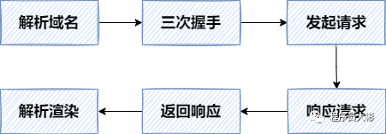
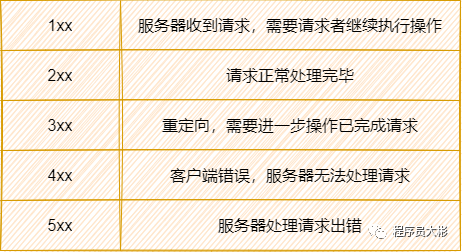

[参考](https://www.nowcoder.com/discuss/826919 channel=-1&source_id=discuss_terminal_discuss_sim_nctrack&ncTraceId=48d6da80779b4df6bae307a8fc32418f.228.16449002695229979)


OSI七层协议

​	应用层（Application Layer）

为应用程序间提供通信和交互的协议。
应用层协议定义的是应用进程（进程：主机中正在运行的程序）间的通信和交互的规则

​	表示层（Presentation Layer）

**表示层对上层数据或信息进行变换以保证一个主机应用层信息可以被另一个主机的应用程序理解**。表示层的数据转换包括数据的加密、压缩、格式转换等。　　表示层协议的代表包括：ASCII、ASN.1、JPEG、MPEG等。

会话层（Session Layer）

**会话层管理主机之间的会话进程，即负责建立、管理、终止进程之间的会话。**会话层还利用在数据中插入校验点来实现数据的同步。　　会话层协议的代表包括：NetBIOS、ZIP（AppleTalk区域信息协议）等。

​	传输层

为两台主机中的进程间提供通用的数据传输服务。
为上层提供服务：把应用层的报文封装成 TCP 的报文段或 UDP 的用户数据报进行传送。

​	网络层

为两台主机提供通信服务。
为上层提供服务：把运输层产生的报文段或用户数据报封装成 IP 数据报进行传送。

​	数据链路层

还是为两台主机之间的数据传输提供服务，两台主机之间的传输，总是在一段一段的链路上传送的，就需要链路层的协议。
为上层提供服务：把 IP 数据报封装成帧，在链路上进行传递。
CSMA PPP

​	物理层

在传输媒体上进行传输比特流。
为上层提供服务：尽可能为数据链路层屏蔽传输媒体和通信手段的差异，把帧拆分成比特流在传输媒介上进行传输。
时分复用、频分、码分多址、波分复用等！


## 网络分层结构
横向看（为哪两个平行的东西提供服务）
纵向看（为上层提供什么服务）
协议举例

# 1. 应用层：
为应用程序间提供通信和交互的协议。
应用层协议定义的是应用进程（进程：主机中正在运行的程序）间的通信和交互的规则
**DNS、HTTP、SMTP ，DHCP，FTP等**。
DNS 协议是域名解析协议，提供了域名和 IP 地址之间相互转换的服务。
DHCP（动态主机配置协议）是一个局域网的网络协议。指的是由服务器控制一段IP地址范围，客户机登录服务器时就可以自动获得服务器分配的IP地址和子网掩码，网关。
区域传送用 TCP 保证可靠性
SMTP是一种提供可靠且有效的电子邮件传输的协议。SMTP是建立在FTP文件传输服务上的一种邮件服务，主要用于系统之间的邮件信息传递，并提供有关来信的通知


## 在浏览器中输入url地址  Web页面的请求过程(面试常客)

打开一个网页，整个过程会使用哪些协议
DNS ARP HTTP 三次握手 



记住这个版本

总体来说分为以下几个过程:

1. 浏览器根据DNS协议找到域名对应的IP地址
2. 浏览器与服务器三次握手建立TCP连接
3. 发送HTTP请求
4. 服务器处理请求并返回HTTP报文
5. 浏览器解析渲染页面
6. 连接结束


简略版：
URL 敲下之后，浏览器是想要生成一个 **TCP 套接字**，以向目标 HTTP 服务器请求资源。
为了生成 TCP 套接字，我们必须知道域名对应的 IP 地址；
为了知道域名的 IP 地址，我们必须先向 DNS 服务器发送 DNS 查询报文；
为了向 DNS 服务器发送 DNS 查询报文，需要知道默认网关的 MAC 地址。
为了知道其 MAC 地址，必须用 ARP 协议进行解析出下一跳，也就是默认网关的 MAC 地址。

拿到默认网关 MAC 地址后，会封装一个 DNS 查询报文，向 DNS 发送 查询请求。
DNS 服务器收到请求后，把查询结果放在 **UDP 报文段**中，返回给主机。

主机现在拿到了域名对应的 IP 地址，可以生成套接字，把套接字用于向 HTTP 服务器发送 HTTP GET 报文了。
**而在生成 TCP 套接字之前，要进行三次握手的连接**
1
2
3
连接之后，把 GET 请求封装在报文中，交付给 HTTP 服务器。
HTTP 服务器拿到请求报文后，返回对应的 Web 资源。
浏览器收到 HTTP 响应之后，抽取 Web 页面的内容进行渲染。

巨tm详细版：
应用层：URL 敲下之后，首先浏览器会生成一个 TCP 套接字，以向目标 HTTP 服务器请求资源。为了生成该套接字，需要知道该 URL 域名对应的 IP 地址。
应用层：而为了向 DNS 服务器发送请求，生成一个 DNS 查询报文，是 53 端口号的。
网络层：这个 DNS 数据报被放入一个目的地址为 DNS 服务器 IP 地址的 IP 数据报中。
IP 数据报被放入一个帧中，把帧发到默认的网关中，而为了知道网关的 MAC 地址，需要用 ARP 协议来把网关的 IP 解析为 MAC 地址。

直到了网关的 MAC 地址后，才可以继续 DNS 的解析过程。
网关路由器拿到 DNS 查询报文后，会根据报文转发给下一跳，直到到达 DNS 服务器。
到达 DNS 服务器后，DNS 在数据库中查询待解析的域名。
找到 DNS 记录后，发送 DNS 回答报文，放入 UDP 报文段中，转发回主机。

主机拿到了解析后的域名，也就是 IP 地址后，就能生成套接字，把套接字用于向 Web 服务器发送 HTTP GET 报文。
在生成 TCP 套接字之前，必须先与 HTTP 服务器进行三次握手来建立连接。
生成一个具有目的端口 80 的 TCP SYN 报文段，并向 HTTP 服务器发送该报文段。
HTTP 服务器收到该报文段之后，回复 TCP 的 SYN ACK 报文段，发回主机。
主机接收到 SYN ACK 之后，再次恢复一个 ACK 确认连接报文段到 HTTP 服务器。
三次连接建立完毕。
浏览器生成 HTTP GET 报文，并交付给 HTTP 服务器。
HTTP 服务器从 TCP 套接字读取 HTTP GET 报文，生成一个响应报文，把 Web 页面的内容放入报文主体中，返回给主机。
浏览器拿到响应报文后，抽取 Web 页面内容，渲染页面。


**DNS解析**
浏览器首先查看本地的hosts文件，如果没有就发送DNS请求到本地DNS服务器。本地DNS服务器首先会查询缓存记录，如果没有，就向DNS根服务器进行查询。根DNS服务器给出域服务器的地址，.com域服务器收到请求后，给出域名的解析服务器的地址。最后，本地DNS服务器向域名的解析服务器发出请求，收到一个域名和IP地址对应关系，本地DNS服务器不仅要把IP地址返回给用户电脑，还会缓存这个地址。（客户端到本地DNS服务器是递归过程，而DNS服务器之间是迭代过程）
DNS解析基于UDP协议。


记住这个版本

# DNS 的解析过程？

1. 浏览器搜索**自己的本地DNS缓存**

2. 若没有，则搜索**操作系统中的DNS缓存和hosts文件**

3. 若没有，则操作系统将域名发送至**本地域名服务器**，本地域名服务器查询自己的DNS缓存，查找成功则返回结果，否则依次向**根域名服务器**发起请求，根域名服务器会返回一个负责域名（.com）的顶级域名服务器的一个IP，本地名称服务器根据根域名服务器所返回的顶级名称服务器地址，向对应的**顶级域名服务器**发送与前面一样的DNS域名查询请求。对应的顶级名称服务器在收到DNS查询请求后，也是先查询自己的缓存，若有则返回给本地名称服务器，然后再由本地域名服务器返回给操作系统。否则向本地域名服务器返回所请求的DNS域名中的二级域名所对应的二级域名服务器地址（qq.com）。然后本地域名服务器继续按照前面的方法向三级、四级域名服务器查询，直到最终的对应域名所在区域的**权威域名服务器**返回到最终的记录给本地域名服务器。

   

   **先记成好记的这个：**

   若没有，则操作系统将域名发送至**本地域名服务器**，本地域名服务器查询自己的DNS缓存，查找成功则返回结果，否则依次向**根域名服务器，顶级域名服务器，权威域名服务器**发起请求，最终返IP地址给本地域名服务器。

4. 本地域名服务器将得到的IP地址返回给**操作系统**，同时自己也**将IP地址缓存起来**

5. 操作系统将 IP 地址返回给浏览器，同时自己也将IP地址缓存起来

6. 浏览器得到域名对应的IP地址


## DNS递归查询与迭代查询

 一、**主机向本地域名服务器的查询一般都是采用递归查询**。

​    所谓递归查询就是：如果主机所询问的本地域名服务器不知道被查询的域名的IP地址，那么本地域名服务器就以DNS客户的身份，

​    向其它根域名服务器继续发出查询请求报文(即替主机继续查询)，而不是让主机自己进行下一步查询。

​    因此，递归查询返回的查询结果或者是所要查询的IP地址，或者是报错，表示无法查询到所需的IP地址。

 

二、**本地域名服务器向根域名服务器的查询是迭代查询**。

​    迭代查询的特点：当根域名服务器收到本地域名服务器发出的迭代查询请求报文时，要么给出所要查询的IP地址，要么告诉本地服务器：“你下一步应当向哪一个域名服务器进行查询”。

​    然后让本地服务器进行后续的查询。根域名服务器通常是把自己知道的顶级域名服务器的IP地址告诉本地域名服务器，让本地域名服务器再向**顶级域名服务器**查询。

​    顶级域名服务器在收到本地域名服务器的查询请求后，要么给出所要查询的IP地址，要么告诉本地服务器下一步应当向哪一个**权限域名服务器**进行查询。

​    最后，本地域名服务器知道了所要解析的IP地址或报错，然后把这个结果返回给发起查询的主机。


**总结：**

递归解析：客户端和本地服务器之间，一去一回得到域名结果的过程

迭代解析：本地服务器，一步步，经过多个步骤得到域名结果的过程


## HTTP 和 HTTPS 的区别

1. HTTP是明文传输协议；HTTPS则是具有**安全性**的ssl加密传输协议。
2. HTTP端口是80，HTTPS是443。
3. HTTPS需要到CA申请证书，需要用到SSL证书，而HTTP不用;
4. HTTP运行在TCP协议之上；HTTPS运行在SSL协议之上，SSL运行在TCP协议之上。
5. HTTPS基于传输层，HTTP基于应用层


## HTTPS原理  

首先是TCP三次握手，然后客户端发起一个HTTPS连接建立请求，客户端先发一个`Client Hello`的包，然后服务端响应`Server Hello`，接着再给客户端发送它的证书，然后双方经过密钥交换，最后使用交换的密钥加解密数据。

关于客户端发送`Client Hello`包和服务端响应`Server Hello`包

**协商加密[算法]()** 。在`Client Hello`里面客户端会告知服务端自己当前的一些信息，包括客户端要使用的TLS版本，支持的加密[算法]()，要访问的域名，给服务端生成的一个随机数（Nonce）等。需要提前告知服务器想要访问的域名以便服务器发送相应的域名的证书过来。

服务端响应`Server Hello`，告诉客户端服务端**选中的加密[算法](https://www.nowcoder.com/jump/super-jump/word?word=算法)**。


### HTTPS加密方式

- **对称加密**：加密和解密都是使用的同一个密钥；

常见的对称加密有`AES`和`DES`算法。

- **非对称加密：**

  - 加密使用的密钥和解密使用的密钥是不相同的，分别称为：公钥、私钥；
  - 公钥和算法都是公开的，私钥是保密的。
  - **非对称加密过程：**

  1. 服务端生成配对的公钥和私钥
  2. 私钥保存在服务端，公钥发送给客户端
  3. 客户端使用公钥加密明文传输给服务端
  4. 服务端使用私钥解密密文得到明文

  

  非对称算法有`RSA`和`DSA`。


## SSL 过程
简略版

SSL 是安全套接字，是用于加密和验证应用程序和Web服务器之间发送数据的协议。用于提供身份验证，HTTPS 的 S 其实指就是 SSL 协议。

how? 简略过程是这样的：
首先客户端向服务器发起 SSL 连接请求。
服务器把自己的证书发给客户端的浏览器。
客户端浏览器检查服务器过来的证书是不是 CA 签发的，如果是，就继续执行协议，如果不是，就发出一个警告，询问是否继续。
继续协议：从证书中把服务器的公钥拿下来，用公钥加密通信用的对称密钥，发给服务器。
服务器用自己的私钥对其解密，拿到对称密钥。
接下来就可以进行数据传输，服务器和客户端双方用相同的对称密钥对数据加密，可以保证安全。


#### 怎么保证公钥就是服务器的公钥？
嗷，服务器事先已经向 CA （证书授权中心）申请，CA 是大家都信任的机构， CA 在判明申请者的身份之后，会用自己的私钥对服务器的公开密钥加密，也就是做了个数字签名，然后把这个经过数字签名之后的证书一起发给客户端，客户端拿到之后用数字签名进行验证，如果验证通过，就可以开始通信了。

####  自己理解的核心点
其实单独的非对称加密的一个弱点就是，公钥可能被伪造，比如 A、B通信之间隔了个C，这个C把 A、B通信时用的公钥全部换了，这样也是没办法验证身份的。
那只需要保证公钥不被伪造就可以了，CA 的公钥大家都相信，甚至已经内置在浏览器里，不会被伪造，都相信 CA 所以只要数字签名认证通过，就可以完全信任服务器了。


# 什么是数字证书？

服务端可以向证书颁发机构CA申请证书，以避免中间人攻击（防止证书被篡改）。证书包含三部分内容：**证书内容、证书签名算法和签名**，签名是为了验证身份。


服务端把证书传输给浏览器，浏览器从证书里取公钥。证书可以证明该公钥对应本网站。

**数字签名的制作过程**：

1. CA使用证书签名算法对证书内容进行**hash运算**。
2. 对hash后的值**用CA的私钥加密**，得到数字签名。

**浏览器验证过程**：

1. 获取证书，得到证书内容、证书签名算法和数字签名。
2. 用CA机构的公钥**对数字签名解密**（由于是浏览器信任的机构，所以浏览器会保存它的公钥）。
3. 用证书里的签名算法**对证书内容进行hash运算**。
4. 比较解密后的数字签名和对证书内容做hash运算后得到的哈希值，相等则表明证书可信。


## http 理解 特点

1. HTTP允许传输**任意类型**的数据。传输的类型由Content-Type加以标记。
2. **无状态**。对于客户端每次发送的请求，服务器都认为是一个新的请求，上一次会话和下一次会话之间没有联系。
3. 支持**客户端/服务器模式**。


# HTTP报文格式

HTTP请求由**请求行、请求头部、空行和请求体**四个部分组成。

- **请求行**：包括请求方法，访问的资源URL，使用的HTTP版本。`GET`和`POST`是最常见的HTTP方法，除此以外还包括`DELETE、HEAD、OPTIONS、PUT、TRACE`。
- **请求头**：格式为“属性名:属性值”，服务端根据请求头获取客户端的信息，主要有`cookie、host、connection、accept-language、accept-encoding、user-agent`。
- **请求体**：用户的请求数据如用户名，密码等。


HTTP响应也由四个部分组成，分别是：**状态行、响应头、空行和响应体**。

- **状态行**：协议版本，状态码及状态描述。
- **响应头**：响应头字段主要有`connection、content-type、content-encoding、content-length、set-cookie、Last-Modified，、Cache-Control、Expires`。
- **响应体**：服务器返回给客户端的内容。


## HTTP 长连接和短连接讲讲？流水线是什么？
长连接：
当浏览器访问一个包含多张图片的网站时，如果用短连接就会建立大量的 TCP 连接，这样很耗资源。
长连接允许只建立一个 TCP 连接，就能进行多次 HTTP 通信。
1.1 之前默认短连接
1.1 以后默认长连接

流水线：
默认情况下，HTTP 请求是按顺序发的，下一个请求只有在当前请求收到响应之后才会被发出，有点像停止等待协议。而在收到下一个请求之前，可能需要很长时间。
流水线就是在一个 HTTP 长连接下连续发出请求，不用等待响应返回，减少延迟。


## http1.0 1.1 2.0 3.0的区别 

## HTTP1.0

- 无状态，无连接的应用层协议
- 短连接：每次发送请求都要重新建立tcp请求，即三次握手，非常浪费性能
- 无host头域，也就是http请求头里的host，
- 不允许断点续传，而且不能只传输对象的一部分，要求传输整个对象


**记住:**

无状态的 短连接 每次请求都要重新建立tcp连接 不允许断点传输

## HTTP1.1

- 长连接，流水线，使用connection:keep-alive使用长连接
- 请求管道化  只要第一个请求发出去了，不必等其回来，就可以发第二个请求出去
- 增加缓存处理(新的字段如cache-control)
- 增加Host字段，支持断点传输等


**记住:**

默认长连接  支持管道传输 

只要第一个请求发出去了，不必等其回来，就可以发第二个请求出去 请求串行排队处理 一旦某个请求超时，后面的就会被阻塞，导致“队头堵塞”

支持断点传输

## http2.0

1. 二进制格式 采用二进制格式而非文本格式
2. 头部压缩，双方各自缓存了一份 header请求头表，所有字段都会存入这个表，产生一个索引号，只需发送索引号，相同的头部，只需发送一次，避免了重复的header传输
3. 多路复用，一个tcp连接能够处理多个http请求，同时发送多个请求或回应，而且不用按照顺序、只需一个连接即可实现并行；
4. 服务器推送 服务器主动向客户端发送资源


记住 上面的

## http3.0

- **基于UDP实现**

- **0RTT建连** 缓存当前会话的上下文，下次恢复会话的时候，只需要将之前的缓存传递给服务器，验证通过，就可以进行传输了。

- **基于UDP的多路复用**

- **加密认证的报文** 几乎所有报文头部都是经过认证的，报文Body都是经过加密的

- **向前纠错机制** 少量的丢包可以通过其他包的冗余数据直接组装而无需重传。


基于 UDP 的 **QUIC** **协议** 可以实现类似 TCP 的可靠性传输。


记住这个

基于 UDP 的 **QUIC **协议  支持多路复用和报文加密 还有向前纠错机制

 QUIC 是一个在 UDP 之上的**伪** TCP + TLS + HTTP/2 的多路复用的协议。


## 缺点

HTTP/1.1 中的管道（ pipeline）传输中如果有一个请求阻塞了，那么队列后请求也统统被阻塞住了

HTTP/2 多个请求复用一个TCP连接，一旦发生丢包，就会触发 TCP 的重传机制，就会阻塞住所有的 HTTP 请求。

这都是基于 TCP 传输层的问题，所以 **HTTP/3** **把** **HTTP** **下层的** **TCP** **协议改成了** **UDP**！

但QUIC 有自己的一套机制可以保证传输的可靠性的。当某个流发生丢包时，只会阻塞这个流，**其他流不会受到影响**。


## HTTP1.0 HTTP1.1的区别 ？
在HTTP/1.0中，默认使用的是短连接，需要使用keep-alive参数来告知服务器端要建立一个长连接
但从 HTTP/1.1起，默认使用长连接，用以保持连接特性。使用长连接的HTTP协议，会在响应头加上Connection、Keep-Alive字段。

- **长连接**：HTTP1.0默认使用短连接，每次请求都需要建立新的TCP连接，连接不能复用。**HTTP1.1支持长连接，复用TCP连接，允许客户端通过同一连接发送多个请求**。不过，这个优化策略也存在问题，当一个队头的请求不能收到响应的资源时，它将会阻塞后面的请求。这就是“**队头阻塞**”问题。
- **断点续传**：HTTP1.0 **不支持断点续传**。HTTP1.1 新增了 **range** 字段，用来指定数据字节位置，**支持断点续传**。
- **错误状态响应码**：在HTTP1.1中新增了24个错误状态响应码，如`409（Conflict）`表示请求的资源与资源的当前状态发生冲突、`410（Gone）`表示服务器上的某个资源被永久性的删除。
- **Host头处理**：在HTTP1.0中认为每台服务器都绑定一个唯一的IP地址，因此，请求消息中的URL并没有传递主机名。到了HTTP1.1时代，虚拟主机技术发展迅速，在一台物理服务器上可以存在多个虚拟主机，并且它们共享一个IP地址，故HTTP1.1增加了HOST信息。


# HTTP1.1和 HTTP2.0的区别？

HTTP2.0相比HTTP1.1支持的特性：

- **新的二进制格式**：HTTP1.1 基于文本格式传输数据；HTTP2.0采用二进制格式传输数据，解析更高效。
- **多路复用**：在一个连接里，允许同时发送多个请求或响应，**并且这些请求或响应能够并行的传输而不被阻塞**，避免 HTTP1.1 出现的”队头堵塞”问题。
- **头部压缩**，HTTP1.1的header带有大量信息，而且每次都要重复发送；HTTP2.0 把header从数据中分离，并封装成头帧和数据帧，**使用特定算法压缩头帧**，有效减少头信息大小。并且HTTP2.0**在客户端和服务器端记录了之前发送的键值对，对于相同的数据，不会重复发送。\**比如请求a发送了所有的头信息字段，请求b则\**只需要发送差异数据**，这样可以减少冗余数据，降低开销。
- **服务端推送**：HTTP2.0允许服务器向客户端推送资源，无需客户端发送请求到服务器获取。


## TCP 长连接
长连接的环境下，进行一次数据交互后，很长一段时间内无数据交互时，客户端可能意外断电、死机、崩溃、重启，还是中间路由网络无故断开，这些TCP连接并未来得及正常释放，那么，连接的另一方并不知道对端的情况，它会一直维护这个连接，长时间的积累会导致非常多的半打开连接，造成端系统资源的消耗和浪费，且有可能导致在一个无效的数据链路层面发送业务数据，结果就是发送失败。所以服务器端要做到快速感知失败，减少无效链接操作，这就有了TCP的Keep alive（**保活探测**）机制。


#### 工作原理
当一个 TCP 连接建立之后，启用 TCP Keepalive 的一端便会启动一个计时器，当这个计时器数值到达 0 之后（也就是经过tcp_keep-alive_time时间后，这个参数之后会讲到），一个 TCP 探测包便会被发出。这个 TCP 探测包是一个纯 ACK 包（规范建议，不应该包含任何数据，但也可以包含1个无意义的字节，比如0x0。），其 Seq号 与上一个包是重复的，所以其实探测保活报文不在窗口控制范围内。

如果一个给定的连接在两小时内（默认时长）没有任何的动作，则**服务器就向客户发一个探测报文段**，客户主机必须处于以下4个状态之一：

1.  客户主机依然正常运行，并从服务器可达。客户的TCP响应正常，而服务器也知道对方是正常的，服务器在两小时后将保活定时器复位。
    
2.  客户主机已经崩溃，并且关闭或者正在重新启动。在任何一种情况下，客户的TCP都没有响应。服务端将不能收到对探测的响应，并在75秒后超时。服务器总共发送10个这样的探测 ，每个间隔75秒。如果服务器没有收到一个响应，它就认为客户主机已经关闭并终止连接。
    
3.  客户主机崩溃并已经重新启动。服务器将收到一个对其保活探测的响应，这个响应是一个复位，使得服务器终止这个连接。
    
4.  客户机正常运行，但是服务器不可达，这种情况与2类似，TCP能发现的就是没有收到探测的响应。
    

对于linux内核来说，应用程序若想使用TCP Keepalive，需要设置 SO_KEEPALIVE 套接字选项才能生效。

定义⼀个时间段，在这个时间段内，如果没有任何连接相关的活动，TCP 保活机制会开始作⽤，每隔⼀个时间间隔，发送⼀个探测报⽂，该探测报⽂包含的数据⾮常少，如果连续⼏个探测报⽂都没有得到响应，则认为当前的 TCP 连接已经死亡，系统内核将错误信息通知给上层应⽤程序。

在 Linux 内核可以有对应的参数可以设置保活时间、保活探测的次数、保活探测的时间间隔，以下都为默认值：

-   tcp_keepalive_time：在TCP保活打开的情况下，最后一次数据交换到TCP发送第一个保活探测包的间隔，即允许的持续空闲时长，或者说每次正常发送心跳的周期，默认值为7200s（2h）。
-   tcp_keepalive_intvl：在 tcp_keepalive_time 之后，没有接收到对方确认，继续发送保活探测包的频率，默认值为 75s。
-   tcp_keepalive_probes：在 tcp_keepalive_time 之后，没有接收到对方确认，继续发送保活探测包次数，默认值为 9（次）。

也就是说在 Linux 系统中，最少需要经过 2 ⼩时 11 分 15 秒才可以发现⼀个「死亡」连接。

#### 作用

1.  **探测连接的对端是否存活**

在应用交互的过程中，可能存在以下几种情况：

（1）客户端或服务器意外断电，死机，崩溃，重启。

（2）中间网络已经中断，而客户端与服务器并不知道。

利用保活探测功能，可以探知这种对端的意外情况，从而保证在意外发生时，可以释放半打开的TCP连接。

2.  **防止中间设备因超时删除连接相关的连接表**

中间设备如防火墙等，会为经过它的数据报文建立相关的连接信息表，并为其设置一个超时时间的定时器，如果超出预定时间，某连接无任何报文交互的话，

中间设备会将该连接信息从表中删除，在删除后，再有应用报文过来时，中间设备将丢弃该报文，从而导致应用出现异常。

#### 可能导致的问题

Keepalive 技术只是 TCP 技术中的一个可选项。因为不当的配置可能会引起一些问题，所以默认是关闭的。

可能导致下列问题：

1.  在短暂的故障期间，Keepalive设置不合理时可能会因为短暂的网络波动而断开健康的TCP连接
2.  需要消耗额外的宽带和流量
3.  在以流量计费的互联网环境中增加了费用开销

#### 和 HTTP 长连接的关系

在HTTP/1.0中，默认使用的是短连接。也就是说，浏览器和服务器每进行一次HTTP操作，就建立一次连接，但任务结束就中断连接。如果客户端浏览器访问的某个HTML或其他类型的 Web页中包含有其他的Web资源，如JavaScript文件、图像文件、CSS文件等；当浏览器每遇到这样一个Web资源，就会建立一个HTTP会话。

但从 HTTP/1.1起，默认使用长连接，用以保持连接特性。使用长连接的HTTP协议，会在响应头加上Connection、Keep-Alive字段。

```
HTTP/1.1 200 OK
Connection: Keep-Alive
Content-Encoding: gzip
Content-Type: text/html; charset=utf-8
Date: Thu, 11 Aug 2016 15:23:13 GMT
Keep-Alive: timeout=5, max=1000
Last-Modified: Mon, 25 Jul 2016 04:32:39 GMT
Server: Apache
```

**HTTP 协议的 Keep-Alive 意图在于TCP连接复用，同一个连接上串行方式传递请求-响应数据； TCP 的 Keepalive 机制意图在于探测连接的对端是否存活。**

### WebSocket 长连接

传统的请求-响应模式的Web开发在处理此类业务场景时，通常采用实时通讯方案。比如常见的轮询方案，其原理简单易懂，就是客户端以一定的时间间隔频繁请求的方式向服务器发送请求，来保持客户端和服务器端的数据同步。其问题也很明显：当客户端以固定频率向服务器端发送请求时，服务器端的数据可能并没有更新，带来很多无谓请求，浪费带宽，效率低下。

WebSocket是HTML5下一种新的协议。它实现了浏览器与服务器全双工通信，能更好的节省服务器资源和带宽并达到实时通讯的目的。它与HTTP一样通过已建立的TCP连接来传输数据，但是它和HTTP最大不同是：

-   WebSocket是一种**双向通信协议**。在建立连接后，WebSocket服务器端和客户端都能主动向对方发送或接收数据，就像Socket一样；
-   WebSocket需要像TCP一样，先建立连接，连接成功后才能相互通信。

相对于传统HTTP每次请求-应答都需要客户端与服务端建立连接的模式，WebSocket是类似Socket的TCP长连接通讯模式。一旦WebSocket连接建立后，后续数据都以帧序列的形式传输。在客户端断开WebSocket连接或Server端中断连接前，不需要客户端和服务端重新发起连接请求。在海量并发及客户端与服务器交互负载流量大的情况下，极大的节省了网络带宽资源的消耗，有明显的性能优势，且客户端发送和接受消息是在同一个持久连接上发起，实时性优势明显。

相比HTTP长连接，WebSocket有以下特点：

-   是真正的全双工方式，建立连接后客户端与服务器端是完全平等的，可以互相主动请求。而HTTP长连接基于HTTP，是传统的客户端对服务器发起请求的模式。
-   HTTP长连接中，每次数据交换除了真正的数据部分外，服务器和客户端还要大量交换HTTP header，信息交换效率很低。Websocket协议通过第一个request建立了TCP连接之后，之后交换的数据都不需要发送 HTTP header就能交换数据，这显然和原有的HTTP协议有区别，所以它需要对服务器和客户端都进行升级才能实现（主流浏览器都已支持HTML5）。此外还有 multiplexing、不同的URL可以复用同一个WebSocket连接等功能。这些都是HTTP长连接不能做到的。

在客户端，new WebSocket实例化一个新的WebSocket客户端对象，请求类似 ws://yourdomain:port/path 的服务端WebSocket URL，客户端WebSocket对象会自动解析并识别为WebSocket请求，并连接服务端端口，执行双方握手过程，客户端发送数据格式类似：

```
GET /webfin/websocket/ HTTP/1.1
Host: localhost
Upgrade: websocket
Connection: Upgrade
Sec-WebSocket-Key: xqBt3ImNzJbYqRINxEFlkg==
Origin: http://localhost:8080
Sec-WebSocket-Version: 13
```

客户端发起的 WebSocket 连接报文类似传统HTTP报文:

-   Upgrade：websocket 参数值表明这是 WebSocket 类型请求
-   Sec-WebSocket-Key 是 WebSocket 客户端发送的一个 base64编码的密文，要求服务端必须返回一个对应加密的 Sec-WebSocket-Accept 应答，否则客户端会抛出 Error during WebSocket handshake 错误，并关闭连接

服务端收到保温后返回的数据格式类似：

```
HTTP/1.1 101 Switching Protocols
Upgrade: websocket
Connection: Upgrade
Sec-WebSocket-Accept: K7DJLdLooIwIG/MOpvWFB3y3FE8=
```

Sec-WebSocket-Accept的值是服务端采用与客户端一致的密钥计算出来后返回客户端的，HTTP/1.1 101 Switching Protocols表示服务端接受WebSocket协议的客户端连接，经过这样的请求-响应处理后，两端的WebSocket连接握手成功, 后续就可以进行通讯了。

关键特点：

1.  标准技术，2011 年被 IETF 定义为 RFC 标准，其后被纳入 W3C 标准
2.  从 HTTP Upgrade 上去
3.  二进制全双工数据交互

优点：

1.  开源技术，各主流编程语言和平台均有其相应实现
2.  （主流）浏览器兼容，适合 Web 场景
3.  全双工，支持服务端主动的推送

缺点：

1.  相比 TCP 定制能力略差，依赖一次HTTP Upgrade，不适合极致的低延迟建连接场景
2.  对浏览器版本有一定要求，低版本浏览器中无法支持。浏览器兼容情况参考链接。不过目前主流浏览器均已支持，除非极特殊场景，对大部分业务来说已经可以不用考虑浏览器兼容问题

常见场景：Web IM、多人协同的文档编辑等依赖推送技术的 Web 应用。

### HTTP 长轮询

关键技术：客户端发送 HTTP 请求到服务端之后，服务端 Hold 请求不做响应，在超时之前如果有需要返回的数据（通常是推送），则把数据作为 Response 返回。否则，客户端在超时后，重新发起新连接。

优点：

1.  Web 标准技术，从技术上看其实是个普通的 HTTP 请求，支持低版本浏览器
2.  支持模拟 Server Push
3.  标准 HTTP，便于审计

缺点：

1.  效率低，低频推送场景下会产生大量无效请求，高频推送中会产生大量 TCP 和 TLS 握手开销
2.  用作 Server Push 场景的话，服务器无法感知本次“推送”的结果（成功或失败），依赖其他辅助实现

### HTTP/2

HTTP/2 是 HTTP 协议家族中真正意义的多路复用长连接，通过对 Header 和 Body 做 Frame 封装并定义 Stream 来支持多路复用，可以极大的提升传输效率。

优点：

1.  IETF 工作组定义的 RFC 标准，有丰富的浏览器等生态支持
2.  二进制 Frame 封装对大数据传输性能有帮助

缺点：半残废的 Server Push，依赖一次客户端请求来触发服务端的 PUSH_PROMISE

## HTTP状态码



1xx 表示成功

2xx 表示成功

3xx 表示重定向

4xx 表示客户端的请求错误，比如 404 资源没找到

5xx 表示服务器错误


记住以下几个：

200 OK

204 和200差不多，但没有响应体body数据

301 永久重定向 302 临时重定向

404 Not Found

403 Forbidden

401 Unauthorized

504 Gateway Timeout 网关超时

503 Service Unavailable 表示服务器当前很忙，暂时无法响应服务器。


## HTTP状态码详细版
「状态码由3位数字组成，第一位定义响应的类别」

1XX：指示信息，表示请求以接收，继续处理

2XX：成功，表示请求已经被成功接收、理解、接受

200 OK 是最常见的成功状态码，表示一切正常。如果是非 HEAD 请求，服务器返回的响应头都会有 body 数据。

204 No Content 也是常见的成功状态码，与 200 OK 基本相同，但响应头没有 body 数据。

206 Partial Content 是应用于 HTTP 分块下载或断电续传，表示响应返回的 body 数据并不是资源的全部，而是其中的一部分，也是服务器处理成功的状态。

3XX：状态码表示客户端请求的资源发送了变动，需要客户端用新的 URL 重新发送请求获取资源，也就是「重定向」。

301 Moved Permanently 表示永久重定向，说明请求的资源已经不存在了，需改用新的 URL 再次访问，搜索引擎在抓取新内容的同时也将旧的网址交换为重定向之后的网址。
302 Moved Permanently 表示临时重定向，说明请求的资源还在，但暂时需要用另一个 URL 来访问，搜索引擎会抓取新的内容而保存旧的网址。
301 和 302 都会在响应头里使用字段 Location，指明后续要跳转的 URL，浏览器会自动重定向新的 URL。

304 Not Modified不具有跳转的含义，表示资源未修改，重定向已存在的缓冲文件，也称缓存重定向，用于缓存控制。
4XX：状态码表示客户端发送的「报文有误」，服务器无法处理，也就是错误码的含义。

400 Bad Request表示客户端请求的报文有错误。

401 Unauthorized：缺失或错误的认证，这个状态代码必须和WWW-Authenticate报头域一起使用。

403 Forbidden表示服务器禁止访问资源，并不是客户端的请求出错。

404 Not Found表示请求的资源在服务器上不存在或未找到，所以无法提供给客户端。

5XX：状态码表示客户端请求报文正确，但是「服务器处理时内部发生了错误」，属于服务器端的错误码。

501 Not Implemented 表示客户端请求的功能还不支持。

502 Bad Gateway 通常是服务器作为网关或代理时返回的错误码，表示服务器自身工作正常，访问后端服务器发生了错误。

503 Service Unavailable 表示服务器当前很忙，暂时无法响应服务器。

504 Gateway Timeout：网关超时，由作为代理或网关的服务器使用，表示不能及时地从远程服务器获得应答。

「301和302的区别」

301重定向，指页面永久性转移，表示为资源或页面永久性地转移到了另一个位置。

301是HTTP协议中的一种状态码，当用户或搜索引擎向服务器发出浏览请求时，服务器返回的HTTP数据流中头信息中包含状态码 301 ，表示该资源已经永久改变了位置。

302重定向是页面暂时性转移，搜索引擎会抓取新的内容而保存旧的网址并认为新的网址只是暂时的。

记住这个


## GET和POST

- get 是获取数据，post 是修改数据
- get 把请求的数据放在 url 上， 以?分割URL和传输数据，参数之间以&相连，所以get不太安全。而post把数据放在HTTP的包体内（requrest body）
- get 提交的数据最大是 2k（ 限制实际上取决于浏览器）， post 理论上没有限制。
- **GET 产生一个 TCP 数据包**，浏览器会把 http header 和 data 一并发送出去，服务器响应 200(返回数据); **POST产生两个TCP数据包**，浏览器先发送header，服务器响应100 continue，浏览器再发送data，服务器响应200 ok(返回数据)。
- GET请求会被浏览器主动缓存，而POST不会，除非手动设置。
- 本质区别：GET是幂等的，而POST不是幂等的
幂等是指一次或多次提交请求，结果都是一样的，资源的状态都是不变的。


**安全可见 缓存长度书签 历史后退**

| 分类       | GET                                                              | POST                                                                  |
|:-------- | ---------------------------------------------------------------- | --------------------------------------------------------------------- |
| 后退按钮/刷新  | 无害                                                               | 数据会被重新提交（浏览器应该告知用户数据会被重新提交）。                                          |
| 书签       | 可收藏为书签                                                           | 不可收藏为书签                                                               |
| 缓存       | 能被缓存                                                             | 不能缓存                                                                  |
| 编码类型     | application/x-www-form-urlencoded                                | application/x-www-form-urlencoded 或 multipart/form-data。为二进制数据使用多重编码。 |
| 历史       | 参数保留在浏览器历史中。                                                     | 参数不会保存在浏览器历史中。                                                        |
| 对数据长度的限制 | 是的。当发送数据时，GET 方法向 URL 添加数据；URL 的长度是受限制的（URL 的最大长度是 2048 个字符）。    | 无限制。                                                                  |
| 对数据类型的限制 | 只允许 ASCII 字符。                                                    | 没有限制。也允许二进制数据。                                                        |
| 安全性      | 与 POST 相比，GET 的安全性较差，因为所发送的数据是 URL 的一部分。在发送密码或其他敏感信息时绝不要使用 GET ！ | POST 比 GET 更安全，因为参数不会被保存在浏览器历史或 web 服务器日志中。                           |
| 可见性      | 数据在 URL 中对所有人都是可见的。                                              | 数据不会显示在 URL 中。                                                        


## Cookie 和 Session 的区别

1. cookie：
what：cookie 是保存在客户端浏览器里的一种信息载体。
why：用来保存一些站点的用户数据，这样能够为用户定值一些功能，比如免登陆功能。
how：服务器发送的响应报文的首部有一个 set-cookie 字段，客户端在拿到这个响应后把这个字段的内容保存到浏览器中。在客户端再次发送请求同类资源时，就会把 cookie 一起携带在请求中，发送到服务端。
2. session
what：服务器会给每个浏览器创建一个 session 对象，保存在服务器里。
why：存储在浏览器的 cookie 不安全，可能会有一些 js 脚本能拿到 cookie 的信息，所以存储在服务器更加安全一些。
how：使用 session 维护用户登陆状态如下
用户登陆时，把用户名密码表单，放入 http 请求报文中。
服务器收到后，为其创建一个 session，并创建一个名为 sessionID 的 cookie，其值就映射了服务器里的 session。
客户端收到这个 cookie 后，把 sessionID 保存在 cookie 里。
客户端之后对同一个服务器进行请求时，会把 cookie 也带上去，服务器收到之后提取出 sessionID，从中读取出用户信息。
3. 以上分析就可以轻易的看出 cookie 和 session 的区别
cookie 存放在客户端，session 存放在服务器端
cookie 的安全性没有 session 高
4. 浏览器如果禁用了 Cookie
URL 重写技术，可以把 sessionID 作为 URL 的参数进行传递。
5. 其他临场发挥：
生命周期：都是可以设置的
作用域：都是可以设置的


- **作用范围不同**，Cookie 保存在客户端，Session 保存在服务器端。
- **有效期不同**，Cookie 可设置为长时间保持，比如我们经常使用的默认登录功能，Session 一般失效时间较短，客户端关闭或者 Session 超时都会失效。
- **隐私策略不同**，Cookie 存储在客户端，容易被窃取；Session 存储在服务端，安全性相对 Cookie 要好一些。
- **存储大小不同**， 单个 Cookie 保存的数据不能超过 4K；对于 Session 来说存储没有上限，但出于对服务器的性能考虑，Session 内不要存放过多的数据，并且需要设置 Session 删除机制。


## 请求转发与重定向区别
重定向：

1.可以理解为是客户端行为，客户端发起一次请求，服务器端给出一次响应，但这个响应包含下一次客户端需要访问的服务器端处理程序的地址，客户端再次发起请求，将会得到处理结果，也就意味着重定向客户端至少发起两次请求

2.当使用了重定向跳转页面后，在其客户端路径栏显示的应该是其重定向的路径，客户端是可以观察到页面地址变化的，重定向是客户端至少做了两次访问请求的

3.简单的图例

请求转发：

1.可以理解是服务器端行为，客户端发起一次请求，这个请求在整个服务器端可以被多次传递，但都是由服务器端的处理程序传递给另一个处理程序，客户端不需要发起二次请求，无论这个请求经历过多少个处理程序，始终都是同一个请求，也就意味着，这个请求中的数据经历过的每一个处理程序都可以使用

2.中间传递的是自己容器的request，客户端的路径栏显示的还是第一次访问的路径，客户端是感觉不到服务器做了转发的，请求转发客户端是只做了一次请求。

3.简单的图例

二、使用
当前后两个页面有数据传递时，例如查询了数据需要在页面显示时，用请求转发

当没有数据传递，例如做了更新操作跳转到其他页面，就用重定向。


# 2. 传输层：
为两台主机中的进程间提供通用的数据传输服务。
为上层提供服务：把应用层的报文封装成 TCP 的报文段或 UDP 的用户数据报进行传送。
TCP、UDP

## TCP UDP区别
1. **传输控制协议 TCP**（Transmission Control Protocol）--**全双工通信**，提供**面向连接**的，**一对一的**，**可靠的**，面向**字节流**的数据传输服务，**效率低**。

TCP的可靠体现在TCP在传递数据之前，会有三次握手来建立连接，而且在数据传递时，有确认、窗口、重传、拥塞控制机制，在数据传完后，还会断开连接用来节约系统资源

2. **用户数据协议 UDP**（User Datagram Protocol）--提供**无连接**的，**多对多的**，**不可靠的**尽最大努力的，面向**数据报文段**的数据传输服务，**效率高**。

TCP首部开销20字节；UDP的首部开销小，只有8个字节。


 ## UDP报文的格式是什么？一个UDP消息包含哪些部分


## TCP报文 头的参数


## TCP 协议如何保证可靠传输


记住这个

**检验和 流量控制 拥塞控制 超时传输**

1. 应用数据被分割成 TCP 认为最适合发送的数据块。
2. TCP 给发送的每一个包进行编号，接收方对数据包进行排序，把有序数据传送给应用层。
3. **校验和**：TCP 将保持它首部和数据的检验和。这是一个端到端的检验和，目的是检测数据在传输过程中的任何变化。如果收到段的检验和有差错，TCP 将丢弃这个报文段和不确认收到此报文段。
4. TCP 的接收端会丢弃重复的数据。
5. **流量控制**：TCP 连接的每一方都有固定大小的缓冲空间，TCP的接收端只允许发送端发送接收端缓冲区能接纳的数据。当接收方来不及处理发送方的数据，能提示发送方降低发送的速率，防止包丢失。（TCP 利用**滑动窗口**实现流量控制）

接收方发送的确认报文中的窗口字段可以用来控制发送方窗口大小，从而影响发送方的发送速率。

1. **拥塞控制**：为了进行拥塞控制，TCP **发送方**要维持一个拥塞窗口(cwnd)的状态变量。

拥塞控制窗口的大小取决于网络的拥塞程度，并且动态变化。发送方让自己的发送窗口取为拥塞窗口和接收方的接受窗口中较小的一个。

TCP的拥塞控制采用了四种算法，即**慢开始**、**拥塞避免**、**快重传**和**快恢复**

1. **ARQ协议**：也是为了实现可靠传输的，它的基本原理就是每发完一个分组就停止发送，等待对方确认。在收到确认后再发下一个分组。
2. **超时重传**：当 TCP 发出一个段后，它启动一个定时器，等待目的端确认收到这个报文段。如果不能及时收到一个确认，将重发这个报文段。


详细版

答：首先可靠传输的基础是滑动窗口协议，配合着一些其他的控制来使得整个传输过程可靠。这些控制我觉得可以按分为三部分去解释，一个是基本的控制、一个是发送端的控制、一个是接收端的控制。

1. 首先详细说一下滑动窗口协议：
首先在发送方和接收方都维护一个滑动窗口，发送方的窗口大小其实是由接收方的响应报文里的一个字段控制的。
发送方：窗内都允许被发送，窗内最左侧的字节如果已发送并且被确认，向右滑动，直到第一个不是被确认状态的字节。
接收方：窗内都允许被接收，窗内最左侧的字节如果已接收，向右滑动到第一个不是已接收的状态的字节。并且最重要的是，接收方仅对最后一个按序到达的字节进行确认！
2. 然后说一下这些控制，从三个方面来讲
- 基本的控制：
把应用层的数据拆分成适合传输的一个个块儿。
给发送的每一个块儿进行编号，在接收端对数据包进行重排。
- 发送端的控制：
超时重传技术（两个公式细节在下面）：当发送方发送一个包时，启动一个定时器，等待确认这个包，如果不能在阈值内收到确认这个包，则重发。
流量控制：为了控制发送方发送速率，保证接收方来得及接收。接收端返回的确认报文中的窗口字段可以控制发送窗口大小，从而影响发送方的速率。将窗口字段设置为 0，则不能发送数据。
拥塞控制（四个算法细节在下面）：当网络拥塞时，会丢包，此时发送方会不断尝试重传，从而导致拥塞程度更高。因此当出现拥塞时，应当限制发送方的发送速率。和流量控制很像但目的不同。流量控制更多的是一个端到端的控制，要做的是抑制发送端发送数据的速率，主要是为了控制接收方来得及接。而拥塞控制是为了宏观上降低网络的拥塞程度。
- 接收端的控制：
校验和：保证首部的数据的校验和。如何校验和有误，那么就丢弃该数据包，且不发送确认消息。
丢弃重复：如果收到重复的数据包，直接丢弃。


## 三次握手和四次挥手-简略版

- 客户端–发送带有 SYN 标志的数据包–一次握手–服务端
- 服务端–发送带有 SYN/ACK 标志的数据包–二次握手–客户端
- 客户端–发送带有带有 ACK 标志的数据包–三次握手–服务端

第一次握手：Client 什么都不能确认；Server 确认了对方发送正常，自己接收正常

第二次握手：Client 确认了：自己发送、接收正常，对方发送、接收正常；Server 确认了：对方发送正常，自己接收正常

第三次握手：Client 确认了：自己发送、接收正常，对方发送、接收正常；Server 确认了：自己发送、接收正常，对方发送、接收正常

所以三次握手就能确认双发收发功能都正常，缺一不可。

断开一个 TCP 连接则需要“四次挥手”：
- 客户端-发送一个 FIN，用来关闭客户端到服务器的数据传送
- 服务器-收到这个 FIN，它发回一 个 ACK，确认序号为收到的序号加1 。和 SYN 一样，一个 FIN 将占用一个序号
- 服务器-关闭与客户端的连接，发送一个FIN给客户端
- 客户端-发回 ACK 报文确认，并将确认序号设置为收到序号加1


记住这个

## TCP 三次握手

明确四个概念的表达！

SYN：请求连接标志位！
ACK：确认标志位！
seq：序号！
ack：确认号！

1. 三次握手的过程：
客户端的连接请求：首先客户端发送一个带 SYN 标志位的连接请求到服务器，客户端进入 SYN-SENT 状态。
服务端的连接确认请求：服务器收到之后回复一个 SYN 和 ACK 的确认报文到客户端，此时服务端进入 SYN-RECV 状态，等待第三次握手。
客户端的连接确认请求：客户端接收到确认报文后，向服务端再次发出带 ACK 的确认报文，后客户端这边连接建立，服务端收到客户端的第三次确认报文后，连接建立。

2. 为何要三次握手？
    从第一个角度。通信是双方的行为，**双方都需要确认四件事，自身的接收发送是否正常以及对方的接收发送是否正常**。如果仅两次的话，服务端是没有办法确认自己发送和对方接收是否正常的，不是可靠的连接。

  **不要忘了答第二个**

  **从第二个角度。也可以防止失效连接到达服务器后重新打开连接。**客户端发送的请求如果阻塞。那么客户端等待一个超时重传时间以后，会重发一个连接请求。假设这个来迟滞留的请求最终到达了服务器，如果不三次握手的话，服务器就会打开两个连接。如果有第三次握手，客户端就会忽略掉服务器之后的连接确认请求。

3. 如果 1、2、3 次握手分别丢包了，会发生什么？
https://blog.csdn.net/plokmju88/article/details/103884145
第一次客户端发的 SYN 丢了：
客户端迟迟接不到响应，超时重传。
第二次服务端发的 SYN 和 ACK 丢了
客户端迟迟接不到响应，超时重传
第三次客户端发的 ACK 丢了？
因为第三次发完 ACK 之后，随时接下来会继续往服务端发数据，我看过一篇博客里写的是发数据时会带上 ACK，所以客户端响应的 ACK 包丢了，服务器也能够通过之后的包来建立连接。
第三次故意不发送 ACK 呢？
洪水攻击，服务器在等待第三次握手时是处于半连接状态，也是需要耗费资源的，如果有攻击者故意不发送第三次 ACK，让大量连接处于半连接状态，那么会把服务器资源耗尽，洪水攻击的目的就达到了。

## TCP 四次挥手


记住这个

1. 四次挥手的过程
    客户端发送一个带 FIN 标志位的关闭连接请求，此时客户端进入 FIN - WAIT - 1 阶段。
    服务器收到该请求后，返回一个 ACK, 进入ClOSE-WAIT阶段。
    客户端收到 ACK 之后，进入 FIN - WAIT - 2 阶段，此时处于半关闭状态，**服务器能给客户端发消息，但客户端不能给服务器发消息**。
    当服务器把剩下的消息发完之后，会发送一个 带 FIN 标志位的关闭连接请求给客户端，进入LAST-ACK阶段。
    客户端收到该请求后，发出 ACK 确认，并进入最后的 TIME - WAIT 状态，等待 2MSL（最大报文存活时间） 后释放连接。
    B 收到ACK确认后，释放连接。


  先不要提前说 等面试官问

  如果在等待2MSL时间内，服务端没有受到客户端发来的ACK接受到的报文响应，服务端就会重新发来一个带FIN标志的关闭连接的请求


2. 四次挥手的原因

  因为TCP是全双工通信的

​	服务端在收到客户端的 FIN 报文后，仅表示客户端不再发送数据了，但客户端还可以接，而服务端也不是说数据都发完了，所以服务端可以立即关闭，也可以再发送一段时间的数据后再发送 FIN 报文给客户端表示同意关闭。因此服务端的 ACK 和 FIN 标志位会分开发送，在 ACK 和 FIN 之间可能还会给客户端传数据，导致多了一次。

3. 为什么客户端要等待 2MSL 后再释放连接
    第一个角度：确保最后一个确认报文能到达，如果服务器没收到来自客户端的 ACK 报文，就会重新发送 FIN 报文到客户端，客户端等待一段时间就是为了处理这种延迟的情况。
    **第二个角度：等待一段时间是为了让本连接持续的时间内所有报文从网络中消失，使得下一个新连接里不会出现旧的报文。**
4. 为什么是两个最大报文存活时间，不是三个？

  - 假设服务端没有收到客户端收到的ACK报文，就会向客户端重新发送一个FIN报文
  - 去向ACK消息最大存活时间（MSL) + 来向FIN消息的最大存活时间(MSL)


# 3. 网络层
为两台主机提供通信服务。
为上层提供服务：把运输层产生的报文段或用户数据报封装成 IP 数据报进行传送。
ARP、ICMP

Address Resolution Protocol 地址解析协议（ARP能够通过目的IP地址发现目标设备的MAC地址，从而实现链路可达）
ICMP（Internet Control Message Protocol） 网络控制报文协议
是网络层的重要协议，主要用来在网络设备间传递各种差错和控制信息，它对于收集各种网络信息、诊断和排除各种网络故障具有至关重要的作用。


### 讲讲ARP协议

ARP 协议：
这个协议主要提供了由目的 IP 地址得到目的 MAC 地址的功能。

因为网络层讲的是 主机和主机 之间的通信，所有下面就把所有的描述成主机之间的通信。

- 在同一个局域网中：主机 A 想往主机 B 发信息时，会先在自己的 **ARP 缓存表**中查找是否有对应 主机B IP 地址的 MAC 地址，如果没有，则发送一次 **广播 ARP 请求分组**，主机 B 和主机 A 在同一个局域网，则主机 B 收到 ARP 请求分组时，会回发一个 ARP 响应分组，里面带有自己的 MAC 地址。

- 不在同一个局域网中：主机 A 会先把子网掩码和目的 IP 进行相与，发现不一个网段，那么其下一跳就直接找默认网关就可以了，如果 ARP 缓存里没有默认网关的 MAC 地址，也需要先发一个 ARP 请求分组，等默认网关给他回一个 ARP 响应分组后，就拿到了默认网关的 MAC 地址。

网关收到 ARP 请求后，也会在自己的 ARP 缓存表里找是否有，没有的话就广播 ARP 请求，如果是一对一那就直接找下一跳，路由器会帮他广播，找到主机 B 的 MAC 地址，然后主机 B 会回答一个 ARP 响应分组给 主机 A 然后就拿到了！


### 讲讲ICMP协议

what?
本质还是个 IP 数据报，IP数据报的数据段用 ICMP 报文代替了而已。

why?
ICMP 协议是网络层的协议，其主要的作用是用来提高交付成功的机会，让网络节点能够报告差错情况和异常情况的。
分为差错报告报文和询问报文。

how?
差错报告报文至少有四种：

- 终点不可达报文，当路由器和主机没办法交付数据，就向源头发送一个终点不可达报文。
- 时间超过：如果路由器发现数据的 TTL 为 0，那么丢弃该数据，并向源头发送一个时间超过报文。可以用于 traceRoute
- 参数问题：如果路由器或主机发现 IP 数据报的首部有错误时，就告诉发给源头一个参数问题报文。
- 改变路由报文：路由器给主机发送这个报文，告诉他有更好的路径。
询问报文有两种：

- echo(回声) 请求报文或回答报文：主机或路由器向一个特定的主机发送回声请求报文，目的主机收到后回一个回答报文。
- 时间戳请求和回答报文：向服务器请求一个时间戳，用来时钟同步和测时间。


记住这个

**应用：**
1. ping 命令的过程：
主要为了测试两个主机间是否是通的！
- 如果在一个网段：
	- 首先主机 A 要向主机 B 发送 ICMP 回声请求报文，会先在 ARP 缓存表里找主机 B 的 IP 对应的 MAC 地址、
	- 如果有直接发送，如果没有，则发送一个 ARP 请求。
	- 主机 B 收到 ARP 请求之后，回复一个 ARP 应答。这样主机 A 就拿到了主机 B 的 MAC 地址。
	- 然后主机 A 发送 ICMP 回声请求报文，主机 B 接收到以后，回复一个 ICMP 回答报文。
	- 主机 A 根据回答报文估算往返时间和丢包率等等等。
- 如果不在同一个网段
	- 还是先找 MAC 地址
	- 如果有直接发送，没有的话，发送 ARP 请求到网关。
	- 网关收到 ARP 请求后，也会在自己的 ARP 缓存表里找是否有，没有的话就广播 ARP 请求，如果是一对一那就直接找下一跳。具体情况具体分析！（这里看王道考研 ARP 协议）反正就记住，如果不在同一个网段，就直接交给路由器处理。
	- 主机 B 收到 ARP 请求之后，把 MAC 地址告诉主机 A
	- 主机 A 发送 ICMP 回声请求报文，主机 B 接到之后，回复一个 ICMP 回答报文。
	- 根据回答报文估算往返时间，丢包率等


Ping 各个层次详细版本

Ping是我们测试网络连接的常用指令。

它利用ICMP报文检测网络连接。

「假设A ping B」

1. ping通知系统建立一个固定格式的ICMP请求数据包。

2. ICMP协议打包这个数据包和B的IP地址转交给IP协议层

3. IP层协议将机器B的IP地址为目的地址，本机的IP地址为源地址，加上一些头部必要的控制信息，构建一个IP数据包

4. 获取B的MAC地址，做这个操作首先机器A会判断B是否在同一网段内，若IP层协议通过B的IP地址和自己的子网掩码，发现它跟自己属于同一网络，就直接在本网络查找这台机器的MAC，否则则通过路由器进行类似查找。

>接下来是ARP协议根据IP地址查找MAC地址的过程:
1 若两台机器之前有过通信，在机器A的ARP缓存表里应该存有B的IP与其MAC地址的映射关系。
2 若没有，则通过发送ARP请求广播，得到回应的B机器MAC地址，并交给数据链路层

5. 数据链路层构建一个数据帧，目的地址是IP层传过来的MAC地址，源地址是本机的MAC地址，再附加一些必要的控制信息，依据以太网的介质访问规则将他们传送出去

6. 机器B收到这个数据帧后，先检查目的地址，和本机MAC地址对比：

7. 符合，接受，接收后检查该数据帧，将IP数据包从帧中提取出来，交给本机的的IP地址协议层协议，IP协议层检查之后，将有用的信息提取给ICMP协议，后者处理，马上构建一个ICMP应答包，发送给A，其过程和主机A发送ICMP请求包到B的过程类似，但不用ARP广播收取A的信息，因为请求包中已经有足够的信息用于B回应A。
8. 若不符合，丢弃。

可以知道PING的过程即一段发送报文和接受确认报文的过程，在来回直接可以计算时延。

2. 路由跟踪
主要是为了跟踪路由的路径。
用自己的话描述：源主机发一系列的 TTL 依次递增的 IP 数据报，比如 TTL 为 1 的数据报，经过第一个路由器就会给源主机发一个时间超过差错报告报文。这样一直到目的主机，就可以直到到达目的主机的路由器的 IP 地址以及到达每个路由器的往返时间。


# 4. 数据链路层
还是为两台主机之间的数据传输提供服务，两台主机之间的传输，总是在一段一段的链路上传送的，就需要链路层的协议。
为上层提供服务：把 IP 数据报封装成帧，在链路上进行传递。
CSMA PPP

# 5. 物理层：
在传输媒体上进行传输比特流。
为上层提供服务：尽可能为数据链路层屏蔽传输媒体和通信手段的差异，把帧拆分成比特流在传输媒介上进行传输。
时分复用、频分、码分多址、波分复用等！