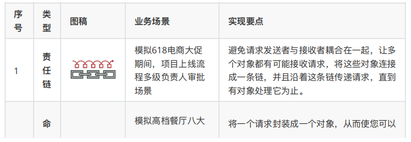

博客

https://blog.csdn.net/weixin_43122090/article/details/105462226

菜鸟教程

https://www.runoob.com/design-pattern/factory-pattern.html

## 23种设计模式

创建型模式，共五种：工厂方法模式、抽象工厂模式、单例模式、建造者模式、原型模式。

结构型模式，共七种：适配器模式、装饰器模式、代理模式、外观模式、桥接模式、组合模式、享元模式。

行为型模式，共十一种：策略模式、模板方法模式、观察者模式、迭代子模式、责任链模式、命令模式、备忘录模式、状态模式、访问者模式、中介者模式、解释器模式。

## 6大设计原则

**单一职责原则**

- 原则思想：一个方法只负责一件事情。
- 描述：单一职责原则很简单，一个方法 一个类只负责一个职责，各个职责的程序改动，不影响其它程序。 这是常识，几乎所有程序员都会遵循这个原则。
- 优点：降低类和类的耦合，提高可读性，增加可维护性和可拓展性，降低可变性的风险。

**开放封闭原则**

- 原则思想：尽量通过扩展软件实体来解决需求变化，而不是通过修改已有的代码来完成变化

- 描述：一个软件产品在生命周期内，都会发生变化，既然变化是一个既定的事实，我们就应该在设计的时候尽量适应这些变化，以提高项目的稳定性和灵活性。
- 优点：单一原则告诉我们，每个类都有自己负责的职责，里氏替换原则不能破坏继承关系的体系。
  

**里氏代换原则**

- 原则思想：使用的基类可以在任何地方使用继承的子类，完美的替换基类。

- 大概意思是：子类可以扩展父类的功能，但不能改变父类原有的功能。子类可以实现父类的抽象方法，但不能覆盖父类的非抽象方法，子类中可以增加自己特有的方法。

- 优点：增加程序的健壮性，即使增加了子类，原有的子类还可以继续运行，互不影响。
  

**依赖倒转原则**

- 依赖倒置原则的核心思想是面向接口编程
- 依赖倒转原则要求我们在程序代码中传递参数时或在关联关系中，尽量引用层次高的抽象层类
- 这个是开放封闭原则的基础，具体内容是：对接口编程，依赖于抽象而不依赖于具体。

**接口隔离原则**

- 这个原则的意思是：使用多个隔离的接口，比使用单个接口要好。还是一个降低类之间的耦合度的意思，从这儿我们看出，其实设计模式就是一个软件的设计思想，从大型软件架构出发，为了升级和维护方便。所以上文中多次出现：降低依赖，降低耦合。
- 例如：支付类的接口和订单类的接口，需要把这俩个类别的接口变成俩个隔离的接口
  

**迪米特法则（最少知道原则）**

- 原则思想：一个对象应当对其他对象有尽可能少地了解，简称类间解耦
- 大概意思就是一个类尽量减少自己对其他对象的依赖，原则是低耦合，高内聚，只有使各个模块之间的耦合尽量的低，才能提高代码的复用率。
- 优点：低耦合，高内聚。

## 设计模式实例

**工厂模式**

其在父类中提供⼀个创建对象的⽅法（子类实现接口的具体实现方法）， 允许⼦类决定实例化对象的类型。

**抽象工厂模式**

提供一个创建一系列相关或相互依赖对象的接口，而无需指定它们具体的类。

抽象工厂模式（Abstract Factory Pattern）是围绕一个超级工厂创建其他工厂。该超级工厂又称为其他工厂的工厂。这种类型的设计模式属于创建型模式，它提供了一种创建对象的最佳方式。

在抽象工厂模式中，接口是负责创建一个相关对象的工厂，不需要显式指定它们的类。每个生成的工厂都能按照工厂模式提供对象。

**代理模式**

- 通过代理控制对象的访问，可以在这个对象调用方法之前、调用方法之后去处理/添加新的功能。(也就是AO的P微实现)
- 代理在原有代码乃至原业务流程都不修改的情况下，直接在业务流程中切入新代码，增加新功能，这也和Spring的（面向切面编程）很相似

应用场景

- Spring AOP、日志打印、异常处理、事务控制、权限控制等

静态代理：简单代理模式，是动态代理的理论基础。常见使用在代理模式
jdk动态代理：使用反射完成代理。需要有顶层接口才能使用，常见是mybatis的mapper文件是代理。
cglib动态代理：也是使用反射完成代理，可以直接代理类（jdk动态代理不行），使用字节码技术，不能对 final类进行继承。（需要导入jar包）

**原型模式**

用原型实例指定创建对象的种类，并且通过拷贝这些原型创建新的对象。

例如 JAVA 中的 Object clone() 方法

**适配器模式**

将一个类的接口转换成客户希望的另外一个接口，使得原本由于接口不兼容而不能一起工作的那些类能一起工作。

**装饰器模式**

装饰器模式（Decorator Pattern）允许向一个现有的对象添加新的功能，同时又不改变其结构，就是创建了一个装饰类，用来包装原有的类，提供额外的功能。

**模板模式**

在模板模式（Template Pattern）中，一个抽象类公开定义了执行它的方法的方式/模板。它的子类可以按需要重写方法实现，但调用将以抽象类中定义的方式进行

就是子类重写抽象类定义的模板方法，调用的时候以抽象类定义的方法就行调用 执行方法按具体实例类执行

**单例模式**

- 哪些地方用到了单例模式
  - 网站的计数器，一般也是采用单例模式实现，否则难以同步。
  - 应用程序的日志应用，一般都是单例模式实现，只有一个实例去操作才好，否则内容不好追加显示
  - 多线程的线程池的设计一般也是采用单例模式，因为线程池要方便对池中的线程进行控制
  - Windows的（任务管理器）就是很典型的单例模式，他不能打开俩个
  - windows的（回收站）也是典型的单例应用。在整个系统运行过程中，回收站只维护一个实例
  - 数据库的连接池不会反复创建
  - spring中⼀个单例模式bean的⽣成和使⽤
  - 在我们平常的代码中需要设置全局的的⼀些属性保存

记住这个

- 实现方式：

饿汉式: 类初始化时,会立即加载该对象，线程天生安全,调用效率高。
懒汉式:  类初始化时,不会初始化该对象,真正需要使用的时候才会创建该对象,具备懒加载功能。
静态内部方式: 结合了懒汉式和饿汉式各自的优点，真正需要对象的时候才会加载，加载类是线程安全的。
枚举单例:  使用枚举实现单例模式 优点:实现简单、调用效率高，枚举本身就是单例，由jvm从根本上提供保障!避免通过反射和反序列化的漏洞， 缺点没有延迟加载。
双重锁检测方式 ：(因为JVM本质重排序的原因，可能会初始化多次，不推荐使用)

**7种单例模式实现**

-  **1 静态类使用**  pdf有

  

- **2 懒汉模式**
  
  - 分线程安全和非线程安全 是否在获取实例的静态方法中加锁
  - 使用懒单例模式时注意线程安全问题

- **3 饿汉模式**（线程安全）

类初始化时,会立即加载该对象，线程天生安全,调用效率高。

- **4 双重锁校验**(线程安全)

**这里面试官可能会问使用volatile的好处？**

Instance 采用 volatile 关键字修饰也是很有必要的， `Instance = new Singleton();` 这段代码其实是分为三步执行：

1. 为 uniqueInstance 分配内存空间 
2. 初始化 uniqueInstance 
3. 将 uniqueInstance 指向分配的内存地址 

但是由于 JVM 具有指令重排的特性，执行顺序有可能变成 1>3>2。指令重排在单线程环境下不会出现问题，但是在多线程环境下会导致一个线程获得还没有初始化的实例。例如，线程 T1 执行了 1 和 3，此时 T2 调用 geteInstance() 后发现 Instance 不为空，因此返回 Instance，但此时 Instance 还未被初始化。

**使用 volatile 可以禁止 JVM 的指令重排，保证在多线程环境下也能正常运行。**

- **5 使⽤静态内部类**(线程安全)

既保证了线程安全有保证了懒加载，同时不会因为加锁的⽅式耗费性能。⾮常推荐使⽤的⼀种单例模式

- **6 使⽤枚举单例的方式**

使用枚举实现单例模式 优点: 实现简单、调用效率高，枚举本身就是单例，由jvm从根本上提供保障!避免通过反射和反序列化的漏洞， 缺点没有延迟加载。

枚举对象  INSTANCE对象 有个demo4变量

- **7 CASAtomicReference**(线程安全)

AtomicReference 可以封装引⽤⼀个V实例，⽀持并发访问

## 在Spring框架中都用到了哪些设计模式

在问Spring的时候可能会问到这样一个问题：**在Spring框架中都用到了哪些设计模式，并举例说明？**

- 工厂设计模式 : Spring使用工厂模式通过 `BeanFactory`、`ApplicationContext` 创建 bean 对象。 
- 代理设计模式 : Spring AOP 功能的实现。 
- 单例设计模式: Spring 中的 Bean 默认都是单例的。 
- 装饰器设计模式 : 我们的项目需要连接多个数据库，而且不同的客户在每次访问中根据需要会去访问不同的数据库。这种模式让我们可以根据客户的需求能够动态切换不同的数据源。 
- 观察者模式: Spring 事件驱动模型就是观察者模式很经典的一个应用。 
- 适配器模式: Spring AOP 的增强或通知(Advice)使用到了适配器模式、spring MVC 中也是用到了适配器模式适配`Controller`。
